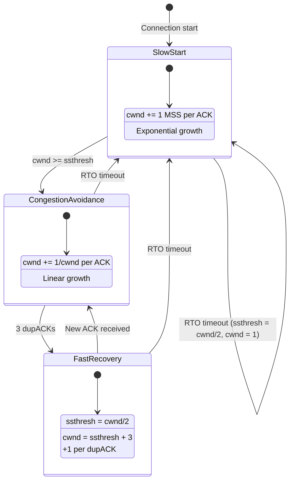
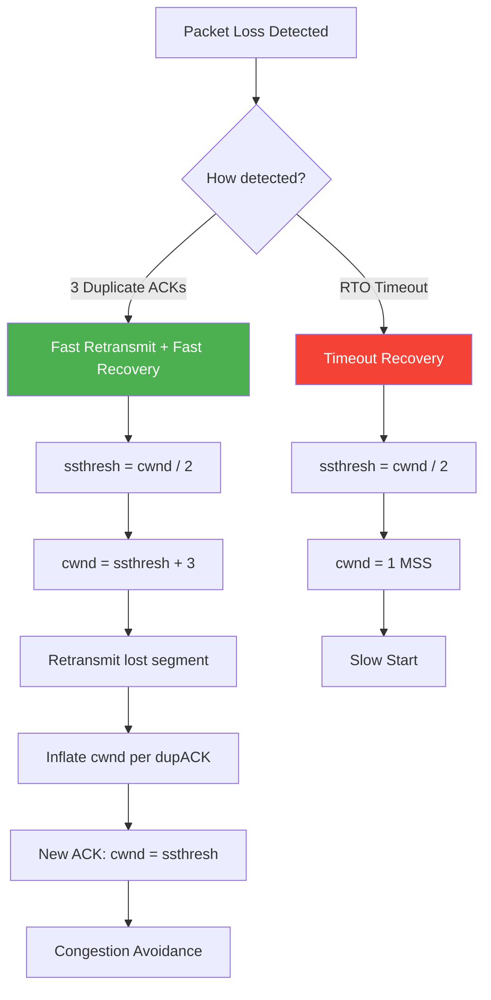
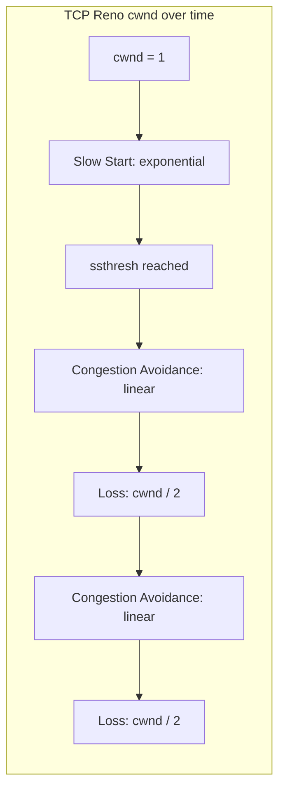
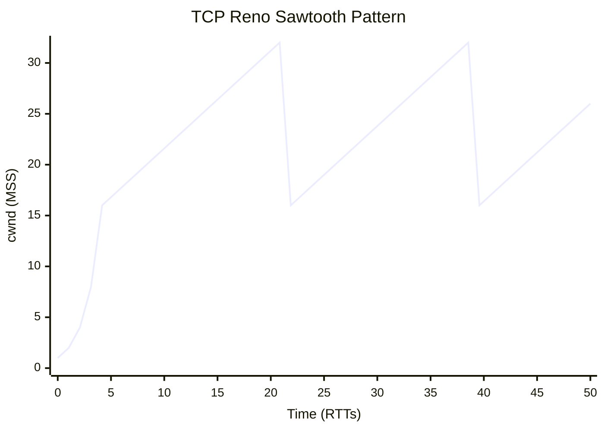

# TCP Reno

## Overview

TCP Reno is one of the most influential TCP congestion control algorithms. It combines **Slow Start**, **Congestion Avoidance**, **Fast Retransmit**, and **Fast Recovery** into a cohesive congestion control strategy. Named after Reno, Nevada (following the Tahoe naming convention), it was the dominant TCP variant for years and forms the conceptual foundation for all modern TCP congestion control.

Reno improved upon Tahoe by adding Fast Recovery — allowing TCP to recover from packet loss without falling all the way back to slow start.

## Detailed Explanation

### Reno's Four Mechanisms

#### 1. Slow Start
When a connection begins or after a timeout:
- Start with `cwnd = 1 MSS`
- For each ACK received, `cwnd += 1 MSS` (exponential growth)
- Growth rate: cwnd doubles every RTT
- Ends when `cwnd >= ssthresh`

```
RTT 1: cwnd = 1  → send 1 segment  → receive 1 ACK  → cwnd = 2
RTT 2: cwnd = 2  → send 2 segments → receive 2 ACKs → cwnd = 4
RTT 3: cwnd = 4  → send 4 segments → receive 4 ACKs → cwnd = 8
RTT 4: cwnd = 8  → send 8 segments → receive 8 ACKs → cwnd = 16
```

#### 2. Congestion Avoidance
When `cwnd >= ssthresh`:
- Increase cwnd by `1/cwnd` per ACK (linear growth)
- Growth rate: cwnd increases by 1 MSS per RTT
- More conservative probing for bandwidth

```
RTT 1: cwnd = 16 → send 16 → ACKs → cwnd = 17
RTT 2: cwnd = 17 → send 17 → ACKs → cwnd = 18
RTT 3: cwnd = 18 → send 18 → ACKs → cwnd = 19
```

#### 3. Fast Retransmit
When 3 duplicate ACKs are received:
- Don't wait for RTO
- Immediately retransmit the lost segment
- Proceed to Fast Recovery

#### 4. Fast Recovery
After Fast Retransmit:
- `ssthresh = cwnd / 2`
- `cwnd = ssthresh + 3 MSS` (inflated)
- For each additional dupACK: `cwnd += 1 MSS`
- When new ACK arrives: `cwnd = ssthresh` → congestion avoidance

### Reno's Congestion Control State Machine



### Reno's Response to Loss Events



### AIMD: Additive Increase, Multiplicative Decrease

Reno implements AIMD:

```
Additive Increase (Congestion Avoidance):
  Each RTT: cwnd += 1 MSS
  
Multiplicative Decrease (on loss):
  cwnd = cwnd / 2 (via Fast Recovery)
  or cwnd = 1 (via Timeout)

Example trajectory:
  Start: cwnd = 1
  Linear increase: 1 → 2 → 3 → ... → 16
  Loss detected: cwnd = 8
  Linear increase: 8 → 9 → 10 → ... → 16
  Loss detected: cwnd = 8
  ... (sawtooth pattern)
```

### Reno's Sawtooth Pattern





### Reno's Algorithm (Pseudocode)

```python
# TCP Reno Congestion Control

ssthresh = initial_window  # typically 64 KB
cwnd = 1 * MSS
state = SLOW_START

def on_ack_received(ack_num):
    if state == SLOW_START:
        cwnd += MSS  # exponential growth
        if cwnd >= ssthresh:
            state = CONGESTION_AVOIDANCE
    elif state == CONGESTION_AVOIDANCE:
        cwnd += MSS * (MSS / cwnd)  # linear growth (~1 MSS per RTT)
    elif state == FAST_RECOVERY:
        cwnd += MSS  # window inflation
        # Will exit when new ACK arrives

def on_duplicate_ack():
    dup_ack_count += 1
    if dup_ack_count == 3:  # Fast Retransmit
        ssthresh = cwnd / 2
        cwnd = ssthresh + 3 * MSS
        retransmit_lost_segment()
        state = FAST_RECOVERY

def on_new_ack_in_recovery():
    cwnd = ssthresh
    state = CONGESTION_AVOIDANCE

def on_timeout():
    ssthresh = cwnd / 2
    cwnd = 1 * MSS
    dup_ack_count = 0
    state = SLOW_START
    retransmit_lost_segment()
```

### Reno vs Tahoe Comparison

| Feature | TCP Tahoe | TCP Reno |
|---------|-----------|----------|
| **Slow Start** | ✓ | ✓ |
| **Congestion Avoidance** | ✓ | ✓ |
| **Fast Retransmit** | ✓ | ✓ |
| **Fast Recovery** | ✗ | ✓ |
| **On 3 dupACKs** | Slow start from cwnd=1 | Fast Recovery (cwnd halved) |
| **On timeout** | Slow start from cwnd=1 | Slow start from cwnd=1 |
| **Multiple losses** | Falls to timeout | Partial ACK handling (basic) |
| **Efficiency** | Lower | Higher |

### Reno's Limitations

1. **Multiple packet losses**: Reno can't handle multiple losses in one window well. A partial ACK during fast recovery may cause Reno to exit recovery prematurely.

2. **Low bandwidth-delay products**: Reno's linear increase is too slow for high-BDP networks.

3. **Random loss**: Reno treats all loss as congestion, penalizing wireless links with random loss.

4. **RTT unfairness**: Flows with shorter RTTs grow their cwnd faster.

5. **No ECN support**: Reno doesn't support Explicit Congestion Notification (added in later variants).

### Evolution from Reno

```
Tahoe → Reno → NewReno → SACK → CUBIC → BBR
         ↑
    Fast Recovery added
```

## Example: Reno in a Real Scenario

### Scenario: Web page transfer over a 100ms RTT link

```
Time 0ms:    cwnd = 1 MSS, ssthresh = 64 KB
             Send 1 segment (1460 bytes)
             
Time 100ms:  ACK received, cwnd = 2 MSS
             Send 2 segments
             
Time 200ms:  2 ACKs received, cwnd = 4 MSS
             Send 4 segments
             
Time 300ms:  4 ACKs, cwnd = 8 MSS
             Send 8 segments
             
Time 400ms:  8 ACKs, cwnd = 16 MSS (≈23.4 KB)
             ssthresh reached, switch to congestion avoidance
             Send 16 segments
             
Time 500ms:  16 ACKs, cwnd = 17 MSS
             Linear growth begins
             ...
             
Time 800ms:  cwnd = 20 MSS, segment lost
             3 duplicate ACKs received
             Fast Retransmit: resend lost segment
             ssthresh = 10 MSS, cwnd = 13 MSS
             
Time 900ms:  New ACK received
             cwnd = 10 MSS
             Continue congestion avoidance
```

## Interview Questions

### Q1: What are the four congestion control mechanisms in TCP Reno?
**A:** (1) Slow Start — exponential growth from cwnd=1; (2) Congestion Avoidance — linear growth after ssthresh; (3) Fast Retransmit — retransmit on 3 dupACKs without waiting for RTO; (4) Fast Recovery — halve cwnd instead of resetting to 1, keep pipeline full via window inflation.

### Q2: How does Reno differ from Tahoe?
**A:** The key difference is Fast Recovery. When Tahoe detects loss via 3 dupACKs, it resets cwnd to 1 and goes to slow start. Reno uses Fast Recovery to halve cwnd and stay in congestion avoidance, which is much more efficient for single packet losses.

### Q3: What is the AIMD pattern in TCP Reno?
**A:** Additive Increase, Multiplicative Decrease. During congestion avoidance, cwnd increases by ~1 MSS per RTT (additive). On loss, cwnd is halved (multiplicative decrease). This creates a sawtooth pattern and is proven to converge to fairness among competing flows.

### Q4: Why does Reno add 3 MSS to ssthresh when entering Fast Recovery?
**A:** The 3 duplicate ACKs indicate 3 segments have successfully left the network. Adding 3 to cwnd compensates for these departed segments, keeping the pipeline approximately full while the retransmission is in flight.

### Q5: What happens in Reno when multiple packets are lost in one window?
**A:** Reno handles this poorly. After retransmitting the first loss and receiving a partial ACK (that doesn't cover all outstanding data), Reno may exit Fast Recovery prematurely. The second loss may only be detected via timeout, which is much slower. NewReno was designed to fix this.

### Q6: Why is Reno's linear increase problematic for high-BDP networks?
**A:** In a network with 1 Gbps bandwidth and 100ms RTT, the BDP is ~12.5 MB (≈8562 MSS of 1460 bytes). For a 3-dupACK loss (Reno's fast-recovery case), cwnd drops to cwnd/2 (≈4281 MSS), so recovery to BDP takes ~4281 RTTs (~7.1 minutes). The 8500-RTT / 14-minute figure is only correct for a timeout that resets cwnd to 1 MSS, which Reno's fast-recovery feature is designed to avoid. This is why CUBIC and BBR were developed.

### Q7: How does Reno determine the initial ssthresh?
**A:** Typically, ssthresh is set to a large value (e.g., 65535 bytes) at connection start, so slow start runs until actual congestion is detected. After a loss event, ssthresh is set to cwnd/2.

### Q8: What is the sawtooth pattern in Reno?
**A:** Reno's cwnd follows a sawtooth: it increases linearly during congestion avoidance, then drops by half on packet loss, then increases linearly again. This pattern repeats, with cwnd oscillating between ssthresh and 2×ssthresh.

## Common Mistakes

1. **Confusing Slow Start with Congestion Avoidance growth rates**: Slow Start doubles cwnd per RTT (exponential); Congestion Avoidance adds 1 MSS per RTT (linear). The names are misleading — "slow" start is actually faster!

2. **Thinking Reno resets cwnd to 1 on 3 dupACKs**: That's Tahoe behavior. Reno uses Fast Recovery (halves cwnd). Only on RTO timeout does Reno reset to 1.

3. **Forgetting that ssthresh is halved on every loss**: Whether it's fast recovery or timeout, ssthresh always becomes cwnd/2. This means ssthresh can keep decreasing over time.

4. **Not understanding window inflation vs deflation**: During Fast Recovery, cwnd is inflated (ssthresh + 3 + dupACKs). When a new ACK arrives, cwnd deflates to ssthresh. This is critical for keeping the pipeline full.

5. **Assuming Reno handles multiple losses well**: It doesn't. A second loss in the same window often requires timeout recovery. NewReno and SACK fix this.

6. **Confusing cwnd with rwnd**: Reno controls cwnd (congestion window). The actual sending rate is min(cwnd, rwnd). A small rwnd from the receiver can limit throughput regardless of cwnd.

7. **Not knowing that Reno is largely obsolete**: Modern Linux uses CUBIC, macOS uses CUBIC or TCP NewReno. But Reno is still the conceptual foundation for understanding congestion control.

## Summary

| Mechanism | Reno Behavior |
|-----------|---------------|
| **Slow Start** | cwnd starts at 1 MSS, doubles per RTT until ssthresh |
| **Congestion Avoidance** | cwnd increases by 1 MSS per RTT (linear) |
| **Fast Retransmit** | 3 dupACKs → retransmit immediately |
| **Fast Recovery** | ssthresh = cwnd/2, cwnd = ssthresh + 3, inflate per dupACK |
| **Timeout** | ssthresh = cwnd/2, cwnd = 1 MSS, back to slow start |
| **Pattern** | Sawtooth (AIMD) |
| **Limitation** | Poor multi-loss handling, slow for high-BDP |

TCP Reno was the workhorse of the Internet for many years and remains the baseline for understanding all modern TCP congestion control algorithms.

## Cross-References

- [TCP Fast Recovery](fast-recovery.md) — Deep dive into the Fast Recovery mechanism
- [TCP CUBIC](cubic.md) — Modern successor that addresses Reno's high-BDP limitations
- [TCP BBR](bbr.md) — Model-based approach that moves beyond loss-based congestion control
- [TCP States](states.md) — How congestion control fits into the TCP state machine
- [TCP Timers](timers.md) — RTO timer that Reno helps avoid via Fast Recovery
