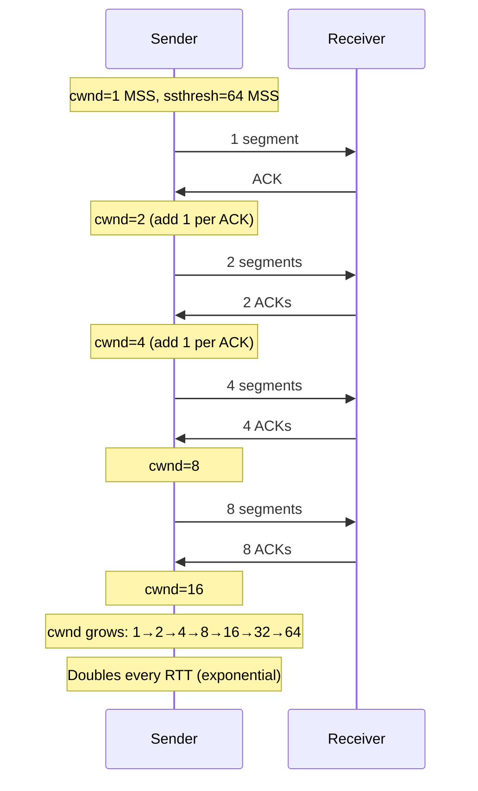
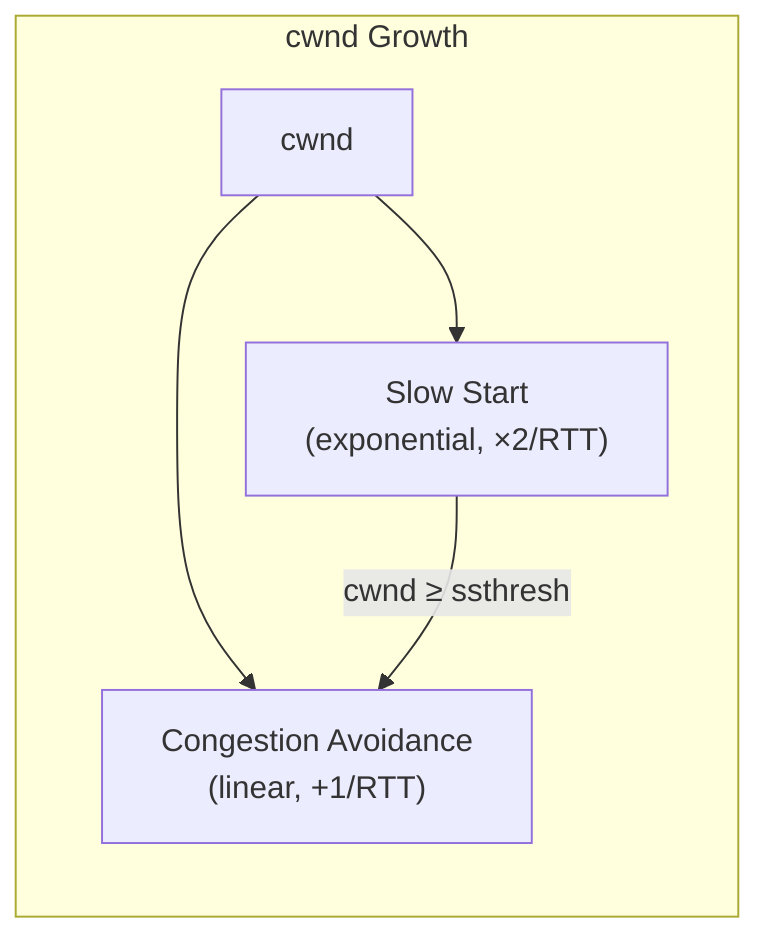
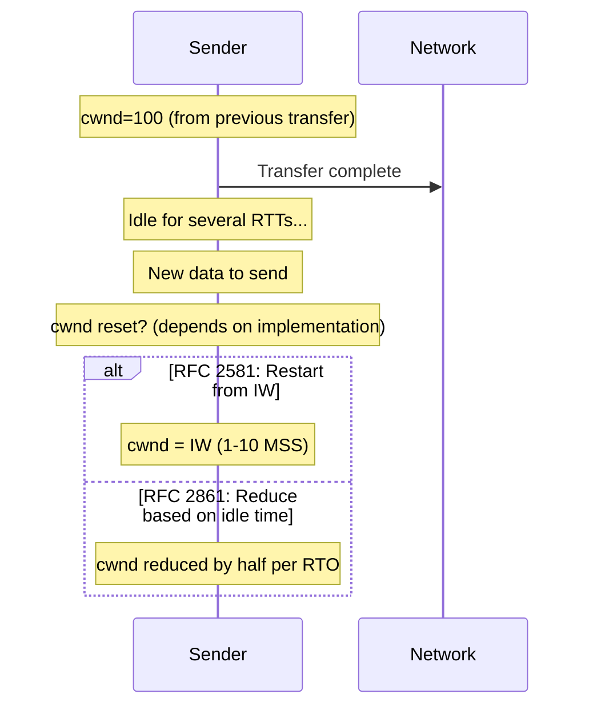
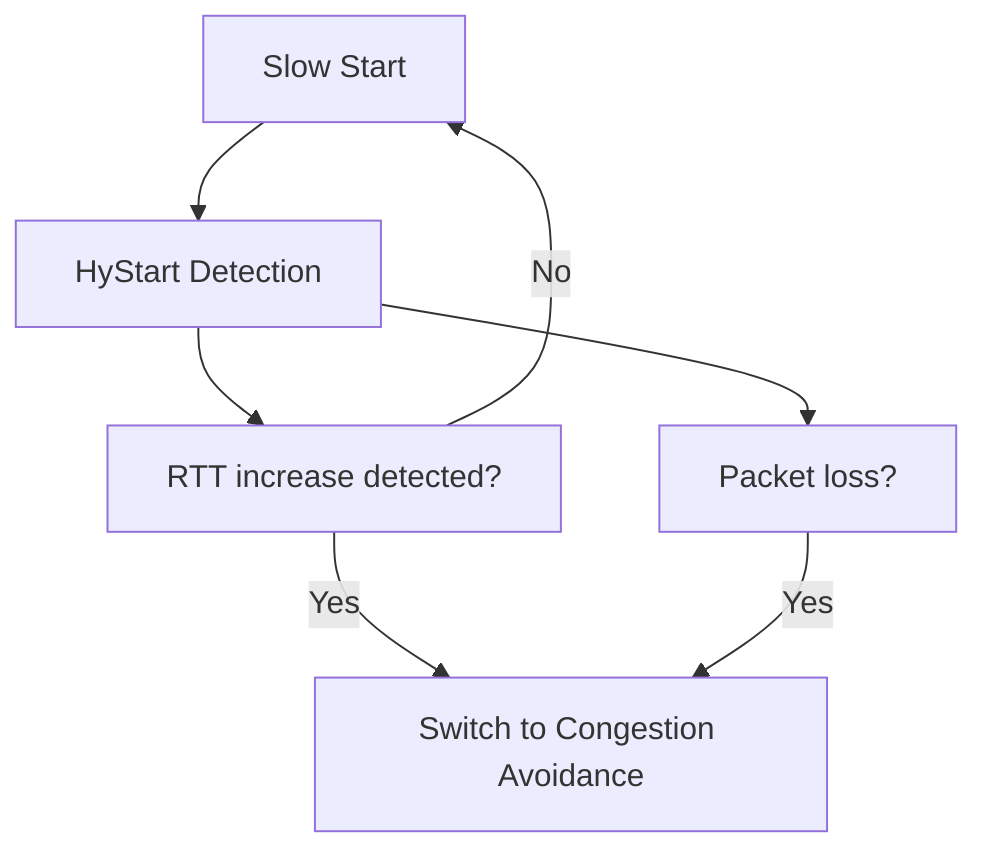

# TCP Slow Start

> *"Slow start isn't actually slow — it's exponential growth that just starts small."*

## Overview

**Slow Start** is the initial phase of TCP congestion control where cwnd grows **exponentially** (doubles every RTT). Despite its name, it's aggressive growth — but starts from a small value. The name "slow" is relative to the original approach of sending the full window immediately.

## How Slow Start Works



## Slow Start Algorithm

```
For each ACK received:
    cwnd += MSS  (increase by 1 MSS per ACK)

Since cwnd segments are in flight and all get ACKed:
    cwnd effectively doubles each RTT

Example:
    RTT 0: cwnd=1, send 1 segment → 1 ACK → cwnd=2
    RTT 1: cwnd=2, send 2 segments → 2 ACKs → cwnd=4
    RTT 2: cwnd=4, send 4 segments → 4 ACKs → cwnd=8
    ...
```

## When Slow Start is Used

| Scenario | Trigger |
|----------|---------|
| **New connection** | Start of TCP connection |
| **After timeout** | Retransmission timeout (cwnd reset to 1) |
| **After idle** | Long idle period (cwnd reset to IW) |

## Slow Start vs Congestion Avoidance



| Phase | Growth | When |
|-------|--------|------|
| Slow Start | Exponential (×2 per RTT) | cwnd < ssthresh |
| Congestion Avoidance | Linear (+1 per RTT) | cwnd ≥ ssthresh |

## Slow Start Threshold (ssthresh)

```
Initial ssthresh: 65535 bytes (or large value)
On loss: ssthresh = cwnd / 2
```

The threshold determines when slow start transitions to congestion avoidance.

## Slow Start Too Idle

If a connection is idle, the network conditions may have changed. TCP "slow starts" again:



## Slow Start in Modern TCP

**RFC 6928** (2013): Initial Window = 10 MSS

```
IW = min(10 × MSS, max(2 × MSS, 14600 bytes))
```

This means slow start reaches useful throughput much faster:
- Old: 1→2→4→8→16→32→64 (6 RTTs to reach 64 MSS)
- New: 10→20→40→80 (3 RTTs to reach 80 MSS)

## HyStart (Hybrid Slow Start)

**Problem**: Slow start overshoots the optimal cwnd, causing loss.

**HyStart** (RFC 5682): Detects when to exit slow start earlier:
1. **Delay increase**: If RTT increases significantly, exit slow start
2. **Loss**: Standard loss detection
3. **Result**: More graceful transition to congestion avoidance



## Interview Questions

### Beginner

**Q1: Why is it called "slow start" if it's exponential?**
It's "slow" compared to the original approach: sending the entire advertised window immediately. Slow start begins with just 1 segment and grows exponentially — fast in absolute terms but slow compared to blasting the full window. The name stuck even though exponential growth is quite aggressive.

**Q2: How does cwnd grow during slow start?**
cwnd doubles every RTT. For each ACK received, cwnd increases by 1 MSS. Since cwnd segments are in flight and all get ACKed, the effective growth is doubling. Example: 1→2→4→8→16→32→64 MSS per RTT.

**Q3: When does slow start end?**
Slow start ends when: (1) cwnd reaches ssthresh (transition to congestion avoidance), (2) Packet loss is detected (timeout or 3 dupACKs), (3) HyStart detects delay increase.

### Intermediate

**Q4: What is the initial window and how has it changed?**
- **Original (RFC 2001)**: IW = 1 MSS
- **RFC 3390 (2002)**: IW = min(4×MSS, max(2×MSS, 4380 bytes))
- **RFC 6928 (2013)**: IW = min(10×MSS, max(2×MSS, 14600 bytes))
Larger IWs speed up short transfers (most web traffic is short-lived).

**Q5: Explain the slow start threshold (ssthresh).**
ssthresh separates slow start from congestion avoidance. Initially very large (65535). On loss, ssthresh = cwnd/2. Slow start continues until cwnd ≥ ssthresh, then switches to congestion avoidance. This prevents slow start from overshooting the network capacity.

**Q6: How does HyStart improve slow start?**
HyStart detects when slow start is approaching the network's capacity by monitoring RTT increases. If RTT increases (indicating queue buildup), HyStart exits slow start early, avoiding the overshoot that causes packet loss. This provides a smoother transition to congestion avoidance.

### Advanced / FAANG-Level

**Q7: How would you optimize TCP for short web flows (most HTTP requests)?**
Short flows complete during slow start — they never reach congestion avoidance. Optimizations:
1. **Large IW (10 MSS)**: Reach useful throughput faster
2. **TCP Fast Open**: Data in SYN (0-RTT)
3. **TFO + large IW**: Combine for maximum benefit
4. **SACK**: Efficient loss recovery during slow start
5. **Consider QUIC**: 0-RTT connection + improved congestion control

**Q8: What happens when slow start overshoots?**
If slow start grows cwnd beyond network capacity:
1. Router buffers fill up
2. Packets are dropped (or ECN marked)
3. TCP detects loss (timeout or dupACKs)
4. cwnd drops dramatically (to 1 on timeout, or cwnd/2 on fast retransmit)
5. Performance oscillation: overshoot → collapse → grow → overshoot
This is why HyStart was developed — to detect the right exit point.

**Q9: Design a congestion control phase that's better than slow start for data centers.**
Data center requirements: low latency, incast handling, fast ramp-up.

Design (similar to DCTCP):
1. **Aggressive initial window**: Start at 10-20 MSS
2. **ECN-based exit**: Exit slow start when ECN marks appear (not loss)
3. **Fine-grained feedback**: Proportional reduction based on ECN fraction
4. **No oscillation**: Maintain high cwnd, make small adjustments
5. **Pacing**: Smooth sending to avoid micro-bursts
6. **RTT-aware**: Exit slow start on delay increase (HyStart++)

## Common Mistakes

1. ❌ Thinking slow start is slow — it's exponential growth
2. ❌ Forgetting that timeout resets to slow start (cwnd=1)
3. ❌ Confusing slow start with congestion avoidance — they're different phases
4. ❌ Not considering IW for short flows — they complete during slow start
5. ❌ Ignoring HyStart — it prevents harmful overshoots

## Summary

- Slow start grows cwnd **exponentially** (doubles per RTT)
- Used at **connection start**, after **timeout**, and after **idle**
- **ssthresh** determines when to switch to congestion avoidance
- **Initial window**: 10 MSS in modern TCP (RFC 6928)
- **HyStart**: Detects when to exit slow start early (avoid overshoot)
- Despite its name, slow start is aggressive — it just starts small

## Cross-References

- [Congestion Control](congestion-control.md) — Overview of all phases
- [Congestion Avoidance](congestion-avoidance.md) — Linear growth phase
- [Fast Retransmit](fast-retransmit.md) — Loss detection
- [TCP Reno](reno.md) — Classic algorithm using slow start

## Cross References

- [Congestion Control](congestion-control.md)
- [Congestion Avoidance](congestion-avoidance.md)
- [TCP Reno](reno.md)
