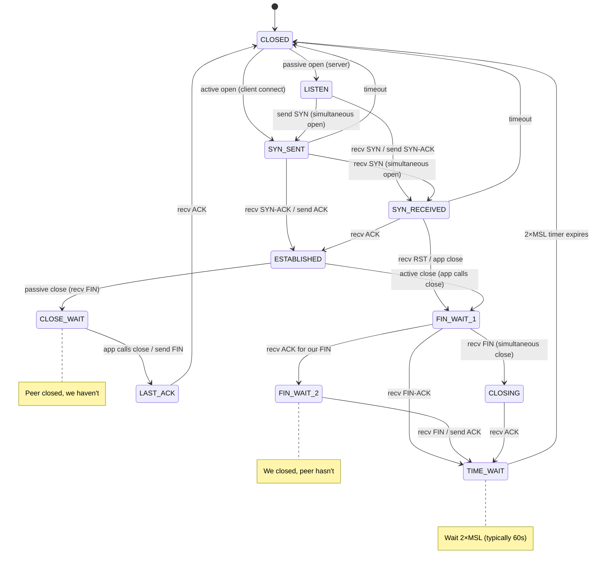
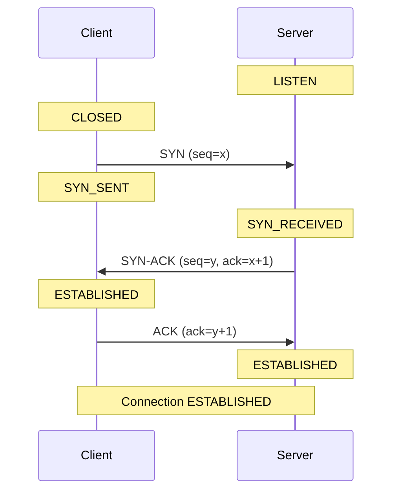
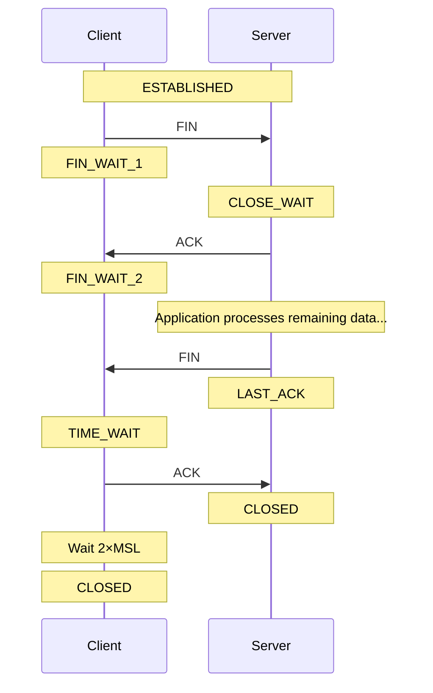
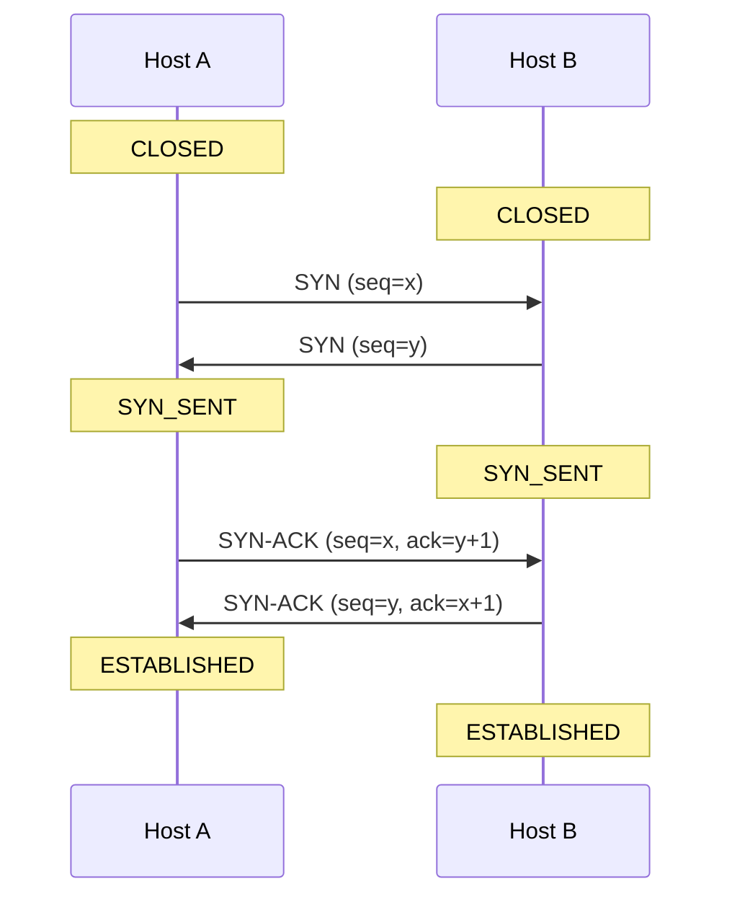
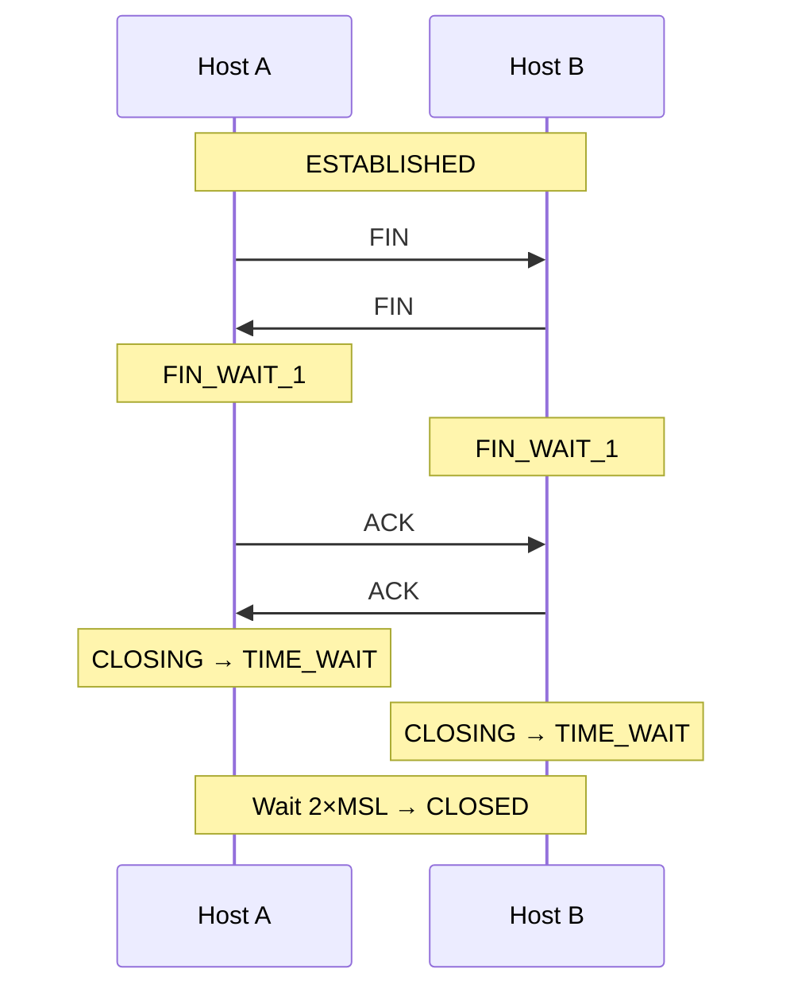

# TCP State Machine

## Overview

The TCP state machine defines the lifecycle of a TCP connection through a series of well-defined states. Every TCP connection transitions through these states from establishment to termination. Understanding the state machine is crucial for debugging network issues, interpreting `netstat`/`ss` output, and answering interview questions about connection management.

A TCP connection can be in exactly **one of 11 states** at any time. The transitions between states are driven by segment arrivals (SYN, FIN, ACK, RST), application calls (connect, accept, close), and timer expirations.

## Detailed Explanation

### The 11 TCP States

| State | Description |
|-------|-------------|
| **CLOSED** | No connection exists (initial/final state) |
| **LISTEN** | Server waiting for incoming connection (passive open) |
| **SYN_SENT** | Client sent SYN, waiting for SYN-ACK (active open) |
| **SYN_RECEIVED** | Server received SYN, sent SYN-ACK, waiting for ACK |
| **ESTABLISHED** | Connection open, data transfer in progress |
| **FIN_WAIT_1** | Sent FIN, waiting for ACK or FIN from peer |
| **FIN_WAIT_2** | Received ACK for our FIN, waiting for peer's FIN |
| **CLOSE_WAIT** | Received FIN from peer, waiting for application to close |
| **CLOSING** | Both sides sent FIN simultaneously, waiting for ACK |
| **LAST_ACK** | Sent FIN after CLOSE_WAIT, waiting for final ACK |
| **TIME_WAIT** | Received FIN and sent ACK, waiting for 2×MSL |

### Complete State Diagram



### Connection Establishment (Three-Way Handshake)



**State transitions:**
1. Client: `CLOSED → SYN_SENT` (send SYN)
2. Server: `LISTEN → SYN_RECEIVED` (receive SYN, send SYN-ACK)
3. Client: `SYN_SENT → ESTABLISHED` (receive SYN-ACK, send ACK)
4. Server: `SYN_RECEIVED → ESTABLISHED` (receive ACK)

### Connection Termination (Four-Way Handshake)



**State transitions (active close by client):**
1. Client: `ESTABLISHED → FIN_WAIT_1` (send FIN)
2. Server: `ESTABLISHED → CLOSE_WAIT` (receive FIN, send ACK)
3. Client: `FIN_WAIT_1 → FIN_WAIT_2` (receive ACK)
4. Server: `CLOSE_WAIT → LAST_ACK` (send FIN)
5. Client: `FIN_WAIT_2 → TIME_WAIT` (receive FIN, send ACK)
6. Server: `LAST_ACK → CLOSED` (receive ACK)
7. Client: `TIME_WAIT → CLOSED` (2×MSL timeout)

### Simultaneous Open

When both sides send SYN before receiving the other's SYN:



**Transitions:** Both go `CLOSED → SYN_SENT → SYN_RECEIVED → ESTABLISHED`

### Simultaneous Close

When both sides close at the same time:



**Transitions:** Both go `ESTABLISHED → FIN_WAIT_1 → CLOSING → TIME_WAIT → CLOSED`

### TIME_WAIT State (2×MSL Wait)

**Purpose:**
1. **Reliable termination**: Ensures the final ACK reaches the other side. If lost, the peer retransmits FIN, and TIME_WAIT allows proper handling.
2. **Old segment cleanup**: Prevents old duplicate segments from a previous connection from being delivered to a new connection with the same (src_ip, src_port, dst_ip, dst_port) tuple.

**Duration:** 2 × MSL (Maximum Segment Lifetime)
- Linux default: `net.ipv4.tcp_fin_timeout = 60` seconds (2 × 30s MSL)
- RFC 793: MSL = 2 minutes, so TIME_WAIT = 4 minutes

**Problems with TIME_WAIT:**
- Ties up resources (socket, memory)
- Limits connection rate to same destination (port exhaustion)
- Can prevent server restart (port in use)

**Solutions:**
```bash
# Allow socket reuse (Linux)
sysctl -w net.ipv4.tcp_tw_reuse=1

# Reduce TIME_WAIT timeout
sysctl -w net.ipv4.tcp_fin_timeout=30

# Allow TIME_WAIT socket shutdown (dangerous)
sysctl -w net.ipv4.tcp_tw_recycle=1  # Removed in Linux 4.12
```

### CLOSE_WAIT State

**Problem:** CLOSE_WAIT indicates the **local application** hasn't called `close()` after receiving FIN from the peer.

```
Normal:     ESTABLISHED → CLOSE_WAIT → LAST_ACK → CLOSED
Abnormal:   ESTABLISHED → CLOSE_WAIT (stuck — application bug!)
```

**Causes:**
- Application bug: not closing sockets properly
- Application crash: socket not cleaned up
- Resource leak: file descriptor exhaustion

**Debugging:**
```bash
# Check CLOSE_WAIT sockets
ss -tp state close-wait
netstat -tnp | grep CLOSE_WAIT

# Count by process
ss -tp state close-wait | awk '{print $NF}' | sort | uniq -c
```

### RST (Reset) Handling

RST segments cause immediate state transitions:

| Current State | On RST | Result |
|---------------|--------|--------|
| SYN_SENT | recv RST | → CLOSED (connection refused) |
| SYN_RECEIVED | recv RST | → LISTEN (if LISTEN) or CLOSED |
| ESTABLISHED | recv RST | → CLOSED (connection reset) |
| FIN_WAIT_1 | recv RST | → CLOSED |
| FIN_WAIT_2 | recv RST | → CLOSED |
| CLOSING | recv RST | → CLOSED |
| LAST_ACK | recv RST | → CLOSED |
| TIME_WAIT | recv RST | → CLOSED (or ignore) |

**RST triggers:**
- Port not listening (SYN to closed port)
- Connection refused by application
- Security/firewall rejection
- Invalid segment sequence numbers
- `SO_LINGER` set to 0

### RST vs FIN

| Aspect | FIN | RST |
|--------|-----|-----|
| **Purpose** | Graceful close | Abortive close |
| **Data** | Allows remaining data | Discards remaining data |
| **State transitions** | FIN_WAIT, CLOSE_WAIT, etc. | → CLOSED immediately |
| **Peer notification** | Application reads EOF | Application gets ECONNRESET |
| **Use case** | Normal close | Error, timeout, refusal |

## Example: Full Connection Lifecycle

### Web Server Connection Trace

```bash
# Server starts listening
$ ss -tlnp | grep :80
LISTEN  0  128  *:80  *:*  users:(("nginx",pid=1234,fd=6))

# Client connects
$ ss -tnp | grep :80
ESTAB  0  0  192.168.1.10:80  192.168.1.1:54321  users:(("nginx",pid=1234,fd=7))

# Client disconnects (server sees CLOSE_WAIT briefly)
CLOSE_WAIT  0  0  192.168.1.10:80  192.168.1.1:54321

# Server processes request and closes
LAST_ACK  0  0  192.168.1.10:80  192.168.1.1:54321

# After ACK received
# (socket cleaned up)
```

### Connection Pool Stuck in CLOSE_WAIT

```bash
# Problem: Application leak
$ ss -tp state close-wait | wc -l
1500

# Find leaking application
$ ss -tp state close-wait | awk '{print $NF}' | sort | uniq -c
   1500 users:(("myapp",pid=5678,fd=42))

# Solution: Fix application to close connections, or restart
```

### TIME_WAIT Accumulation

```bash
# High-traffic server
$ ss -tp state time-wait | wc -l
50000

# This is usually normal for a busy server
# But can be problematic for connection reuse

# Check TIME_WAIT settings
$ sysctl net.ipv4.tcp_tw_reuse
net.ipv4.tcp_tw_reuse = 0

# Enable reuse (safe for outbound connections)
$ sudo sysctl -w net.ipv4.tcp_tw_reuse=1
```

## Interview Questions

### Q1: What are the states in a TCP connection lifecycle?
**A:** The key states are: CLOSED → LISTEN → SYN_RECEIVED → ESTABLISHED → FIN_WAIT_1 → FIN_WAIT_2 → TIME_WAIT → CLOSED (server perspective). Client: CLOSED → SYN_SENT → ESTABLISHED → FIN_WAIT_1 → FIN_WAIT_2 → TIME_WAIT → CLOSED.

### Q2: Why is TIME_WAIT needed?
**A:** Two reasons: (1) **Reliable termination** — if the final ACK is lost, the peer retransmits FIN; TIME_WAIT allows proper handling. (2) **Old segment cleanup** — prevents stale segments from a previous connection from being delivered to a new connection with the same 4-tuple. Duration: 2 × MSL.

### Q3: What is CLOSE_WAIT and why is it dangerous?
**A:** CLOSE_WAIT means the peer has sent FIN (closed their end), but the local application hasn't called `close()`. It indicates an **application bug** — the socket is leaked. Stuck CLOSE_WAIT sockets consume file descriptors and memory. The fix is in the application code, not the OS.

### Q4: What's the difference between FIN_WAIT_1, FIN_WAIT_2, and TIME_WAIT?
**A:** **FIN_WAIT_1**: We sent FIN, waiting for ACK. **FIN_WAIT_2**: We received ACK for our FIN, waiting for peer's FIN. **TIME_WAIT**: We received peer's FIN and sent ACK, waiting 2×MSL to ensure reliable termination and clean up old segments.

### Q5: How does simultaneous open work?
**A:** Both sides send SYN before receiving the other's SYN. States: CLOSED → SYN_SENT → SYN_RECEIVED → ESTABLISHED. Both send SYN-ACK instead of just ACK. This is rare but supported by TCP.

### Q6: What causes RST and what does it do?
**A:** RST (Reset) aborts a connection immediately. Causes: port not listening, connection refused, security rejection, invalid sequence numbers. It transitions the peer directly to CLOSED. Unlike FIN (graceful), RST is abortive — no more data can be sent or received.

### Q7: How do you debug stuck CLOSE_WAIT sockets?
**A:** Use `ss -tp state close-wait` to list them with process info. Check which application has the most CLOSE_WAIT sockets. The fix is always in the application — it must call `close()` after receiving EOF. Common causes: connection pool leaks, missing error handling, application crashes.

### Q8: What is the difference between active and passive close?
**A:** **Active close**: The side that calls `close()` first. Goes through FIN_WAIT_1 → FIN_WAIT_2 → TIME_WAIT. **Passive close**: The side that receives FIN first. Goes through CLOSE_WAIT → LAST_ACK. The active closer ends up in TIME_WAIT (handles the 2×MSL wait).

## Common Mistakes

1. **Confusing FIN_WAIT_2 with TIME_WAIT**: FIN_WAIT_2 means we're waiting for the peer's FIN. TIME_WAIT means we've received FIN and sent ACK, waiting for cleanup. FIN_WAIT_2 can be stuck if the peer never sends FIN (bug or crash).

2. **Not understanding TIME_WAIT's purpose**: TIME_WAIT is not a bug — it's essential for reliable termination and preventing stale segments. Don't blindly disable it with `tcp_tw_recycle` (removed in Linux 4.12 for good reason).

3. **Thinking CLOSE_WAIT is an OS issue**: CLOSE_WAIT is always an application bug. The OS correctly received FIN and put the socket in CLOSE_WAIT. The application must call `close()` to transition to LAST_ACK.

4. **Confusing RST with FIN**: FIN is graceful (allows remaining data). RST is abortive (immediate teardown). FIN causes proper state transitions; RST causes immediate CLOSED.

5. **Not knowing that TIME_WAIT ties up the 4-tuple**: A connection in TIME_WAIT prevents a new connection with the same (src_ip, src_port, dst_ip, dst_port). This is why high-connection-rate servers may need `tcp_tw_reuse`.

6. **Forgetting about simultaneous open/close**: TCP supports both simultaneous open (both SYN) and simultaneous close (both FIN). These are rare but valid scenarios that affect state transitions.

7. **Not understanding the 2×MSL duration**: TIME_WAIT = 2 × MSL. Linux MSL = 30 seconds (configurable via tcp_fin_timeout). This means TIME_WAIT = 60 seconds by default, not 2 minutes.

## Summary

| State | Meaning | Typical Duration |
|-------|---------|-----------------|
| **CLOSED** | No connection | Initial/final |
| **LISTEN** | Waiting for connections | Until server stops |
| **SYN_SENT** | Sent SYN, waiting for SYN-ACK | 1 RTT |
| **SYN_RECEIVED** | Got SYN, sent SYN-ACK | 1 RTT |
| **ESTABLISHED** | Connection active | Data transfer |
| **FIN_WAIT_1** | Sent FIN, waiting for ACK | 1 RTT |
| **FIN_WAIT_2** | Got ACK, waiting for FIN | Until peer closes |
| **CLOSE_WAIT** | Peer closed, we haven't | Until app closes |
| **CLOSING** | Both sent FIN | 1 RTT |
| **LAST_ACK** | Sent FIN, waiting for ACK | 1 RTT |
| **TIME_WAIT** | Cleanup wait | 2×MSL (60s default) |

The TCP state machine is the foundation of connection management. Understanding each state, its transitions, and common issues is essential for network debugging and interview success.

## Cross-References

- [TCP Timers](timers.md) — Timers that drive state transitions (RTO, TIME_WAIT)
- [TCP Options](options.md) — Options negotiated during SYN (MSS, window scaling)
- [TCP Keepalive](keepalive.md) — Keepalive mechanism in ESTABLISHED state
- [TCP Fast Recovery](fast-recovery.md) — Congestion control within ESTABLISHED state
- [HTTP Overview](../http/README.md) — Application layer that uses TCP connections
