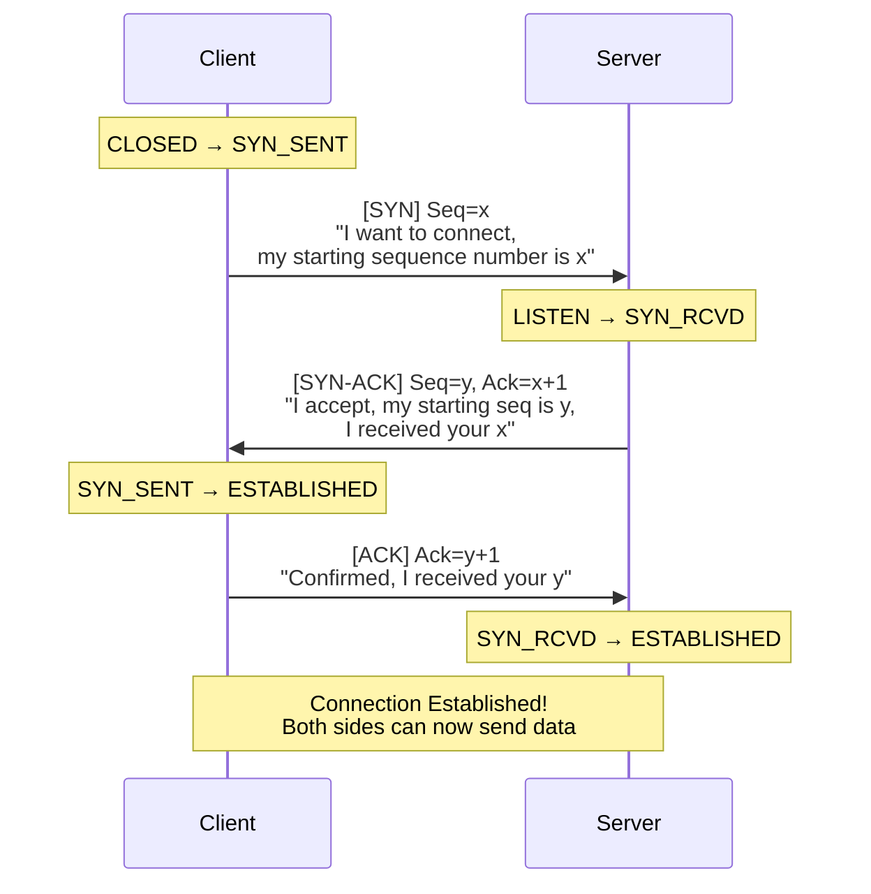
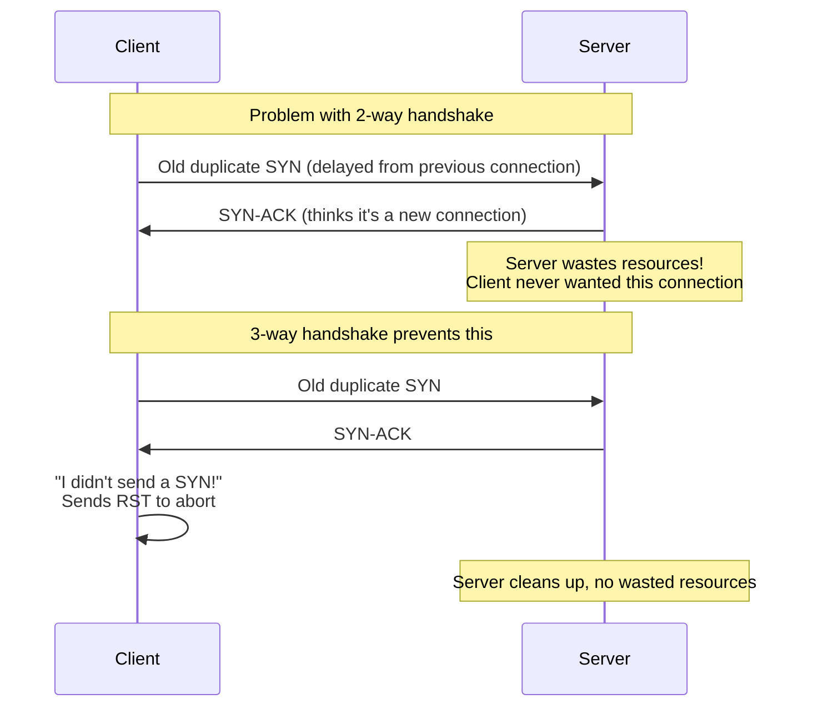
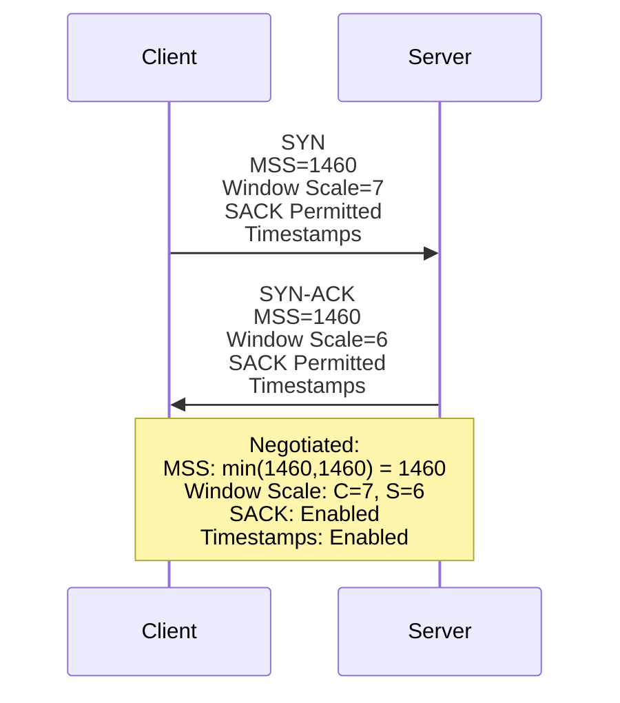
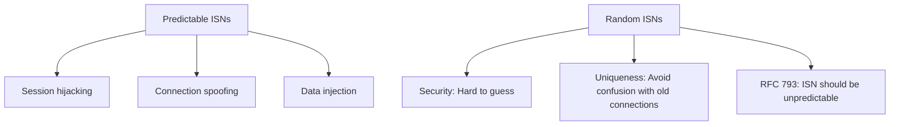
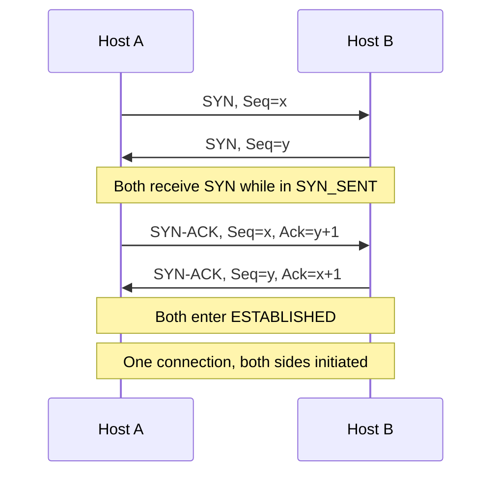
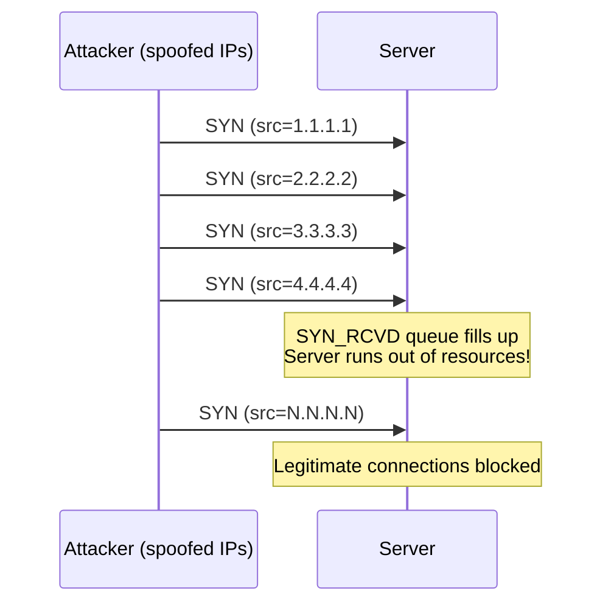

# TCP Three-Way Handshake

> *"The 3-way handshake is TCP's way of saying 'hello, let's talk — and here's how we'll track our conversation.'"*

## Overview

The **Three-Way Handshake** establishes a TCP connection before data transfer begins. It synchronizes sequence numbers and negotiates connection parameters between client and server.

## The Handshake Process



## Step-by-Step Breakdown

### Step 1: SYN (Client → Server)

```
Client → Server:
  Flags:     SYN
  Seq:       x (random initial sequence number)
  Options:   MSS, Window Scale, SACK, Timestamps
  State:     Client: CLOSED → SYN_SENT
```

- Client picks a random **Initial Sequence Number (ISN)**
- Includes TCP options the client supports
- No data in this segment

### Step 2: SYN-ACK (Server → Client)

```
Server → Client:
  Flags:     SYN + ACK
  Seq:       y (server's random ISN)
  Ack:       x + 1 (acknowledges client's SYN)
  Options:   MSS, Window Scale, SACK, Timestamps
  State:     Server: LISTEN → SYN_RCVD
```

- Server picks its own random ISN
- Acknowledges client's SYN (x+1 because SYN consumes 1 seq number)
- Includes server's supported options

### Step 3: ACK (Client → Server)

```
Client → Server:
  Flags:     ACK
  Seq:       x + 1
  Ack:       y + 1 (acknowledges server's SYN)
  State:     Client: SYN_SENT → ESTABLISHED
  Data:      Can include data (piggybacked)
```

- Acknowledges server's SYN (y+1)
- Connection is now ESTABLISHED
- Client can start sending data immediately

## Why Three Way? (Not Two)



The third ACK serves as:
1. **Confirmation**: Client confirms it received the server's SYN-ACK
2. **Validation**: Proves the client actually initiated the connection
3. **Synchronization**: Both sides have confirmed each other's ISNs

## TCP Options Negotiation

During the handshake, both sides negotiate options:



| Option | Client Offers | Server Accepts | Result |
|--------|--------------|----------------|--------|
| MSS | 1460 | 1460 | min(1460,1460) = 1460 |
| Window Scale | 7 (×128) | 6 (×64) | Each uses other's value |
| SACK | Permitted | Permitted | Enabled both directions |
| Timestamps | Enabled | Enabled | Enabled both directions |

## ISN (Initial Sequence Number) Selection

### Why Random ISNs?



**Modern ISN generation**: ISN = clock-based + hash(srcIP, srcPort, dstIP, dstPort, secret)
- Clock component ensures uniqueness over time
- Hash component ensures unpredictability
- Changed every ~4 microseconds (2^32 wraps in ~4.6 hours)

## Simultaneous Open

When both sides send SYN at the same time:



## SYN Flood Attack



### SYN Flood Defenses

| Defense | Description |
|---------|-------------|
| **SYN Cookies** | No state stored; encode info in ISN, verify on ACK |
| **SYN Cache** | Hash table instead of per-connection state |
| **Rate Limiting** | Limit SYN packets per source IP |
| **Firewalls** | Detect and block SYN flood patterns |
| **Cloud DDoS** | Cloudflare, AWS Shield absorb flood |

### SYN Cookies

Instead of storing state in SYN_RCVD:
1. Encode connection info in the ISN (MSS, timestamp, hash)
2. Send SYN-ACK with cookie ISN
3. When ACK comes back, verify the cookie
4. No memory used for half-open connections

## Interview Questions

### Beginner

**Q1: What is the TCP 3-way handshake?**
The 3-way handshake establishes a TCP connection: (1) Client sends SYN with its sequence number, (2) Server responds with SYN-ACK, acknowledging client's SYN and sending its own sequence number, (3) Client sends ACK, acknowledging server's SYN. After these three steps, both sides have synchronized their sequence numbers and can begin data transfer.

**Q2: Why can't TCP use a 2-way handshake?**
A 2-way handshake can't verify both sides are ready and synchronized. If an old, delayed SYN arrives, the server would establish a connection the client doesn't expect. The third ACK confirms to the server that the client actually received the SYN-ACK and wants to proceed.

**Q3: What is an ISN?**
ISN (Initial Sequence Number) is the starting sequence number chosen by each side during the handshake. It's randomly generated to prevent session hijacking and connection confusion with old connections. Both sides exchange ISNs during the handshake.

### Intermediate

**Q4: What TCP options are negotiated during the handshake?**
Key options: (1) **MSS**: Maximum segment size (avoid fragmentation), (2) **Window Scale**: Scale window size for high-BDP networks, (3) **SACK**: Selective acknowledgments for efficient loss recovery, (4) **Timestamps**: RTT measurement and PAWS protection.

**Q5: What happens if the third ACK is lost?**
If the third ACK (client → server) is lost:
- Server stays in SYN_RCVD, eventually retransmits SYN-ACK
- Client is in ESTABLISHED and may start sending data
- Server receives data, transitions to ESTABLISHED (implicit confirmation)
- Or server times out and closes the connection

**Q6: How does SYN cookie defense work?**
SYN cookies avoid storing state for half-open connections. Instead of saving connection info in memory, the server encodes it (MSS, timestamp) into the ISN using a hash. When the ACK comes back, the server verifies the cookie. This prevents SYN flood attacks from consuming memory.

### Advanced / FAANG-Level

**Q7: How does TCP Fast Open (TFO) work?**
TFO allows data in the SYN segment (0-RTT connection establishment):
1. **First connection**: Normal handshake, server generates TFO cookie
2. **Subsequent connections**: Client includes TFO cookie + data in SYN
3. Server validates cookie, sends data in SYN-ACK (0-RTT!)
4. Risk: Replay attacks on data (only use for idempotent requests)

**Q8: Design a load balancer that handles TCP handshakes efficiently.**
Approaches:
1. **L4 DSR (Direct Server Return)**: LB forwards SYN to server, server responds directly to client. LB doesn't track state.
2. **L4 NAT**: LB terminates handshake, creates new connection to backend. State tracking required.
3. **L7 full proxy**: LB terminates TCP + TLS, creates new connection. Enables HTTP routing.
4. **SYN cookie offload**: LB uses SYN cookies to absorb SYN floods.
5. **Connection pooling**: Reuse backend connections across clients.

**Q9: Explain how TCP handles the case where a connection attempt receives a SYN for a port with no listener.**
When a SYN arrives for a closed port:
1. TCP stack sends RST+ACK (not just RST)
2. RST+ACK has: Seq=0 (or random), Ack=received_seq+1
3. Client receives RST, connection attempt fails immediately
4. Application gets "Connection refused" error (ECONNREFUSED)
This is immediate feedback — no timeout needed.

## Common Mistakes

1. ❌ Thinking the handshake establishes a "physical" connection — it's logical state in both endpoints
2. ❌ Forgetting SYN consumes one sequence number — first data byte is ISN+1
3. ❌ Confusing SYN_RCVD with ESTABLISHED — SYN_RCVD means waiting for the third ACK
4. ❌ Assuming the third ACK can't carry data — it can (piggybacked)
5. ❌ Not considering SYN flood attacks in server design

## Summary

- 3-way handshake: **SYN → SYN-ACK → ACK** — synchronizes both sides
- Each side picks a random **ISN** (Initial Sequence Number)
- **Options negotiated**: MSS, Window Scale, SACK, Timestamps
- **Why 3-way**: Validates both sides, prevents stale SYN issues
- **SYN flood**: Attacker sends many SYNs; mitigated with SYN cookies
- **TCP Fast Open**: Data in SYN for 0-RTT on subsequent connections

## Cross-References

- [Four-Way Teardown](four-way.md) — How connections end
- [TCP Header](header.md) — Flags and fields used
- [TCP Options](options.md) — MSS, SACK, Timestamps
- [TCP States](states.md) — Connection state machine

## Cross References

- [Four-Way Teardown](four-way.md)
- [TCP States](states.md)
- [TCP Header](header.md)
- [Flow Control](flow-control.md)
