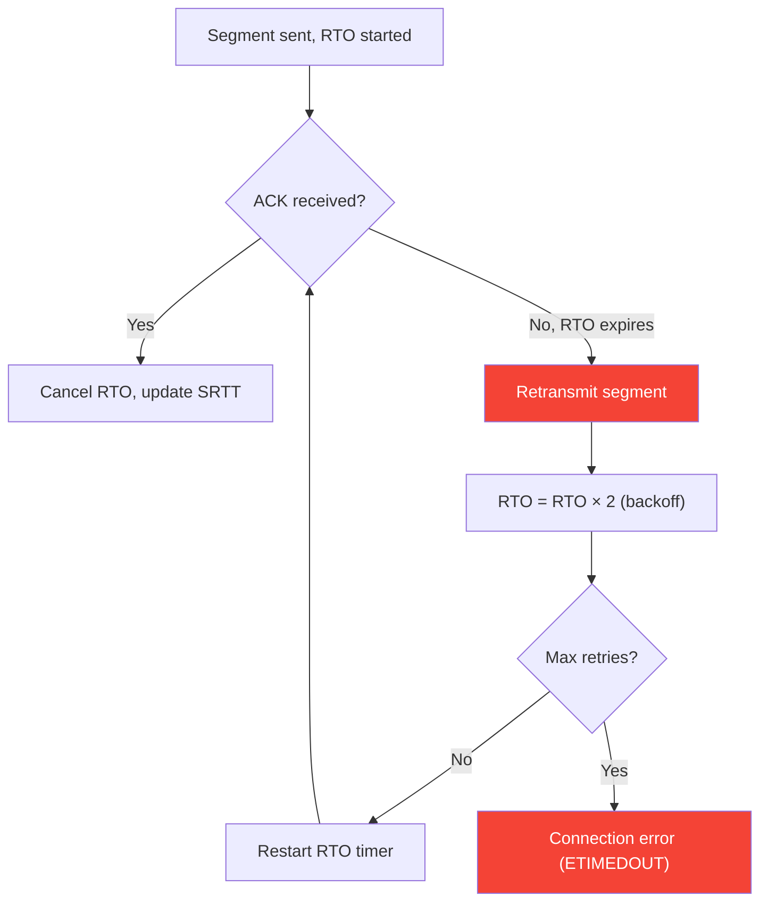
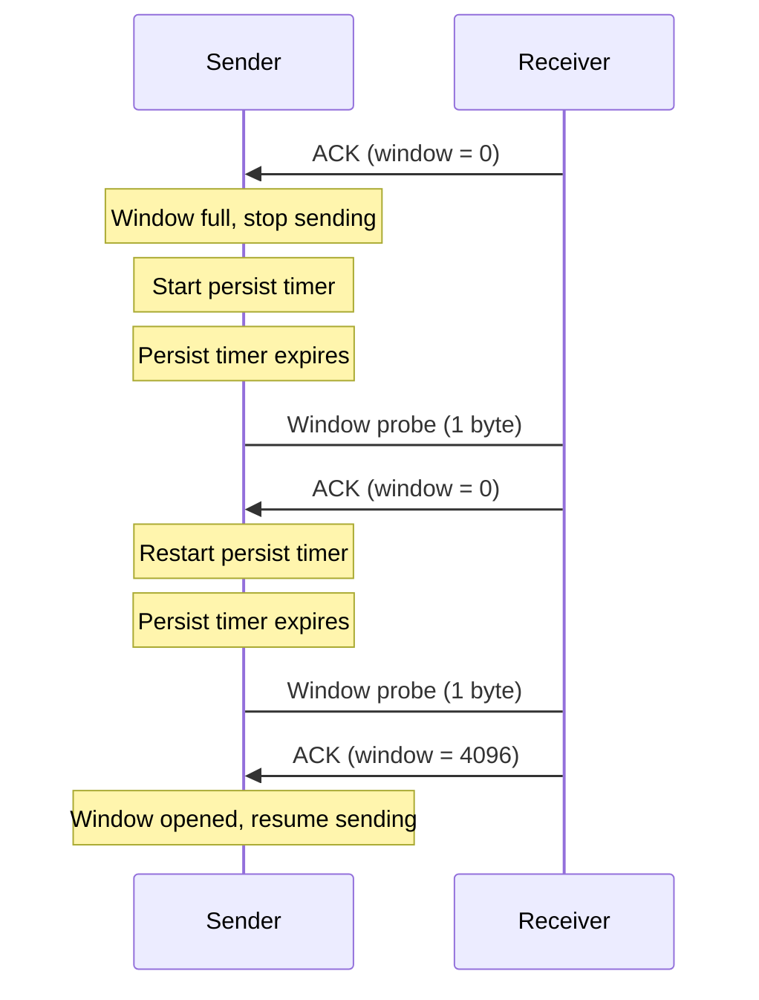
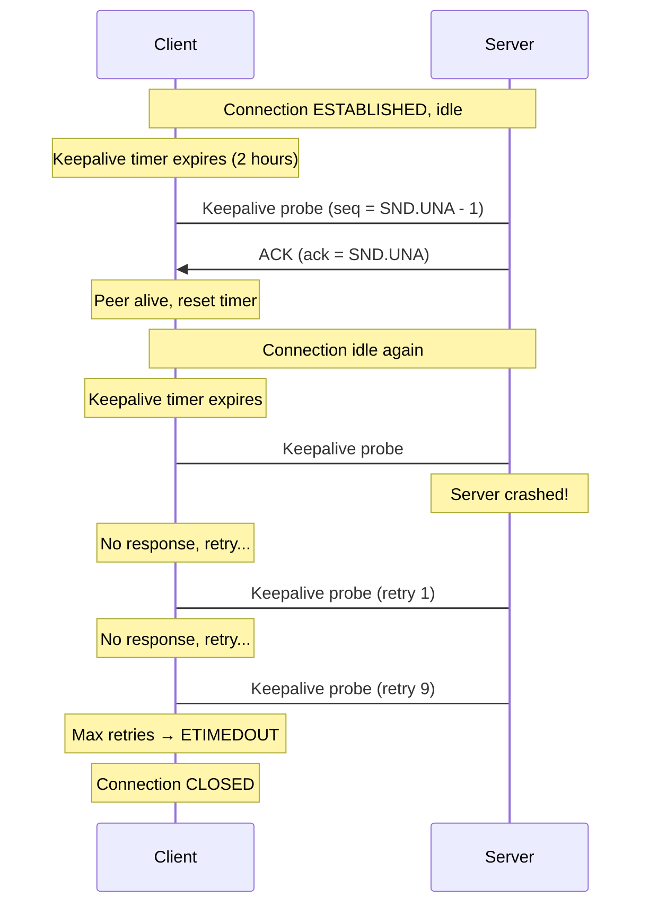
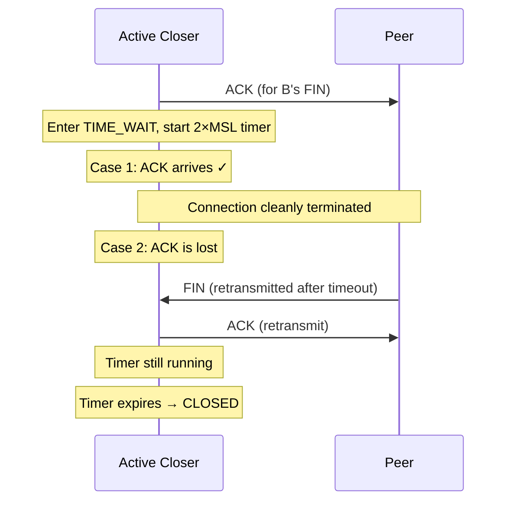
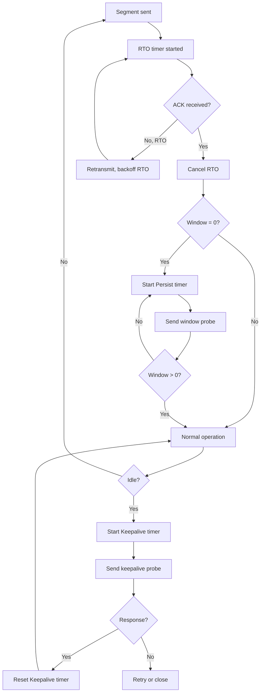

# TCP Timers

## Overview

TCP uses **four critical timers** to ensure reliable, ordered data delivery. These timers handle retransmissions, window probing, connection liveness detection, and safe connection termination. Without these timers, TCP would be unable to recover from lost segments, detect dead connections, or safely close connections.

Understanding TCP timers is essential for debugging performance issues (why is this connection slow?), writing robust applications (why does my connection hang?), and answering network interview questions.

## Detailed Explanation

### The Four TCP Timers

| Timer | Purpose | Typical Value | State(s) |
|-------|---------|---------------|----------|
| **Retransmission Timer (RTO)** | Retransmit lost segments | 200ms–120s (adaptive) | ESTABLISHED |
| **Persist Timer** | Probe zero window | 5–60s | ESTABLISHED |
| **Keepalive Timer** | Detect idle connections | 2 hours (Linux: 7200s) | ESTABLISHED |
| **TIME_WAIT Timer** | Safe connection cleanup | 2×MSL (60s default) | TIME_WAIT |

### 1. Retransmission Timer (RTO)

**Purpose:** If an ACK is not received within RTO, retransmit the segment.

**RTO Calculation (Jacobson's Algorithm):**

```python
# Initial values
SRTT = 0          # Smoothed RTT
RTTVAR = 0        # RTT variance
RTO = 1 second    # Initial RTO (RFC 6298)

# On measuring a new RTT sample (R):
SRTT = (1 - α) × SRTT + α × R       # α = 1/8
RTTVAR = (1 - β) × RTTVAR + β × |SRTT - R|  # β = 1/4
RTO = SRTT + max(G, 4 × RTTVAR)     # G = clock granularity

# Bounds
RTO = max(1s, min(RTO, 60s))  # Initial bounds
# After first valid measurement:
RTO = max(1s, min(RTO, 60s))  # Can be relaxed
```

**Exponential Backoff:**

On each retransmission timeout:
```python
RTO = RTO × 2  # Double the RTO
# Up to maximum (typically 60-120 seconds)
```



**RTO vs RTT:**
```
RTT (Round-Trip Time): Actual time for segment + ACK
RTO (Retransmission Timeout): How long to wait before retransmitting

RTO = SRTT + 4 × RTTVAR
Typically: RTO ≈ 1.5 × RTT to 4 × RTT

Example:
  Measured RTT = 100ms, RTTVAR = 10ms
  RTO = 100 + 4 × 10 = 140ms
```

**Karn's Algorithm:**
- Don't use retransmitted segments for RTT estimation (ambiguous ACK)
- Only measure RTT for segments sent once
- Exponential backoff on retransmissions

**Retransmission Limits:**
```bash
# Linux default retransmission attempts
sysctl net.ipv4.tcp_retries1  # = 3 (early warning)
sysctl net.ipv4.tcp_retries2  # = 15 (give up)
# Total timeout ≈ 13-30 minutes depending on RTT
```

### 2. Persist Timer

**Purpose:** Prevent **deadlock** when receiver's window is zero.

**The Problem:**
```
Receiver: "Window = 0" (buffer full)
Sender: Stops sending, waits for window update

What if window update is LOST?
Sender waits forever → deadlock!
```

**Solution: Persist Timer**
```
Sender sends window probe (1 byte) every persist interval
Receiver must respond with current window
If window > 0, sender resumes
```



**Persist Timer Values:**
```python
# Initial persist timeout ≈ RTO
persist_timeout = RTO

# Exponential backoff (capped)
persist_timeout = min(persist_timeout × 2, 60 seconds)

# Linux: net.ipv4.tcp_probe_interval = 60 seconds
```

**Persist vs RTO:**
| Aspect | RTO | Persist |
|--------|-----|---------|
| **Trigger** | No ACK received | Window = 0 |
| **Sends** | Retransmit of data | Window probe (1 byte) |
| **Backoff** | Yes (exponential) | Yes (exponential) |
| **Gives up** | After max retries | Never (keeps probing) |

### 3. Keepalive Timer

**Purpose:** Detect if an idle connection's peer is still alive.

**The Problem:**
```
Client and server connected, but idle for hours
Server crashes (power failure, kernel panic)
Client doesn't know — no data to trigger RTO
Connection appears ESTABLISHED but is dead
```

**Solution: Keepalive Probes**
```python
# After idle_period with no data:
# Send keepalive probe (sequence = last_ACK - 1)
# If ACK received → peer alive, reset timer
# If no response after retries → connection dead
```



**Linux Keepalive Configuration:**
```bash
# Time before first probe (idle time)
sysctl net.ipv4.tcp_keepalive_time = 7200  # 2 hours

# Interval between probes
sysctl net.ipv4.tcp_keepalive_intvl = 75   # 75 seconds

# Number of probes before giving up
sysctl net.ipv4.tcp_keepalive_probes = 9   # 9 probes

# Total timeout: 7200 + 75 × 9 = 7875 seconds ≈ 2.2 hours
```

**Application-Level Keepalive:**
```c
// Enable keepalive on socket
int yes = 1;
setsockopt(fd, SOL_SOCKET, SO_KEEPALIVE, &yes, sizeof(yes));

// Linux-specific tuning
int idle = 60;    // Start after 60s idle
int intvl = 10;   // Probe every 10s
int cnt = 5;      // Give up after 5 probes
setsockopt(fd, IPPROTO_TCP, TCP_KEEPIDLE, &idle, sizeof(idle));
setsockopt(fd, IPPROTO_TCP, TCP_KEEPINTVL, &intvl, sizeof(intvl));
setsockopt(fd, IPPROTO_TCP, TCP_KEEPCNT, &cnt, sizeof(cnt));
```

**Keepalive vs Application Heartbeat:**

| Aspect | TCP Keepalive | App Heartbeat |
|--------|--------------|---------------|
| **Layer** | Transport (TCP) | Application |
| **Visibility** | Transparent to app | App-controlled |
| **Content** | Empty (seq - 1) | Can carry data |
| **Default** | Off (must enable) | App implements |
| **Granularity** | Coarse (2h default) | Fine (any interval) |
| **Use case** | Detect dead peers | Connection health + business logic |

### 4. TIME_WAIT Timer (2×MSL)

**Purpose:** Safe cleanup after connection termination.

**MSL (Maximum Segment Lifetime):**
- Maximum time a segment can live in the network
- RFC 793: MSL = 2 minutes
- Linux: configurable, default ≈ 30 seconds

**Why 2×MSL:**
```
1×MSL: Time for last ACK to reach peer
1×MSL: Time for peer's retransmitted FIN to reach us

If ACK is lost:
  t=0: We send ACK (lost)
  t=MSL: Peer retransmits FIN (timeout)
  t=2×MSL: We receive retransmitted FIN, send new ACK
```



**TIME_WAIT Problems and Solutions:**
```bash
# Problem: Port exhaustion
# Solution 1: Enable socket reuse
sysctl -w net.ipv4.tcp_tw_reuse=1  # Safe for outbound

# Solution 2: Increase port range
sysctl -w net.ipv4.ip_local_port_range="1024 65535"

# Solution 3: Reduce TIME_WAIT timeout (careful!)
sysctl -w net.ipv4.tcp_fin_timeout=30

# DANGEROUS (removed in Linux 4.12):
# sysctl -w net.ipv4.tcp_tw_recycle=1  # DON'T USE
```

### Timer Interactions



## Example: Debugging Timer Issues

### Slow Connection (RTO Too High)

```bash
# Check current RTO
ss -ti dst 10.0.0.1
# Output: rto:204 rtt:100/50 ...

# Problem: RTO much larger than RTT
# Solution: RTO adapts based on measured RTT
# Check for network issues causing RTT variance
```

### Connection Hanging (Persist Timer Issue)

```bash
# Check for zero-window connections
ss -tnp | grep "recv-q" 
# High recv-q with zero send window = persist issue

# Application fix: Read data faster to free buffer
# Or increase receive buffer: setsockopt(SO_RCVBUF)
```

### Dead Connection Not Detected

```bash
# Check keepalive settings
ss -tnpi | grep keepalive
# tcp_keepalive_time:7200 tcp_keepalive_intvl:75 tcp_keepalive_probes:9

# Enable keepalive on socket (application code)
setsockopt(fd, SOL_SOCKET, SO_KEEPALIVE, &yes, sizeof(yes));

# Or use application-level heartbeat (more common)
# Send ping every 30s, close if no pong in 10s
```

## Interview Questions

### Q1: What are the four TCP timers and their purposes?
**A:** (1) **RTO** — retransmit lost segments if ACK not received; (2) **Persist** — probe when receiver window is zero to prevent deadlock; (3) **Keepalive** — detect dead peers on idle connections; (4) **TIME_WAIT** — wait 2×MSL after FIN for safe cleanup.

### Q2: How is RTO calculated?
**A:** Using Jacobson's algorithm: `RTO = SRTT + 4 × RTTVAR`. SRTT is smoothed RTT (EWMA with α=1/8), RTTVAR is RTT variance (EWMA with β=1/4). On timeout, RTO doubles (exponential backoff). Initial RTO is 1 second (RFC 6298).

### Q3: What problem does the Persist Timer solve?
**A:** Deadlock when receiver's window is zero. If the window update segment is lost, the sender would wait forever. The Persist Timer sends periodic window probes (1 byte) to elicit a window update from the receiver, preventing deadlock.

### Q4: Why is TIME_WAIT 2×MSL?
**A:** 1×MSL for the last ACK to reach the peer, plus 1×MSL for a retransmitted FIN from the peer to arrive (if the ACK was lost). This ensures the connection is cleanly terminated and old segments from the connection have expired from the network.

### Q5: What is Karn's Algorithm?
**A:** Don't use retransmitted segments for RTT measurement — the ACK could be for the original or the retransmit (ambiguous). Only measure RTT for segments sent once. Also, exponential backoff applies to RTO on each retransmission.

### Q6: How does TCP Keepalive work?
**A:** After a configurable idle period (default 2 hours), TCP sends a probe segment (sequence = last_ACK - 1). If the peer responds with ACK, the connection is alive and the timer resets. If no response after `tcp_keepalive_probes` (default 9), the connection is closed.

### Q7: What's the difference between RTO backoff and Persist backoff?
**A:** Both use exponential backoff, but: RTO backs off on retransmissions and gives up after `tcp_retries2` (15) attempts. Persist never gives up — it keeps probing indefinitely (capped at 60s interval). RTO handles lost data; Persist handles zero window.

### Q8: When should you use application-level heartbeats vs TCP Keepalive?
**A:** Use application-level heartbeats when you need: (1) faster detection (minutes, not hours); (2) application-level health checks; (3) data in the heartbeat; (4) cross-platform consistency. TCP Keepalive is fine for basic dead-peer detection with coarse timing.

## Common Mistakes

1. **Not understanding exponential backoff**: RTO doubles on each retransmission: 200ms, 400ms, 800ms, 1.6s, 3.2s... This means the 10th retry waits ~100 seconds! Total timeout can be minutes.

2. **Confusing RTO with RTT**: RTT is the actual round-trip time (measured). RTO is the timeout (calculated). RTO = SRTT + 4 × RTTVAR, typically 1.5-4× RTT.

3. **Forgetting Persist Timer exists**: If receiver's window goes to zero and a window update is lost, without the Persist Timer, the connection would deadlock forever. This is a subtle but critical timer.

4. **Not enabling TCP Keepalive**: It's off by default in most APIs. If you need idle connection detection, you must explicitly enable it via `setsockopt(SO_KEEPALIVE)`.

5. **Setting Keepalive too aggressively**: 2-hour default is too long for most apps, but setting it too short (e.g., 10s) can cause false positives on slow networks. Use application heartbeats for fine-grained detection.

6. **Not understanding TIME_WAIT's timer**: TIME_WAIT = 2 × MSL. Linux MSL = 30s, so TIME_WAIT = 60s. This is not the same as RFC 793's 2-minute MSL (4-minute TIME_WAIT).

7. **Confusing tcp_retries1 and tcp_retries2**: `tcp_retries1` (3) triggers early warning (may notify upper layers). `tcp_retries2` (15) is when TCP gives up and closes the connection.

## Summary

| Timer | Purpose | Default | Backoff | Gives Up |
|-------|---------|---------|---------|----------|
| **RTO** | Retransmit lost data | Adaptive (SRTT + 4×RTTVAR) | Yes (×2) | After 15 retries |
| **Persist** | Probe zero window | RTO initially | Yes (×2, cap 60s) | Never |
| **Keepalive** | Detect dead peers | 7200s + 9×75s | No | After 9 probes |
| **TIME_WAIT** | Safe cleanup | 2×MSL (60s) | No | Timer only |

These four timers work together to ensure TCP's reliability, flow control, and safe connection management. Understanding their interactions is key to debugging TCP issues.

## Cross-References

- [TCP States](states.md) — State machine that timers operate within
- [TCP Fast Recovery](fast-recovery.md) — Fast recovery avoids RTO timeout
- [TCP Keepalive](keepalive.md) — Deep dive into keepalive mechanism
- [TCP Options](options.md) — Timestamps help measure RTT for RTO
- [TCP Reno](reno.md) — Congestion control that uses RTO for loss detection

## Cross References

- [TCP States](states.md)
- [TCP Keepalive](keepalive.md)
- [Three-Way Handshake](three-way.md)
