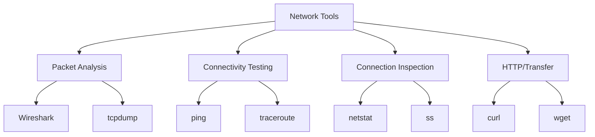
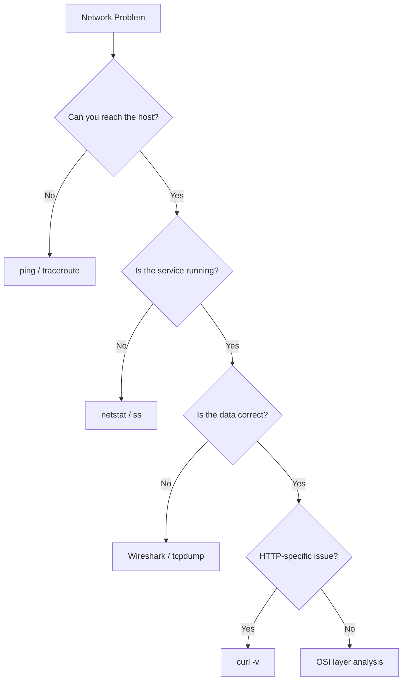

# Network Tools

## Overview

Network diagnostic tools are essential for troubleshooting, monitoring, and understanding network behavior. This section covers the most commonly used command-line tools that every network engineer and developer should know.

## Tool Categories

## Quick Reference

| Tool | Purpose | Layer | Common Use |
|------|---------|-------|------------|
| **ping** | Test connectivity | L3 (ICMP) | "Is the host reachable?" |
| **traceroute** | Path discovery | L3 | "What's the route to the host?" |
| **netstat** | Connection inspection | L4 | "What connections are open?" |
| **tcpdump** | Packet capture (CLI) | L2-L7 | "What packets are flowing?" |
| **Wireshark** | Packet analysis (GUI) | L2-L7 | "Deep packet inspection" |
| **curl** | HTTP client | L7 | "Test HTTP endpoints" |

## When to Use What

## Interview Questions

1. **Q: You can't connect to a server. What tools would you use and in what order?**
   A: 1) `ping` — Is the host reachable? 2) `traceroute` — Where does the path break? 3) `telnet <host> <port>` — Is the port open? 4) `curl -v` — Is the service responding correctly? 5) `tcpdump` — What packets are being sent/received?

2. **Q: What's the difference between tcpdump and Wireshark?**
   A: tcpdump is a CLI packet capture tool — lightweight, scriptable, runs on servers. Wireshark is a GUI packet analyzer — powerful visualization, protocol dissection, filtering. Use tcpdump on remote servers, Wireshark for deep analysis.

3. **Q: How do you check if a port is open?**
   A: `telnet host port`, `nc -zv host port`, `nmap -p port host`, or `ss -tlnp` (on the server). For external checks, use `curl host:port` or online port scanners.

## Summary

Mastering network tools is essential for troubleshooting. Start with ping/traceroute for connectivity, netstat/ss for connections, tcpdump/Wireshark for packet analysis, and curl for HTTP debugging.

## Cross-References

- [Wireshark](wireshark.md)
- [tcpdump](tcpdump.md)
- [netstat](netstat.md)
- [ping & traceroute](ping-traceroute.md)
- [curl](curl.md)
