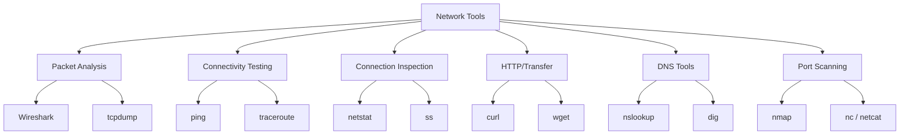
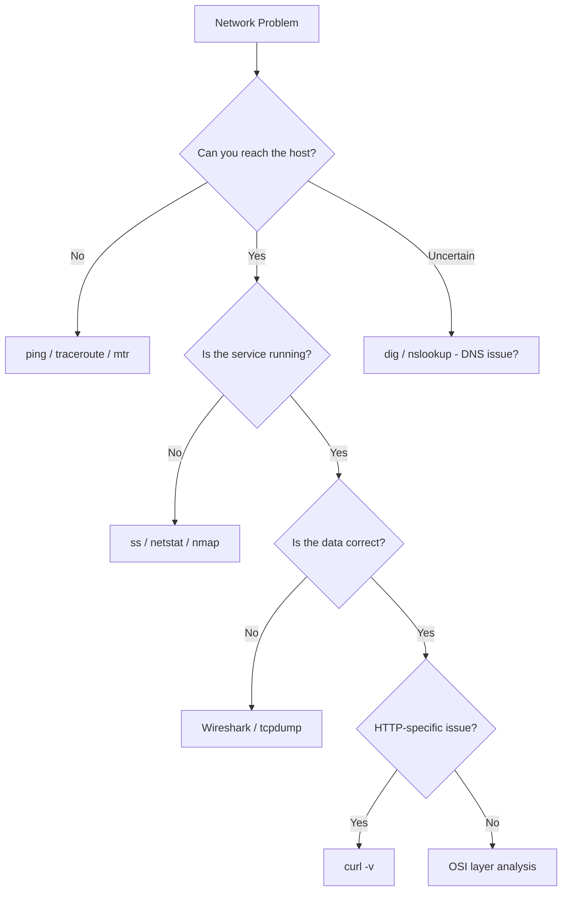

# Network Tools

## Overview

Network diagnostic tools are essential for troubleshooting, monitoring, and understanding network behavior. This section covers the most commonly used command-line tools that every network engineer and developer should know.

## Tool Categories



## Quick Reference

| Tool | Purpose | Layer | Common Use |
|------|---------|-------|------------|
| **ping** | Test connectivity | L3 (ICMP) | "Is the host reachable?" |
| **traceroute** | Path discovery | L3 | "What's the route to the host?" |
| **netstat** | Connection inspection | L4 | "What connections are open?" |
| **ss** | Connection inspection (modern) | L4 | "What connections are open?" |
| **tcpdump** | Packet capture (CLI) | L2-L7 | "What packets are flowing?" |
| **Wireshark** | Packet analysis (GUI) | L2-L7 | "Deep packet inspection" |
| **curl** | HTTP client | L7 | "Test HTTP endpoints" |
| **wget** | File download | L7 | "Download files via HTTP/FTP" |
| **nslookup** | DNS lookup | L7 | "What IP does this domain resolve to?" |
| **dig** | DNS lookup (detailed) | L7 | "Full DNS query with all records" |
| **nmap** | Port scanning | L3-L7 | "What ports are open on this host?" |
| **netcat** | Swiss army knife | L4-L7 | "Test ports, transfer data, debug" |
| **iftop** | Interface traffic | L2-L3 | "What's using my bandwidth?" |
| **mtr** | Combined ping + traceroute | L3 | "Continuous path monitoring" |

## When to Use What



## ping — Connectivity Testing

`ping` sends ICMP Echo Request packets and measures round-trip time.

```bash
# Basic ping
ping google.com

# Ping with count limit
ping -c 5 google.com

# Ping with specific interface
ping -I eth0 10.0.0.1

# Flood ping (requires root) — stress test
ping -f 10.0.0.1

# Ping with specific packet size
ping -s 1400 google.com
```

**Output explained:**
```
PING google.com (142.250.185.78) 56(84) bytes of data.
64 bytes from 142.250.185.78: icmp_seq=1 ttl=116 time=12.3 ms
64 bytes from 142.250.185.78: icmp_seq=2 ttl=116 time=11.8 ms

--- google.com ping statistics ---
2 packets transmitted, 2 received, 0% packet loss, time 1001ms
rtt min/avg/max/mdev = 11.8/12.0/12.3/0.2 ms
```

| Field | Meaning |
|-------|---------|
| `icmp_seq` | Sequence number (detect missing packets) |
| `ttl` | Time to live (hop count remaining) |
| `time` | Round-trip time |
| `packet loss` | % of packets that didn't return |
| `rtt` | Round-trip time statistics |

## traceroute — Path Discovery

`traceroute` shows the network path (hops) to a destination.

```bash
# Basic traceroute
traceroute google.com

# Use TCP instead of ICMP (bypasses firewalls)
traceroute -T google.com

# Use specific port
traceroute -T -p 443 google.com

# Skip DNS resolution (faster)
traceroute -n google.com
```

**Output explained:**
```
traceroute to google.com (142.250.185.78), 30 hops max
 1  gateway (10.0.0.1)        1.234 ms
 2  192.168.1.1               2.567 ms
 3  * * *                     (firewall dropping ICMP)
 4  72.14.215.85              8.901 ms
 5  142.250.185.78            12.345 ms
```

`* * *` means the hop didn't respond (firewall or rate limiting).

## tcpdump — Packet Capture

`tcpdump` captures and displays network packets in real-time.

```bash
# Capture all traffic on interface eth0
sudo tcpdump -i eth0

# Capture only TCP traffic on port 80
sudo tcpdump -i eth0 tcp port 80

# Capture traffic to/from specific host
sudo tcpdump -i eth0 host 10.0.0.5

# Capture and save to file (for Wireshark analysis)
sudo tcpdump -i eth0 -w capture.pcap

# Read from file
tcpdump -r capture.pcap

# Show packet contents (hex + ASCII)
sudo tcpdump -i eth0 -X tcp port 80

# Capture DNS traffic
sudo tcpdump -i eth0 port 53

# Capture with specific protocol
sudo tcpdump -i eth0 'tcp[tcpflags] & (tcp-syn) != 0'
```

### tcpdump Filters (BPF Syntax)

| Filter | Meaning |
|--------|---------|
| `tcp port 80` | TCP traffic on port 80 |
| `host 10.0.0.5` | Traffic to/from 10.0.0.5 |
| `src net 10.0.0.0/24` | Traffic from 10.0.0.x subnet |
| `tcp[tcpflags] & tcp-syn != 0` | Only SYN packets |
| `udp and port 53` | DNS traffic |
| `icmp` | ICMP (ping) traffic |
| `not port 22` | Exclude SSH traffic |

## ss — Socket Statistics

`ss` is the modern replacement for `netstat`.

```bash
# Show all TCP connections
ss -t

# Show all listening sockets
ss -tln

# Show all connections with process info
ss -tlnp

# Show connections to specific port
ss -tn dst :443

# Show connection states summary
ss -s

# Show established connections
ss -tn state established

# Show sockets with timer info
ss -tno
```

### Connection States

| State | Meaning |
|-------|---------|
| `LISTEN` | Waiting for connections |
| `ESTABLISHED` | Active connection |
| `SYN_SENT` | Waiting for SYN-ACK (client) |
| `SYN_RECV` | Received SYN, waiting for ACK (server) |
| `TIME_WAIT` | Connection closed, waiting for stray packets |
| `CLOSE_WAIT` | Remote closed, local hasn't closed yet |
| `FIN_WAIT1/2` | Local initiated close |

## curl — HTTP Client

`curl` is the Swiss army knife for HTTP debugging.

```bash
# Basic GET request
curl https://api.example.com/users

# Verbose output (headers, TLS info, timing)
curl -v https://api.example.com/users

# POST with JSON body
curl -X POST https://api.example.com/users \
  -H "Content-Type: application/json" \
  -d '{"name": "John", "email": "john@example.com"}'

# Follow redirects
curl -L https://example.com/redirect

# Show only headers
curl -I https://api.example.com/users

# Custom headers
curl -H "Authorization: Bearer token123" https://api.example.com/me

# Measure timing
curl -o /dev/null -s -w "DNS: %{time_namelookup}s\nConnect: %{time_connect}s\nTLS: %{time_appconnect}s\nTotal: %{time_total}s\n" https://example.com

# Upload file
curl -F "file=@photo.jpg" https://api.example.com/upload

# Set timeout
curl --connect-timeout 5 --max-time 30 https://api.example.com
```

## DNS Tools

### nslookup

```bash
# Basic DNS lookup
nslookup google.com

# Specify DNS server
nslookup google.com 8.8.8.8

# Query specific record type
nslookup -type=MX google.com
nslookup -type=TXT google.com
```

### dig

```bash
# Basic lookup
dig google.com

# Short output
dig +short google.com

# Specific record type
dig google.com MX
dig google.com NS

# Trace full DNS resolution path
dig +trace google.com

# Reverse DNS lookup
dig -x 8.8.8.8

# Query specific DNS server
dig @8.8.8.8 google.com
```

## Interview Questions

1. **Q: You can't connect to a server. What tools would you use and in what order?**
   A: (1) `ping` — Is the host reachable? (2) `dig` — Is DNS resolving correctly? (3) `traceroute` — Where does the path break? (4) `ss -tlnp` — Is the service listening on the server? (5) `curl -v` — Is the service responding correctly? (6) `tcpdump` — What packets are being sent/received?

2. **Q: What's the difference between tcpdump and Wireshark?**
   A: tcpdump is a CLI packet capture tool — lightweight, scriptable, runs on servers without a GUI. Wireshark is a GUI packet analyzer — powerful visualization, protocol dissection, filtering, and analysis. Use tcpdump on remote servers to capture, then transfer the `.pcap` file to Wireshark for deep analysis.

3. **Q: How do you check if a port is open?**
   A: From the client: `nc -zv host port`, `nmap -p port host`, `telnet host port`, or `curl host:port`. From the server: `ss -tlnp | grep port`. For external checks: online port scanners or `nmap` from outside the network.

4. **Q: Explain the difference between `netstat` and `ss`.**
   A: `ss` is the modern replacement for `netstat`. Both show socket statistics, but `ss` is faster (reads directly from kernel netlink sockets instead of parsing `/proc/net/tcp`), supports more filtering options, and shows more detail (e.g., TCP internal info with `-i`). Use `ss` on modern systems.

5. **Q: How would you debug a DNS resolution issue?**
   A: (1) `nslookup domain` — Does it resolve? (2) `dig +trace domain` — Follow the full resolution chain (root → TLD → authoritative). (3) Try different DNS servers (`dig @8.8.8.8`). (4) Check `/etc/resolv.conf` for configured nameservers. (5) Check if the domain has proper NS, A, and CNAME records. (6) Use `tcpdump port 53` to see actual DNS traffic.

6. **Q: What does `curl -w` tell you about request timing?**
   A: `curl -w` with timing variables shows: DNS lookup time, TCP connect time, TLS handshake time, time to first byte (TTFB), and total time. This helps identify where latency occurs: slow DNS, slow TLS, or slow server response. Use it to benchmark and compare endpoints.

7. **Q: How do you capture packets on a remote server?**
   A: (1) SSH into the server, (2) Run `sudo tcpdump -i eth0 -w capture.pcap` to capture, (3) Stop capture with Ctrl+C, (4) Copy the file locally with `scp`, (5) Open in Wireshark for analysis. Alternatively, pipe tcpdump output: `ssh server 'sudo tcpdump -i eth0 -w -' > capture.pcap`.

8. **Q: What is `mtr` and when would you use it?**
   A: `mtr` combines `ping` and `traceroute` — it continuously traces the path and shows per-hop latency and packet loss statistics over time. Use it when you need to identify intermittent network issues: `mtr --report google.com` runs 10 cycles and shows statistics. More reliable than a single traceroute for spotting flaky hops.

9. **Q: How would you monitor bandwidth usage on a Linux server?**
   A: (1) `iftop` — Real-time per-connection bandwidth display, (2) `nload` — Interface-level bandwidth graph, (3) `vnstat` — Historical bandwidth statistics, (4) `sar -n DEV` — Network interface statistics, (5) `bmon` — Bandwidth monitor with curses UI. For per-process: `nethogs`.

10. **Q: What's the difference between TCP and UDP in terms of troubleshooting?**
    A: TCP troubleshooting: check connection states with `ss`, look for retransmissions with `tcpdump 'tcp[tcpflags] & tcp-syn != 0'`, check for RST packets. UDP troubleshooting: no connection state, check if packets arrive with `tcpdump udp`, use `nc -u` for testing. UDP issues are often firewall-related (ICMP unreachable blocking).

## Cross-References

- [Ping & Traceroute](ping-traceroute.md) — Detailed connectivity tools
- [tcpdump](tcpdump.md) — Packet capture deep dive
- [Wireshark](wireshark.md) — GUI packet analysis
- [curl](curl.md) — HTTP client reference
- [DNS](../dns/README.md) — DNS protocol and troubleshooting
- [TCP/IP](../tcp-ip/README.md) — Protocol fundamentals

## References

- [TCP/IP Illustrated, Vol 1](https://www.pearson.com/en-us/subject-catalog/p/tcpip-illustrated-volume-1-the-protocols/P200000003283) — W. Richard Stevens
- [Wireshark User Guide](https://www.wireshark.org/docs/wsug_html_chunked/) — Official documentation
- [tcpdump Manual](https://www.tcpdump.org/manpages/tcpdump.1.html) — Official man page
- [curl Documentation](https://curl.se/docs/) — Everything curl
- [dig Manual](https://linux.die.net/man/1/dig) — DNS lookup tool
- [nmap Reference Guide](https://nmap.org/book/man.html) — Network scanning
