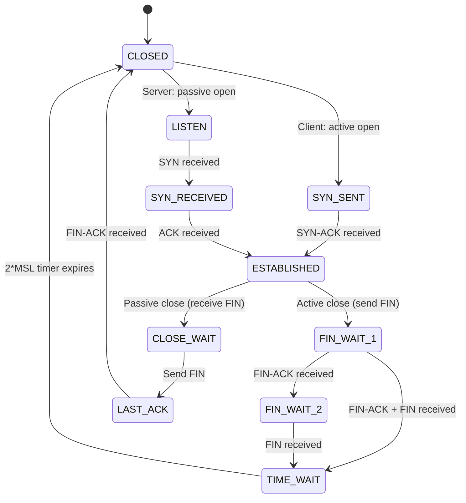

# netstat & ss

## Overview

`netstat` (network statistics) and `ss` (socket statistics) are command-line tools for inspecting network connections, routing tables, interface statistics, and protocol information. `ss` is the modern replacement for `netstat` on Linux.

## netstat

### Common Usage

```bash
# Show all active connections
netstat -a

# Show TCP connections only
netstat -at

# Show UDP connections only
netstat -au

# Show listening ports
netstat -l

# Show listening TCP ports with process info
netstat -tlnp

# Show routing table
netstat -r

# Show interface statistics
netstat -i

# Show connections with PID/program name
netstat -p

# Show continuous output (refresh every second)
netstat -c
```

### Connection States (TCP)

| State | Description |
|-------|-------------|
| **LISTEN** | Server waiting for connections |
| **ESTABLISHED** | Active connection |
| **SYN_SENT** | Client sent SYN, waiting for SYN-ACK |
| **SYN_RECEIVED** | Server received SYN, sent SYN-ACK |
| **FIN_WAIT_1** | Sent FIN, waiting for ACK |
| **FIN_WAIT_2** | Received ACK for FIN, waiting for FIN from peer |
| **CLOSE_WAIT** | Received FIN, waiting for application to close |
| **TIME_WAIT** | After closing, waiting for remaining packets |
| **CLOSED** | Connection terminated |

### TCP State Machine



### Sample Output

```
Proto Recv-Q Send-Q Local Address    Foreign Address   State       PID/Program
tcp   0      0      0.0.0.0:22       0.0.0.0:*         LISTEN      1234/sshd
tcp   0      0      10.0.0.1:52341   93.184.216.34:443 ESTABLISHED 5678/firefox
tcp   0      0      10.0.0.1:80      203.0.113.50:1234 ESTABLISHED 9012/nginx
tcp   1      0      10.0.0.1:52342   198.51.100.1:80   CLOSE_WAIT  3456/chrome
```

**Key columns**:
- **Recv-Q**: Data queued to be received (application not reading fast enough)
- **Send-Q**: Data queued to be sent (network congestion or slow peer)

## ss (Socket Statistics)

`ss` is faster and provides more information than `netstat` on modern Linux systems.

### Common Usage

```bash
# Show all TCP sockets
ss -t

# Show all UDP sockets
ss -u

# Show listening sockets
ss -l

# Show listening TCP sockets with process info
ss -tlnp

# Show all sockets with process info
ss -tunap

# Show connections to specific IP
ss -tn dst 10.0.0.1

# Show connections on specific port
ss -tn sport = :80

# Show socket memory usage
ss -m

# Show TCP internal info (timers, congestion)
ss -ti

# Filter by state
ss -t state established
ss -t state time-wait
ss -t state close-wait

# Show summary statistics
ss -s
```

### ss Filters

```bash
# Connections to port 443
ss -tn 'dport = :443'

# Connections from specific source
ss -tn 'src 10.0.0.0/24'

# Connections with specific state
ss -tn state established

# Connections with specific process
ss -tnp | grep nginx

# Combine filters
ss -tn '( dport = :80 or dport = :443 ) and src 10.0.0.0/24'
```

## netstat vs ss

| Feature | netstat | ss |
|---------|---------|-----|
| **Speed** | Slower (reads /proc) | Faster (uses netlink) |
| **Filters** | Basic | Powerful expressions |
| **TCP info** | Limited | Detailed (timers, congestion) |
| **Socket memory** | No | Yes (-m) |
| **Modern Linux** | Deprecated | Recommended |
| **Available** | Most Unix systems | Linux only |

## Practical Scenarios

### Find Who's Using a Port

```bash
# netstat
netstat -tlnp | grep :80

# ss
ss -tlnp | grep :80

# lsof (alternative)
lsof -i :80
```

### Check for Connection Leaks

```bash
# Count connections per state
ss -s

# Show all TIME_WAIT connections
ss -tn state time-wait | wc -l

# Show all CLOSE_WAIT connections (potential leak)
ss -tn state close-wait
```

### Monitor Connection Rate

```bash
# Watch new connections (SYN_SENT)
watch -n 1 'ss -tn state syn-recv | wc -l'
```

### Debug High Send-Q

```bash
# Show connections with data queued in Send-Q
ss -tn | awk '$2 > 0'
```

## Interview Questions

1. **Q: What is TIME_WAIT and why does it exist?**
   A: After a TCP connection closes, the endpoint that initiated the close waits 2×MSL (Maximum Segment Lifetime, typically 60s). This ensures: 1) Any remaining packets from the connection are received, 2) The remote side receives the final ACK (if it was lost, the remote retransmits FIN).

2. **Q: What does CLOSE_WAIT indicate?**
   A: The remote end has sent FIN (wants to close), but the local application hasn't closed the socket. This usually indicates an application bug — the code isn't closing connections properly. High CLOSE_WAIT counts = connection leak.

3. **Q: What's the difference between LISTEN and ESTABLISHED?**
   A: LISTEN means the server socket is waiting for incoming connections. ESTABLISHED means a TCP connection is active (handshake complete, data can flow). A server typically has one LISTEN socket and many ESTABLISHED sockets.

4. **Q: Why is `ss` faster than `netstat`?**
   A: `netstat` reads /proc/net/tcp which requires parsing. `ss` uses netlink sockets to directly query the kernel's socket table. For systems with many connections, the performance difference is significant.

5. **Q: How do you find which process is using a port?**
   A: `ss -tlnp | grep :80` or `netstat -tlnp | grep :80` shows the PID and program name. Alternatively, `lsof -i :80`. Requires root for processes you don't own.

6. **Q: What is Recv-Q and Send-Q in netstat output?**
   A: Recv-Q = bytes received by the kernel but not yet read by the application. Send-Q = bytes sent by the application but not yet acknowledged by the peer. High Recv-Q means the application is slow to read. High Send-Q means the network or peer is slow.

## Common Mistakes

- Confusing CLOSE_WAIT (application bug) with TIME_WAIT (normal)
- Not understanding that TIME_WAIT is normal and usually harmless
- Forgetting that high TIME_WAIT can exhaust ports (tune with sysctl)
- Using `netstat` when `ss` is available (ss is faster)
- Not using `-p` flag to see which process owns a connection

## Summary

`netstat` and `ss` inspect network connections, routing, and socket state. `ss` is the modern, faster replacement. Understanding TCP states (LISTEN, ESTABLISHED, TIME_WAIT, CLOSE_WAIT) is essential for debugging network issues.

## Cross-References

- [Tools Overview](README.md)
- [tcpdump](tcpdump.md) — Packet-level analysis
- [ping & traceroute](ping-traceroute.md) — Connectivity testing
- [curl](curl.md) — HTTP-level testing
