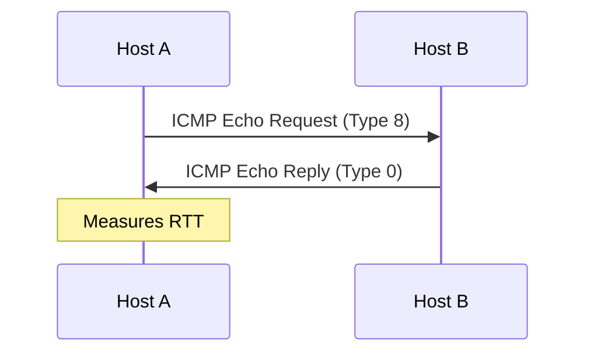
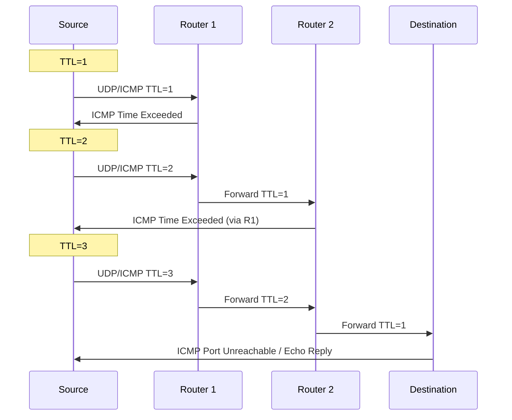

# ping & traceroute

## Overview

`ping` and `traceroute` are the most fundamental network diagnostic tools. `ping` tests reachability and measures round-trip time. `traceroute` discovers the path packets take to reach a destination.

## ping

### How ping Works



### Common Usage

```bash
# Basic ping
ping google.com

# Ping with count limit
ping -c 5 google.com

# Ping with specific interface
ping -I eth0 google.com

# Ping with specific packet size
ping -s 1400 google.com

# Ping with flood (requires root)
sudo ping -f google.com

# Ping with interval (seconds)
ping -i 0.5 google.com

# Ping with timeout
ping -W 2 google.com

# IPv4 only
ping -4 google.com

# IPv6 only
ping -6 google.com
```

### Interpreting Output

```
PING google.com (142.250.185.78) 56(84) bytes of data.
64 bytes from 142.250.185.78: icmp_seq=1 ttl=116 time=12.3 ms
64 bytes from 142.250.185.78: icmp_seq=2 ttl=116 time=11.8 ms
64 bytes from 142.250.185.78: icmp_seq=3 ttl=116 time=12.1 ms

--- google.com ping statistics ---
3 packets transmitted, 3 received, 0% packet loss, time 2003ms
rtt min/avg/max/mdev = 11.8/12.1/12.3/0.2 ms
```

| Field | Meaning |
|-------|---------|
| **icmp_seq** | Sequence number (detects lost packets) |
| **ttl** | Time to Live (decremented at each hop) |
| **time** | Round-trip time in milliseconds |
| **packet loss** | Percentage of packets not returned |
| **rtt min/avg/max/mdev** | Min, average, max, and deviation of RTT |

### ICMP Messages

| Type | Code | Description |
|------|------|-------------|
| 0 | 0 | Echo Reply |
| 3 | 0 | Network Unreachable |
| 3 | 1 | Host Unreachable |
| 3 | 3 | Port Unreachable |
| 3 | 13 | Administratively Prohibited |
| 8 | 0 | Echo Request |
| 11 | 0 | TTL Expired in Transit |

### ping Variations

```bash
# Test TCP connectivity (when ICMP is blocked)
# Using nping (nmap)
nping --tcp -p 80 google.com

# Using hping3
sudo hping3 -S -p 80 google.com

# Using curl (HTTP level)
curl -o /dev/null -s -w "time_connect: %{time_connect}\n" https://google.com
```

## traceroute

### How traceroute Works

traceroute sends packets with incrementing TTL values. Each router decrements TTL; when TTL reaches 0, the router sends back an ICMP "Time Exceeded" message, revealing its identity.



### Common Usage

```bash
# Basic traceroute
traceroute google.com

# TCP traceroute (works through firewalls)
traceroute -T google.com

# UDP traceroute (default on Linux)
traceroute -U google.com

# ICMP traceroute (like Windows tracert)
traceroute -I google.com

# No DNS resolution (faster)
traceroute -n google.com

# Max hops
traceroute -m 30 google.com

# Queries per hop
traceroute -q 1 google.com

# Specific port
traceroute -T -p 443 google.com

# Wait time
traceroute -w 2 google.com
```

### Interpreting Output

```
traceroute to google.com (142.250.185.78), 30 hops max, 60 byte packets
 1  gateway (10.0.0.1)        1.234 ms  1.156 ms  1.123 ms
 2  192.168.1.1 (192.168.1.1) 5.678 ms  5.543 ms  5.432 ms
 3  * * *
 4  72.14.215.85 (72.14.215.85) 12.345 ms  12.234 ms  12.123 ms
 5  142.250.185.78 (142.250.185.78) 15.678 ms  15.543 ms  15.432 ms
```

| Field | Meaning |
|-------|---------|
| **Hop number** | Router position in path |
| **Hostname (IP)** | Reverse DNS and IP of router |
| **RTT × 3** | Three round-trip measurements |
| **\* \* \*** | No response (firewall, rate limiting, or ICMP blocked) |

### Common Traceroute Patterns

```
# Normal path
1  gateway        1 ms
2  isp-router     5 ms
3  backbone      10 ms
4  destination   15 ms

# Firewall blocking (shows * * *)
1  gateway        1 ms
2  * * *          ← Router dropping ICMP/UDP
3  backbone      10 ms

# Asymmetric routing (RTT jumps)
1  gateway        1 ms
2  isp-router     5 ms
3  * * *          ← Large RTT jump = path change
4  destination   50 ms
```

## MTR (My Traceroute)

Combines ping and traceroute for continuous path monitoring.

```bash
# Basic mtr
mtr google.com

# Report mode (non-interactive)
mtr -r -c 100 google.com

# TCP mode
mtr -T -P 443 google.com

# No DNS
mtr -n google.com
```

### MTR Output

```
Host                   Loss%   Snt   Last   Avg  Best  Wrst
1. gateway              0.0%   100    1.0   1.1   0.9   1.5
2. isp-router           0.0%   100    5.2   5.3   5.0   6.1
3. ???                 100.0   100    0.0   0.0   0.0   0.0
4. backbone             0.0%   100   12.1  12.3  11.8  13.2
5. destination          0.0%   100   15.4  15.6  15.1  16.3
```

**Key**: Loss% shows packet loss at each hop. 100% at hop 3 = router blocks probes but traffic still flows.

## Interview Questions

1. **Q: How does ping work?**
   A: ping sends ICMP Echo Request packets to the destination and waits for ICMP Echo Reply. It measures the round-trip time (RTT) and reports packet loss. Works at Layer 3 (Network Layer).

2. **Q: Why might ping fail but the service still works?**
   A: Many firewalls block ICMP. The service might be accessible via TCP/UDP even when ICMP is blocked. Use TCP-based tools (telnet, curl, nping) instead.

3. **Q: How does traceroute discover the path?**
   A: It sends packets with incrementing TTL (1, 2, 3...). Each router decrements TTL; when TTL=0, the router sends ICMP Time Exceeded. By collecting these responses, traceroute builds the path.

4. **Q: What do `* * *` mean in traceroute?**
   A: The router at that hop didn't respond. Could be: 1) Firewall dropping ICMP, 2) Rate limiting on ICMP responses, 3) Router configured not to send ICMP. The path may still work — the router just doesn't respond to probes.

5. **Q: What's the difference between UDP, TCP, and ICMP traceroute?**
   A: ICMP traceroute uses ICMP Echo (like ping). UDP traceroute sends UDP to high ports (default on Linux). TCP traceroute sends TCP SYN (works through firewalls that block ICMP/UDP). TCP is most reliable for reaching the destination.

6. **Q: What is MTR and when would you use it?**
   A: MTR (My Traceroute) combines ping and traceroute for continuous monitoring. It shows loss% and latency at each hop over time. Use it for intermittent issues — it reveals which hop has packet loss or latency spikes.

## Common Mistakes

- Assuming ping failure means the host is down (ICMP may be blocked)
- Not knowing that Windows `tracert` uses ICMP while Linux `traceroute` uses UDP
- Ignoring `* * *` in traceroute (may be hiding real issues)
- Not running enough samples (use `-c` for count, `-r` for report mode in MTR)
- Confusing latency at a hop with latency to that hop (traceroute shows RTT to each hop, not between hops)

## Summary

`ping` tests reachability and measures RTT using ICMP. `traceroute` discovers the path using incrementing TTL. `MTR` combines both for continuous monitoring. Always consider that ICMP may be blocked — use TCP-based alternatives when needed.

## Cross-References

- [Tools Overview](README.md)
- [tcpdump](tcpdump.md) — See actual packets
- [netstat](netstat.md) — Connection state
- [curl](curl.md) — HTTP-level testing

## Cross References

- [ICMP](../tcp-ip/icmp.md)
- [DNS Resolution](../dns/resolution.md)
- [Routing](../routing/README.md)
