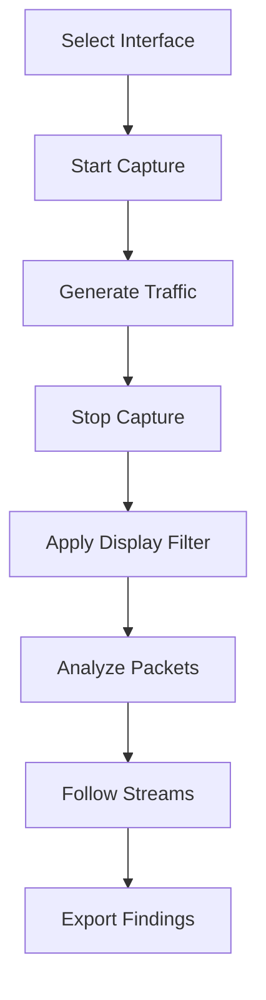

# Wireshark

## Overview

Wireshark is the world's most popular **network protocol analyzer**. It captures packets from a network interface and provides deep inspection of hundreds of protocols. Available for Windows, macOS, and Linux.

## Key Features

- **Live capture** from any network interface
- **Offline analysis** of pcap files
- **Protocol dissection** for 2000+ protocols
- **Display filters** for precise traffic analysis
- **Color coding** for quick visual identification
- **Statistics** and flow analysis
- **Expert info** for automatic problem detection

## Basic Workflow



## Display Filters

Display filters show only packets matching criteria. They don't affect what's captured.

### Common Filters

| Filter | Description |
|--------|-------------|
| `ip.addr == 10.0.0.1` | Any traffic to/from 10.0.0.1 |
| `ip.src == 10.0.0.1` | Traffic from 10.0.0.1 |
| `ip.dst == 10.0.0.1` | Traffic to 10.0.0.1 |
| `tcp.port == 80` | TCP port 80 (HTTP) |
| `tcp.port == 443` | TCP port 443 (HTTPS) |
| `http.request.method == "GET"` | HTTP GET requests |
| `dns` | All DNS traffic |
| `tcp.flags.syn == 1` | TCP SYN packets |
| `tcp.flags.reset == 1` | TCP RST packets |
| `http.response.code >= 400` | HTTP error responses |
| `frame.len > 1000` | Packets larger than 1000 bytes |

### Compound Filters

```
# HTTP traffic from specific IP
ip.src == 10.0.0.1 && tcp.port == 80

# DNS queries (not responses)
dns.flags.response == 0

# TCP retransmissions
tcp.analysis.retransmission

# Packets with errors
tcp.analysis.flags
```

## Capture Filters (BPF)

Capture filters are applied during capture and reduce the amount of data captured.

```
# Capture only HTTP traffic
port 80

# Capture traffic to/from specific host
host 10.0.0.1

# Capture only TCP
tcp

# Capture traffic on specific subnet
net 192.168.1.0/24

# Capture only SYN packets
'tcp[tcpflags] & (tcp-syn) != 0'
```

## Following TCP Streams

Right-click a packet → Follow → TCP Stream. This shows the complete conversation:

```
GET /api/users HTTP/1.1
Host: example.com
Accept: application/json

HTTP/1.1 200 OK
Content-Type: application/json
Content-Length: 42

{"users": [{"id": 1, "name": "Alice"}]}
```

## Wireshark Color Rules

| Color | Meaning |
|-------|---------|
| **Light purple** | TCP |
| **Light blue** | UDP |
| **Black on red** | TCP errors (retransmissions, RST) |
| **Green** | HTTP |
| **Light green** | TCP SYN |
| **White** | Normal traffic |

## Statistics Menu

| Feature | Purpose |
|---------|---------|
| **Conversations** | Traffic between endpoints |
| **Endpoints** | All unique addresses |
| **Protocol Hierarchy** | Breakdown by protocol |
| **IO Graphs** | Traffic over time |
| **Flow Graph** | Sequence diagram of packets |

## Command-Line Usage

```bash
# Capture to file
tshark -i eth0 -w capture.pcap

# Read and filter
tshark -r capture.pcap -Y "http.request"

# Extract specific fields
tshark -r capture.pcap -T fields -e ip.src -e ip.dst -e tcp.port

# Capture with ring buffer (10 files, 100MB each)
tshark -i eth0 -b filesize:100000 -b files:10 -w capture.pcap
```

## Interview Questions

1. **Q: What's the difference between display filters and capture filters?**
   A: Capture filters (BPF syntax) are applied during capture — packets not matching are discarded and never saved. Display filters are applied after capture — all packets are saved but only matching ones shown. Capture filters save disk; display filters provide flexibility.

2. **Q: How would you debug a TCP connection that's not establishing?**
   A: Apply filter `ip.addr == <host> && tcp`. Look for: 1) SYN packets being sent, 2) SYN-ACK responses, 3) RST packets (connection refused), 4) No response (firewall blocking), 5) SYN retransmissions (packet loss).

3. **Q: How do you analyze HTTPS traffic in Wireshark?**
   A: HTTPS is encrypted, so you can't see HTTP content directly. Options: 1) Use the `ssl` display filter to see TLS handshake details, 2) Use the pre-master secret log file (set SSLKEYLOGFILE environment variable), 3) Use a proxy with TLS interception.

4. **Q: What is a pcap file?**
   A: Packet Capture file — a binary format that stores captured network packets with timestamps. Can be opened by Wireshark, tcpdump, and other tools. Common extensions: .pcap, .pcapng, .cap.

5. **Q: How would you find the source of network latency?**
   A: Use Wireshark's Statistics → Flow Graph to see timing between packets. Look for: 1) Long gaps between request and response (server latency), 2) TCP retransmissions (packet loss), 3) Window size issues (flow control), 4) DNS resolution delays.

## Common Mistakes

- Capturing on the wrong interface (especially with VPNs)
- Not using capture filters on high-traffic links (fills disk quickly)
- Confusing display filters with capture filters (different syntax)
- Not following TCP streams (looking at individual packets instead)
- Forgetting that HTTPS content is encrypted (can't see HTTP without key)

## Summary

Wireshark is the gold standard for packet analysis. Master display filters, TCP stream following, and the statistics menu. Use tshark for CLI-based analysis. Always start with a capture filter to limit data, then use display filters for analysis.

## Cross-References

- [tcpdump](tcpdump.md) — CLI alternative
- [ping & traceroute](ping-traceroute.md) — Basic connectivity tools
- [netstat](netstat.md) — Connection inspection
- [TLS](../security/tls.md) — Encrypted traffic analysis

## Cross References

- [tcpdump](tcpdump.md)
- [OSI Model](../osi/README.md)
- [TLS](../security/tls.md)
