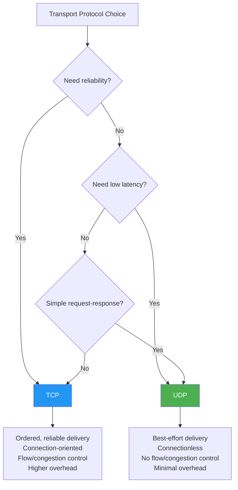
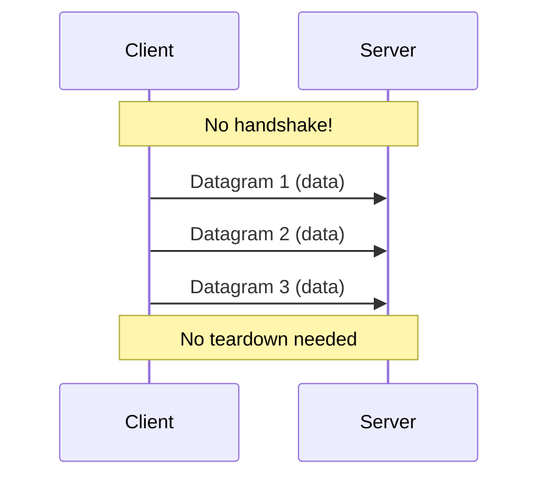

# UDP Overview

## Overview

The **User Datagram Protocol (UDP)** is a connectionless, lightweight transport layer protocol that provides minimal overhead for sending data across IP networks. Unlike TCP, UDP does not establish connections, guarantee delivery, or provide ordered delivery — it simply sends datagrams from one host to another with best-effort delivery.

UDP is the second most widely used transport protocol (after TCP) and is the foundation for applications that prioritize speed and simplicity over reliability, such as DNS, VoIP, video streaming, gaming, and DHCP.

## Detailed Explanation

### What is UDP?

UDP is defined in **RFC 768** (1980), one of the oldest Internet standards. It sits on top of IP (Internet Protocol) and provides:
- **Process-to-process communication** (via port numbers)
- **Optional checksum** (for data integrity)
- **Message boundaries** (unlike TCP's byte stream)

UDP does NOT provide:
- Connection establishment (no handshake)
- Reliable delivery (no ACKs, no retransmission)
- Ordered delivery (no sequence numbers)
- Flow control (no window mechanism)
- Congestion control (no rate adaptation)

### UDP Header

```
 0                   1                   2                   3
 0 1 2 3 4 5 6 7 8 9 0 1 2 3 4 5 6 7 8 9 0 1 2 3 4 5 6 7 8 9 0 1
+-+-+-+-+-+-+-+-+-+-+-+-+-+-+-+-+-+-+-+-+-+-+-+-+-+-+-+-+-+-+-+-+
|          Source Port          |       Destination Port        |
+-+-+-+-+-+-+-+-+-+-+-+-+-+-+-+-+-+-+-+-+-+-+-+-+-+-+-+-+-+-+-+-+
|            Length             |           Checksum            |
+-+-+-+-+-+-+-+-+-+-+-+-+-+-+-+-+-+-+-+-+-+-+-+-+-+-+-+-+-+-+-+-+
|                         Data (payload)                        |
+-+-+-+-+-+-+-+-+-+-+-+-+-+-+-+-+-+-+-+-+-+-+-+-+-+-+-+-+-+-+-+-+
```

**Header fields (8 bytes total):**
- **Source Port** (16 bits): Sender's port number (optional, 0 if unused)
- **Destination Port** (16 bits): Receiver's port number
- **Length** (16 bits): Total datagram length (header + data), minimum 8
- **Checksum** (16 bits): Optional in IPv4, mandatory in IPv6

### UDP vs TCP: The Fundamental Tradeoff



### UDP Characteristics

#### 1. Connectionless


Each datagram is independent. The sender doesn't know if the receiver is ready, alive, or received anything.

#### 2. Unreliable
```
Sender                          Network                      Receiver
  |--- Datagram 1 ----------->|                              |
  |--- Datagram 2 ----------->|  ← LOST                     |
  |--- Datagram 3 ----------->|                              |
  |                           |--- Datagram 1 ------------->|
  |                           |--- Datagram 3 ------------->|
  
  Datagram 2 is simply gone. No notification to sender.
  Receiver gets 1, 3 (out of order, with gap)
```

#### 3. Message-Oriented
```
UDP preserves message boundaries:
  Send: "Hello" (5 bytes) → Receive: "Hello" (5 bytes)
  Send: "World" (5 bytes) → Receive: "World" (5 bytes)

TCP is a byte stream:
  Send: "Hello" + "World" → May receive: "Hel" + "loWorld"
```

#### 4. No Flow Control
```
Sender can blast data as fast as it wants:
  If receiver is slow → packets dropped
  If network is congested → packets dropped
  No automatic rate adjustment
```

#### 5. No Congestion Control
```
UDP sends at whatever rate the application specifies
During congestion:
  TCP: reduces rate (AIMD, CUBIC, BBR)
  UDP: keeps sending at same rate → more packet loss
  
This is why UDP can "starve" TCP on shared links
```

### UDP Pseudo-Header

The checksum includes a pseudo-header (for integrity verification):

```
Pseudo-Header (IPv4):
+--------+--------+--------+--------+
|          Source Address            |
+--------+--------+--------+--------+
|        Destination Address         |
+--------+--------+--------+--------+
|  zero  |  proto |   UDP Length     |
+--------+--------+--------+--------+

proto = 17 (UDP protocol number)
```

### UDP Socket API

```c
// Server
int sockfd = socket(AF_INET, SOCK_DGRAM, 0);  // SOCK_DGRAM = UDP
bind(sockfd, (struct sockaddr*)&server_addr, sizeof(server_addr));
recvfrom(sockfd, buffer, sizeof(buffer), 0, &client_addr, &addr_len);
sendto(sockfd, response, resp_len, 0, &client_addr, addr_len);

// Client
int sockfd = socket(AF_INET, SOCK_DGRAM, 0);
sendto(sockfd, data, data_len, 0, &server_addr, sizeof(server_addr));
recvfrom(sockfd, buffer, sizeof(buffer), 0, &server_addr, &addr_len);
```

**Key differences from TCP:**
- `SOCK_DGRAM` instead of `SOCK_STREAM`
- `sendto()`/`recvfrom()` instead of `send()`/`recv()`
- No `connect()` required (but can be used)
- No `listen()`/`accept()` (server handles any client)

### UDP with `connect()`

```c
// UDP can use connect() for convenience
int sockfd = socket(AF_INET, SOCK_DGRAM, 0);
connect(sockfd, (struct sockaddr*)&server_addr, sizeof(server_addr));

// Now can use send()/recv() instead of sendto()/recvfrom()
send(sockfd, data, data_len, 0);
recv(sockfd, buffer, sizeof(buffer), 0);

// Benefits:
// 1. Simpler API (no address on every call)
// 2. Error reporting (ICMP errors delivered)
// 3. Slight performance improvement (kernel caches route)
```

### UDP Applications

| Application | Why UDP? |
|-------------|----------|
| **DNS** | Small request-response, speed critical |
| **DHCP** | No IP address yet (can't use TCP) |
| **VoIP** | Latency > reliability, can tolerate loss |
| **Video streaming** | Latency > reliability, app handles loss |
| **Gaming** | Real-time, old data is useless |
| **SNMP** | Simple monitoring, fire-and-forget |
| **TFTP** | Simple file transfer (built-in reliability) |
| **NTP** | Time sync, small messages |
| **QUIC/HTTP3** | Built reliability on top of UDP |

### UDP in the Protocol Stack

```
Application Layer:    DNS, DHCP, VoIP, QUIC, ...
Transport Layer:      UDP (port-to-port, checksum)
Network Layer:        IP (host-to-host, routing)
Link Layer:           Ethernet, Wi-Fi, ...
Physical Layer:       Cables, radio, ...
```

## Example: Simple UDP Echo Server

### Python Implementation

```python
# UDP Echo Server
import socket

sock = socket.socket(socket.AF_INET, socket.SOCK_DGRAM)
sock.bind(('0.0.0.0', 12345))

print("UDP Echo Server listening on :12345")
while True:
    data, addr = sock.recvfrom(1024)
    print(f"Received from {addr}: {data.decode()}")
    sock.sendto(data, addr)  # Echo back
```

```python
# UDP Echo Client
import socket

sock = socket.socket(socket.AF_INET, socket.SOCK_DGRAM)
sock.sendto(b"Hello UDP!", ('127.0.0.1', 12345))
data, addr = sock.recvfrom(1024)
print(f"Received: {data.decode()}")
```

### UDP Packet Capture

```bash
# Capture UDP traffic
tcpdump -i eth0 -nn udp

# Capture DNS specifically
tcpdump -i eth0 -nn udp port 53

# Capture with full payload
tcpdump -i eth0 -nn -X udp port 53
```

## Interview Questions

### Q1: What is UDP and how does it differ from TCP?
**A:** UDP (User Datagram Protocol) is a connectionless, unreliable transport protocol. Unlike TCP, it has no handshake, no ACKs, no retransmission, no ordering, no flow control, and no congestion control. UDP simply sends datagrams with port numbers and an optional checksum. It's faster and lighter than TCP but doesn't guarantee delivery.

### Q2: When should you use UDP instead of TCP?
**A:** Use UDP when: (1) Speed/latency is more important than reliability (VoIP, gaming); (2) Application handles its own reliability (QUIC, TFTP); (3) Simple request-response (DNS, DHCP); (4) Multicast/broadcast needed (TCP is unicast only); (5) Small messages where TCP overhead is excessive.

### Q3: Is UDP really "unreliable"?
**A:** UDP itself is unreliable — it doesn't guarantee delivery, ordering, or duplicate protection. But applications built on UDP can add their own reliability mechanisms. QUIC (HTTP/3) builds reliable, ordered delivery on UDP. TFTP adds simple ACK/retransmit. So UDP provides a *building block*, not necessarily an unreliable experience.

### Q4: Why does DNS use UDP instead of TCP?
**A:** DNS queries are small (typically < 512 bytes) and need fast responses. TCP's 3-way handshake adds 1.5 RTT overhead before the first byte of data. UDP sends the query immediately. For a protocol used billions of times daily, this overhead matters. DNS falls back to TCP for large responses (> 512 bytes) or zone transfers.

### Q5: Can UDP be used for reliable communication?
**A:** Yes, by implementing reliability at the application layer. QUIC does this — it runs over UDP but provides reliable, ordered delivery with congestion control. TFTP implements simple ACK-based reliability. The key insight: UDP provides the *transport*, reliability is a *feature* that can be added on top.

### Q6: What is the UDP pseudo-header and why is it needed?
**A:** The pseudo-header includes source/destination IP addresses and protocol number. It's included in the checksum calculation to verify that the datagram was delivered to the correct host and port. This catches IP-level corruption that UDP's own checksum might miss.

### Q7: Why can't UDP do multicast but TCP can't?
**A:** TCP requires a point-to-point connection (state, ACKs, ordering). Multicast is one-to-many — you can't maintain state or receive ACKs from thousands of receivers. UDP's connectionless nature makes it compatible with multicast and broadcast, which IP supports at the network layer.

### Q8: What happens when UDP receives a packet larger than its buffer?
**A:** The excess data is silently truncated (Linux) or an error is returned (some systems). UDP datagrams that don't fit in the receive buffer are dropped. Unlike TCP, UDP doesn't fragment/reassemble at the transport layer — the application must handle message boundaries.

## Common Mistakes

1. **Assuming UDP is always faster than TCP**: For bulk data transfers, TCP's congestion control and windowing are more efficient. UDP's advantage is in low-latency, small-message scenarios.

2. **Not implementing application-level reliability when needed**: If you need reliable delivery, you must implement it yourself (or use QUIC). Don't use raw UDP for file transfers without ACKs and retransmission.

3. **Forgetting that UDP has message boundaries**: Unlike TCP, each `sendto()` creates one datagram. The receiver gets exactly what was sent in each `sendto()`. This is a feature, not a bug.

4. **Not handling packet loss in the application**: With UDP, packet loss is normal. Applications must handle missing datagrams gracefully — either by tolerating loss (VoIP) or implementing retransmission (QUIC).

5. **Using UDP for large transfers without congestion control**: Sending large amounts of data over UDP without congestion control can congest the network and starve TCP flows. This is considered "unfair" and can cause widespread problems.

6. **Confusing UDP's simplicity with simplicity of use**: UDP is simple to send, but hard to use correctly. Applications must handle loss, reordering, duplication, flow control, and congestion — all of which TCP handles automatically.

7. **Not considering NAT traversal**: UDP is more NAT-friendly than TCP (simpler state) but still requires care. UDP hole punching, STUN/TURN/ICE are needed for P2P UDP communication through NATs.

## Summary

| Aspect | UDP | TCP |
|--------|-----|-----|
| **Connection** | Connectionless | Connection-oriented (3-way handshake) |
| **Reliability** | Best-effort | Guaranteed delivery (ACKs, retransmit) |
| **Ordering** | No guarantee | Ordered (sequence numbers) |
| **Flow control** | None | Sliding window |
| **Congestion control** | None | AIMD, CUBIC, BBR |
| **Header size** | 8 bytes | 20+ bytes |
| **Message boundaries** | Preserved | Byte stream (no boundaries) |
| **Multicast** | Supported | Not supported |
| **Use cases** | DNS, VoIP, gaming, QUIC | HTTP, SSH, email, file transfer |

UDP is a powerful building block for networked applications. Its simplicity and low overhead make it ideal for scenarios where speed matters more than guaranteed delivery, and where applications can implement their own reliability as needed.

## Cross-References

- [UDP Header](header.md) — Detailed UDP header format
- [TCP vs UDP](tcp-vs-udp.md) — Comprehensive comparison
- [UDP Applications](applications.md) — Real-world UDP use cases
- [DNS Overview](../dns/README.md) — DNS uses UDP for queries
- [QUIC Protocol](../http/quic.md) — QUIC builds reliable transport on UDP
- [HTTP/3](../http/http3.md) — HTTP/3 uses QUIC (UDP-based)
