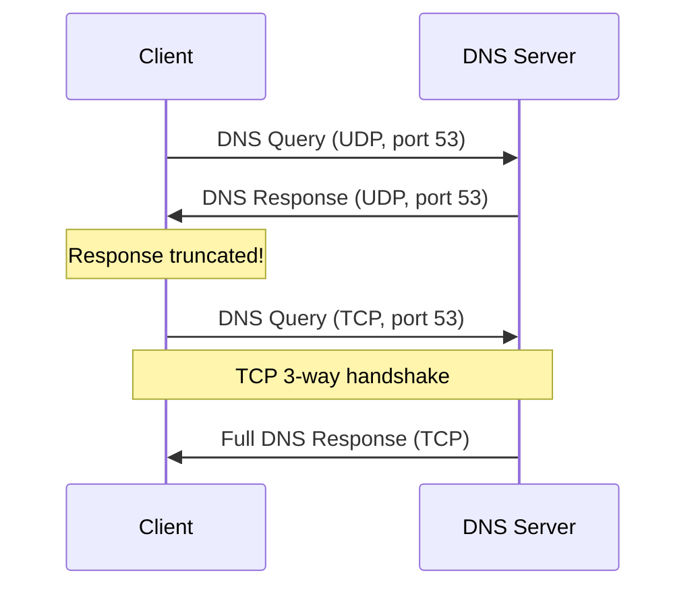
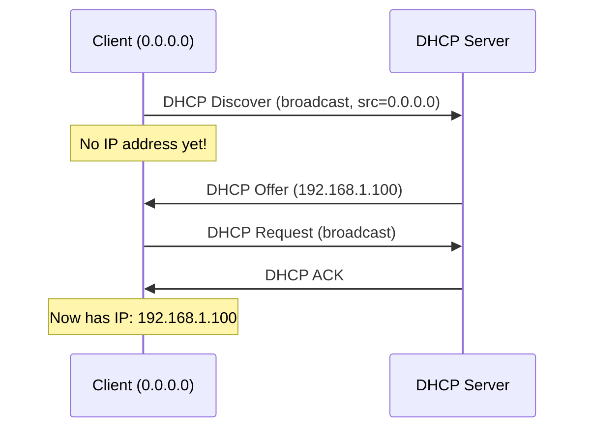
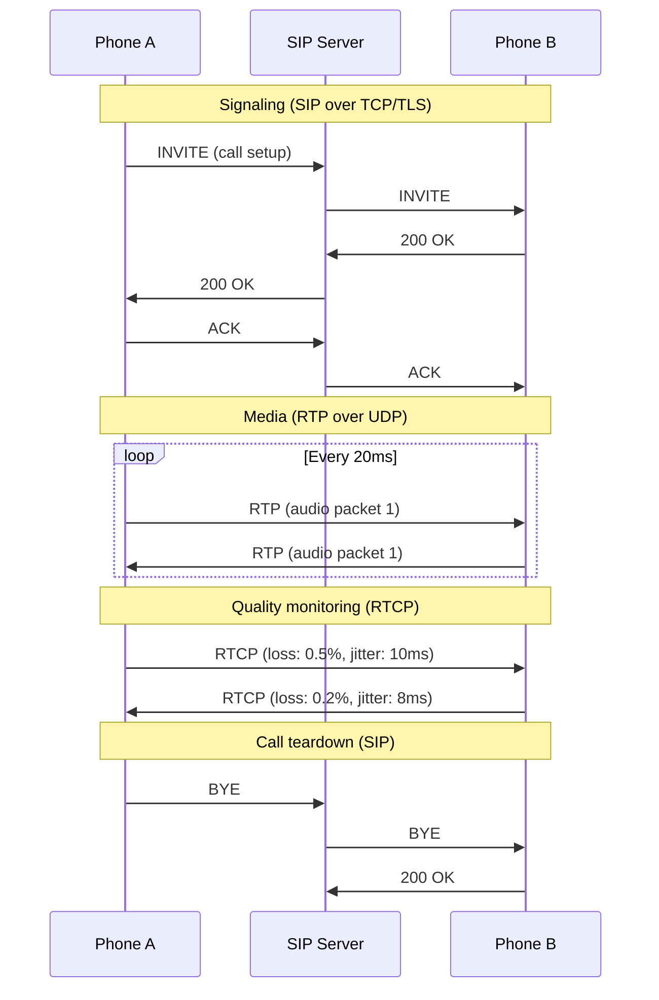
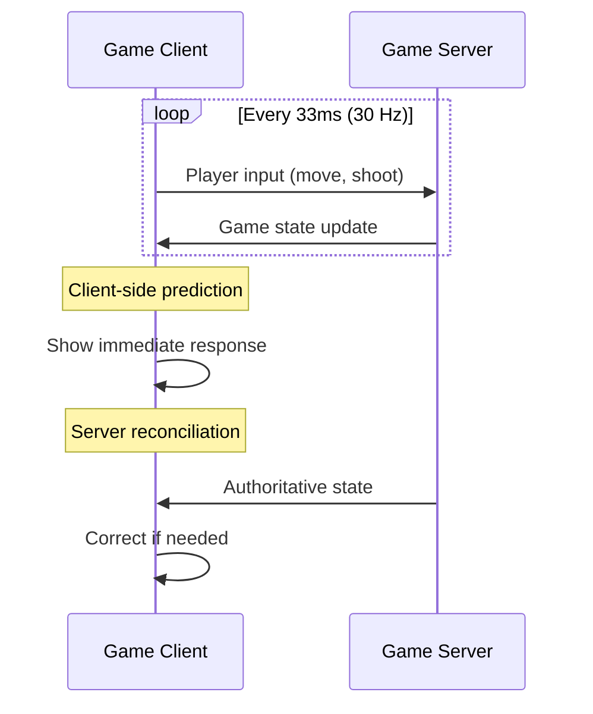

# UDP Applications

## Overview

UDP's simplicity and low overhead make it the transport protocol of choice for applications where **speed matters more than guaranteed delivery**. From the DNS queries that resolve every website you visit, to the VoIP calls that carry your voice, to the online games that demand real-time responsiveness — UDP powers many of the Internet's most critical and performance-sensitive applications.

This page explores the major UDP-based applications, why they chose UDP over TCP, and how they handle UDP's lack of reliability.

## Detailed Explanation

### 1. DNS (Domain Name System)

**Why UDP?**
- Queries are small (< 512 bytes typically)
- Speed is critical (every web request starts with DNS)
- Simple request-response pattern
- TCP handshake overhead (1.5 RTT) is unacceptable for billions of daily queries

**How DNS uses UDP:**
```
Client → Server: DNS Query (UDP port 53)
Server → Client: DNS Response (UDP port 53)

Typical sizes:
  Query: 40-100 bytes
  Response: 100-512 bytes (UDP limit)
```

**DNS fallback to TCP:**
```
DNS uses TCP when:
  - Response > 512 bytes (or EDNS0 allows larger UDP)
  - Zone transfers (AXFR/IXFR)
  - DNSSEC responses (large)
  - TCP flag set in response (truncation)
```



### 2. DHCP (Dynamic Host Configuration Protocol)

**Why UDP?**
- **Chicken-and-egg problem**: Client has no IP address yet!
- TCP requires IP addresses for connection setup
- DHCP uses broadcast to find servers
- Simple configuration exchange (request → offer → ack)

**DHCP Port Usage:**
```
Client → Server: UDP port 68 → 67 (broadcast)
Server → Client: UDP port 67 → 68 (broadcast or unicast)

DHCP Discover: Client broadcasts "I need an IP"
DHCP Offer:    Server offers an IP
DHCP Request:  Client requests the offered IP
DHCP ACK:      Server confirms the assignment
```



### 3. VoIP (Voice over IP)

**Why UDP?**
- Real-time communication (latency < 150ms required)
- Old audio is useless (can't retransmit past conversation)
- Application handles loss gracefully (interpolation, concealment)
- Codec output is time-sensitive

**VoIP Characteristics:**
```
Codec: G.711, G.729, Opus
Packet rate: 50 packets/sec (20ms per packet)
Packet size: 20-200 bytes
Bandwidth: 64-128 Kbps
Max acceptable latency: 150ms
Max acceptable jitter: 30ms
Max acceptable loss: 1-3%
```

**VoIP Protocol Stack:**
```
Application:  Audio codec (Opus, G.711)
Transport:    RTP (Real-time Transport Protocol) over UDP
Signaling:    SIP or H.323 (often TCP/TLS)
Network:      IP
```

**RTP over UDP:**
```
RTP Header (12 bytes) + Audio payload
  - Sequence number (detect loss, reorder)
  - Timestamp (playback timing)
  - SSRC (synchronization source)
  - Payload type (codec identification)
  
RTP Control Protocol (RTCP):
  - Quality metrics (loss, jitter, RTT)
  - Sent periodically (every 5 seconds)
```

### 4. Video Streaming

**Why UDP?**
- Live streaming can't wait for retransmissions
- Viewers experience stutters with TCP's retransmission delays
- Adaptive bitrate can skip lost frames
- Multicast support for IPTV

**Video Streaming Protocols:**
```
Live streaming:  RTP/UDP (low latency)
IPTV/Multicast:  UDP multicast
Web streaming:   HTTP/TCP (reliable, higher latency)
  - HLS (HTTP Live Streaming)
  - DASH (Dynamic Adaptive Streaming)
```

**UDP for Live Streaming:**
```
Sender: Encodes video → RTP packets → UDP
Receiver: UDP → RTP → Decode → Display

Frame types:
  I-frames: Complete image (reference)
  P-frames: Predicted from I-frame (smaller)
  B-frames: Bidirectional prediction (smallest)

Loss handling:
  I-frame loss: Freeze until next I-frame (bad!)
  P-frame loss: Skip frame, continue
  B-frame loss: Skip frame, minimal impact
```

### 5. Online Gaming

**Why UDP?**
- Real-time interaction (latency < 50ms ideal)
- Old game state is useless (can't retransmit past positions)
- Player actions are time-critical
- Game engine handles state synchronization

**Gaming Network Model:**
```
Client sends: Player inputs (move, shoot, etc.)
Server sends: Game state updates (positions, events)

Update rate: 20-128 updates/sec
Packet size: 50-200 bytes
Acceptable latency: 50-100ms
Acceptable loss: 1-2%
```

**Game Networking Techniques:**
```
1. Client-side prediction: Show immediate response
2. Server reconciliation: Correct when server disagrees
3. Entity interpolation: Smooth other players' movement
4. Lag compensation: Rewind time for hit detection
5. Delta compression: Send only changes, not full state
```

### 6. SNMP (Simple Network Management Protocol)

**Why UDP?**
- Simple monitoring queries (get/set OID values)
- Fire-and-forget traps (notifications)
- Low overhead for frequent polling
- Network devices may be resource-constrained

**SNMP Ports:**
```
Manager → Agent: UDP port 161 (queries)
Agent → Manager: UDP port 162 (traps/informs)

SNMP versions:
  v1: Simple, community strings (insecure)
  v2c: Bulk operations, community strings
  v3: Encryption, authentication (secure)
```

### 7. NTP (Network Time Protocol)

**Why UDP?**
- Small, simple time synchronization messages
- Speed critical (RTT affects time accuracy)
- Fire-and-forget queries
- Multicast/anycast support

**NTP Characteristics:**
```
Port: UDP 123
Message size: 48 bytes (NTPv4)
Sync accuracy: < 1ms over Internet, < 1μs on LAN
Poll interval: 64s to 1024s (adaptive)
```

### 8. TFTP (Trivial File Transfer Protocol)

**Why UDP?**
- Designed for simplicity (boot ROM implementations)
- Small code footprint
- Built-in reliability (simple ACK mechanism)

**TFTP Reliability:**
```
TFTP adds its own reliability on UDP:
  - Each data packet acknowledged
  - Timeout and retransmit on missing ACK
  - Stop-and-wait protocol (one packet at a time)

Sender → Receiver: Data block 1
Receiver → Sender: ACK 1
Sender → Receiver: Data block 2
Receiver → Sender: ACK 2
...

Simple but slow (no pipelining)
```

### 9. Syslog

**Why UDP?**
- Fire-and-forget logging
- Minimal overhead for frequent messages
- Don't want logging to block application
- Acceptable to lose some log messages

**Syslog Ports:**
```
Traditional: UDP 548
Modern (RFC 5424): UDP 514 (also TCP 514, TLS 6514)

Message format:
  <priority>version timestamp hostname app-name procid msgid [structured-data] msg
```

### 10. QUIC (Quick UDP Internet Connections)

**Why UDP?**
- Bypass TCP's ossification (middleboxes interfere with TCP)
- Implement custom congestion control
- 0-RTT connection establishment
- Multiplexed streams without head-of-line blocking
- Built-in encryption (TLS 1.3)

**QUIC Stack:**
```
Application:  HTTP/3
Transport:    QUIC (over UDP)
Network:      IP
Link:         Ethernet/Wi-Fi

QUIC provides:
  - Reliable delivery (like TCP)
  - Ordered streams (like TCP)
  - Congestion control (like TCP)
  - 0-RTT connection (better than TCP)
  - Connection migration (better than TCP)
```

### Application Protocol Summary

| Application | Protocol | Port(s) | Why UDP? |
|-------------|----------|---------|----------|
| **DNS** | DNS/UDP | 53 | Small queries, speed critical |
| **DHCP** | DHCP/UDP | 67, 68 | No IP address yet |
| **VoIP** | RTP/UDP | dynamic | Real-time, loss-tolerant |
| **Video** | RTP/UDP | dynamic | Real-time, adaptive |
| **Gaming** | Custom/UDP | varies | Real-time, stale data useless |
| **SNMP** | SNMP/UDP | 161, 162 | Simple queries, traps |
| **NTP** | NTP/UDP | 123 | Time sync, speed critical |
| **TFTP** | TFTP/UDP | 69 | Simple, built-in reliability |
| **Syslog** | Syslog/UDP | 514 | Fire-and-forget logging |
| **QUIC** | QUIC/UDP | 443 | Custom transport, 0-RTT |

## Example: VoIP Packet Flow

### VoIP Call Setup and Data



### Gaming Network Flow



## Interview Questions

### Q1: Why does DNS use UDP instead of TCP?
**A:** DNS queries are small (< 512 bytes) and need fast responses. TCP's 3-way handshake adds 1.5 RTT overhead. For a protocol used billions of times daily, this overhead is unacceptable. UDP sends immediately (0 RTT overhead). DNS falls back to TCP for large responses (> 512 bytes) or zone transfers.

### Q2: How does VoIP handle UDP's unreliability?
**A:** VoIP uses several techniques: (1) RTP sequence numbers detect loss and enable reordering; (2) Audio codecs conceal loss (interpolation from surrounding packets); (3) Jitter buffers smooth out delay variation; (4) Old audio is simply discarded (retransmitting past conversation is useless); (5) FEC (Forward Error Correction) can recover some losses.

### Q3: Why can't DHCP use TCP?
**A:** DHCP clients don't have IP addresses yet — they're requesting one! TCP requires IP addresses for the 3-way handshake. DHCP uses UDP broadcast (0.0.0.0 → 255.255.255.255) to discover servers. The chicken-and-egg problem: you need an IP to use TCP, but you need DHCP to get an IP.

### Q4: How does online gaming handle packet loss?
**A:** Games use: (1) Client-side prediction — show immediate response without waiting for server; (2) Server reconciliation — correct client state when server disagrees; (3) Entity interpolation — smooth other players' movements between updates; (4) Delta compression — send only changes; (5) Priority systems — important events (kills) sent reliably, positions sent unreliably.

### Q5: What is QUIC and why is it built on UDP?
**A:** QUIC is a transport protocol built on UDP that provides TCP-like reliability with better performance. It uses UDP to: (1) Bypass TCP's ossification (middleboxes that interfere with TCP extensions); (2) Implement custom congestion control; (3) Achieve 0-RTT connection establishment; (4) Support connection migration (Wi-Fi → cellular); (5) Multiplex streams without head-of-line blocking.

### Q6: Why does SNMP use UDP?
**A:** SNMP queries are simple request-response (get/set OID values) with small payloads. UDP's minimal overhead is ideal for frequent polling of thousands of network devices. SNMP traps (notifications) are fire-and-forget — the agent doesn't need to know if the manager received the trap.

### Q7: How does TFTP provide reliability over UDP?
**A:** TFTP implements stop-and-wait reliability: each data packet requires an ACK before the next is sent. If no ACK arrives within the timeout, the packet is retransmitted. This is simple but slow — TFTP doesn't use pipelining or windowing. It's designed for simplicity (boot ROMs), not performance.

### Q8: When should video streaming use UDP vs TCP?
**A:** **Use UDP for**: Live streaming (low latency critical), IPTV/multicast, real-time video calls. **Use TCP for**: VoD (Video on Demand), HLS/DASH streaming, when reliability is more important than latency. Modern streaming (YouTube, Netflix) mostly uses TCP (HTTP-based) because adaptive bitrate can handle TCP's latency.

## Common Mistakes

1. **Assuming all real-time apps use UDP**: Modern video streaming (YouTube, Netflix) uses TCP (HTTP-based HLS/DASH). Adaptive bitrate handles TCP's latency. Only ultra-low-latency (live sports, video calls) truly benefits from UDP.

2. **Not implementing any reliability for UDP apps**: Even "loss-tolerant" apps need some reliability. VoIP needs sequence numbers for reordering. Games need reliable delivery for critical events (kills, score updates). QUIC builds full reliability on UDP.

3. **Forgetting about NAT traversal for UDP P2P**: UDP P2P applications (gaming, VoIP) need NAT hole punching, STUN/TURN/ICE for connectivity. NATs are more friendly to UDP than TCP but still require traversal techniques.

4. **Using UDP for large file transfers without congestion control**: Sending large amounts of data over UDP without congestion control is considered harmful. It can congest the network and starve TCP flows. Use QUIC or implement congestion control.

5. **Not considering firewall behavior**: Many firewalls are more restrictive with UDP than TCP. UDP has no connection state to track, so firewalls may drop "unsolicited" UDP packets. Applications may need to send periodic keepalives to maintain NAT/firewall mappings.

6. **Confusing UDP's simplicity with simplicity of use**: UDP is simple to send, but hard to use correctly. Applications must handle loss, reordering, duplication, flow control, congestion, and NAT traversal — all of which TCP handles automatically.

7. **Not using the right protocol for the application**: Don't reinvent the wheel. For reliable file transfer, use TCP or QUIC. For time sync, use NTP. For DNS, use the DNS protocol. UDP is a building block, not a complete solution.

## Summary

| Application | Port | Reliability | Key UDP Benefit |
|-------------|------|-------------|-----------------|
| **DNS** | 53 | App-level retry | Speed (no handshake) |
| **DHCP** | 67/68 | Built-in | Broadcast, no IP needed |
| **VoIP** | dynamic | RTP + loss concealment | Real-time latency |
| **Video** | dynamic | Adaptive bitrate | Low latency for live |
| **Gaming** | dynamic | Client prediction | Real-time interaction |
| **SNMP** | 161/162 | Simple retry | Low overhead polling |
| **NTP** | 123 | Single query | Time accuracy |
| **TFTP** | 69 | Stop-and-wait | Simplicity |
| **QUIC** | 443 | Full reliability | Custom transport |

UDP's versatility as a building block makes it indispensable. From simple queries (DNS) to complex transports (QUIC), UDP provides the foundation that applications build upon.

## Cross-References

- [UDP Overview](README.md) — UDP protocol fundamentals
- [UDP Header](header.md) — UDP header format
- [TCP vs UDP](tcp-vs-udp.md) — Detailed comparison
- [DNS Overview](../dns/README.md) — DNS uses UDP for queries
- [QUIC Protocol](../http/quic.md) — Reliable transport on UDP
- [WebSocket](../http/websocket.md) — Alternative for real-time web
