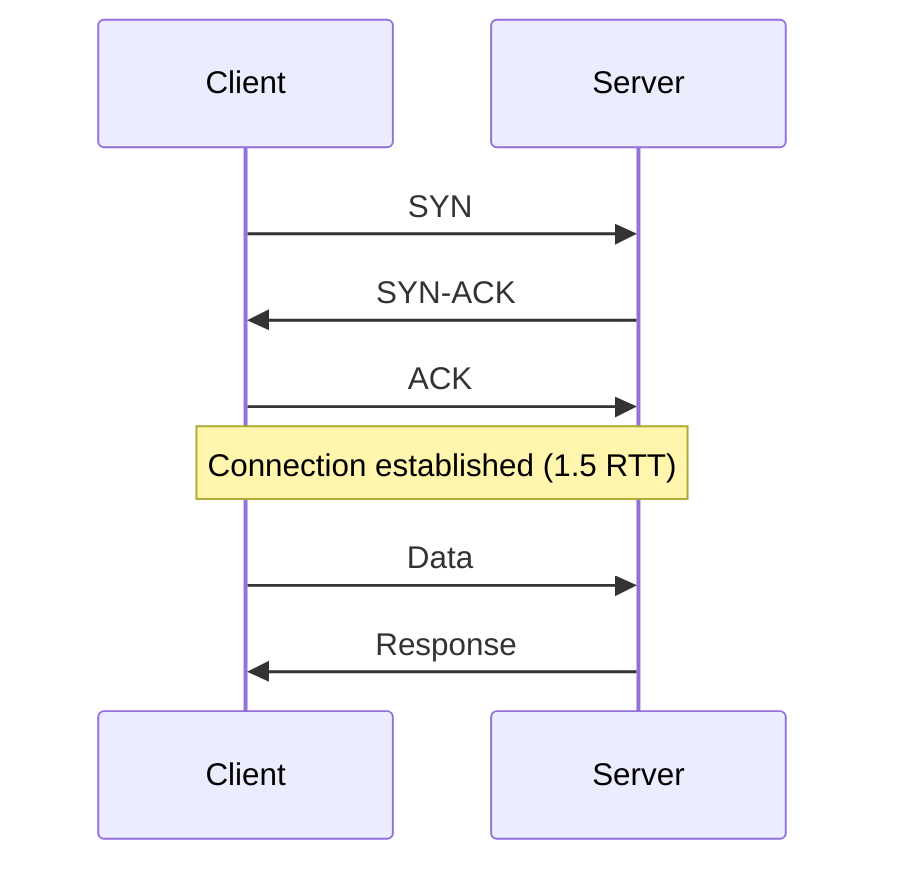
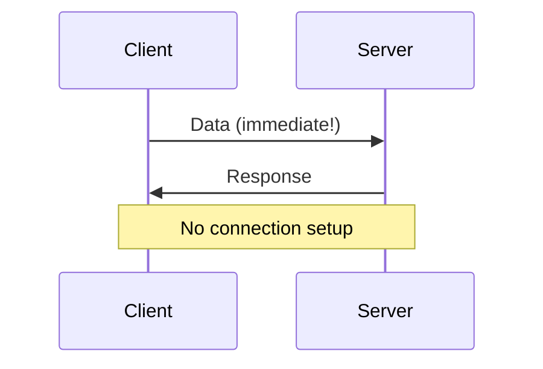
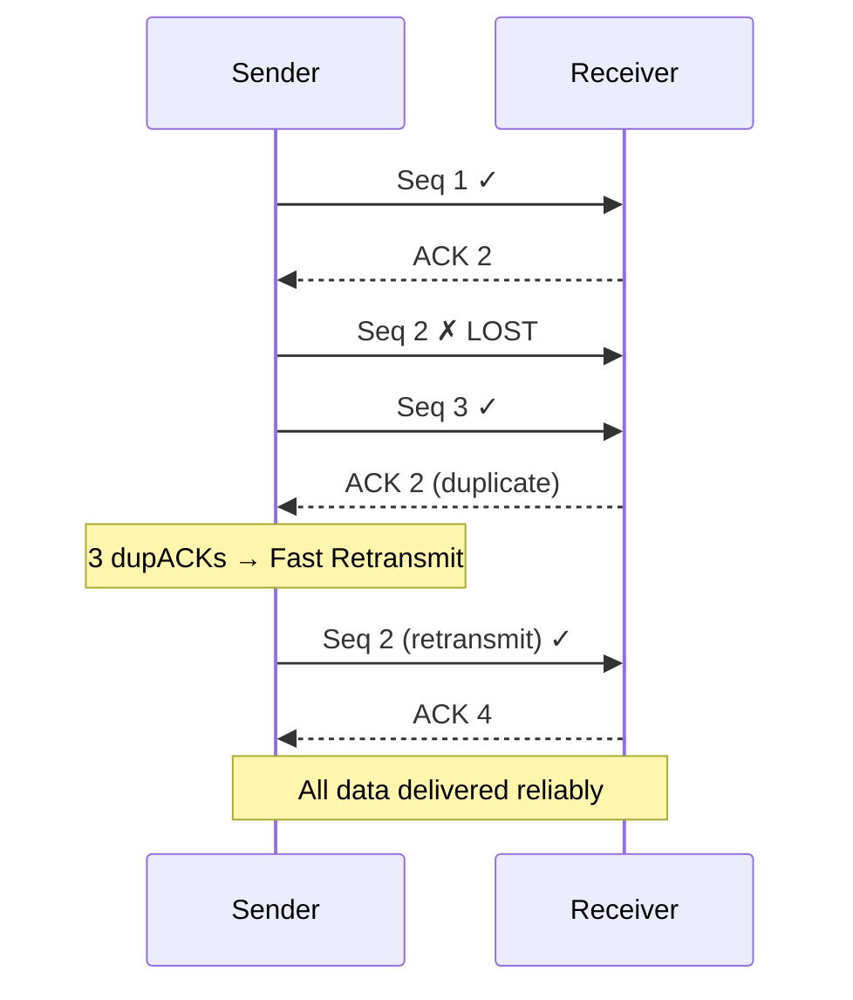
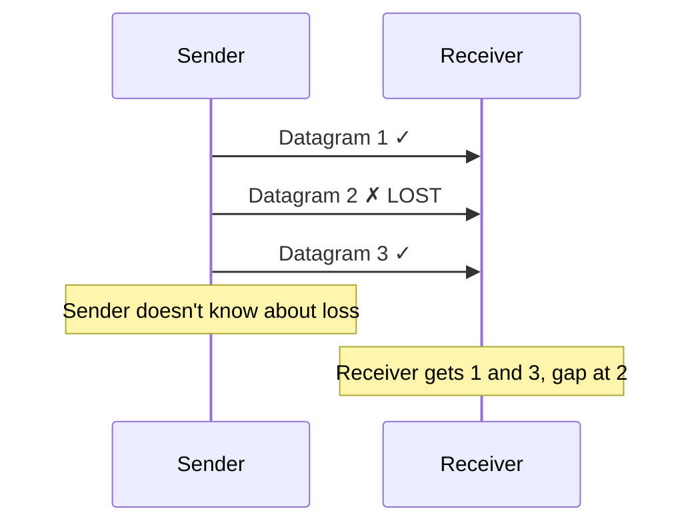
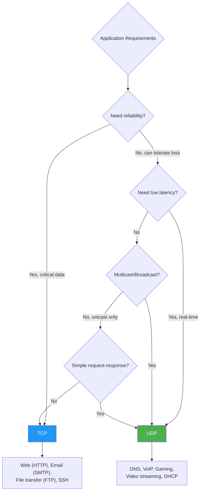

# TCP vs UDP Comparison

## Overview

TCP (Transmission Control Protocol) and UDP (User Datagram Protocol) are the two primary transport layer protocols in the TCP/IP stack. They represent fundamentally different design philosophies: TCP prioritizes **reliability** while UDP prioritizes **simplicity and speed**. Understanding their differences is one of the most common interview topics in networking.

This page provides a comprehensive comparison across all dimensions — from header format to performance characteristics to real-world applications.

## Detailed Explanation

### Quick Comparison Table

| Feature | TCP | UDP |
|---------|-----|-----|
| **Connection** | Connection-oriented (3-way handshake) | Connectionless |
| **Reliability** | Guaranteed delivery (ACKs, retransmit) | Best-effort (no guarantee) |
| **Ordering** | Ordered (sequence numbers) | No ordering guarantee |
| **Flow control** | Sliding window | None |
| **Congestion control** | AIMD, CUBIC, BBR | None |
| **Header size** | 20+ bytes | 8 bytes |
| **Message boundaries** | Byte stream (no boundaries) | Datagram (preserved) |
| **Error detection** | Checksum + ACKs | Checksum only |
| **Multiplexing** | Port numbers | Port numbers |
| **Broadcast/Multicast** | No | Yes |
| **State** | Stateful (connection state) | Stateless |
| **Overhead** | High | Low |
| **Latency** | Higher (handshake, ACKs) | Lower (no handshake) |
| **Throughput** | Optimized (windowing) | Depends on app |
| **Use cases** | Web, email, file transfer | DNS, VoIP, gaming |

### Connection Establishment

**TCP: 3-Way Handshake (1.5 RTT)**


**UDP: No Handshake (0 RTT)**


**Impact:** For small request-response (like DNS), TCP adds 1.5 RTT overhead before the first byte. UDP sends immediately.

### Reliability

**TCP: Guaranteed Delivery**


**UDP: No Guarantees**


### Ordering

**TCP: Ordered Delivery**
```
Sender sends:  [1] [2] [3] [4] [5]
Network:       [1] [3] [2] [5] [4]  (arrives out of order)
Receiver gets: [1] [2] [3] [4] [5]  (reordered by TCP)
```

**UDP: No Ordering**
```
Sender sends:  [1] [2] [3] [4] [5]
Network:       [1] [3] [2] [5] [4]  (arrives out of order)
Receiver gets: [1] [3] [2] [5] [4]  (delivered as-is)
```

### Flow Control

**TCP: Sliding Window**
```
Sender                              Receiver
  |--- Send window = 10 ---------->|
  |                                |
  |<--- Window update: 8 ----------|  (receiver buffer filling)
  |--- Send window = 8 ----------->|
  |                                |
  |<--- Window update: 0 ----------|  (receiver buffer full)
  |--- STOP sending --------------|
  |                                |
  |<--- Window update: 10 ---------|  (buffer drained)
  |--- Resume sending ------------|
```

**UDP: No Flow Control**
```
Sender                              Receiver
  |--- Blast at 100 Mbps --------->|
  |                                | (receiver only handles 10 Mbps)
  |--- Still 100 Mbps ------------>|  Packets dropped!
  |--- Still 100 Mbps ------------>|  More dropped!
  
  No automatic rate adjustment
```

### Congestion Control

**TCP: Adapts to Network Conditions**
```
CUBIC sawtooth:
  cwnd: 10 → 20 → 30 → 40 → 50 → 60 → 70 → 80
        ↓ loss detected
  cwnd: 56 → 57 → 58 → ... → 80
        ↓ loss detected
  cwnd: 56 → ...

TCP reduces rate when congestion is detected
```

**UDP: No Congestion Awareness**
```
Application sends at constant rate:
  Rate: 50 Mbps, 50 Mbps, 50 Mbps, 50 Mbps
  Network capacity drops to 30 Mbps
  UDP still sends 50 Mbps → 20 Mbps dropped
  
  No automatic adaptation
```

### Message Boundaries

**TCP: Byte Stream**
```python
# Sender
sock.send(b"Hello")
sock.send(b"World")

# Receiver - may receive any of:
# "HelloWorld" (combined)
# "Hel" + "loWorld" (split)
# "Hello" + "World" (preserved, but not guaranteed)
# Need length prefix or delimiter to parse
```

**UDP: Preserved Boundaries**
```python
# Sender
sock.sendto(b"Hello", addr)
sock.sendto(b"World", addr)

# Receiver - always receives:
# "Hello" (exactly one sendto)
# "World" (exactly one sendto)
# Each sendto = one recvfrom
```

### Header Overhead

**TCP Header (20+ bytes):**
```
20 bytes minimum + options (MSS, SACK, timestamps, window scale)
Typical: 32 bytes (with common options)

Per-segment overhead:
  IP header: 20 bytes
  TCP header: 32 bytes
  Total: 52 bytes

For 1 byte payload: 52 bytes overhead / 1 byte data = 5200% overhead
For 1460 bytes payload: 52 bytes / 1460 bytes = 3.6% overhead
```

**UDP Header (8 bytes):**
```
8 bytes, no options, no negotiation

Per-datagram overhead:
  IP header: 20 bytes
  UDP header: 8 bytes
  Total: 28 bytes

For 1 byte payload: 28 bytes / 1 byte = 2800% overhead
For 1472 bytes payload: 28 bytes / 1472 = 1.9% overhead
```

### Latency Comparison

**TCP First Byte Latency:**
```
1 RTT (handshake) + 0.5 RTT (data) = 1.5 RTT
For 50ms RTT: 75ms before first byte received
```

**UDP First Byte Latency:**
```
0.5 RTT (data only)
For 50ms RTT: 25ms before first byte received
```

**Difference: 1 RTT (the handshake)**

### Socket API Comparison

```c
// TCP Socket
int tcp_sock = socket(AF_INET, SOCK_STREAM, 0);
connect(tcp_sock, &addr, sizeof(addr));  // 3-way handshake
send(tcp_sock, data, len, 0);           // Reliable, ordered
recv(tcp_sock, buf, sizeof(buf), 0);    // Byte stream
close(tcp_sock);                         // 4-way teardown

// UDP Socket
int udp_sock = socket(AF_INET, SOCK_DGRAM, 0);
// No connect() needed
sendto(udp_sock, data, len, 0, &addr, sizeof(addr));  // Fire and forget
recvfrom(udp_sock, buf, sizeof(buf), 0, &addr, &len);  // One datagram
close(udp_sock);  // Immediate, no teardown
```

### Performance Characteristics

**Throughput:**
```
TCP: Optimized via windowing
  Throughput ≈ Window Size / RTT
  With window scaling: up to line rate
  
UDP: No built-in optimization
  Throughput = min(app_rate, network_capacity)
  No windowing, no ACK clocking
```

**Packet Loss Handling:**
```
TCP: Retransmission + rate reduction
  Lost segment → retransmit in ~1 RTT
  cwnd reduced → lower rate
  
UDP: No recovery
  Lost datagram → gone forever
  Application must handle (or ignore)
```

### When to Choose TCP vs UDP



### Hybrid Approaches

**QUIC (UDP + Reliability):**
```
Built on UDP, adds:
- Connection management (like TCP)
- Reliable delivery (ACKs, retransmit)
- Ordered streams
- Congestion control
- Encryption (TLS 1.3 built-in)

Best of both worlds: UDP's flexibility + TCP's reliability
```

**TCP with TCP_NODELAY:**
```
Disable Nagle's algorithm
Reduces latency for small messages
Still has handshake overhead
Still has ACK overhead for data
```

## Example: DNS Query Performance

### TCP DNS (without optimization)
```
Client → Server: SYN           (0ms)
Server → Client: SYN-ACK      (50ms)
Client → Server: ACK + Query  (100ms)
Server → Client: Response     (150ms)
Total: 150ms (3 round trips)
```

### UDP DNS
```
Client → Server: Query         (0ms)
Server → Client: Response     (50ms)
Total: 50ms (1 round trip)
```

**UDP is 3× faster for DNS!** This is why DNS primarily uses UDP.

### TCP DNS (with connection reuse)
```
First query:  150ms (establish connection)
Second query: 100ms (reuse connection)
Third query:  100ms (reuse connection)

Amortized: 117ms average
Still slower than UDP's 50ms
```

## Interview Questions

### Q1: What are the key differences between TCP and UDP?
**A:** TCP is connection-oriented, reliable, ordered, with flow and congestion control. UDP is connectionless, unreliable, unordered, with no flow or congestion control. TCP has 20+ byte headers; UDP has 8 bytes. TCP preserves byte streams; UDP preserves message boundaries. TCP requires handshake; UDP sends immediately.

### Q2: When would you choose UDP over TCP?
**A:** Choose UDP when: (1) Latency is critical (VoIP, gaming); (2) Application handles its own reliability (QUIC, TFTP); (3) Multicast/broadcast needed; (4) Simple request-response (DNS, DHCP); (5) Lost data is acceptable (video streaming, telemetry).

### Q3: Can UDP be made reliable?
**A:** Yes, by implementing reliability at the application layer. QUIC does this — it runs over UDP but provides reliable, ordered delivery with congestion control and encryption. TFTP implements simple ACK-based reliability. UDP provides the transport; reliability is a feature that can be added.

### Q4: Why does DNS use UDP instead of TCP?
**A:** DNS queries are small (< 512 bytes typically) and need fast responses. TCP's 3-way handshake adds 1.5 RTT overhead. UDP sends immediately (0 RTT overhead). For a protocol used billions of times daily, this matters. DNS falls back to TCP for large responses or zone transfers.

### Q5: What is the throughput difference between TCP and UDP?
**A:** TCP optimizes throughput via windowing and congestion control — it can achieve near line-rate on stable paths. UDP has no built-in optimization — throughput equals the application's send rate, limited by network capacity. For bulk transfers, TCP is generally more efficient due to its congestion-aware sending.

### Q6: How does TCP handle flow control vs UDP?
**A:** TCP uses a sliding window mechanism — the receiver advertises available buffer space, and the sender limits inflight data. UDP has no flow control — the sender can overwhelm the receiver, causing packet drops. Applications using UDP must implement their own flow control if needed.

### Q7: What is the latency overhead of TCP vs UDP?
**A:** TCP adds at least 1 RTT for the handshake before the first data byte. For a 50ms RTT link, TCP first-byte latency is 75ms; UDP is 25ms. During data transfer, TCP adds ACK overhead (each segment needs acknowledgment). UDP has no per-message overhead beyond the 8-byte header.

### Q8: Can TCP and UDP use the same port number?
**A:** Yes! TCP and UDP port spaces are independent. Port 53 can be used by both a TCP DNS server and a UDP DNS server simultaneously. The OS demultiplexes based on the IP protocol number (6 for TCP, 17 for UDP) in addition to the port number.

## Common Mistakes

1. **Assuming UDP is always faster**: For bulk data transfers, TCP's congestion control and windowing are more efficient. UDP's advantage is in latency (no handshake, no ACKs), not throughput.

2. **Using UDP for reliable data transfer without implementing reliability**: If you need all data to arrive, use TCP or implement ACKs/retransmission on UDP. Don't use raw UDP for file transfers or critical data.

3. **Not understanding that UDP preserves message boundaries**: Each `sendto()` creates one datagram, each `recvfrom()` returns one datagram. This is a feature — no need for length prefixes or delimiters.

4. **Forgetting TCP's handshake overhead**: For small, frequent request-response interactions (like DNS), TCP's 1.5 RTT handshake per connection is a significant penalty. Connection reuse helps but adds complexity.

5. **Assuming UDP has no overhead**: UDP still has IP header (20 bytes) + UDP header (8 bytes) = 28 bytes per datagram. For very small payloads, this overhead percentage is high.

6. **Not considering middlebox behavior**: NATs, firewalls, and load balancers treat TCP and UDP differently. TCP's stateful nature makes it easier to track; UDP's stateless nature can cause issues with NAT timeouts and firewall rules.

7. **Thinking TCP is always better because it's reliable**: Reliability isn't always needed. VoIP can tolerate packet loss (old audio is useless). Gaming needs fresh data, not retransmitted old data. Forcing TCP's reliability on these applications wastes resources and adds latency.

## Summary

| Dimension | TCP | UDP |
|-----------|-----|-----|
| **Design philosophy** | Reliability first | Simplicity first |
| **Connection** | 3-way handshake (1.5 RTT) | None (0 RTT) |
| **Header** | 20+ bytes | 8 bytes |
| **Data delivery** | Guaranteed, ordered | Best-effort, unordered |
| **Flow control** | Sliding window | None |
| **Congestion control** | AIMD/CUBIC/BBR | None |
| **Message boundaries** | Byte stream | Preserved |
| **Multicast** | No | Yes |
| **First-byte latency** | 1.5 RTT | 0.5 RTT |
| **Best for** | Reliable data transfer | Real-time, simple queries |
| **Examples** | HTTP, SSH, email, FTP | DNS, VoIP, gaming, DHCP |

The choice between TCP and UDP depends on application requirements. Modern protocols like QUIC blur the line by building TCP-like reliability on UDP's flexible foundation.

## Cross-References

- [UDP Overview](README.md) — UDP protocol details
- [UDP Header](header.md) — UDP header format
- [UDP Applications](applications.md) — Real-world UDP use cases
- [TCP States](../tcp/states.md) — TCP connection lifecycle
- [TCP Options](../tcp/options.md) — TCP header options (overhead)
- [QUIC Protocol](../http/quic.md) — Reliable transport on UDP
- [DNS Overview](../dns/README.md) — DNS uses both TCP and UDP
