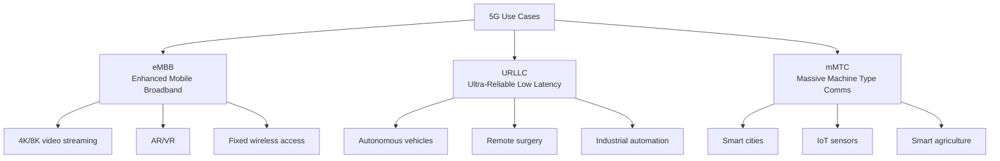
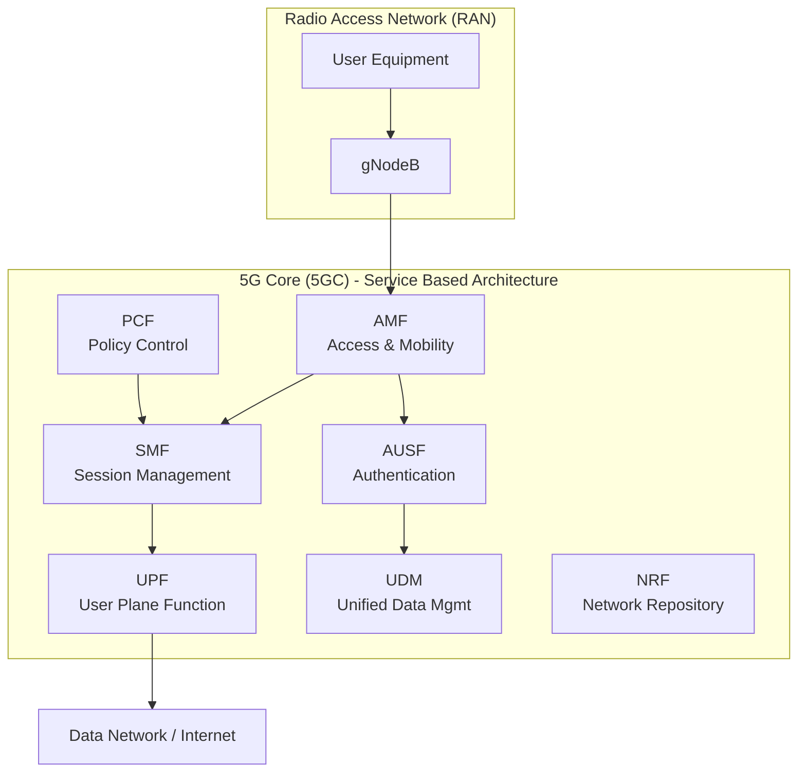
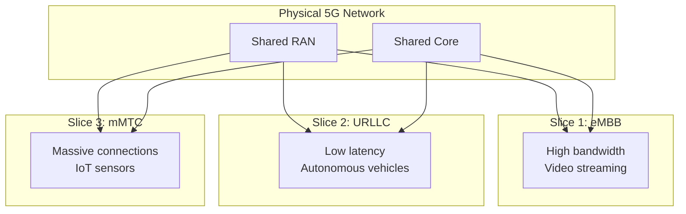

# 5G — Fifth Generation Mobile Network

## Overview

5G is the fifth generation of cellular network technology, designed for enhanced mobile broadband (eMBB), ultra-reliable low-latency communications (URLLC), and massive machine-type communications (mMTC).

## 5G vs 4G LTE

| Feature | 4G LTE | 5G NR |
|---------|--------|-------|
| **Peak speed** | 1 Gbps | 20 Gbps |
| **Latency** | 30-50ms | 1-10ms |
| **Frequency** | Sub-6 GHz | Sub-6 GHz + mmWave |
| **Bandwidth** | 20 MHz | Up to 400 MHz |
| **Connection density** | 100K/km² | 1M/km² |
| **Spectral efficiency** | Moderate | High (Massive MIMO) |
| **Architecture** | Monolithic | Service-based (SBA) |

## 5G Use Cases

## 5G Frequency Bands

| Band | Frequency | Characteristics | Use |
|------|-----------|----------------|-----|
| **Low-band** | < 1 GHz | Long range, low speed | Rural, IoT |
| **Mid-band** | 1-6 GHz | Balance of range/speed | Urban coverage |
| **High-band (mmWave)** | 24-100 GHz | Short range, extreme speed | Dense urban, stadiums |

### mmWave Challenges

- **Range**: ~500m (needs many small cells)
- **Blockage**: Walls, trees, even rain attenuate signal
- **Line-of-sight**: Requires direct or reflected paths
- **Cost**: Many cells needed for coverage

## 5G Architecture

## 5G Core Components

| Function | Role |
|----------|------|
| **AMF** | Access and Mobility Management — handles registration, reachability |
| **SMF** | Session Management — manages PDU sessions, IP allocation |
| **UPF** | User Plane — packet routing, QoS enforcement, traffic measurement |
| **AUSF** | Authentication Server Function |
| **UDM** | Unified Data Management — subscriber data |
| **PCF** | Policy Control — QoS policies, charging rules |
| **NRF** | Network Repository — service discovery |
| **NSSF** | Network Slice Selection |

## Network Slicing

5G introduces **network slicing** — creating multiple virtual networks on the same physical infrastructure:

Each slice has independent: QoS, security policies, resource allocation, and management.

## 5G vs WiFi 6

| Feature | 5G | WiFi 6 |
|---------|-----|--------|
| **Spectrum** | Licensed (carrier) | Unlicensed (anyone) |
| **Range** | km (macro cell) | ~100m (AP) |
| **Mobility** | Full mobility | Limited |
| **Handoff** | Seamless | Can be disruptive |
| **Cost** | Carrier subscription | One-time AP cost |
| **Use case** | Outdoor, mobile | Indoor, fixed |
| **Latency** | 1-10ms | 1-10ms |

## Interview Questions

1. **Q: What are the three main use cases of 5G?**
   A: 1) eMBB (Enhanced Mobile Broadband) — high-speed data (4K video, AR/VR). 2) URLLC (Ultra-Reliable Low Latency) — mission-critical (autonomous vehicles, remote surgery). 3) mMTC (Massive Machine Type Communications) — IoT (smart cities, sensors).

2. **Q: What is network slicing in 5G?**
   A: Creating multiple virtual networks on the same physical infrastructure. Each slice has independent QoS, security, and resources. Example: one slice for high-bandwidth video, another for low-latency autonomous driving, another for IoT sensors.

3. **Q: What is mmWave and what are its challenges?**
   A: mmWave (24-100 GHz) provides extreme bandwidth (multiple Gbps) but: short range (~500m), blocked by walls/trees/rain, requires line-of-sight, and needs many small cells. Used for dense urban areas and stadiums.

4. **Q: How does 5G achieve lower latency than 4G?**
   A: 1) Edge computing (MEC — Multi-access Edge Computing) processes data closer to users. 2) Shorter TTI (Transmission Time Interval). 3) Grant-free uplink (no scheduling request needed). 4) Network function placement closer to the edge.

5. **Q: What is the 5G Service-Based Architecture (SBA)?**
   A: 5G core uses SBA where network functions communicate via APIs (HTTP/2). Each function (AMF, SMF, UPF) is a microservice that registers with NRF for discovery. This enables cloud-native deployment and scalability.

## Common Mistakes

- Confusing 5G frequency bands (low/mid/high have very different characteristics)
- Assuming 5G replaces WiFi (they're complementary)
- Not understanding network slicing (it's not just VPNs)
- Forgetting that 5G standalone (SA) vs non-standalone (NSA) are different architectures
- Assuming 5G latency is always 1ms (depends on deployment and edge computing)

## Summary

5G brings extreme speed (20 Gbps), low latency (1-10ms), and massive connectivity (1M devices/km²). Network slicing enables virtual networks for different use cases. The service-based architecture (SBA) makes 5G core cloud-native. mmWave provides extreme bandwidth but limited range.

## Cross-References

- [Wireless Overview](README.md)
- [WiFi](wifi.md) — Complementary technology
- [SDN](sdn.md) — Software-defined networking enables slicing
- [NFV](nfv.md) — Virtualized network functions
- [Edge Computing](../cdn/edge.md) — MEC in 5G
