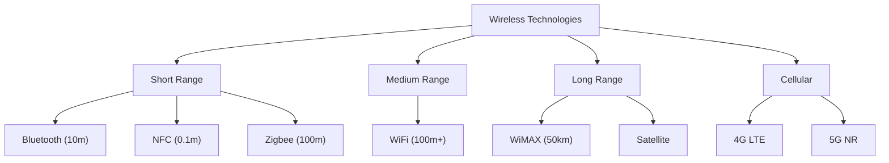
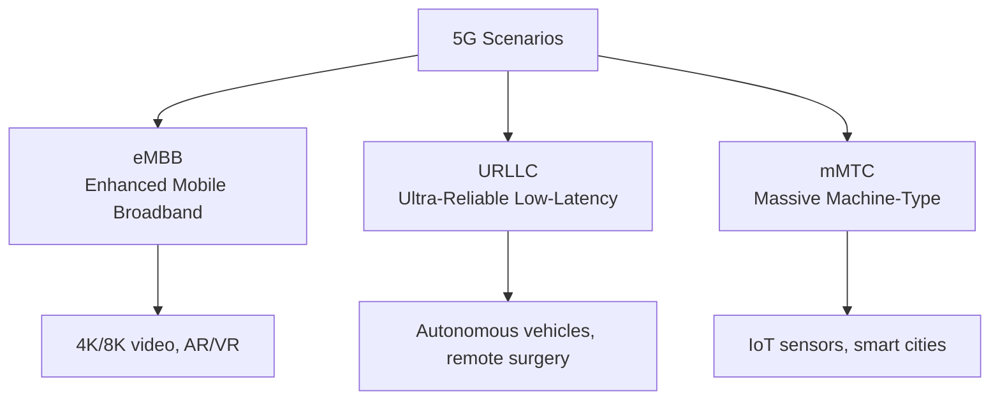
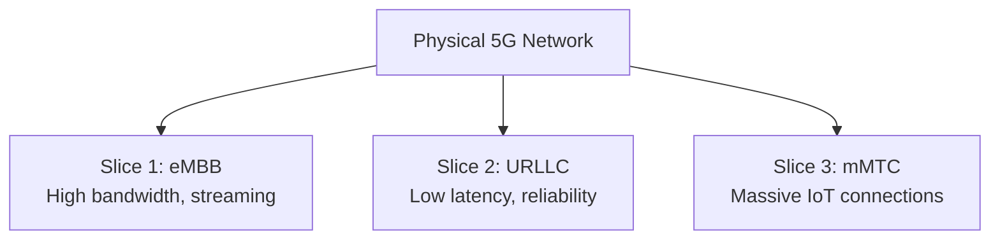
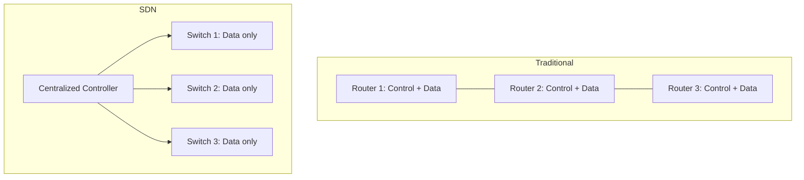
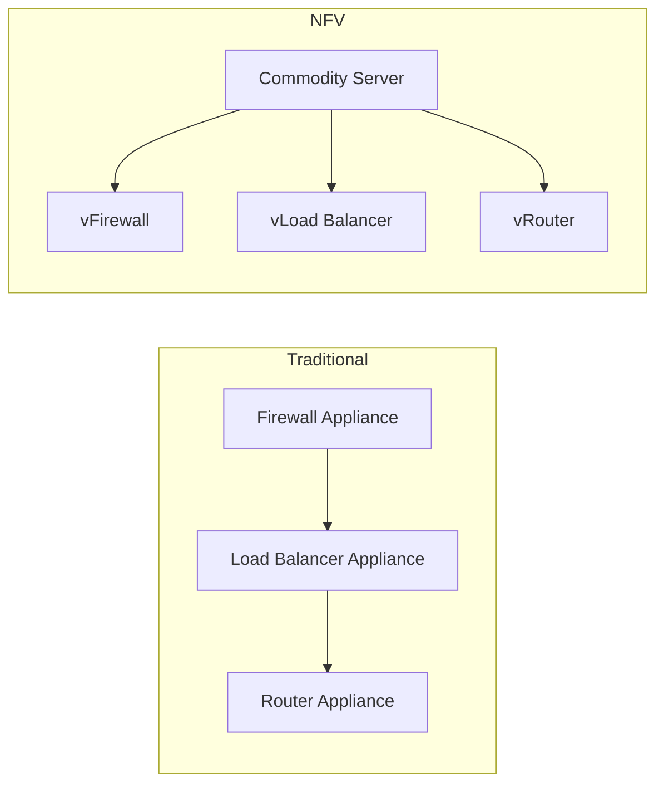
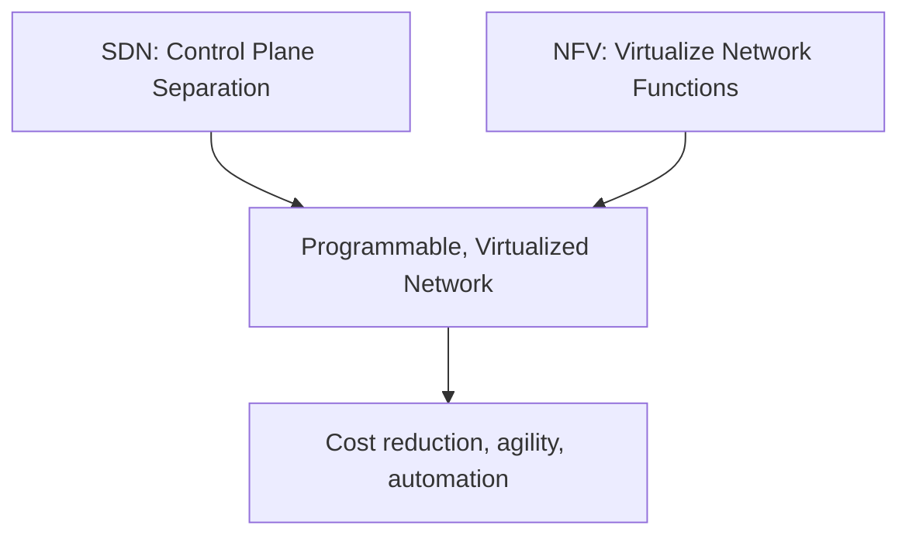

# Wireless Networking

## Overview

Wireless networking enables communication without physical cables, using radio waves, microwaves, or infrared signals. This section covers WiFi standards, 5G cellular, and modern network paradigms like SDN and NFV. Understanding wireless technologies is essential for networking interviews, as mobile and wireless increasingly dominate connectivity.

## Wireless Technologies



## WiFi Standards (IEEE 802.11)

| Standard | Name | Max Speed | Frequency | Year | Key Feature |
|----------|------|-----------|-----------|------|-------------|
| 802.11b | WiFi 1 | 11 Mbps | 2.4 GHz | 1999 | DSSS |
| 802.11a | WiFi 2 | 54 Mbps | 5 GHz | 1999 | OFDM |
| 802.11g | WiFi 3 | 54 Mbps | 2.4 GHz | 2003 | OFDM at 2.4 GHz |
| 802.11n | WiFi 4 | 600 Mbps | 2.4/5 GHz | 2009 | MIMO |
| 802.11ac | WiFi 5 | 6.9 Gbps | 5 GHz | 2013 | MU-MIMO, beamforming |
| 802.11ax | WiFi 6 | 9.6 Gbps | 2.4/5/6 GHz | 2019 | OFDMA, BSS Coloring |
| 802.11ax | WiFi 6E | 9.6 Gbps | 6 GHz | 2021 | Extended to 6 GHz band |
| 802.11be | WiFi 7 | 46 Gbps | 2.4/5/6 GHz | 2024 | 4096-QAM, MLO |

### WiFi 6 (802.11ax) Key Features

| Feature | Description | Benefit |
|---------|-------------|---------|
| **OFDMA** | Orthogonal Frequency Division Multiple Access | Multiple users per channel simultaneously |
| **MU-MIMO** | Multi-User MIMO (uplink + downlink) | Serve multiple clients at once |
| **BSS Coloring** | Tag frames with BSS identifier | Reduces co-channel interference |
| **TWT** | Target Wake Time | Devices sleep, wake on schedule → better battery |
| **1024-QAM** | Higher-order modulation | 25% more data per symbol |

### WiFi 7 (802.11be) Key Features

| Feature | Description | Benefit |
|---------|-------------|---------|
| **4096-QAM** | Even higher modulation | 20% more data per symbol |
| **MLO** | Multi-Link Operation | Use multiple bands simultaneously |
| **320 MHz channels** | Wider channels | Double the bandwidth |
| **Preamble puncturing** | Skip interference in channel | More usable spectrum |

### 2.4 GHz vs 5 GHz vs 6 GHz

| Aspect | 2.4 GHz | 5 GHz | 6 GHz |
|--------|---------|-------|-------|
| **Range** | Longest | Medium | Shortest |
| **Wall penetration** | Best | Moderate | Worst |
| **Channels** | 3 non-overlapping | 24+ | 59+ (WiFi 6E) |
| **Interference** | High (Bluetooth, microwaves) | Low | Very low |
| **Max speed** | Lower | Higher | Highest |
| **Best for** | IoT, legacy | General use | High-bandwidth, low-latency |

---

## 5G (Fifth Generation Cellular)

### 5G vs 4G LTE

| Metric | 4G LTE | 5G NR |
|--------|--------|-------|
| **Peak speed** | 1 Gbps | 20 Gbps |
| **Latency** | 30-50ms | 1-10ms |
| **Frequency** | Sub-6 GHz | Sub-6 GHz + mmWave |
| **Density** | ~100K devices/km² | ~1M devices/km² |
| **Bandwidth** | 20 MHz | 100 MHz (sub-6), 400 MHz (mmWave) |

### 5G Usage Scenarios (ITU IMT-2020)



| Scenario | Speed | Latency | Density | Use Case |
|----------|-------|---------|---------|----------|
| **eMBB** | 20 Gbps | Moderate | Moderate | Video streaming, AR/VR |
| **URLLC** | Moderate | 1ms | Low | Industrial automation, vehicle comms |
| **mMTC** | Low | Relaxed | 1M/km² | IoT sensors, smart agriculture |

### 5G Architecture

| Component | Description |
|-----------|-------------|
| **gNB** | 5G base station (replaces eNB) |
| **5G Core (5GC)** | Service-Based Architecture (SBA) |
| **Network Slicing** | Virtual networks on shared infrastructure |
| **MEC** | Multi-access Edge Computing (low-latency processing) |
| **mmWave** | 24-100 GHz, very high bandwidth, short range |

### Network Slicing

Create multiple virtual networks on the same physical infrastructure:



Each slice has independent: bandwidth, latency, security policies, and resource allocation.

---

## SDN (Software-Defined Networking)

### Core Concept

Separate the **control plane** (routing decisions) from the **data plane** (packet forwarding). A central controller manages network devices programmatically.



### SDN Architecture

| Layer | Function | Examples |
|-------|----------|---------|
| **Application** | Network applications (firewall, load balancer) | ONOS, OpenDaylight apps |
| **Control** | Centralized network logic | OpenDaylight, ONOS, Floodlight |
| **Infrastructure** | Packet forwarding (switches) | OpenFlow switches |

### OpenFlow Protocol

The standard protocol between SDN controller and switches:

```
Controller → Switch: "For packets matching (src=10.0.0.1, dst=10.0.0.2), forward out port 3"
Switch → Controller: "Packet doesn't match any flow, what should I do?"
Controller → Switch: "Forward out port 2, install flow rule"
```

### SDN Benefits

| Benefit | Description |
|---------|-------------|
| **Programmability** | Network behavior defined in software |
| **Centralized view** | Controller sees entire network topology |
| **Rapid changes** | Update policies without touching individual devices |
| **Vendor independence** | OpenFlow works across vendors |
| **Automation** | APIs for network configuration |

### SDN Use Cases

- **Data center networking**: Dynamic VM migration, micro-segmentation
- **WAN optimization**: SD-WAN for branch office connectivity
- **Network security**: Centralized firewall policy, traffic analysis
- **Traffic engineering**: Optimize paths based on real-time conditions

---

## NFV (Network Function Virtualization)

### Core Concept

Replace dedicated hardware appliances (firewalls, load balancers, routers) with software running on commodity servers.



### NFV Architecture (ETSI)

| Component | Function |
|-----------|----------|
| **VNF** | Virtualized Network Function (software version of appliance) |
| **NFVI** | NFV Infrastructure (compute, storage, network) |
| **MANO** | Management and Orchestration |
| **NFVO** | NFV Orchestrator (lifecycle management) |
| **VNFM** | VNF Manager (scaling, healing) |
| **VIM** | Virtual Infrastructure Manager (OpenStack, Kubernetes) |

### NFV Benefits

| Benefit | Description |
|---------|-------------|
| **Cost reduction** | Commodity hardware instead of specialized appliances |
| **Flexibility** | Deploy, scale, update VNFs rapidly |
| **Vendor independence** | Mix VNFs from different vendors |
| **Rapid deployment** | Spin up new network functions in minutes |
| **Elasticity** | Scale VNFs up/down based on demand |

### SDN + NFV Together



- **SDN** provides programmable network control
- **NFV** provides virtualized network functions
- Together they enable fully software-defined, virtualized networks

---

## Interview Questions

1. **Q: What's the difference between 2.4 GHz and 5 GHz WiFi?**
   A: 2.4 GHz has longer range and better wall penetration but more interference (only 3 non-overlapping channels, shared with Bluetooth/microwaves). 5 GHz has shorter range but 24+ channels and less interference. 6 GHz (WiFi 6E) adds 59 more channels for even less congestion.

2. **Q: What is SDN and why does it matter?**
   A: Software-Defined Networking separates the control plane (routing decisions) from the data plane (packet forwarding). A central controller manages network devices programmatically via OpenFlow. Benefits: centralized visibility, rapid policy changes, automation, vendor independence. Essential for data centers and WAN.

3. **Q: What is NFV?**
   A: Network Function Virtualization replaces dedicated hardware (firewalls, load balancers) with software (VNFs) running on commodity servers. Reduces cost, enables rapid deployment and scaling. Together with SDN, enables fully programmable, virtualized networks.

4. **Q: What is network slicing in 5G?**
   A: Creating multiple virtual networks on the same physical 5G infrastructure. Each slice is tailored for a specific use case: eMBB (high bandwidth for video), URLLC (low latency for industrial), mMTC (massive IoT). Slices have independent SLAs, security, and resource allocation.

5. **Q: Explain WiFi 6's key improvements.**
   A: (1) OFDMA — multiple users per channel simultaneously (vs one-at-a-time in WiFi 5). (2) MU-MIMO uplink — serve multiple clients in both directions. (3) BSS Coloring — reduces interference between overlapping networks. (4) TWT — devices sleep and wake on schedule, improving battery life. (5) 1024-QAM — 25% more data per symbol.

6. **Q: What is the difference between eMBB, URLLC, and mMTC?**
   A: eMBB (Enhanced Mobile Broadband): high speed for video/AR (20 Gbps). URLLC (Ultra-Reliable Low-Latency): 1ms latency for autonomous vehicles, remote surgery. mMTC (Massive Machine-Type Communications): 1M devices/km² for IoT sensors. 5G supports all three via network slicing.

7. **Q: How do SDN and NFV relate?**
   A: SDN separates control from data plane (programmable network). NFV virtualizes network functions (software replaces hardware). They're complementary: SDN provides the programmable control, NFV provides the virtualized functions. Together: software-defined, virtualized, automated networks.

8. **Q: What is MLO in WiFi 7?**
   A: Multi-Link Operation allows a device to simultaneously use multiple frequency bands (2.4, 5, 6 GHz). Instead of switching between bands, WiFi 7 transmits on all bands at once, increasing throughput and reducing latency. If one band has interference, traffic shifts to others seamlessly.

## Summary

Wireless networking spans from short-range (Bluetooth/NFC) to cellular (5G). WiFi has evolved from 11 Mbps (802.11b) to 46 Gbps (WiFi 7), with each generation adding efficiency improvements (MIMO, OFDMA, wider channels). 5G introduces three distinct usage scenarios (eMBB, URLLC, mMTC) via network slicing. SDN and NFV represent the shift toward programmable, virtualized networks. Understanding these technologies and their trade-offs is essential for modern networking interviews.

## Cross-References

- [WiFi](wifi.md) — Detailed WiFi protocols
- [5G](5g.md) — 5G architecture deep dive
- [SDN](sdn.md) — Software-Defined Networking details
- [NFV](nfv.md) — Network Function Virtualization details
- [Bluetooth](bluetooth.md) — Short-range wireless
- [Network Security](../security/README.md) — Wireless security (WPA3)
- [Load Balancing](../load-balancing/README.md) — L4/L7 load balancing

## References

- [IEEE 802.11 Standards](https://standards.ieee.org/ieee/802.11/7028/) — WiFi specifications
- [3GPP 5G Specifications](https://www.3gpp.org/technologies/5g-system-overview) — 5G NR standards
- [ONF — SDN Definition](https://opennetworking.org/sdn-definition/) — SDN architecture
- [ETSI NFV ISG](https://www.etsi.org/technologies/network-functions-virtualization-nfv) — NFV specifications
- [WiFi Alliance](https://www.wi-fi.org/) — WiFi certifications
- Kurose & Ross, *Computer Networking*, Chapter 7: Wireless and Mobile Networks
- [OpenFlow Specification](https://opennetworking.org/wp-content/uploads/2014/10/openflow-spec-v1.5.1.pdf)
