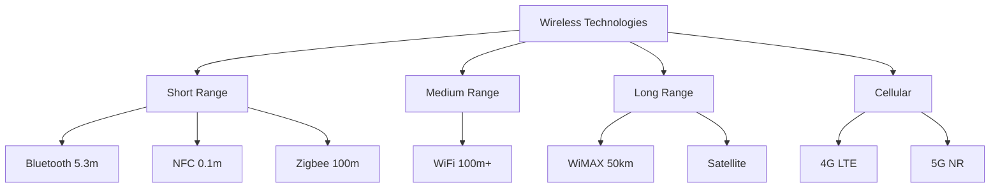

# Wireless Networking

## Overview

Wireless networking enables communication without physical cables, using radio waves, microwaves, or infrared signals. This section covers WiFi, 5G, and modern network paradigms like SDN and NFV.

## Wireless Technologies

## Frequency Bands

| Band | Frequency | Range | Use |
|------|-----------|-------|-----|
| **Sub-1 GHz** | 900 MHz | Long | IoT, rural |
| **2.4 GHz** | 2.4-2.4835 GHz | Medium | WiFi, Bluetooth |
| **5 GHz** | 5.15-5.825 GHz | Short | WiFi (less interference) |
| **6 GHz** | 5.925-7.125 GHz | Short | WiFi 6E |
| **mmWave** | 24-100 GHz | Very short | 5G, high bandwidth |

## Key Wireless Concepts

| Concept | Description |
|---------|-------------|
| **SSID** | Network name (Service Set Identifier) |
| **BSS** | Basic Service Set (one AP + connected clients) |
| **ESS** | Extended Service Set (multiple APs, same SSID) |
| **Roaming** | Moving between APs seamlessly |
| **MIMO** | Multiple-Input Multiple-Output (antenna arrays) |
| **OFDMA** | Orthogonal Frequency Division Multiple Access |
| **Beamforming** | Directing signal toward specific clients |
| **CSMA/CA** | Carrier Sense Multiple Access with Collision Avoidance |

## Interview Questions

1. **Q: What's the difference between 2.4 GHz and 5 GHz WiFi?**
   A: 2.4 GHz has longer range and better wall penetration but more interference (only 3 non-overlapping channels). 5 GHz has shorter range but more channels (24+) and less interference. 6 GHz (WiFi 6E) adds even more channels.

2. **Q: What is SDN?**
   A: Software-Defined Networking separates the control plane (routing decisions) from the data plane (packet forwarding). A central controller manages network devices programmatically. See [SDN](sdn.md).

3. **Q: What is NFV?**
   A: Network Function Virtualization replaces dedicated hardware (firewalls, load balancers) with software running on commodity servers. See [NFV](nfv.md).

## Summary

Wireless networking spans from short-range (Bluetooth) to cellular (5G). WiFi, 5G, SDN, and NFV are the key topics for interviews. Understanding frequency bands, modulation, and modern network architectures is essential.

## Cross-References

- [WiFi](wifi.md)
- [5G](5g.md)
- [SDN](sdn.md)
- [NFV](nfv.md)
