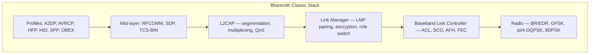
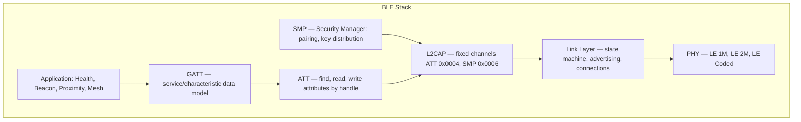
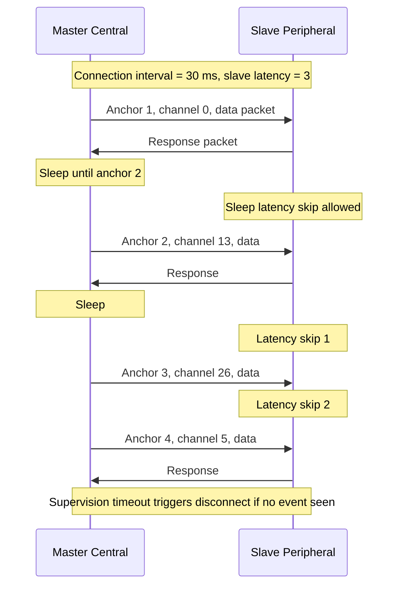
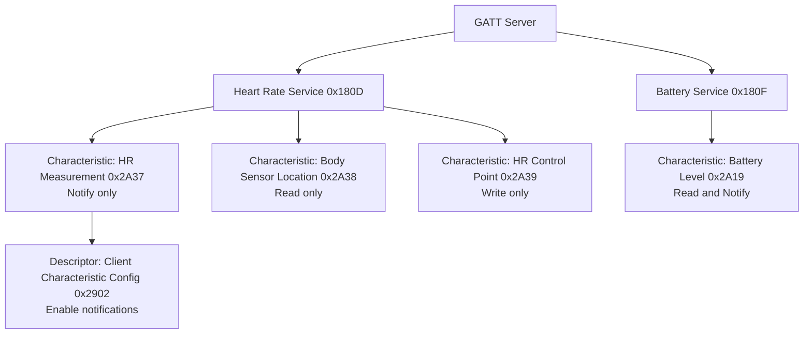
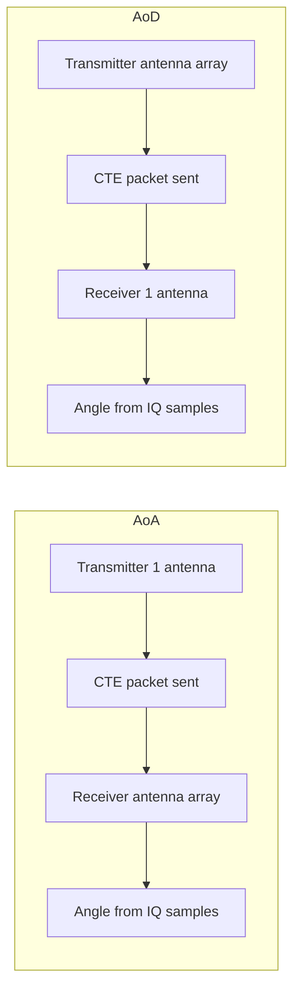
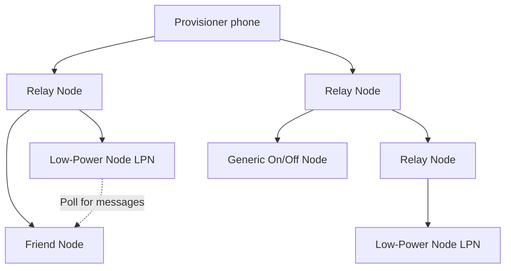

# Bluetooth

## Overview

Bluetooth is a short-range wireless communication standard operating in the 2.4 GHz ISM (Industrial, Scientific, Medical) band, governed by the Bluetooth Special Interest Group (SIG). Originally conceived in 1994 by Ericsson as a cable replacement for RS-232, it has since split into two distinct flavors: **Bluetooth Classic** (BR/EDR — Basic Rate / Enhanced Data Rate) for streaming audio and file transfer, and **Bluetooth Low Energy (BLE)** introduced in Bluetooth 4.0 for battery-constrained IoT devices. Modern dual-mode chips support both stacks simultaneously, allowing a single headset to stream A2DP audio while a fitness app reads BLE heart-rate data. Named (legend has it) after the 10th-century Viking king Harald "Bluetooth" Gormsson who united Denmark, the standard unites disparate personal-area devices under one specification. As of 2024 there are more than 5 billion Bluetooth shipments per year, making it the most ubiquitous short-range wireless technology on Earth.

> **Related:** [TCP/IP Suite](../tcp-ip/README.md) · [OSI Model](../osi/README.md) · [Embedded IoT](../../embedded-systems/iot.md) · [Cryptography](../../security/cryptography.md)

## Bluetooth Classic vs BLE

Although they share the 2.4 GHz ISM band and a common brand, Classic and BLE are essentially two different protocols with different PHYs, link layers, and upper stacks. A dual-mode controller can time-multiplex between them, but a BLE-only sensor cannot talk to a Classic-only A2DP sink. The split was deliberate: Classic was over-engineered for streaming (always-on SCO audio, 79 channels at 1600 hops/s), which made it unsuitable for coin-cell sensors that need to wake, transmit 20 bytes, and sleep within 3 ms. BLE was designed ground-up for that burst pattern.

| Feature | Bluetooth Classic (BR/EDR) | Bluetooth Low Energy (BLE) |
|---------|---------------------------|----------------------------|
| **Introduced** | 1999 (1.0) / 2004 (EDR 2.0) | 2010 (4.0) |
| **Use case** | Audio streaming, file transfer, SPP | IoT sensors, beacons, fitness |
| **Channels** | 79 channels, 1 MHz each | 40 channels, 2 MHz each |
| **Hop rate** | 1600 hops/s fixed | Per connection event |
| **Max throughput** | ~2.1 Mbps (EDR) | ~2 Mbps (LE 2M PHY) |
| **Real throughput** | ~1.5 Mbps after overhead | ~100–200 kbps over GATT |
| **Latency** | ~100 ms (typical) | ~6 ms (min connection interval) |
| **Power** | 1 W (class 1 radio) | 0.01–0.5 W |
| **Topology** | Piconet / scatternet | Star + Mesh (BT5) |
| **Discovery** | Inquiry scan (multi-second) | Advertising (3.75 ms min) |
| **Audio** | A2DP (SBC, AAC, aptX) | LE Audio (LC3, BT5.2+) |
| **Stack top** | RFCOMM / SDP / OBEX | ATT / GATT |
| **Pairing** | SSP, legacy PIN, Secure Connections | SMP, LE Secure Connections |

## Protocol Stack

Both Classic and BLE split into a **Host** (upper layers, runs on the application CPU), a **Controller** (radio + baseband, the Bluetooth chip itself), and the **Host Controller Interface (HCI)** between them — typically UART, USB, or a 3-wire variant. This split lets a phone vendor swap Bluetooth chips without rewriting the upper stack.

### Bluetooth Classic Stack

**RFCOMM** emulates up to 60 virtual serial ports (RS-232) over L2CAP and is what SPP, HFP, and OBEX object push ride on. **SDP** (Service Discovery Protocol) lets a client query which profiles a peer supports and on which L2CAP PSM (Protocol Service Multiplexer) they listen. **L2CAP** multiplexes several logical channels over a single ACL link, handles segmentation and reassembly of up-to-64 kB packets, and enforces per-channel QoS and retransmission for "Enhanced Retransmission Mode" channels. **LMP** (Link Manager Protocol) runs on the controller and is responsible for pairing, authentication, encryption key negotiation, role switching, and power-control. **Baseband** defines the 79-channel hop sequence, SCO (Synchronous Connection-Oriented) for telephony-grade voice, ACL (Asynchronous Connection-Less) for data, and AFH (Adaptive Frequency Hopping) that blacklists noisy channels.

### BLE Stack

BLE inherits the host/controller split but replaces the upper layers with the **Attribute Protocol (ATT)** and **Generic Attribute Profile (GATT)**, both optimized for tiny state reads/writes rather than streams.

**ATT** is a request/response protocol that operates over a flat array of up to 65 536 attributes, each addressed by a 16-bit handle and typed by a UUID. ATT defines six operations: Find Information, Find By Type Value, Read By Type, Read Blob, Write, and Handle-Value Notification. **GATT** layers a hierarchical *service → characteristic → descriptor* data model on top of ATT and standardizes when each operation is allowed based on a characteristic's properties. **SMP** runs on a dedicated fixed L2CAP channel (CID 0x0006) and negotiates the STK (Short-Term Key) and LTK (Long-Term Key) used by the controller's AES-CCM link-layer encryption. The **Link Layer** is a small state machine with five roles — Standby, Advertiser, Scanner, Initiator, Master/Central, Slave/Peripheral — and uses 40 channels split into 37 data channels and 3 advertising channels (37, 38, 39).

## Frequency Hopping Spread Spectrum (FHSS)

Both Classic and BLE avoid the congested 2.4 GHz band — shared with WiFi, microwaves, and Zigbee — by **hopping** between channels many times per second using a pseudorandom sequence seeded by the master's clock and BD_ADDR. Frequency hopping also provides natural interference resilience: if a hop lands on a noisy channel, only one packet is lost, not the entire stream.

| Property | Classic | BLE |
|----------|---------|-----|
| **Channels** | 79 (0–78), 1 MHz spacing | 40 (0–39), 2 MHz spacing |
| **Adv channels** | N/A | 3 (37, 38, 39) |
| **Data channels** | All 79 | 37 (0–36) |
| **Hop rate** | 1600 hops/s fixed | Per connection event |
| **Algorithm** | 5-bit hop selection kernel | Channel map + increment |
| **Adaptivity** | AFH — blacklist bad channels | Channel map (37-bit bitmask) |

**Classic** uses a 79-channel hop sequence driven by the master's 28-bit clock and 48-bit BD_ADDR, with **Adaptive Frequency Hopping (AFH)** blacklisting noisy channels so they're skipped. **BLE** separates advertising (3 fixed channels) from data (37 channels), and the master periodically sends a `ChannelMap` indicating which data channels are "good" or "bad"; the slave applies a 16-bit hopping increment to derive the next channel index. Because advertising happens on only 3 channels, two BLE devices in proximity can discover each other in 3.75–10 ms — far faster than Classic's multi-second inquiry scan.

## BLE Advertising

Advertising is how a BLE peripheral announces its presence and optionally its data, without first establishing a connection. There are four advertising PDU types defined by the Link Layer, each trading off discovery latency, payload capacity, and connectability:

| Type | AdvA | AdvData | Scan Response | Connectable |
|------|------|---------|---------------|-------------|
| **ADV_IND** | Yes | Yes | Yes | Yes |
| **ADV_DIRECT_IND** | Yes | No | No | Yes (directed) |
| **ADV_NONCONN_IND** | Yes | Yes | No | No |
| **ADV_SCAN_IND** | Yes | Yes | Yes | No (scannable) |

- **ADV_IND** (connectable + scannable): default for most peripherals — a watch waiting to pair.
- **ADV_DIRECT_IND** (high-duty directed): used for fast reconnect to a known peer; emits every 3.75 ms for ≤1.28 s, then gives up to save battery.
- **ADV_NONCONN_IND** (beacon): iBeacon / Eddystone frames broadcasting up to 31 bytes of payload.
- **ADV_SCAN_IND** (scannable non-connectable): used when more than 31 bytes are needed; the scanner issues a `SCAN_REQ` and receives a `SCAN_RSP` carrying another 31 bytes.

The advertising interval is configurable from 20 ms to 10.24 s; shorter intervals drain battery faster but reduce discovery latency. To mitigate prolonged collisions on the three adv channels, BLE adds a pseudo-random 0–10 ms delay (`advDelay`) to each event. **Bluetooth 5 Extended Advertising** moves large payloads off the 3 primary adv channels onto 37 secondary channels, raising the payload limit from 31 bytes to 254 bytes per packet and 1650 bytes per chain.

## BLE Connection Events

Once an initiator receives an `ADV_IND` it sends a `CONNECT_IND` (a PDU on an adv channel) containing the access address, the connection interval, slave latency, and supervision timeout. From that moment both devices hop to the first data channel at the **anchor point** and exchange packets in **connection events** — one event per connection interval.

Three parameters define the connection's trade-off between latency and battery:

| Parameter | Range | Meaning |
|-----------|-------|---------|
| **Connection interval** | 7.5 ms – 4 s | Time between anchor points |
| **Slave latency** | 0 – 499 | Number of intervals the slave may skip responding |
| **Supervision timeout** | 100 ms – 32 s | If no event seen, terminate the link |

A heart-rate strap might use a 1 s interval + latency 4 (waking only every 5 s), while a HID mouse uses 7.5 ms with latency 0 for sub-10 ms responsiveness. After each packet exchange the master sets the next channel via `hopIncrement`, so the sequence of channels used is deterministic but pseudorandom — important for coexistence with WiFi.

## GATT Services and Characteristics

GATT organizes state as a tree: a **server** exposes one or more **services**, each containing **characteristics** that hold a value plus optional **descriptors**. A **client** (typically the phone) discovers the hierarchy via a `Discover All Services` query, then reads/writes/notifications happen on specific characteristics by handle.

- **UUIDs**: 16-bit assigned numbers (0x180D) are shorthand for the full 128-bit Bluetooth UUID `0000180D-0000-1000-8000-00805F9B34FB`. Custom services use a vendor-specific 128-bit base.
- **Properties**: each characteristic declares a bitmask — Read, Write, Write Without Response, Notify, Indicate, Broadcast, Signed Write, Extended Properties.
- **Notifications vs Indications**: Notify is fire-and-forget (no ACK); Indicate requires a confirmation, useful when packet loss must be detected. Notify is lower-latency; Indicate is more reliable.
- **CCC descriptor (0x2902)**: a 2-byte flag the client writes to enable or disable notifications/indications on a characteristic. Without writing 0x0001 to this descriptor, the server will not push notifications.

## Profiles

### Classic Profiles

Classic profiles define complete vertical use cases — a peer that implements A2DP can stream to any A2DP sink regardless of vendor.

| Profile | Acronym | Stands For | Transport | Use |
|---------|---------|-----------|-----------|-----|
| **A2DP** | Advanced Audio Distribution Profile | Streams high-quality mono/stereo audio | L2CAP + AVDTP | Headphones, speakers |
| **AVRCP** | Audio/Video Remote Control Profile | Play/pause/skip commands | L2CAP + AVCTP | Media buttons on headset |
| **HFP** | Hands-Free Profile | Two-way voice + call control | RFCOMM + SCO | Car kits, headset mic |
| **HID** | Human Interface Device | Keyboard/mouse/gamepad reports | L2CAP (interrupt + control) | Wireless peripherals |
| **SPP** | Serial Port Profile | Virtual RS-232 over RFCOMM | RFCOMM | Legacy IoT, barcode scanners |
| **PBAP** | Phone Book Access Profile | Sync contacts and call history | OBEX over RFCOMM | Car infotainment |
| **MAP** | Message Access Profile | SMS and MMS sync | OBEX over RFCOMM | Car infotainment |
| **DUN** | Dial-Up Networking Profile | Tether phone as modem | RFCOMM + AT commands | Legacy laptop tethering |

### BLE GATT Services

BLE doesn't use the Classic "profile" concept directly; instead, every device is a GATT server exposing SIG-defined or custom services. The "profile" is implied by which services and characteristics a device exposes.

| Service | UUID | Common Characteristics |
|---------|------|------------------------|
| **Generic Access** | 0x1800 | Device Name, Appearance, Connection Params |
| **Generic Attribute** | 0x1801 | Service Changed indication |
| **Heart Rate** | 0x180D | HR Measurement, Body Sensor Location, Control Point |
| **Battery** | 0x180F | Battery Level (0–100%) |
| **Device Information** | 0x180A | Manufacturer, Model, Firmware, HW rev |
| **Current Time** | 0x1805 | Exact time + 24h format |
| **Environmental Sensensing** | 0x181A | Temperature, Humidity, Pressure, UV Index |
| **Cycling Power** | 0x1818 | Power, Cadence, Torque, Balance |

## Pairing and Security

Bluetooth security has evolved through several generations, each fixing the prior one's weaknesses. The defining transition was from **legacy PIN pairing** (susceptible to offline brute-force) to **Secure Simple Pairing (SSP)** using Elliptic-Curve Diffie-Hellman.

| Security Version | Introduced | Pairing Method | Crypto Strength |
|------------------|-----------|----------------|-----------------|
| **SV 1 (Legacy)** | BT 2.1 | PIN entry | E22 / E21, 128-bit but weak entropy |
| **SV 2 (SSP)** | BT 2.1 | Just Works / Numeric Comparison / Passkey / OOB | ECDH P-192 |
| **SV 3 (Secure Connections)** | BT 4.1 | Same methods, stronger crypto | ECDH P-256, HMAC-SHA-256 |
| **SV 4 (LE Secure Connections)** | BT 4.2 | Numeric Comparison added to BLE | ECDH P-256 |
| **SV 5 (Public Key Crash fix)** | BT 5.2 | Hardens SV4 state machine | Same crypto, hardened |

**Legacy PIN pairing (SV1)** is broken — an attacker who records the pairing exchange can recover the link key offline via the E22 algorithm and a small PIN space (most PINs were 4 digits, only 10 000 candidates). **Secure Simple Pairing (SSP, SV2)** replaces PINs with ECDH and a man-in-the-middle defense chosen per situation: *Just Works* (no MITM protection, for headsets with no input), *Numeric Comparison* (6-digit compare, BT 4.1+), *Passkey Entry* (6-digit typed on one device), or *Out of Band* (OOB via NFC or QR code). **Secure Connections (SV3+)** upgrades the curve from P-192 to P-256 and the key-derivation function from SAFER+ to HMAC-SHA-256, raising brute-force cost to ~128-bit security. **LE Secure Connections (SV4)** brings P-256 to BLE and adds the *Numeric Comparison* association model that Classic already had — important because the older BLE "Passkey Entry" was vulnerable to passive eavesdropping if the curve was weak.

### Notable Attacks

| Attack | CVE / Year | Target | Root Cause |
|--------|-----------|--------|------------|
| **KNOB** | CVE-2019-9506 | Classic + BLE | Negotiate 1-byte entropy key then brute-force in seconds |
| **BLUR** | 2020 | Cross-transport | Classic pairing keys reused for BLE → cross-protocol impersonation |
| **BLUFFS** | 2023 | BR/EDR | Force forward-only key derivation → decrypt past sessions |
| **BIAS** | CVE-2020-10135 | BR/EDR | Role switch bypasses authentication state |
| **MAC Randomization bypass** | ongoing | BLE | Static random MAC hashed to identity across sessions |

**MAC randomization**: BLE peripherals randomize their 48-bit address (either *static* random, stable per power cycle, or *non-static* random, rotated every ~15 min) to defeat long-term tracking. iOS and Android both implement private address resolution by hashing against an Identity Resolving Key (IRK) exchanged at pairing — only paired peers can recognize the device.

## Bluetooth 5 Features

Bluetooth 5 (2016) was the most consequential BLE update since 4.0, focused on range, speed, and broadcast capacity rather than power consumption.

| Feature | Improvement | How Achieved |
|---------|-------------|--------------|
| **2× speed** | 1 Mbps → 2 Mbps | New LE 2M PHY |
| **4× range** | ~50 m → ~200 m | LE Coded PHY with FEC S=8 |
| **8× broadcast capacity** | 31 B → 255 B (single), 1650 B (chain) | Extended Advertising on secondary channels |
| **Coexistence** | Better WiFi/BLE coexistence | Slot availability masks, TIFS scheduling |
| **Dual PHY** | Speed or range, per-link | PHY update procedure mid-connection |

The **LE Coded PHY** uses a 1/2-rate convolutional code (S=2 → 500 kbps) or 1/8-rate (S=8 → 125 kbps) with Preamble, CI, and TERM1/TERM2 fields to lift receiver sensitivity by ~4–12 dB. **Extended Advertising** moves large payloads off the 3 primary adv channels onto 37 secondary channels (one of the data channels), enabling beacons to broadcast 255 bytes instead of 31, and to chain multiple packets for up to 1650 bytes total. Slot Availability Masks (SAM) let the BLE controller tell the WiFi scheduler which Bluetooth slots it needs reserved, improving coexistence in dual-radio phones.

## Bluetooth 5.1 Direction Finding

BT 5.1 adds **Angle of Arrival (AoA)** and **Angle of Departure (AoD)** to give BLE sub-meter localization — useful for asset tracking, indoor navigation, and key-fob direction (e.g. Apple AirTag direction finding).

The transmitter appends a **Constant Tone Extension (CTE)** — 2–20 µs of unmodulated 250 kHz tone — to the end of a normal BLE packet. The receiver samples I/Q pairs while switching through its antenna array on a known schedule (the "switching pattern"), then computes the angle from the phase rotation between samples. AoA uses a single TX antenna and an RX array; AoD inverts (TX array, single RX). Practical accuracy is ±5° in lab conditions, ±10° in the field. The IEEE 802.15.4z standard uses an identical technique (called RIM / Ranging) for UWB.

## Bluetooth 5.2 – 5.4 Updates

| Version | Year | Headline Feature | Why It Matters |
|---------|------|------------------|----------------|
| **5.2** | 2019 | LE Audio + LC3 codec + Isochronous Channels | Native audio over BLE, replacing Classic A2DP for hearing aids |
| **5.2** | 2019 | Enhanced Attribute Protocol (EATT) | Concurrent ATT operations, reduced latency |
| **5.2** | 2019 | LE Power Control | Closed-loop Tx power → up to 20% battery savings |
| **5.3** | 2021 | Periodic Advertising Enhancement | Larger adv data, better scheduling |
| **5.3** | 2021 | Connection Subrating | Fast mode transition (7.5 ms → 1000 ms) without re-pairing |
| **5.4** | 2023 | PAwR — Periodic Advertising with Responses | Bidirectional comms with thousands of passive scanners (electronic shelf labels) |
| **5.4** | 2023 | Encrypted Advertising Data | AEAD over adv payload, defeating passive sniffers |
| **5.4** | 2023 | LE GATT Security Levels | Stronger characteristic-level access control |

**LE Audio** is the headline: a new isochronous channel type carries LC3-encoded audio with sub-10 ms latency, and a new Broadcast Audio Scan Service (BASS) enables **Auracast** — share one phone's music with many headsets simultaneously, or broadcast airport gate announcements to hearing aids. The LC3 codec is roughly 2× more efficient than the SBC codec used by Classic A2DP, so equivalent audio quality at half the bit rate.

## BLE Mesh

Bluetooth Mesh (2017, a profile spec layered on top of BLE 4.x) extends BLE's star topology to many-to-many networks of up to 32 767 nodes per network, targeting smart lighting, HVAC, and building automation. It deliberately does NOT route over IP — every node speaks the Mesh Proxy Protocol over GATT, which lets a phone participate as a "provisioner" without needing a special radio.

- **Managed flooding**: every message is relayed by all relay-capable nodes, but a TTL field caps the hop count (max 126) and a 24-bit sequence number prevents replay.
- **Relay nodes**: mains-powered, repeat every message they receive. Form the backbone.
- **Low-Power Nodes (LPN)**: battery sensors that sleep and periodically poll a **Friend** for queued messages addressed to them.
- **Friend nodes**: cache messages addressed to their LPNs and deliver them on the next poll.
- **Security**: mesh uses AES-CCM with separate **application keys** (per app/function) and **network keys** (per subnet). All messages are encrypted at the network layer; the relay can decrypt the network header but cannot read the app payload. A "proxy" node bridges a phone into the mesh via GATT, with a separate Proxy Protocol encryption on the GATT link.

## BLE vs Other IoT Protocols

| Feature | BLE 5 | Zigbee 3.0 | Thread | Wi-Fi HaLow 802.11ah |
|---------|-------|------------|--------|----------------------|
| **Frequency** | 2.4 GHz | 2.4 GHz | 2.4 GHz | Sub-1 GHz 902–928 MHz |
| **Range** | 50–200 m | 100 m | 100 m | 1 km |
| **Max data rate** | 2 Mbps | 250 kbps | 250 kbps | 347 Mbps |
| **Topology** | Star + Mesh | Mesh | Mesh via 6LoWPAN | Star or mesh |
| **Power** | Years on coin cell | Years on coin cell | Years on coin cell | Higher than BLE |
| **IP-native** | No, uses GATT | No, uses ZCL | Yes, IPv6 | Yes, IPv6 |
| **Nodes per network** | ~32 K | ~65 K | ~250 router + child | ~8 K |
| **Security** | AES-CCM 128 | AES-128 | DTLS / ECC | WPA3 |
| **Best for** | Phone-paired wearables | Smart home lighting | IPv6 smart home | Industrial IoT, smart metering |

## BLE PHY Modes

| PHY | Symbol Rate | FEC | Bit Rate | Sensitivity | Range typical |
|-----|-------------|-----|----------|-------------|---------------|
| **LE 1M** | 1 Msym/s | None | 1 Mbps | −70 dBm | ~50 m |
| **LE 2M** | 2 Msym/s | None | 2 Mbps | −65 dBm | ~30 m |
| **LE Coded S=2** | 1 Msym/s | 1/2 rate | 500 kbps | −75 dBm | ~150 m |
| **LE Coded S=8** | 1 Msym/s | 1/8 rate | 125 kbps | −80 dBm | ~200 m+ |

The PHY is selected per-connection via the **PHY Update Procedure**; a phone might use LE 2M for fast firmware transfer and drop to LE Coded S=8 when the user walks to the far end of a warehouse. Receiver sensitivity improves roughly 6 dB per doubling of coding rate, which translates to ~2× range improvement for every 6 dB in free-space propagation.

## Interview Questions

1. **Q: What's the fundamental difference between Bluetooth Classic and BLE?**
   A: Classic (BR/EDR) is optimized for continuous streaming — 79 channels at 1600 hops/s, A2DP audio, RFCOMM serial, SCO voice. BLE is optimized for sporadic bursts — 40 channels, connection events with long sleep intervals, GATT state reads/writes. They share the 2.4 GHz band and HCI but use different PHYs, link layers, and upper stacks. A dual-mode chip time-multiplexes both, but a BLE-only sensor cannot talk to a Classic-only A2DP sink.

2. **Q: How does BLE achieve multi-year battery life?**
   A: Three mechanisms: (1) advertising at long intervals (e.g. 1 s) consumes only ~10 μA average; (2) connection events let the slave sleep for the entire interval except the anchor point, and slave latency allows skipping multiple intervals; (3) LE Coded PHY adds FEC so the radio can be on for fewer bit-times per byte received. A CR2032 coin cell (220 mAh) can run a temperature sensor for 5+ years at 1 s interval + slave latency 4.

3. **Q: Explain GATT service, characteristic, and descriptor.**
   A: A **service** is a collection of characteristics exposing a coherent function (e.g. Heart Rate Service 0x180D). A **characteristic** is a typed value plus a properties bitmask (Read, Write, Notify, Indicate, etc.). A **descriptor** adds metadata or behavior — the Client Characteristic Configuration (0x2902) descriptor is the 2-byte flag a client writes to enable notifications or indications on that characteristic. Without writing 0x0001 to the CCC, the server will not push notifications.

4. **Q: What is the KNOB attack and how is it mitigated?**
   A: KNOB (CVE-2019-9506) exploits the fact that the Classic LMP key-negotiation step allowed the entropy of the encryption key to be reduced to as little as 1 byte (8 bits). An active MITM downgrades the entropy, then brute-forces the key in seconds. Mitigation: enforce a minimum key entropy of 7 bytes (56 bits) at the LMP layer — mandated in BT 4.2+ and back-ported via vendor security patches. Even better, use Secure Connections (P-256) which sidesteps the negotiation entirely.

5. **Q: What did Bluetooth 5 add over 4.2?**
   A: Four headline features: (1) LE 2M PHY for 2× speed (1 Mbps → 2 Mbps); (2) LE Coded PHY with FEC for 4× range (~50 m → ~200 m); (3) Extended Advertising moving large payloads to secondary channels for 8× broadcast capacity (31 B → 255 B); (4) better WiFi coexistence via Slot Availability Masks. Combined with the existing LE Secure Connections (BT 4.2), BT5 made BLE viable for asset tracking and richer beacons.

6. **Q: How does BLE direction finding (AoA) work?**
   A: The transmitter appends a Constant Tone Extension (CTE) — a 2–20 µs unmodulated 250 kHz sine — to the end of a normal BLE packet. The receiver has an antenna array and samples I/Q pairs while switching antennas on a known schedule. The phase difference between samples encodes the angle of arrival, which the host resolves to ±5° in lab conditions. AoD inverts: the array is on the transmitter and the receiver samples with one antenna — useful for tags that need to know their own position relative to fixed beacons.

7. **Q: What is BLE Mesh and why "managed flooding"?**
   A: BLE Mesh (2017) layers many-to-many routing on top of standard BLE using a flood-based relay model. Every relay node re-broadcasts every message with a decremented TTL (max 126) and a 24-bit sequence number for replay protection. "Managed" refers to the TTL cap, sequence numbers, and per-message cache that prevent infinite loops. Low-Power Nodes sleep and poll a Friend node for queued traffic. All traffic is AES-CCM encrypted with separate network and application keys, so a relay can forward packets without reading their payload.

8. **Q: Why does BLE randomize its MAC address, and how does a peer recognize it?**
   A: To prevent long-term device tracking by passive sniffers. BLE supports *static random* addresses (stable for a power cycle, regenerated on reboot) and *non-static random* addresses (rotated every ~15 min). Paired peers resolve the random address to a fixed Identity Resolving Key (IRK) exchanged during pairing — the peer hashes the random address with the IRK and checks for a match, so it recognizes the device while eavesdroppers cannot link sessions across rotations.

## Common Mistakes

- Confusing Classic and BLE (a BLE-only sensor cannot stream A2DP audio)
- Assuming BLE throughput is 2 Mbps — protocol overhead and GATT round-trips drop real-world throughput to ~100–200 kbps
- Setting the connection interval too short (e.g. 7.5 ms) for a battery device — kills battery without real latency benefit
- Forgetting that `slave latency` lets a peripheral skip N intervals — many firmware bugs come from ignoring it on the master side
- Treating BLE encryption as unbreakable — without Secure Connections (P-256), legacy SSP (P-192) is weaker than the marketing suggests
- Using `Just Works` pairing for sensitive data — it provides encryption but no MITM protection
- Believing Bluetooth 5 "2× speed" applies to Classic — it is BLE-only; Classic EDR still caps at ~2.1 Mbps
- Leaving CCC descriptor unwritten when expecting notifications — the server will silently never push

## Summary

Bluetooth has bifurcated into two complementary stacks sharing the 2.4 GHz ISM band: **Classic** for streaming (A2DP audio, RFCOMM serial, SCO voice) and **BLE** for state (GATT services, mesh, beacons). The BLE stack — PHY → Link Layer → L2CAP → ATT/GATT — trades raw throughput for sub-10 ms latency and multi-year coin-cell battery life via connection events, slave latency, and low-duty advertising. Bluetooth 5 brought LE 2M and LE Coded PHYs for 2× speed and 4× range; 5.1 added AoA/AoD direction finding; 5.2 introduced LE Audio with the LC3 codec; 5.4 added PAwR and encrypted advertising. Security evolved from legacy PIN (broken) through SSP (P-192) to Secure Connections (P-256), with ongoing hardening against KNOB, BLUR, BIAS, and BLUFFS. BLE Mesh extends the star topology into many-to-many networks of tens of thousands of nodes via managed flooding with separate network and application keys.

## Cross-References

- [Wireless Overview](README.md) — Where Bluetooth fits among WiFi, 5G, SDN
- [WiFi](wifi.md) — Companion 2.4 GHz technology, coexistence concerns
- [5G](5g.md) — Wide-area cellular alternative for IoT
- [TCP/IP Suite](../tcp-ip/README.md) — BLE Mesh carries GATT, not IP; Thread does
- [OSI Model](../osi/README.md) — Bluetooth spans PHY + Data Link
- [Embedded IoT](../../embedded-systems/iot.md) — BLE as a sensor bus
- [Cryptography](../../security/cryptography.md) — ECDH P-256, AES-CCM used by SMP

## References

- [Bluetooth Core Specification](https://www.bluetooth.com/specifications/specs/) — Authoritative spec (currently 5.4)
- [Bluetooth SIG — Mesh Profile Specification](https://www.bluetooth.com/specifications/specs/mesh-profile-1-0-1/) — BLE Mesh
- [Bluetooth SIG — GATT Specification Supplement](https://www.bluetooth.com/specifications/specs/gatt-specification-supplement/) — Service and characteristic UUIDs
- Townsend, Cufí, Davidson, Akiba, *Bluetooth Low Energy: A Technical Primer*, O'Reilly, 2nd ed., 2022
- Bluetooth SIG Whitepaper, *Bluetooth 5: Go Faster, Go Further*, 2016
- Bluetooth SIG Whitepaper, *Bluetooth Direction Finding*, 2019
- Bluetooth SIG, *LE Audio Developer's Guide*, 2022
- Matt Berglund, *Deep Dive into BLE* blog series — practical GATT and Link-Layer walkthroughs
- Antonioli et al., *The KNOB Attack*, USENIX Security 2019 (CVE-2019-9506)
- Antonioli, *The BLUR Attack*, Black Hat Europe 2020
- Antonioli, *The BLUFFS Attack*, USENIX Security 2023
- [Auracast and LE Audio](https://www.bluetooth.com/learn-about-bluetooth/feature-topics/le-audio/) — Broadcast audio
