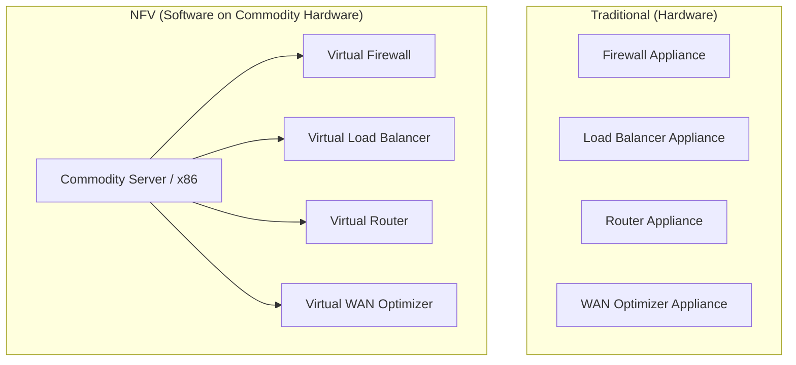
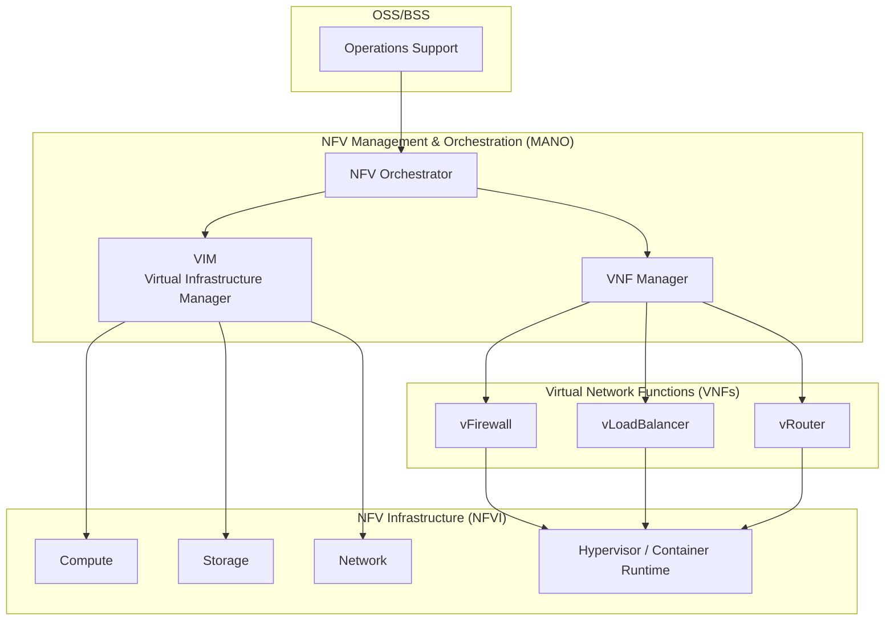
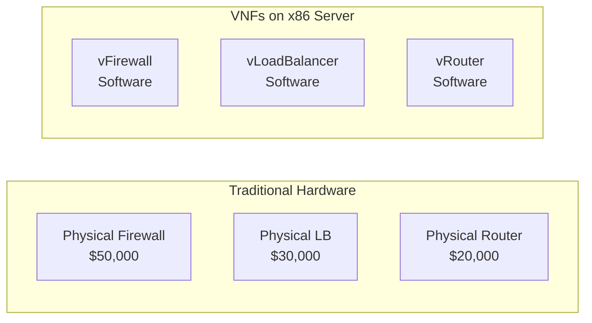
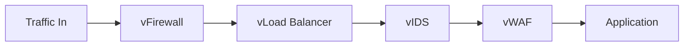
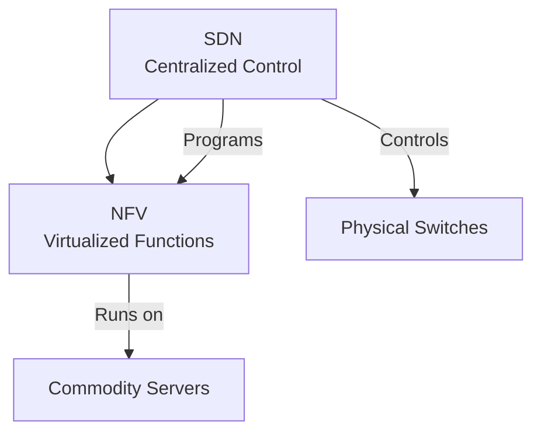
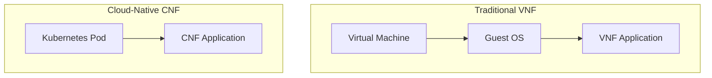

# NFV — Network Function Virtualization

## Overview

NFV decouples network functions (firewalls, load balancers, routers) from dedicated hardware appliances, running them as software on commodity servers. This reduces costs, increases flexibility, and enables rapid service deployment.

## Traditional vs NFV Architecture

## NFV Architecture (ETSI Framework)

## NFV Components

| Component | Role | Examples |
|-----------|------|----------|
| **VNF** | Virtualized network function (the actual function) | vFirewall, vRouter, vEPC |
| **NFVI** | Infrastructure (compute, storage, network) | Servers, hypervisors, switches |
| **MANO** | Management and orchestration | NFVO, VNFM, VIM |
| **VIM** | Virtual infrastructure management | OpenStack, VMware vSphere, Kubernetes |
| **VNFM** | VNF lifecycle management | Deploy, scale, heal, terminate |
| **NFVO** | Orchestration of network services | Service chaining, resource orchestration |

## VNF (Virtual Network Function)

A VNF is a software implementation of a network function:

### Common VNFs

| VNF | Function | Examples |
|-----|----------|----------|
| **vFirewall** | Packet filtering, IPS | Palo Alto VM, Fortinet VM |
| **vLoadBalancer** | Traffic distribution | HAProxy, NGINX, F5 VM |
| **vRouter** | Routing | VyOS, Cisco CSR 1000v |
| **vEPC** | Mobile core | Open5GS, Athonet |
| **vCPE** | Customer premise | Virtual branch office |
| **vWAN** | WAN optimization | Riverbed SteelHead |

## Service Function Chaining (SFC)

NFV enables dynamic service chains — ordered sequences of VNFs:

**Traditional**: Traffic must pass through physical appliances in a fixed order.
**NFV**: Service chains are defined in software and can be changed dynamically.

## NFV vs SDN

| Aspect | NFV | SDN |
|--------|-----|-----|
| **Focus** | Virtualize network functions | Separate control/data plane |
| **Decouples** | Software from hardware | Control plane from data plane |
| **Runs on** | Commodity servers | Programmable switches |
| **Primary goal** | Reduce hardware costs | Centralized network control |
| **Relationship** | Complementary | Complementary |

## NFV Benefits

| Benefit | Description |
|---------|-------------|
| **Cost reduction** | Commodity hardware vs expensive appliances |
| **Rapid deployment** | Deploy VNFs in minutes, not weeks |
| **Scalability** | Scale VNFs horizontally on demand |
| **Vendor independence** | Mix and match VNFs from different vendors |
| **Innovation** | Faster development cycles (software vs hardware) |
| **Energy efficiency** | Consolidate multiple functions on fewer servers |

## NFV Challenges

| Challenge | Description |
|-----------|-------------|
| **Performance** | Software overhead vs dedicated hardware (especially for high throughput) |
| **Complexity** | MANO stack is complex to deploy and manage |
| **Interoperability** | VNFs from different vendors may not integrate well |
| **Security** | Shared infrastructure increases attack surface |
| **Migration** | Moving from hardware to virtual is complex |

## Containerized Network Functions (CNF)

Modern NFV is moving from VMs to containers:

| Aspect | VNF (VM-based) | CNF (Container-based) |
|--------|---------------|----------------------|
| **Startup** | Minutes | Seconds |
| **Size** | GBs | MBs |
| **Overhead** | Full OS per VNF | Shared kernel |
| **Scaling** | VM scaling | Pod autoscaling |
| **Platform** | OpenStack, VMware | Kubernetes |

## Interview Questions

1. **Q: What is NFV?**
   A: Network Function Virtualization runs network functions (firewalls, load balancers, routers) as software on commodity hardware instead of dedicated appliances. Benefits: cost reduction, rapid deployment, scalability, vendor independence.

2. **Q: What is a VNF?**
   A: A Virtual Network Function — a software implementation of a network function running on NFVI. Examples: vFirewall, vLoadBalancer, vRouter. Multiple VNFs can run on the same server.

3. **Q: What's the difference between NFV and SDN?**
   A: NFV virtualizes network functions (runs them as software). SDN separates control and data planes (centralized control). They're complementary: SDN can control the network that NFV functions run on.

4. **Q: What is MANO in NFV?**
   A: Management and Orchestration — the ETSI framework for managing NFV. Components: NFVO (orchestration), VNFM (VNF lifecycle), VIM (infrastructure management). Handles deployment, scaling, healing, and termination of VNFs.

5. **Q: What is service function chaining?**
   A: An ordered sequence of network functions that traffic must traverse. Example: firewall → load balancer → WAF → application. NFV enables dynamic chaining in software, rather than fixed physical appliance order.

6. **Q: What are CNFs?**
   A: Containerized Network Functions — VNFs running in containers instead of VMs. They start faster (seconds vs minutes), use less resources, and integrate with Kubernetes for orchestration. The evolution of NFV toward cloud-native.

## Common Mistakes

- Confusing NFV (virtualize functions) with SDN (separate control/data plane)
- Assuming NFV means no hardware (you still need servers)
- Not understanding the MANO framework
- Forgetting that VNFs can have performance overhead vs dedicated hardware
- Not considering that containerized NFVs (CNFs) are the modern approach

## Summary

NFV virtualizes network functions, running them as software on commodity hardware. The ETSI MANO framework manages VNFs. Service function chaining enables dynamic traffic paths. CNFs (containerized) are the modern evolution. NFV and SDN are complementary technologies.

## Cross-References

- [Wireless Overview](README.md)
- [SDN](sdn.md) — Complementary technology
- [5G](5g.md) — 5G core uses NFV
- [Firewalls](../security/firewalls.md) — vFirewall example
- [Load Balancing](../load-balancing/README.md) — vLoadBalancer example

## Cross References

- [SDN](sdn.md)
- [Cloud Virtualization](../../cloud/virtualization/README.md)
- [Distributed Microservices](../../distributed/microservices/README.md)
