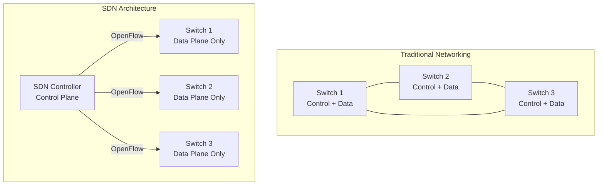
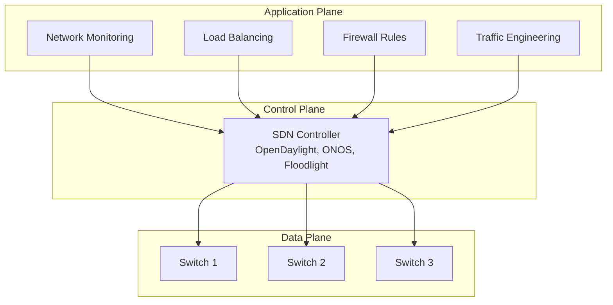
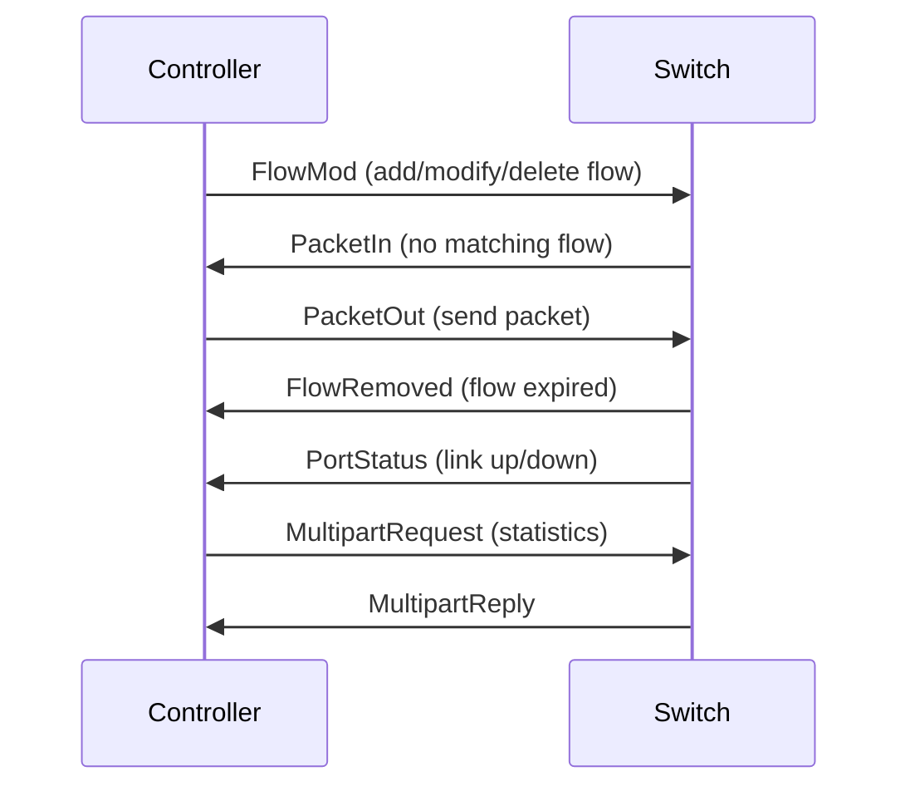
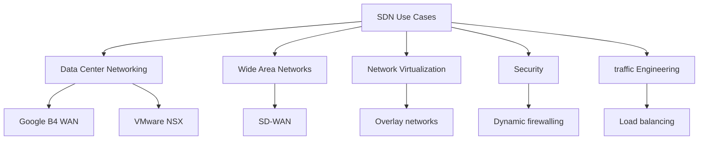
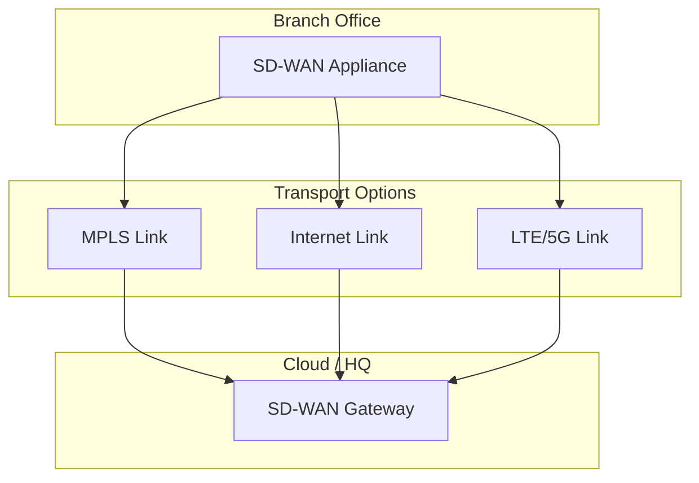

# SDN — Software-Defined Networking

## Overview

SDN is a network architecture that **separates the control plane** (routing decisions) **from the data plane** (packet forwarding). A centralized controller programs network devices, enabling dynamic, manageable, and cost-effective networks.

## Traditional vs SDN Architecture



## SDN Layers



| Layer | Function | Examples |
|-------|----------|----------|
| **Application** | Network services and policies | Load balancers, firewalls, monitoring |
| **Control** | Centralized network brain | OpenDaylight, ONOS, Floodlight |
| **Data** | Packet forwarding | OpenFlow switches, white-box switches |

## OpenFlow Protocol

OpenFlow is the standard SDN protocol between controller and switches:

### Flow Table Entry

| Field | Description |
|-------|-------------|
| **Match** | Header fields to match (IP, port, MAC, etc.) |
| **Actions** | What to do with matched packets (forward, drop, modify) |
| **Priority** | Rule precedence |
| **Counters** | Packet/byte counters |
| **Timeouts** | Idle/hard timeout for rule expiration |

### OpenFlow Messages



### Example Flow Rules

```
# Forward HTTP traffic to web server
Match: IP dst=10.0.0.1, TCP dst_port=80
Action: output:port3

# Drop SSH from external
Match: IP src=203.0.113.0/24, TCP dst_port=22
Action: drop

# Default rule (send to controller)
Match: *
Action: send_to_controller
```

## SDN Controllers

| Controller | Language | Features |
|-----------|----------|----------|
| **OpenDaylight** | Java | Modular, production-grade, multi-protocol |
| **ONOS** | Java | Distributed, carrier-grade, high availability |
| **Floodlight** | Java | Lightweight, OpenFlow-focused |
| **Ryu** | Python | Simple, good for learning |
| **P4Runtime** | - | P4-programmable data planes |

## SDN Benefits

| Benefit | Description |
|---------|-------------|
| **Centralized management** | Single point of control for entire network |
| **Programmability** | APIs for automation and custom applications |
| **Vendor independence** | White-box switches, open protocols |
| **Rapid innovation** | New features via software, not hardware |
| **Cost reduction** | Commodity hardware, centralized management |
| **Dynamic configuration** | Real-time policy changes |

## SDN Use Cases



## SD-WAN

SD-WAN applies SDN principles to WAN connections:



**Benefits**: Application-aware routing, cost savings (use internet instead of MPLS), centralized management, automatic failover.

## Interview Questions

1. **Q: What is SDN and why is it important?**
   A: SDN separates the control plane (routing decisions) from the data plane (packet forwarding). A centralized controller programs network devices. Benefits: centralized management, programmability, vendor independence, and rapid innovation.

2. **Q: What is OpenFlow?**
   A: The standard SDN protocol between controller and switches. It defines how the controller installs flow rules (match + action) in switches. When a packet doesn't match any rule, it's sent to the controller (PacketIn).

3. **Q: What's the difference between traditional and SDN networking?**
   A: Traditional: each device has its own control plane (distributed). SDN: centralized control plane manages all devices. Traditional requires CLI/SNMP per device. SDN uses APIs for programmatic control.

4. **Q: What is SD-WAN?**
   A: SD-WAN applies SDN to WAN connections. It aggregates multiple transport links (MPLS, internet, LTE) and routes traffic based on application requirements. Benefits: cost savings, application-aware routing, centralized management.

5. **Q: What are the challenges of SDN?**
   A: 1) Single point of failure (controller), 2) Scalability (controller must handle all decisions), 3) Security (controller is a high-value target), 4) Latency (controller-switch communication), 5) Vendor lock-in (despite open standards).

## Common Mistakes

- Confusing SDN (architecture) with OpenFlow (protocol)
- Assuming SDN eliminates all hardware (data plane still needs switches)
- Not understanding that SDN controller is a single point of failure
- Forgetting that SDN requires well-defined APIs between layers
- Confusing SDN with NFV (complementary but different)

## Summary

SDN separates control and data planes, enabling centralized, programmable network management. OpenFlow is the standard protocol. SD-WAN applies SDN to WAN. Benefits include programmability, vendor independence, and dynamic configuration.

## Cross-References

- [Wireless Overview](README.md)
- [NFV](nfv.md) — Complementary technology
- [5G](5g.md) — 5G uses SDN principles
- [Load Balancing](../load-balancing/README.md) — SDN use case

## Cross References

- [NFV](nfv.md)
- [Load Balancing](../load-balancing/README.md)
- [Cloud Virtualization](../../cloud/virtualization/README.md)
