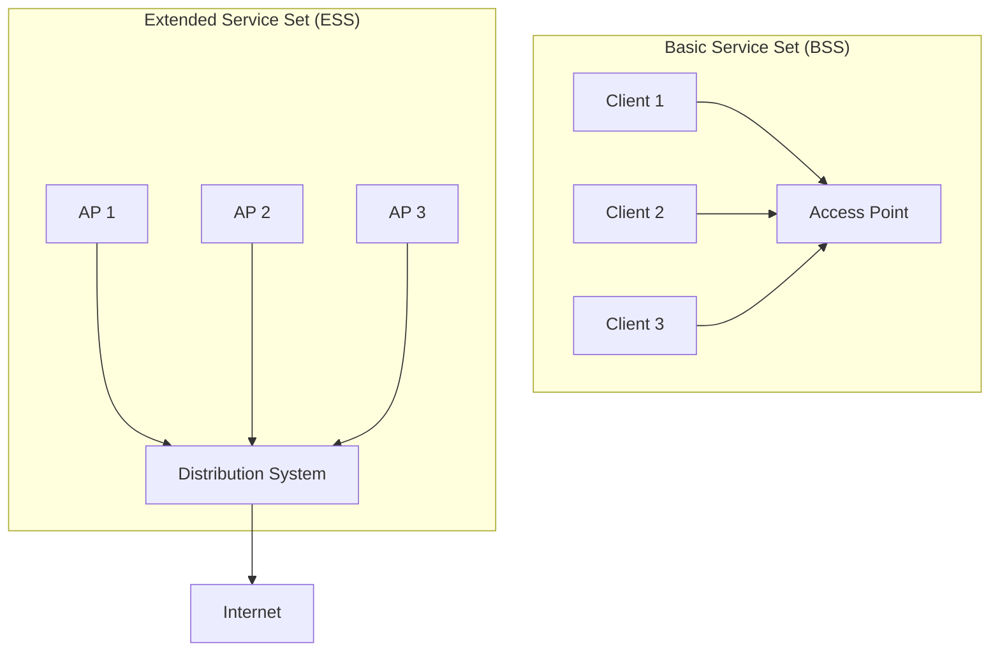
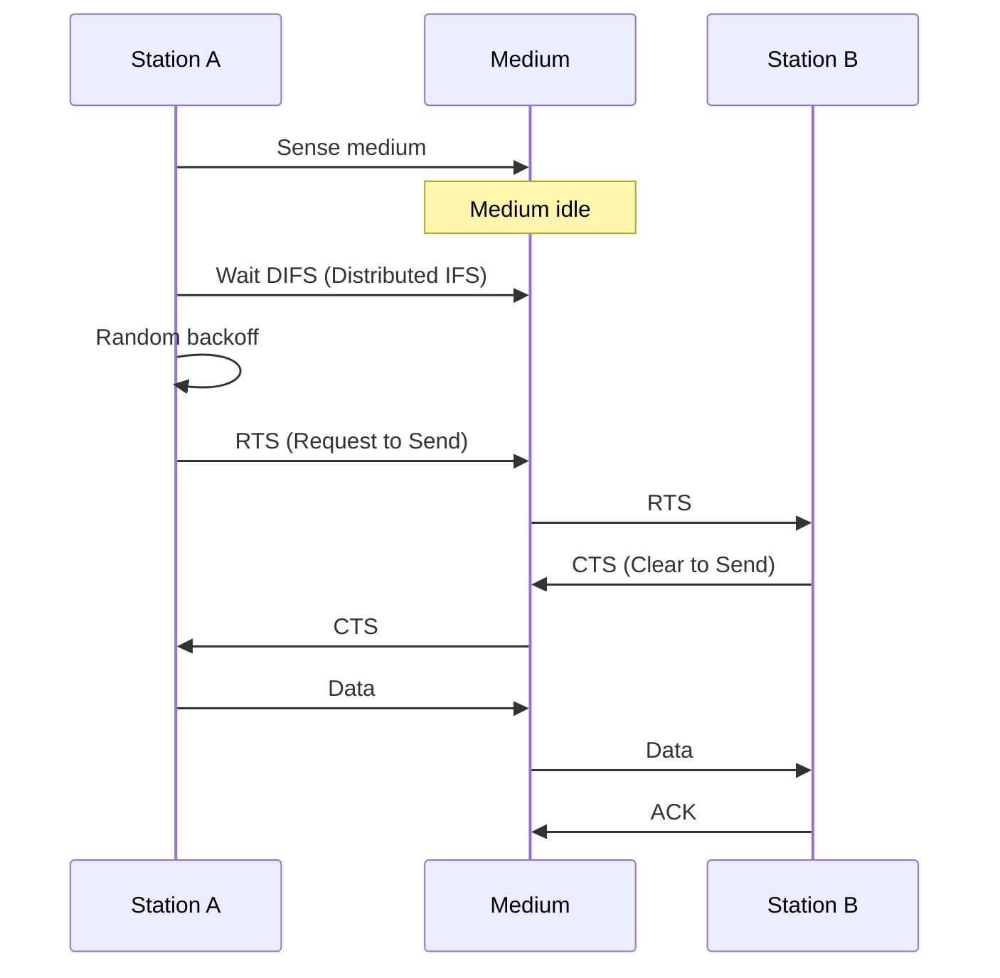
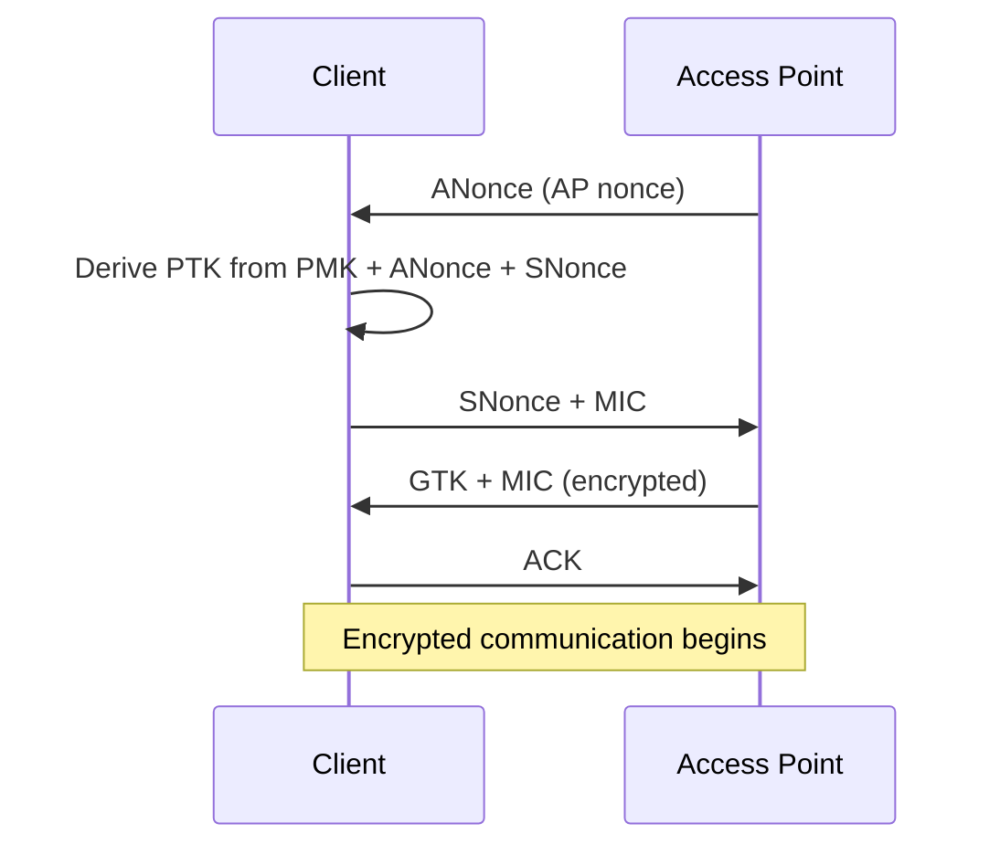

# WiFi (IEEE 802.11)

## Overview

WiFi is a family of wireless network protocols based on the IEEE 802.11 standard. It's the most common wireless LAN technology, used in homes, offices, and public hotspots.

## WiFi Standards

| Standard | Name | Year | Max Speed | Frequency | Key Feature |
|----------|------|------|-----------|-----------|-------------|
| **802.11b** | WiFi 1 | 1999 | 11 Mbps | 2.4 GHz | First popular WiFi |
| **802.11a** | WiFi 2 | 1999 | 54 Mbps | 5 GHz | OFDM |
| **802.11g** | WiFi 3 | 2003 | 54 Mbps | 2.4 GHz | Backward compatible with b |
| **802.11n** | WiFi 4 | 2009 | 600 Mbps | 2.4/5 GHz | MIMO |
| **802.11ac** | WiFi 5 | 2013 | 6.9 Gbps | 5 GHz | MU-MIMO, beamforming |
| **802.11ax** | WiFi 6 | 2019 | 9.6 Gbps | 2.4/5 GHz | OFDMA, BSS coloring |
| **802.11ax** | WiFi 6E | 2021 | 9.6 Gbps | 6 GHz | 6 GHz band |
| **802.11be** | WiFi 7 | 2024 | 46 Gbps | 2.4/5/6 GHz | MLO, 320 MHz channels |

## WiFi Architecture



## CSMA/CA (Collision Avoidance)

WiFi uses CSMA/CA instead of CSMA/CD (Ethernet) because wireless stations can't detect collisions:



### Why Collision Avoidance?

- **Hidden terminal problem**: A and C can't hear each other but both reach B
- **Exposed terminal problem**: B can hear A but C's transmission to D wouldn't interfere
- **RTS/CTS** solves hidden terminal by reserving the medium

## WiFi Security

| Protocol | Year | Encryption | Status |
|----------|------|------------|--------|
| **WEP** | 1999 | RC4 (broken) | Insecure, never use |
| **WPA** | 2003 | TKIP (RC4-based) | Deprecated |
| **WPA2** | 2004 | AES-CCMP | Current minimum |
| **WPA3** | 2018 | SAE, 192-bit | Recommended |

### WPA2 4-Way Handshake



## WiFi Channel Allocation

### 2.4 GHz (3 non-overlapping channels)

```
Channel: 1  2  3  4  5  6  7  8  9  10 11
         [====1====]
                   [====6====]
                              [====11====]
```

**Best practice**: Use channels 1, 6, or 11 only.

### 5 GHz (24+ non-overlapping channels)

Much more spectrum available, reducing interference significantly.

## Interview Questions

1. **Q: What's the difference between WiFi 5 and WiFi 6?**
   A: WiFi 6 adds: OFDMA (multiple users per channel), BSS coloring (reduces interference), TWT (Target Wake Time for IoT battery life), 1024-QAM (higher data rates), and better performance in dense environments.

2. **Q: What is CSMA/CA and why not CSMA/CD?**
   A: CSMA/CA (Collision Avoidance) is used because wireless stations can't detect collisions (can't send and listen simultaneously on the same frequency). CSMA/CD (Collision Detection) works on wired Ethernet where collisions are detectable.

3. **Q: What is the hidden terminal problem?**
   A: Two stations can't hear each other but both can reach a third station. They may transmit simultaneously, causing a collision at the third station. Solved by RTS/CTS: the access point reserves the medium.

4. **Q: Why is WEP insecure?**
   A: WEP uses RC4 with a 24-bit IV (too small, causing reuse). The key can be cracked in minutes with tools like Aircrack-ng. WPA2 (AES-CCMP) is the minimum secure standard.

5. **Q: What is MIMO?**
   A: Multiple-Input Multiple-Output uses multiple antennas at both transmitter and receiver to increase throughput and reliability. MU-MIMO (WiFi 5+) allows serving multiple clients simultaneously.

6. **Q: What is OFDMA in WiFi 6?**
   A: Orthogonal Frequency Division Multiple Access divides a channel into smaller sub-channels (Resource Units). Multiple users can transmit simultaneously on different sub-channels, improving efficiency in dense environments.

## Common Mistakes

- Using 2.4 GHz channel other than 1, 6, or 11 (causes interference)
- Using WEP or WPA (insecure)
- Not knowing that WiFi speed degrades with distance and obstacles
- Confusing bandwidth (Hz) with data rate (Mbps)
- Forgetting that WiFi is half-duplex (one transmission at a time per channel)

## Summary

WiFi has evolved from 11 Mbps (802.11b) to 46 Gbps (WiFi 7). Key concepts: CSMA/CA, MIMO, OFDMA, channel planning, and WPA3 security. WiFi 6/6E brings OFDMA and 6 GHz spectrum for better performance in dense environments.

## Cross-References

- [Wireless Overview](README.md)
- [5G](5g.md) — Cellular alternative
- [SDN](sdn.md) — Software-defined networking
- [TLS](../security/tls.md) — Application-layer security
