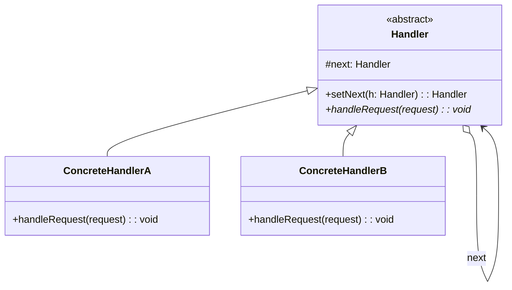

# Chain of Responsibility Pattern

## Intent

Avoid coupling the sender of a request to its receiver by giving more than one object a chance to handle the request. Chain the receiving objects and pass the request along the chain until an object handles it.

## Structure



## Implementation

```python
from abc import ABC, abstractmethod

class Handler(ABC):
    def __init__(self):
        self._next = None

    def set_next(self, handler):
        self._next = handler
        return handler  # enable chaining

    def handle(self, request):
        result = self._handle(request)
        if result is None and self._next:
            result = self._next.handle(request)
        return result

    @abstractmethod
    def _handle(self, request):
        pass

class AuthHandler(Handler):
    def _handle(self, request):
        if not request.get('token'):
            return 'Authentication failed'
        return None  # pass to next

class RateLimitHandler(Handler):
    def _handle(self, request):
        if self._is_rate_limited(request['ip']):
            return 'Rate limit exceeded'
        return None

    def _is_rate_limited(self, ip):
        return False  # simplified

class LoggingHandler(Handler):
    def _handle(self, request):
        print(f'Processing: {request}')
        return None  # always pass through

# Usage
auth = AuthHandler()
rate_limit = RateLimitHandler()
logging = LoggingHandler()

auth.set_next(rate_limit).set_next(logging)
auth.handle({'token': 'abc', 'ip': '1.2.3.4'})
```

## Chain of Responsibility vs Observer

| Aspect | Chain of Responsibility | Observer |
|--------|------------------------|----------|
| Intent | Handle a request along a chain | Notify multiple listeners of an event |
| Flow | Sequential, one handler acts | Broadcast, all observers react |
| Termination | Stops when handled | All observers notified |
| Coupling | Handler knows only next link | Subject knows only observer interface |

## Real-World Examples

- **Express.js middleware**: `app.use(auth, rateLimit, handler)` — each middleware calls `next()` or sends a response.
- **Servlet filters**: Java EE filter chains process HTTP requests.
- **Exception handling**: Catches cascade through call stack frames.
- **Approval workflows**: Manager → Director → VP → CEO.

## Interview Questions

**Q: When would you use Chain of Responsibility over a simple if-else chain?**
A: When handlers are independently selectable, orderable, or composable at runtime. Middleware stacks, plugin pipelines, and approval workflows benefit from loose coupling between sender and handler.

**Q: What are the downsides of this pattern?**
A: Requests may go unhandled if no handler catches them (silent failures). Debugging is harder because the chain is implicit. Performance suffers for very long chains. Use a default handler at the end to guarantee handling.

## References

- [Design Patterns — GoF](https://www.pearson.com/en-us/subject-catalog/p/design-patterns-elements-of-reusable-object-oriented-software/P200000003270)
- See also: [SOLID Deep Dive](./solid-deep-dive.md), [Creational Patterns](./design-patterns-creational.md), [Structural & Behavioral Patterns](./design-patterns-structural-behavioral.md)