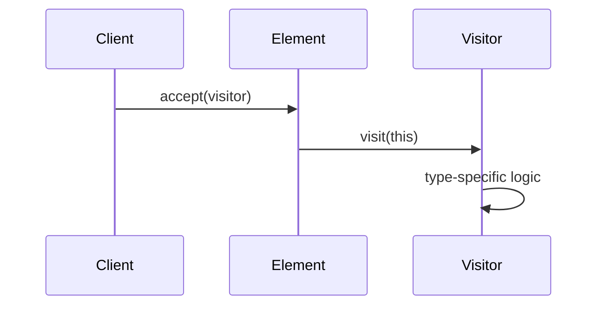

# Visitor Pattern

## Intent

Represent an operation to be performed on elements of an object structure. Visitor lets you define a new operation without changing the classes of the elements.

## Double Dispatch

Single dispatch selects a method based on the runtime type of **one** object (the receiver). Double dispatch selects based on the runtime types of **two** objects (the receiver and the argument).

In languages without multiple dispatch, visitor simulates it: `element.accept(visitor)` calls `visitor.visit(element)`, resolving both types.



## Implementation

```python
from abc import ABC, abstractmethod

class ShapeVisitor(ABC):
    @abstractmethod
    def visit_circle(self, circle): pass
    @abstractmethod
    def visit_rectangle(self, rectangle): pass

class Shape(ABC):
    @abstractmethod
    def accept(self, visitor: ShapeVisitor): pass

class Circle(Shape):
    def __init__(self, radius):
        self.radius = radius
    def accept(self, visitor):
        visitor.visit_circle(self)

class Rectangle(Shape):
    def __init__(self, w, h):
        self.w, self.h = w, h
    def accept(self, visitor):
        visitor.visit_rectangle(self)

class AreaCalculator(ShapeVisitor):
    def visit_circle(self, circle):
        return 3.14159 * circle.radius ** 2
    def visit_rectangle(self, rect):
        return rect.w * rect.h

class JSONExporter(ShapeVisitor):
    def visit_circle(self, circle):
        return f'{{"type": "circle", "radius": {circle.radius}}}'
    def visit_rectangle(self, rect):
        return f'{{"type": "rect", "w": {rect.w}, "h": {rect.h}}}'

shapes = [Circle(5), Rectangle(3, 4)]
for s in shapes:
    print(s.accept(AreaCalculator()))    # 78.54, 12
    print(s.accept(JSONExporter()))      # JSON strings
```

## Use Cases

| Domain | Visitor Operation |
|--------|-------------------|
| Compilers | Code generation, type checking, optimization passes |
| Document models | Export to HTML, PDF, plain text from same AST |
| Abstract syntax trees | Linting, formatting, refactoring |
| File systems | Search, size calculation, permissions audit |

## Trade-offs

| Pro | Con |
|-----|-----|
| Add operations without changing elements | Adding new element types requires updating all visitors |
| Groups related operations in one class | Breaks encapsulation (visitor accesses element internals) |
| Clean separation of concerns | Overkill for small, stable object structures |

## Interview Questions

**Q: Why does the visitor pattern need double dispatch?**
A: A single `process(shape)` call only dispatches on the shape's type. With visitor, `shape.accept(visitor)` dispatches on shape's type, then `visitor.visit(shape)` dispatches on the visitor's type — giving you the correct method for both the concrete element and the concrete operation.

**Q: When should you NOT use visitor?**
A: When the element hierarchy changes frequently (every change requires updating all visitors), when the object structure is small and stable, or when elements are simple enough that a method per operation is cleaner.

## References

- [Design Patterns — GoF](https://www.pearson.com/en-us/subject-catalog/p/design-patterns-elements-of-reusable-object-oriented-software/P200000003270)
- See also: [SOLID Deep Dive](./solid-deep-dive.md), [Chain of Responsibility](./chain-of-responsibility.md), [Structural & Behavioral Patterns](./design-patterns-structural-behavioral.md)
