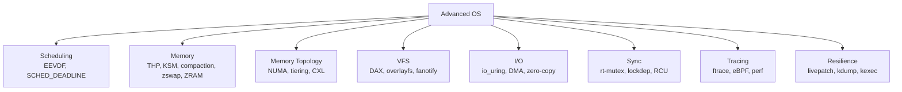
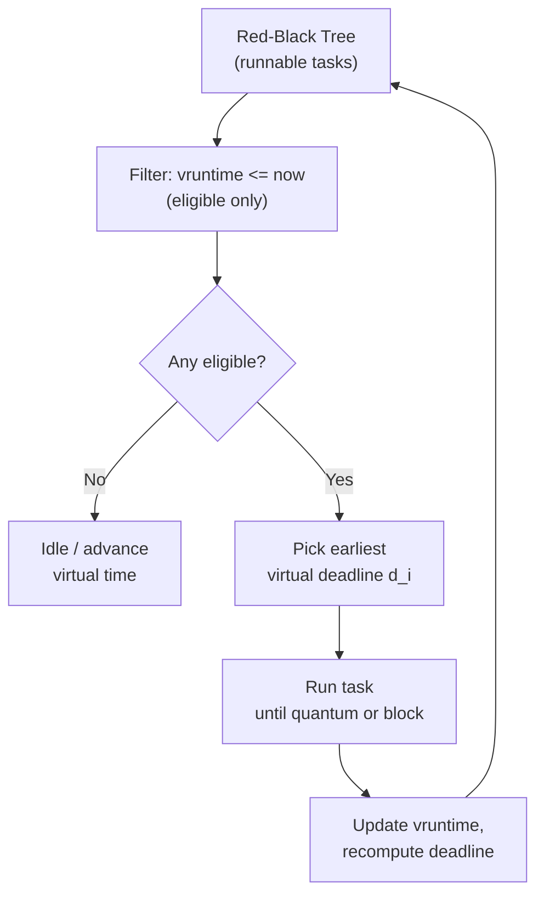
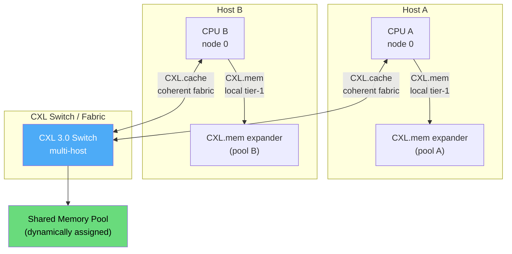
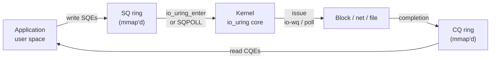

# Operating Systems — Advanced

## Overview

This page is the **section-level integrator** for index.md §48 ("Operating Systems — Advanced"). The earlier OS chapters build the foundations: [CFS scheduling](./scheduling/linux-cfs.md), [virtual memory](./virtual-memory/README.md), [page tables](./memory/page-tables.md), [VFS](./filesystems/vfs.md), [synchronization primitives](./synchronization/README.md). Here we cross into **production kernel engineering**: scheduling theory driving 6.6+ kernels, memory disaggregation across CXL fabrics, async I/O rings, lock validators, RCU, observability tooling, and crash-dump forensics.

The target reader has finished the introductory chapters and now wants to: discuss *why* EEVDF replaced CFS and what it changes for latency; reason about NUMA distance matrices and CXL memory tiers; choose between `io_uring`, `sendfile`, `splice`, and DPDK for a high-IOPS service; explain how `lockdep`, `RCU`, and `ftrace` cooperate to keep a multi-million-line kernel correct; and walk an interviewer through a `kdump`-style post-mortem.

> **Interview one-liner:** "Advanced OS is the layer where scheduling theory, memory hierarchy physics, and observability meet — fairness becomes EEVDF, locality becomes NUMA/CXL, throughput becomes `io_uring`+zero-copy, correctness becomes lockdep+RCU, and survivability becomes livepatching+kdump."

### Top-Level Map



---

## 1. Advanced Scheduling

### 1.1 EEVDF — Earliest Eligible Virtual Deadline First

EEVDF replaced CFS as Linux's default fair scheduler in **Linux 6.6 (2023)**, after sixteen years of CFS. The change was driven by Peter Zijlstra and based on the algorithm published by Stoica & Abdel-Wahab (1995). EEVDF keeps CFS's red-black tree of runnables sorted by virtual runtime (`vruntime`), but adds two principled ideas CFS only approximated heuristically:

1. **Eligibility** — a task may run only when its `vruntime` is at or below the system's virtual time. A task that has already consumed more than its fair share is *ineligible* until virtual time catches up.
2. **Virtual deadline** — each runnable gets a virtual deadline \\( d_i = a_i + r_i \\), where \\( a_i \\) is the arrival (eligible) time and \\( r_i \\) is the request size (inversely proportional to weight). The scheduler picks the *eligible* task with the *earliest deadline*.

This combination gives EEVDF provable fairness (like CFS) **and** bounded latency (which CFS only achieved via `sched_min_granularity_ns` and wakeup heuristics that were easy to game). See the [EEVDF deep dive](../linux/kernel/processes/eevdf.md) for the full derivation.



### 1.2 SCHED_DEADLINE — Earliest Deadline First with CBS

Above the fair scheduler sits **SCHED_DEADLINE**, an implementation of the Earliest Deadline First (EDF) algorithm with the Constant Bandwidth Server (CBS) to isolate tasks. The user supplies three parameters via `sched_setattr(2)`:

- `sched_runtime` — guaranteed CPU time within each period,
- `sched_deadline` — relative deadline (often == period),
- `sched_period` — the reservation period.

The CBS admission test (utilization) must hold across the system:

\\[ \sum_{i} \frac{\text{runtime}_i}{\text{deadline}_i} \le 1 \\]

per CPU (with `DL_CAPACITY` accounting on SMP). SCHED_DEADLINE strictly dominates SCHED_FIFO/RR for real-time workloads: it gives *temporal isolation* between tasks, which fixed-priority RT cannot.

### 1.3 Scheduler Comparison

| Property | CFS (≤ 6.5) | EEVDF (≥ 6.6) | SCHED_DEADLINE |
|---|---|---|---|
| Data structure | Red-black tree (vruntime) | Red-black tree (vruntime + deadline) | Red-black tree (absolute deadline) |
| Fairness | Proportional (vruntime) | Proportional + eligibility test | Bandwidth-reservation (CBS) |
| Latency bound | Heuristic (`sched_latency_ns`) | Provable via virtual deadline | Hard (deadline = period) |
| Preemption | Wakeup heuristics | Eligibility + deadline comparison | Strict EDF |
| Priority knob | nice −20..+19 | nice −20..+19 | runtime/deadline/period tuple |
| Use case | General purpose | General purpose + better latency | Real-time audio/controls, robotics |

`SCHED_EXT` (`sched_ext`, since 6.12) lets you load a BPF scheduler for experimentation — see the [sched-ext guide](../linux/kernel/processes/sched-ext-guide.md).

---

## 2. Advanced Memory Management

### 2.1 Transparent Huge Pages (THP)

Modern CPUs support huge pages (2 MiB on x86-64, 1 GiB if available). Huge pages slash TLB misses for large working sets: one TLB entry maps 2 MiB instead of 4 KiB — a 512× reduction in TLB pressure for memory-sweeper workloads (databases, JVMs, ML inference).

THP lets the kernel collapse 512 base pages into a single huge page **transparently**, without application changes. The khugepaged daemon scans anonymous memory and collapses candidate ranges. The sysfs knob:

```bash
echo always  > /sys/kernel/mm/transparent_hugepage/enabled   # default
echo madvise > /sys/kernel/mm/transparent_hugepage/enabled   # opt-in via madvise(MADV_HUGEPAGE)
echo never   > /sys/kernel/mm/transparent_hugepage/enabled
```

THP tradeoffs: (a) higher memory waste (2 MiB even for 4 KiB used), (b) page-fault latency spikes, (c) **internal fragmentation** for sparse workloads, (d) compaction stalls under pressure. Latency-sensitive services (databases, redis) usually set `madvise` and explicitly tag the buffer pool. See [Huge Pages](./memory/huge-pages.md).

### 2.2 KSM — Kernel Same-Page Merging

KSM scans memory marked `madvise(MADV_MERGEABLE)` for content-identical pages and merges them into one copy-on-write page. Originally aimed at KVM (multiple VMs share libraries and zero pages), it also deduplicates container image content.

- **Savings**: 10–50% for VM hosts; significant for container density.
- **Cost**: ksmd CPU (1–5% typical), plus a subtle **side-channel risk** — page deduplication is detectable by timing the COW fault, so KSM is often disabled on multi-tenant clouds.
- **Tuning**: `/sys/kernel/mm/ksm/{pages_to_scan, sleep_millisecs, run}`. Deep dive: [KSM](../linux/kernel/memory/ksm.md).

### 2.3 Memory Compaction

`/proc/buddyinfo` shows the buddy allocator's free lists per order. When high-order allocations (huge pages, kernel stacks, contig DMA buffers) fail despite enough total free memory, the system is **fragmented**. The `kcompactd` daemon runs `__compaction_alloc` to migrate pages and create contiguous free blocks of order ≥ 9 (2 MiB). Stats live in `/proc/vmstat`:

```
compact_migrate_scanned  compact_free_scanned
compact_stall            compact_fail
compact_success           pgmigrate_success
```

A `compact_stall` spike under load usually means THP allocation is stalling — switch to `madvise` mode or pre-reserve huge pages.

### 2.4 ZRAM and zswap — Compressing Cold Memory

When RAM is scarce, both **zswap** and **ZRAM** compress cold pages rather than writing them to swap disk. The two systems overlap in goal but differ in architecture.

| Aspect | kswapd (plain swap) | zswap | ZRAM |
|---|---|---|---|
| Where pages go | Swap device (disk/NVMe) | Compressed pool **in RAM**, then evicted to swap on pressure | Compressed block device **in RAM** |
| Compression | None | LZ4 / zstd / lzo | lzo / zstd / lz4 |
| Backing store | Required | Optional (real swap as backing) | None (RAM-only) |
| Eviction policy | LRU-ish on swap | LRU per-pool; cold pages go to swap | None — fixed-size device |
| Config | `vm.swappiness` | `CONFIG_ZSWAP`, `zswap.compressor=zstd` | `modprobe zram`, `zramctl` |
| Best for | Desktops with swap partition | Servers with mixed hot/cold memory | Embedded / IoT / containers, no swap |

```bash
# zswap: enable, set zstd, cap pool at 20% of RAM
echo zstd > /sys/module/zswap/parameters/compressor
echo 20   > /sys/module/zswap/parameters/max_pool_percent
echo Y    > /sys/module/zswap/parameters/enabled

# ZRAM: 4 GB compressed block device backed by zstd
modprobe zram num_devices=1
echo zstd > /sys/block/zram0/comp_algorithm
echo 4G   > /sys/block/zram0/disksize
mkswap /dev/zram0 && swapon -p 100 /dev/zram0
```

Decompression latency (µs for zstd) is dwarfed by NVMe latency (tens of µs), so compressing in RAM is almost always a net win under memory pressure.

---

## 3. NUMA, Memory Tiering, and CXL

### 3.1 NUMA Recap and Balancing

On a multi-socket system, each CPU socket has local DRAM (~100 ns) and remote DRAM (~150–300 ns). The Linux NUMA layer (covered in [NUMA](./memory/numa.md)) maintains:

- **SLIT** (System Locality Information Table) — relative distance matrix exposed via `/sys/devices/system/node/nodeN/distance`.
- **HMAT** (Heterogeneous Memory Attribute Table) — bandwidth/latency attributes per memory target, used by the tiering code.

**Automatic NUMA balancing** (`/proc/sys/kernel/numa_balancing`) samples PTE access bits, unmaps hot remote pages to trigger faults, and migrates them to the accessing CPU's local node. The trade-off is page-migration cost vs long-run locality; for tightly bound workloads (databases, ML training) manual `numactl --cpunodebind --membind` is still preferable.

### 3.2 Memory Tiering

With CXL, a system may have **multiple memory tiers** per node:

- Tier 0 — local DRAM (fastest, ~100 ns)
- Tier 1 — CXL-attached DRAM (~170–250 ns, higher bandwidth)
- Tier 2 — CXL-attached PMem or volatile-NVDIMM (~300–500 ns)

The kernel's **memory tiering** subsystem (`mm/memory-tiers.c`, since 6.0) classifies NUMA nodes into tiers by `HMAT_ADVISORY` performance, and `damon` (Data Access MONitor) tracks hot/cold pages. Cold pages are demoted Tier 0 → Tier 1; hot pages promoted back. The kswapd-style demotion only triggers when Tier 0 is under pressure, while `DAMOS` ("DAMON-based Operation Scheme") can do proactive demotion. See [DAMON](../linux/kernel/memory/damon.md).

### 3.3 CXL — Compute Express Link

CXL is a cache-coherent interconnect built on PCIe 5.0/6.0 physical layer, standardized by the CXL Consortium (Intel, Google, Microsoft, Meta, et al.). It enables three device types — Type 1 (cache-only accelerator), Type 2 (cache + local memory, e.g. GPU+HBM), and Type 3 (memory expander). CXL 2.0 (2022) added memory *pooling*: a fabric-attached memory device can be assigned to one host, hot-removed, and reassigned to another.



Linux exposes CXL memory via **memory hotplug**: each CXL Type-3 device becomes a NUMA node with its own distance value, so existing NUMA tooling (numactl, mbind, numad) works unchanged. Key sysfs paths:

```
/sys/bus/cxl/devices/
/sys/bus/cxl/drivers/cxl_mem/
/sys/devices/system/node/nodeN/  ← CXL memory shows up here as a NUMA node
```

Hotness tracking: `DAMOS` for userspace, plus the in-kernel `MIGRATE_DEMOTE` path. The CXL spec is published by the CXL Consortium (3.1, Nov 2023); kernel docs live at `Documentation/cxl/`.

---

## 4. Advanced VFS

### 4.1 DAX — Direct Access

For persistent-memory file systems (ext4/XFS with `-o dax`), DAX bypasses the page cache: `mmap` returns a mapping directly to NVDIMM media, and `read`/`write` are CPU loads/stores. This gives microsecond-scale I/O latency and zero-copy semantics for byte-addressable storage. The cost is that write ordering is exposed via `msync`/`fsync` + CLWB, so filesystems and applications must handle atomicity explicitly.

### 4.2 overlayfs — Union Mount

Containers (Docker, Podman, Kubernetes) layer file system views: a thin writable upper layer over read-only lower image layers. overlayfs implements this union in the kernel since 3.18. On `write`, it copies the file up from lower to upper (copy-up). Gotchas: first write to a large file is a full copy-up (bad for databases); `redirect_dir` and `metacopy` reduce copy-up overhead for metadata-heavy workloads; ovl is now the default storage driver for most container runtimes.

### 4.3 fanotify — Global File Event Notification

`inotify` watches a path per fd, which doesn't scale to whole-system monitoring (antivirus, IDS, audit). **fanotify** (since 2.6.31, expanded in 5.x) lets a privileged listener register for events on entire mount points or filesystems. The `FAN_CLASS_CONTENT` and `FAN_CLASS_PRE_CONTENT` classes can *block* opens (e.g., for malware scanning) — the kernel hands a permission decision fd to userspace, which replies allow/deny.

---

## 5. Advanced I/O

### 5.1 io_uring — Submission/Completion Rings

io_uring (since 5.1, the topic of the [io_uring page](./kernel/io-uring.md)) is Linux's modern async I/O interface. Two shared-memory rings — **SQ** (submission queue, app→kernel) and **CQ** (completion queue, kernel→app) — let the app batch many operations per `io_uring_enter(2)`. With `IORING_SETUP_SQPOLL`, a kernel thread busy-polls the SQ, removing the syscall from the data path entirely.



Critical performance features (cross-ref [io_uring](./kernel/io-uring.md)):

- **Registered buffers** (`IORING_REGISTER_BUFFERS`) — pin user pages once, skip `get_user_pages` per op.
- **Registered files** — pre-resolve fd → file, skip `fget`.
- **Multishot** — one SQE for many completions (e.g., `IORING_OP_ACCEPT` multishot replaces an accept loop).
- **Provided buffer ring** — kernel fills buffers from a per-CQE pool.

### 5.2 DMA — Direct Memory Access

DMA lets a device transfer data to/from RAM without CPU involvement. The kernel programs a DMA descriptor (bus address + length + direction) into the device, which then performs the transfer and raises an interrupt on completion. On systems with an IOMMU, `dma_map_*` returns a bus address that is *not* the physical address — the IOMMU translates. This enables device assignment to VMs (VFIO) and protects the kernel from malicious devices. See [DMA](./io/dma.md).

### 5.3 Zero-Copy — sendfile and splice

Copying data between kernel and user buffers wastes CPU and cache. Two syscalls eliminate copies:

- **`sendfile(out_fd, in_fd, offset, count)`** — copies data from one fd's page cache to another fd's socket buffer, entirely in the kernel. Used by nginx, Apache, static-file CDNs.
- **`splice(fd_in, off_in, fd_out, off_out, len, flags)`** — moves data between two fds via a kernel pipe buffer, no user-space copy. `tee()` duplicates data inside a pipe. `vmsplice()` maps user pages into a pipe without copying.

Zero-copy variants compared:

| I/O Model | Syscalls / op | Copies | True async for files | Use case |
|---|---|---|---|---|
| Blocking `read`/`write` | 2 | 2 (k↔u) | No | Simple apps, small data |
| `epoll` + non-blocking | 1–2 | 2 | No (files block) | Network servers |
| `sendfile` | 1 | 0 (kernel-only) | Yes (single op) | Static file → socket |
| `splice` + pipe | 2 | 0 (kernel-only) | Yes (single op) | Proxy / relay pipelines |
| `io_uring` | ~1/batch | 0 with fixed bufs | Yes | High-IOPS storage, databases |
| DPDK / SPDK | 0 (kernel bypass) | 0 | Yes | NIC/disk in user space |

Kernel bypass (DPDK for networking, SPDK for storage) goes further: the user-space driver maps the device BARs and rings the hardware queues directly. This wins on latency and IOPS but loses isolation, requires dedicated cores, and needs huge pages + VFIO. See [virtio](../linux/virtualization/virtio.md) for the guest-side story.

### 5.4 RDMA — Remote Direct Memory Access

RDMA lets one machine read/write another's RAM without involving either CPU. RoCEv2 (RDMA over Converged Ethernet) and InfiniBand underpin HPC, distributed training, and storage fabrics (NVMe-oF). Linux exposes RDMA via `libibverbs`; the kernel side lives in `drivers/infiniband/`.

---

## 6. Advanced Synchronization

### 6.1 Real-Time Mutexes (rt_mutex)

`struct mutex` in the mainline kernel is *not* strictly priority-inheritance aware. The **PREEMPT_RT** tree (merged into mainline in 6.12, after years as an out-of-tree patch) replaces sleeping mutexes with `rt_mutex` that implements **priority inheritance**: a low-priority owner holding a mutex needed by a high-priority waiter is temporarily boosted to the waiter's priority, preventing unbounded priority inversion (the classic Mars Pathfinder bug). On PREEMPT_RT, spinlocks become rt_mutexes under `CONFIG_PREEMPT_RT`.

### 6.2 lockdep — Runtime Lock Validator

`lockdep` (since 2.6.18) instruments every `mutex_lock`/`spin_lock` to build a graph of lock-acquisition orderings. If it ever detects a cycle (e.g., `A → B → C → A`), it reports a *potential* deadlock — even on a code path that would never trigger in production. It also tracks IRQ-safety annotations (`spin_lock_irqsave` vs `spin_lock`) and reports when a non-IRQ-safe lock is taken in an IRQ context. The cost: 5–15% slowdown, so it is normally only on in debug/CI builds.

```c
/* Lock classes — every instance shares one class */
DEFINE_MUTEX(my_lock);          /* single class */
/* Lockdep validates ordering across all instances of a class. */
```

Deep dive: [lockdep](../linux/kernel/sync/lockdep.md). Cross-ref to [deadlock detection](./synchronization/deadlocks/detection.md).

### 6.3 RCU — Read-Copy-Update

RCU provides **lock-free reads**: readers traverse a structure with `rcu_read_lock()` (essentially free — disables preemption), and writers publish a new version atomically and defer freeing the old version until every reader has exited (a "grace period"). RCU is the most pervasive synchronization primitive in the kernel — used by the scheduler, networking routing tables, dentries, and the syscall table. The full story is in [RCU](../linux/kernel/sync/rcu.md); the headline insight is:

> Writers do the expensive work (copy + wait-for-grace-period), readers pay nothing.

```c
/* Reader — no lock, no atomic */
rcu_read_lock();
p = rcu_dereference(gp);   /* load with smp_read_barrier_depends */
do_something(p);
rcu_read_unlock();

/* Writer */
new = make_copy(old);
rcu_assign_pointer(gp, new);   /* publish with release fence */
synchronize_rcu();             /* wait one grace period */
kfree(old);
```

### 6.4 Synchronization Comparison

| Primitive | Reader cost | Writer cost | Sleeping? | Bounded wait? | Use case |
|---|---|---|---|---|---|
| Spinlock | Atomic, spins | Atomic, spins | No | No (under contention) | Short, non-sleeping critical sections |
| Mutex | Atomic | Atomic + queue | Yes | Yes | Long, sleeping critical sections |
| rt_mutex | Atomic + PI | Atomic + PI + queue | Yes | Yes + priority inheritance | Real-time, PREEMPT_RT |
| RW spinlock | Atomic (multi-reader) | Atomic (exclusive) | No | No | Read-mostly, non-sleeping |
| Seqlock | Atomic (retry on seq) | Atomic + seq bump | No | No (readers may retry) | Stats counters, monotonic |
| RCU | Zero (preempt off) | Copy + grace period | Writer may sleep | No bound on grace period | Read-mostly, infrequent updates |

---

## 7. Tracing — ftrace, eBPF, perf

The kernel exposes multiple cooperating observability layers; their tradeoffs determine which to reach for in an interview or production incident.

```bash
# ftrace: trace every sched_switch for 5 seconds
echo nop        > /sys/kernel/tracing/current_tracer
echo 1          > /sys/kernel/tracing/events/sched/sched_switch/enable
sleep 5
cat /sys/kernel/tracing/trace | head -40
echo 0          > /sys/kernel/tracing/events/sched/sched_switch/enable
```

```bash
# perf: count cache misses for a binary
perf stat -e cache-misses,L1-dcache-load-misses ./my_app

# perf: CPU profile, folded call graphs
perf record -F 999 -g -- ./my_app
perf script | flamegraph.pl > out.svg

# bpftrace: one-liner — syscall counts by process
bpftrace -e 'tracepoint:raw_syscalls:sys_enter { @[comm] = count(); }'
```

### Tracing Tools Comparison

| Tool | Mechanism | Overhead | Aggregation | Use Case |
|---|---|---|---|---|
| **ftrace** | In-kernel tracepoints, function tracer | Low–medium (10s of ns) | Kernel ring buffer (text) | Quick "what's happening" diagnosis, function-graph timing |
| **perf** | Hardware counters + tracepoints + kprobes | Very low (counter mode) | Per-event sample, post-processed | CPU profiling, cache-miss analysis, flamegraphs |
| **eBPF** (bcc/bpftrace/libbpf) | Verifier-checked bytecode on kprobes/tracepoints/USDT | Low; aggregation in kernel | Maps, histograms, custom | Latency SLO histograms, custom policy, security observability |
| **LTTng** | Static tracepoints, ring buffer | Low | Per-event, CTF format | System-wide correlation across user/kernel |
| **SystemTap** | Scripted probes, kernel module | Medium | Custom | Older alternative to eBPF, mostly RHEL |

Deep dives: [ftrace/kprobes](./kernel/tracing.md), [eBPF](./kernel/ebpf.md), [Kernel Modules](./kernel/modules.md).

---

## 8. Kernel Livepatching

When a critical CVE drops, rebooting every host in a fleet is expensive. **Kernel livepatching** patches a single function in a running kernel by inserting a redirect at the function prologue — the same ftrace hook used by function tracing. Three implementations converged on a shared core (`CONFIG_LIVEPATCH`):

- **kpatch** (Red Hat, 2014) — `kpatch-build` compares a patched kernel object to the original and emits a loadable module.
- **kGraft** (SUSE, 2014) — similar approach, focused on consistency models.
- **kernel livepatch** (mainline since 4.0) — the unified in-kernel infrastructure that both kpatch and kGraft target today.

The hard problem is **consistency**: a function being patched must not have any thread executing inside it. Three consistency models exist:

1. **Stop-machine** — freeze all CPUs, swap, resume. Simple, but adds latency spikes.
2. **Per-task stack checking** — inspect every task's stack; once none are in the old function, switch.
3. **Hybrid** — try per-task, fall back to stop-machine after a deadline.

Cross-ref: [kernel live patching deep dive](../linux/kernel/live-patching.md).

---

## 9. Kernel Panic and Crash Dump (kdump / kexec)

When the kernel panics, the system is dead — but a snapshot of memory is invaluable for post-mortem. Two pieces of infrastructure capture it:

- **kexec** — boot a new kernel directly from the running kernel, bypassing firmware (BIOS/UEFI). The "crash kernel" is pre-loaded at boot into a reserved memory region (`crashkernel=256M` on the kernel command line).
- **kdump** — the orchestration: on panic, kexec jumps into the crash kernel, which dumps the dying kernel's memory to disk (`/var/crash/YYYY-MM-DD-...`), then reboots.

```bash
# Reserve memory on kernel cmdline: crashkernel=256M (1G for large hosts)
apt install kdump-tools       # Debian/Ubuntu
dnf install kexec-tools       # Fedora/RHEL
kdumpctl status
echo c > /proc/sysrq-trigger  # test crash (DANGEROUS — will panic)
```

Post-mortem with `crash`:

```bash
crash /usr/lib/debug/lib/modules/$(uname -r)/vmlinux /var/crash/2024-.../vmcore
crash> bt; crash> ps; crash> log; crash> kmem -i   # backtrace, tasks, dmesg, mem
```

kexec is also used for **fast reboot** in cloud environments — skip the 30–60 s of POST and boot the next kernel in ~1 s. See [kexec deep dive](../linux/embedded/kexec.md) and [crash dump](../linux/debugging/crash-dump.md).

---

## Interview Questions

### Beginner

**Q1: What is EEVDF and why did Linux switch to it from CFS?**
A: EEVDF (Earliest Eligible Virtual Deadline First) is the default Linux scheduler since 6.6. It keeps CFS's red-black-tree fairness via vruntime but adds (a) an eligibility test — only tasks whose vruntime is ≤ the system virtual time may run — and (b) per-task virtual deadlines, so the scheduler picks the *eligible* task with the earliest deadline. This gives provable latency bounds without CFS's heuristic wakeup-preemption logic, fixing long-standing issues like sleeper-bonus abuse.

**Q2: What problem does kdump solve, and what's the role of kexec?**
A: When the kernel panics, the system state is gone on reboot — but the cause lives in memory. kexec is the mechanism: it loads a "crash kernel" into reserved RAM at boot, and on panic jumps directly into it, bypassing firmware. kdump is the orchestration: the crash kernel runs a small init that writes the dying kernel's memory image (`vmcore`) to disk, after which the box reboots normally. The vmcore is then analyzed offline with `crash`.

### Intermediate

**Q3: Compare zswap and ZRAM. When would you choose each?**
A: Both compress cold pages in RAM rather than writing to swap. **zswap** sits *in front of* a real swap device: pages compress into a per-CPU pool in RAM, and only the coldest compressed pages are evicted to the swap device. **ZRAM** is a block device backed by compressed RAM with no backing store — once full, it evicts by LRU on its own. Use zswap on servers with NVMe swap where you want graceful degradation. Use ZRAM on embedded, IoT, or container hosts where there is no swap partition and you want a fixed RAM budget for compression.

**Q4: How does RCU give lock-free reads?**
A: Readers enter a critical section with `rcu_read_lock()` — essentially just disabling preemption (or even a no-op in non-preemptible kernels), so it's nearly free. Writers never modify in place; they build a new version of the data, atomically swap the pointer (`rcu_assign_pointer`), and then call `synchronize_rcu()`, which waits for a "grace period" — every CPU to pass through a quiescent state (schedule, idle, or user-space return). Once the grace period elapses, no reader can still hold the old version, so it's safe to free. The reader pays nothing; the writer pays copy + wait. Cross-ref [RCU](../linux/kernel/sync/rcu.md).

**Q5: What is priority inheritance, and why does PREEMPT_RT need rt_mutex?**
A: Priority inversion happens when a low-priority task holds a mutex needed by a high-priority task, and a medium-priority task preempts the low one — the high-priority task is effectively blocked by the medium one. Priority inheritance temporarily boosts the mutex holder to the highest waiter's priority, so it can finish quickly and release the lock. PREEMPT_RT needs rt_mutex because mainline `struct mutex` lacks PI; without it, real-time deadlines can be missed indefinitely — the classic Mars Pathfinder reset.

**Q6: When does fanotify beat inotify, and what's the catch?**
A: inotify watches a path per fd; you must `inotify_add_watch` per directory and the watch list grows O(files). fanotify registers for events on an entire mount or filesystem with one fd, and supports `FAN_CLASS_CONTENT` / `FAN_CLASS_PRE_CONTENT` permission events — the kernel hands the listener a decision fd, and the open blocks until the listener responds. The catch: permission classes require `CAP_SYS_ADMIN`, and blocking opens adds latency to every file access — so a slow listener can stall the system.

### FAANG-Level

**Q7: Design a memory tiering policy for a 4-socket host with 1 TB local DRAM (Tier 0) and 2 TB CXL-attached DRAM (Tier 1).**
A: 1. **Topology**: Bind Tier 1 as separate NUMA nodes with HMAT-derived distance; verify via `numactl --hardware` and `/sys/devices/system/node/nodeN/distance`.
2. **Hot/cold tracking**: enable `damon` with 256 MiB regions sampling every 100 ms; aggregate over a 5-minute window.
3. **Demotion policy**: when Tier 0 utilization > 80% (kswapd high watermark), demote the coldest 5% via `MIGRATE_DEMOTE`.
4. **Promotion policy**: any Tier-1 page with access frequency above Tier-0 median gets promoted on next fault.
5. **Huge pages**: keep THP enabled on Tier 0 (latency-sensitive); `madvise`-only on Tier 1 (avoid collapse stalls).
6. **Workload binding**: pin latency-critical workloads (databases) to Tier 0 via `numactl --membind`; let batch jobs (ML inference, log indexing) spill onto Tier 1.
7. **Metrics**: per-node `numa_hit`/`numa_miss`/`numa_pages_migrated` and `damon` aggregated stats — alert if Tier-0 hit rate < 90%.
8. **Failure domain**: CXL link failure should be handled by `memory_failure()` — test with `einj` (Error INJection) before production.

**Q8: A service has p99 latency spikes every few minutes. Walk me through how you'd use ftrace, perf, and eBPF to find the cause.**
A: 1. **Start coarse**: `perf record -F 999 -ag -- sleep 60` then `perf script | flamegraph.pl` to see if a single function dominates wall-time during a spike window. Look for scheduler / I/O wait / GC.
2. **Scheduler view**: enable `sched:sched_switch` and `sched:sched_wakeup` via ftrace; capture the spike window. Are there long gaps where the target thread is runnable but not running? That points to CPU contention or rt throttling.
3. **Latency histogram with eBPF**: run `bpftrace -e 'kprobe:__x64_sys_* { @start[tid] = nsecs; } kretprobe:__x64_sys_* /@start[tid]/ { @us = hist((nsecs - @start[tid]) / 1000); delete(@start[tid]); }'` to get a syscall-latency histogram. Find the syscall family spiking.
4. **Drill in**: I/O → `biolatency` (BCC) for block latencies; memory → `compact_stall`/`allocstall` in `/proc/vmstat`; locks → `perf lock`.
5. **Confirm root cause**: build a targeted hypothesis (e.g. "THP compaction stalls the request thread"), reproduce under controlled load, fix (e.g. `echo madvise > .../enabled` + `MADV_NOHUGEPAGE` on the hot VMA), and re-measure. A good post-mortem ends with a number before and after, not a theory.

---

## Common Mistakes

1. **Treating EEVDF as "just CFS with deadlines"** — eligibility is the core innovation; without it the deadline rule degenerates to EDF, which is wrong for a fair scheduler.
2. **Leaving THP on `always` for databases** — compaction stalls under memory pressure cost more than the TLB win; use `madvise` and tag the buffer pool explicitly.
3. **Confusing zswap and ZRAM** — zswap has a backing swap device; ZRAM does not. They are not interchangeable.
4. **Ignoring NUMA distance in CXL designs** — CXL memory looks like a NUMA node, but the *distance* value is what makes the tiering code treat it as Tier 1; check `/sys/devices/system/node/nodeN/distance`, not just `numactl --hardware`.
5. **Using `splice` without a pipe** — `splice` *requires* at least one fd to be a pipe; it's not a general `sendfile` replacement.
6. **Enabling lockdep in production** — the 5–15% overhead is acceptable in CI/staging but should be off on perf-sensitive prod boxes.
7. **Forgetting that RCU readers cannot sleep** — in mainline RCU, `rcu_read_lock()` disables preemption; sleeping (taking a mutex) inside is a bug. (PREEMPT_RCU relaxes this.)
8. **Treating kdump as free** — the crashkernel reservation is permanently lost RAM; size it once and right (256 MiB minimum, more for huge hosts).

---

## Summary

| Area | Key Mechanism | Linux Source / Knob | Deeper Page |
|---|---|---|---|
| Scheduling | EEVDF + SCHED_DEADLINE | `kernel/sched/{fair,deadline}.c` | [EEVDF](../linux/kernel/processes/eevdf.md), [CFS](./scheduling/linux-cfs.md) |
| Huge pages | THP + khugepaged | `/sys/kernel/mm/transparent_hugepage/` | [Huge Pages](./memory/huge-pages.md) |
| Memory dedup | KSM | `/sys/kernel/mm/ksm/` | [KSM](../linux/kernel/memory/ksm.md) |
| Compressed swap | zswap, ZRAM | `CONFIG_ZSWAP`, `modprobe zram` | [Memory Compression](./virtual-memory/compression.md) |
| Memory topology | NUMA + HMAT + tiering | `numactl`, `mm/memory-tiers.c` | [NUMA](./memory/numa.md), [DAMON](../linux/kernel/memory/damon.md) |
| Disaggregated memory | CXL | `drivers/cxl/` | [CXL](../linux/kernel/memory/cxl.md) |
| Async I/O | io_uring | `io_uring_setup(2)` | [io_uring](./kernel/io-uring.md) |
| Zero-copy | sendfile, splice, vmsplice | `sendfile(2)`, `splice(2)` | [I/O Layers](./io/software-layers.md) |
| Real-time sync | rt_mutex + PREEMPT_RT | `CONFIG_PREEMPT_RT` (6.12+) | [Mutex](./synchronization/mutex.md) |
| Lock validation | lockdep | `CONFIG_LOCKDEP` | [lockdep](../linux/kernel/sync/lockdep.md) |
| Lock-free reads | RCU | `rcu_read_lock`, `synchronize_rcu` | [RCU](../linux/kernel/sync/rcu.md) |
| Tracing | ftrace, perf, eBPF | `/sys/kernel/tracing/`, `perf(1)`, `bpftrace` | [Tracing](./kernel/tracing.md), [eBPF](./kernel/ebpf.md) |
| Livepatch | kpatch / kGraft / livepatch | `CONFIG_LIVEPATCH` | [Live Patching](../linux/kernel/live-patching.md) |
| Crash dump | kdump + kexec | `crashkernel=`, `kdumpctl` | [kexec](../linux/embedded/kexec.md), [crash dump](../linux/debugging/crash-dump.md) |

---

## References

- Daniel P. Bovet & Marco Cesati, *Understanding the Linux Kernel*, 3rd ed., O'Reilly, 2005.
- Robert Love, *Linux Kernel Development*, 3rd ed., Addison-Wesley, 2010.
- Remzi H. Arpaci-Dusseau & Andrea C. Arpaci-Dusseau, *Operating Systems: Three Easy Steps* (ARPASI) — http://pages.cs.wisc.edu/~remzi/OSTEP/
- I. Stoica, H. Abdel-Wahab, "Earliest Eligible Virtual Deadline First..." (EEVDF paper), TR, Old Dominion University, 1995.
- Linux kernel docs — https://docs.kernel.org/ (scheduler, mm, cxl, livepatch, tracing); LWN.net — https://lwn.net/ (EEVDF, CXL, io_uring coverage)
- CXL Consortium, *CXL Specification*, rev 3.1, Nov 2023 — https://www.computeexpresslink.org/
- Jens Axboe, *Efficient IO with io_uring* — https://kernel.dk/io_uring.pdf

## Cross-References

- **Parent / kernel chapter**: [Linux Kernel Internals](./kernel/README.md)
- **Scheduling**: [Linux CFS](./scheduling/linux-cfs.md), [Real-time Scheduling](./scheduling/realtime.md), [EEVDF](../linux/kernel/processes/eevdf.md)
- **Memory**: [NUMA](./memory/numa.md), [Huge Pages](./memory/huge-pages.md), [KSM](../linux/kernel/memory/ksm.md), [CXL](../linux/kernel/memory/cxl.md), [DAMON](../linux/kernel/memory/damon.md), [Memory Compression](./virtual-memory/compression.md)
- **I/O**: [DMA](./io/dma.md), [io_uring](./kernel/io-uring.md), [I/O Layers](./io/software-layers.md), [virtio](../linux/virtualization/virtio.md)
- **Synchronization**: [RCU](../linux/kernel/sync/rcu.md), [lockdep](../linux/kernel/sync/lockdep.md), [Mutex](./synchronization/mutex.md), [Deadlock Detection](./synchronization/deadlocks/detection.md)
- **Observability & resilience**: [Tracing (ftrace/kprobes)](./kernel/tracing.md), [eBPF](./kernel/ebpf.md), [Live Patching](../linux/kernel/live-patching.md), [kexec](../linux/embedded/kexec.md), [crash dump](../linux/debugging/crash-dump.md)
