# Advanced Operating Systems — Section Overview

This section dives into **production-grade operating system internals** that go far beyond textbook abstractions. While the introductory OS chapters cover fundamental concepts like process states, page tables, and scheduling algorithms, this section examines the actual engineering decisions, data structures, and trade-offs inside modern kernels — primarily Linux, with references to seL4, Barrelfish, and research systems.

## Why This Matters for Interviews

Top-tier systems engineering roles (kernel development, infrastructure platforms, database engines, high-frequency trading) expect candidates to reason about: why EEVDF replaced CFS and what changed for tail latency; how `io_uring` achieves 10M+ IOPS with zero syscalls per completion; when RCU is appropriate versus a seqlock versus a read-write semaphore; how nested virtualization VM exits cascade into performance cliffs; and what happens inside the Linux memory subsystem when a 256 GB NUMA node starts thrashing.

> **Interview one-liner:** "Advanced OS is where textbook abstractions meet silicon — scheduling theory becomes EEVDF vruntime math, memory models become acquire/release barrier ordering, I/O becomes shared ring buffers in kernel/userspace, and correctness becomes lockdep+RCU grace periods."

## Topic Map

```mermaid
graph TD
    ROOT["Advanced OS"] --> KA["Kernel Architectures"]
    ROOT --> VIRT["Virtualization"]
    ROOT --> FIO["Fast I/O"]
    ROOT --> SI["Scheduler Internals"]
    ROOT --> SP["Sync Primitives"]
    ROOT --> MM["Memory Models"]
    ROOT --> MI["Memory Internals"]
    ROOT --> II["I/O Internals"]

    KA --> KA1["Microkernels, Exokernels"]
    KA --> KA2["Unikernels, seL4"]
    KA --> KA3["Multikernel, Barrelfish"]

    VIRT --> V1["EPT, NPT, IOMMU"]
    VIRT --> V2["VirtIO, VFIO, SR-IOV"]
    VIRT --> V3["Nested virt, VM exits"]

    FIO --> F1["DPDK, SPDK"]
    FIO --> F2["io_uring internals"]
    FIO --> F3["async syscalls"]

    SI --> S1["CFS/EEVDF"]
    SI --> S2["PREEMPT_RT"]
    SI --> S3["SCHED_DEADLINE"]

    SP --> SP1["RCU, SRCU, QSBR"]
    SP --> SP2["futex, qspinlock"]
    SP --> SP3["hazard pointers"]

    MM --> MM1["Memory barriers"]
    MM --> MM2["Weak models"]
    MM --> MM3["False sharing"]

    MI --> M1["KPTI, ASLR"]
    MI --> M2["THP, zswap, zram"]
    MI --> M3["DAMON, PSI, OOM"]

    II --> I1["Direct I/O, DAX"]
    II --> I2["mmap internals"]
    II --> I3["fork scalability"]
```

## Files in This Section

| File | Core Topics | Prerequisite |
|------|-------------|--------------|
| [kernel-architectures.md](./kernel-architectures.md) | Microkernels, Exokernels, Unikernels, seL4, Barrelfish, Multikernel | [Overview](../overview.md) |
| [virtualization.md](./virtualization.md) | EPT/NPT, VM exits, IOMMU, SR-IOV, VirtIO, VFIO, nested virt | [Process States](../processes/states.md) |
| [fast-io.md](./fast-io.md) | DPDK, SPDK, io_uring SQ/CQ, async syscalls, completion-based I/O | [DMA](../io/dma.md), [io_uring basics](../kernel/io-uring.md) |
| [scheduler-internals.md](./scheduler-internals.md) | CFS internals, EEVDF, sched classes, PREEMPT_RT, SCHED_DEADLINE, NUMA scheduling | [Linux CFS](../scheduling/linux-cfs.md) |
| [sync-primitives.md](./sync-primitives.md) | RCU/SRCU/QSBR, hazard pointers, futex, qspinlock, MCS, lock convoying | [Spinlocks](../synchronization/spinlocks.md), [Lock-free](../synchronization/lock-free.md) |
| [memory-models.md](./memory-models.md) | Memory barriers, acquire/release, sequential consistency, weak models, false sharing | [Memory Barriers](../synchronization/memory-barriers.md) |
| [memory-internals.md](./memory-internals.md) | KPTI, ASLR, THP, compaction, reclaim, page cache, PSI, OOM, DAMON, zswap, zram | [Huge Pages](../memory/huge-pages.md), [mmap](../memory/mmap.md) |
| [io-internals.md](./io-internals.md) | Direct I/O, buffered I/O, DAX, mmap internals, CoW, fork scalability, clone3 | [DMA](../io/dma.md), [CoW](../virtual-memory/cow.md) |

## Reading Order

For a linear study path:

1. **kernel-architectures.md** — broadens perspective beyond monolithic kernels
2. **memory-models.md** — hardware memory ordering fundamentals needed everywhere
3. **sync-primitives.md** — builds on memory models for lock-free techniques
4. **scheduler-internals.md** — deep scheduling with PREEMPT_RT implications
5. **memory-internals.md** — the Linux memory subsystem in production
6. **fast-io.md** — modern I/O path optimization
7. **io-internals.md** — I/O internals including mmap and fork
8. **virtualization.md** — hardware virtualization as the capstone topic

## Cross-References

- Foundational scheduling: [Linux CFS](../scheduling/linux-cfs.md), [Scheduling Overview](../scheduling/README.md)
- Memory fundamentals: [Paging](../memory/paging.md), [Page Tables](../memory/page-tables.md), [TLB](../memory/tlb.md)
- Synchronization basics: [Mutex](../synchronization/mutex.md), [Spinlocks](../synchronization/spinlocks.md), [Lock-free](../synchronization/lock-free.md)
- Container primitives: [Namespaces](../containers/namespaces.md), [Cgroups](../containers/cgroups.md)
- Virtual memory: [Copy-on-Write](../virtual-memory/cow.md), [Demand Paging](../virtual-memory/demand-paging.md)
