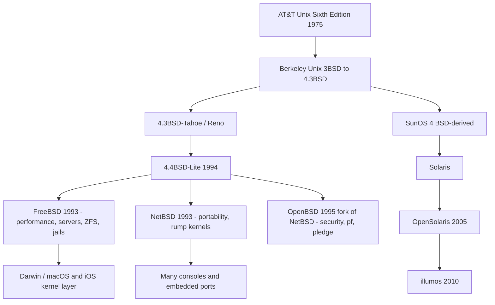
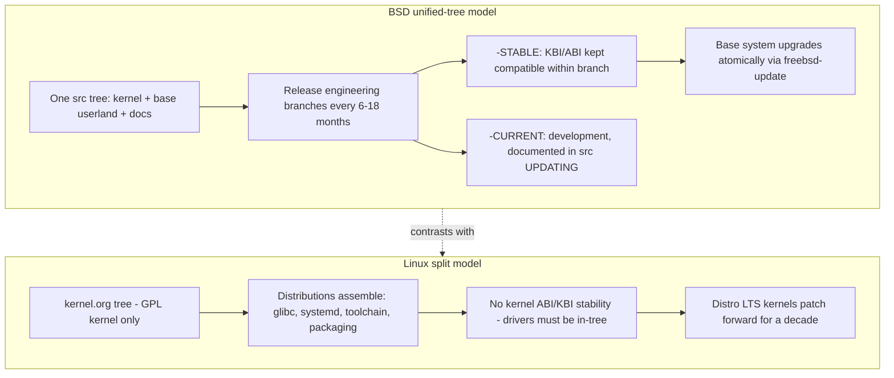

# The BSD Family: What Linux Interviews Forget

Linux dominates server rooms and interview question banks, but the BSD family — FreeBSD, OpenBSD, NetBSD, and their Illumos cousin — produced many of the operating system ideas interviews probe: jails before containers, DTrace before eBPF, ZFS before btrfs, pf before nftables, and some of the best-written OS documentation in existence. Candidates who can place these systems precisely, compare their mechanisms honestly, and explain *why* Linux made different choices sound senior rather than bookish. This page covers each family member's signature internals, the unified-tree release model that contrasts with Linux's distributed development, and the interview angles where BSD knowledge pays off.

Primary sources:

- FreeBSD: [FreeBSD Handbook](https://docs.freebsd.org/en/books/handbook/) and [freebsd/freebsd-src](https://github.com/freebsd/freebsd-src)
- OpenBSD: [man.openbsd.org](https://man.openbsd.org/) (normative manual pages) and [openbsd/src](https://github.com/openbsd/src)
- NetBSD: [netbsd.org/docs](https://www.netbsd.org/docs/)
- illumos: [illumos.org/books](https://illumos.org/books/)

## Family Tree and the Licensing Baseline

BSD descends from the Berkeley Software Distribution of AT&T Unix: 3BSD ran the ARPANET-adopted 1979 work, 4.2/4.3BSD gave us the socket API and TCP/IP stack, and 4.4BSD-Lite (1994, after the USL v. BSDi lawsuit settled) became the common ancestor of every modern descendant. The lawsuit itself is interview-relevant: because it required removing AT&T code, it proved BSD could stand alone, and the permissive license let that code flow anywhere.



The BSD license is the fork-enabler: a two-clause (or three-clause) permit allowing proprietary embedding with attribution, versus Linux's GPLv2 copyleft. That single legal difference explains Apple's Darwin (Mach + BSD kernel, not Linux), the PlayStation 4/5 OS (FreeBSD-derived), Netflix's CDN appliances (FreeBSD), and why companies can ship BSD code in closed products without lawyers. For the full Linux-side contrast, see [licensing](../../linux/foundations/licensing.md) and the deeper lineage in [Unix heritage](../../linux/foundations/unix-heritage.md) and the [Unix timeline](../../linux/history/unix-timeline.md).

### The Licenses in Practice

Licensing is an architecture input, not paperwork, so learn the four licenses that matter in one table:

| License | Core obligation | Commercial consequence |
|---------|-----------------|------------------------|
| BSD-2-Clause | Reproduce the copyright notice in source and binary redistributions | Embed in proprietary products and ship without publishing changes — why appliances, game consoles, and macOS could build on BSD with minimal legal overhead |
| BSD-3-Clause | 2-clause plus non-endorsement: derived products may not use the originators' names in promotion | Same freedom as 2-clause with a marketing restriction; the default for most upstream projects today |
| GPL-2.0 (Linux) | Distributing binaries requires source offers and GPL-compatible derivative works; `EXPORT_SYMBOL_GPL` restricts symbol use | Android must publish kernel source; out-of-tree drivers live in a legally debated zone (the VMware/Hellwig case tested module boundaries and settled nothing) |
| CDDL (ZFS, DTrace) | File-level copyleft | Widely treated as GPL-incompatible: ZFS stays out-of-tree on Linux but native in-base on FreeBSD/illumos |

Two nuances turn this into a senior answer. First, Linux kernel developers state (in `COPYING`) that user programs calling the kernel through the syscall interface are not derivative works — an informal but load-bearing boundary BSD never needed, because permissive code creates no inheritance question at all. Second, the commercial outcomes trace directly to the license: Apple chose Mach + BSD for XNU (Darwin/macOS), Sony built the PS4/PS5 Orbis OS on FreeBSD, Netflix runs its OpenConnect CDN appliances on FreeBSD, and Windows NT's original TCP/IP stack was licensed from a BSD derivative — none of those deals survive a GPL base system.

## FreeBSD — The Reference Implementation

FreeBSD (1993) is the performance- and server-oriented descendant, and its [Handbook](https://docs.freebsd.org/en/books/handbook/) is widely considered the best single piece of OS documentation anywhere — a coherent, maintained, versioned book covering installation to kernel internals, which itself is an interview talking point when discussing documentation culture. Source lives in one tree at [freebsd/freebsd-src](https://github.com/freebsd/freebsd-src).

### The FreeBSD Handbook: Why It's Praised

The [Handbook](https://docs.freebsd.org/en/books/handbook/) is the rare OS document that is simultaneously a tutorial and a reference, and its structure explains the praise:

- **Part I — Getting started**: installation, Unix fundamentals, the base-system layout.
- **Part II — Common tasks**: desktops, multimedia, Linux binary compatibility.
- **Part III — System administration**: packages/ports, users, security hardening, jails, MAC, audit, updating.
- **Part IV — Network communication**: serial consoles, PPP, mail, firewalls (pf and IPFW), advanced networking.
- **Part V — Appendices**: glossary, bibliography, and a real subject index.

Why it works as engineering culture, not just documentation: it is versioned with each release and maintained by dedicated doc committers; its examples are cut-and-paste reproducible against the base system; it explains the *why* beside every command; and it treats kernel-adjacent topics (jails, GEOM, pf, ZFS) as first-class material rather than link-outs. The contrast with Linux is structural rather than a quality judgment: Linux documentation is federated across kernel docs, man pages, distro wikis, and blog posts of wildly varying vintage — trading a single authoritative voice for ecosystem breadth. In interviews, citing the Handbook as the model for internal platform documentation lands well.

**ULE scheduler.** FreeBSD's default CPU scheduler (replacing the older 4BSD scheduler) introduced per-CPU runqueues with load balancing, a real-time / interactive / idle priority tiering, and interactivity heuristics that score threads by their voluntary-run-to-sleep ratio — the same *idea space* as Linux's vruntime accounting, but with a completely different scoring mechanism. Comparing ULE's interactivity score to CFS/EEVDF's virtual-time ordering (see [scheduler internals](../../os/advanced/scheduler-internals.md) and [Linux scheduling](../../linux/kernel/processes/scheduler.md)) is a strong senior-level answer: two different solutions to the same problem of interactive fairness without starvation.

**Jails (2000) — containers before containers.** Jails combine a chroot-style filesystem restriction with per-jail user and process visibility (a process inside jail 3 cannot signal processes of jail 1), a hostname/IP binding, and restricted capabilities for root *inside* the jail (`securelevel` and jail flags prevent mounting devices, altering network config, or touching firewall rules). Linux reached similar semantics only by composing namespaces + cgroups + seccomp (see [namespaces](../../os/containers/namespaces.md), [cgroups](../../os/containers/cgroups.md)) — a modular design that won on ecosystem (Docker, Kubernetes: see [docker](../../os/containers/docker.md), [kubernetes](../../os/containers/kubernetes.md)) but is individually less integrated. Key comparison points:

| Dimension | FreeBSD jail | Linux container stack |
|-----------|--------------|----------------------|
| Isolation primitive | Single first-class kernel object | Namespaces (7 kinds) composed at runtime |
| Resource limits | `rctl`/`cpuset` integrated per-jail | cgroups v2 controllers |
| Root inside | Privileges revoked by jail flags | Capabilities sets + user namespaces |
| Networking | VNET (per-jail stack) or shared IP | netns with veth/bridge |
| Images/registry | None native — OCI runtimes bolted on | OCI images, registries, layering |
| Audit lineage | 2000, single codebase, 25+ years | 2013+ composition, fast-moving |
| Creation privilege | Root on the host (or `allow.set_hostname`-style flag grants) | Unprivileged via user namespaces |
| Granularity | Per-jail process set (a jail is many processes) | Per-process namespaces; composition varies per container |

### Jails in Operation

A two-jail configuration shows the integrated model — parameters, not assembly:

```conf
# /etc/jail.conf - two service jails, one with a private network stack
exec.start = "/bin/sh /etc/rc";
allow.raw_sockets = 0;

web {
    host.hostname = "web.internal";
    path = "/jails/web";
    ip4.addr = "em0|10.0.0.11";
}

db {
    host.hostname = "db.internal";
    path = "/jails/db";
    vnet;                        # private net stack: own interfaces, own firewall view
    persist;
}
```

`jail(8)`/`jls`/`jexec` manage the lifecycle; child jails can nest and inherit restrictions; each jail gets a constrained `security.jail.*` sysctl view; and `rctl` limiters attach per jail the way cgroup controllers do on Linux. The net effect is that a 2000-era design still reads as one coherent kernel feature — the interview contrast is that Linux reached parity by *composing* seven namespaces plus cgroups, winning tooling breadth at the cost of integration (see [namespaces](../../os/containers/namespaces.md), [cgroups](../../os/containers/cgroups.md)).

**OpenZFS heritage.** FreeBSD shipped ZFS (Sun's 2005 filesystem: copy-on-write everything, checksums in block pointers, pooled storage replacing volumes, snapshots and clones as first-class citizens) in 2008, and when Oracle closed Solaris development, the OpenZFS project (2013) became the cross-platform home — the codebase * FreeBSD carried for years * is the same one Linux distributions now package (see [ZFS on Linux](../../linux/kernel/filesystems/zfs.md)). The licensing irony is a great interview nugget: ZFS spread fastest on the BSDs because the CDDL and GPL are considered incompatible, so Linux had to ship it as an out-of-tree module — while FreeBSD integrated it in the base system with zero friction.

Also worth knowing: FreeBSD's `sendfile(2)` was the original zero-copy file-to-socket path that Netflix pushes to 400 Gbps per box (with `kern.ipc` tuning and its own `sendfile` improvements upstreamed back), `GEOM` is the modular storage framework underlying disks/RAID/encryption (gmirror, geli), and bhyve is its type-2-style hypervisor, comparable in role to KVM (see [virtualization](../../os/advanced/virtualization.md)).

## OpenBSD — Correctness as a Culture

OpenBSD forked from NetBSD in 1995 (Theo de Raadt) around a security- and correctness-first mission, and its influence on the whole industry is enormous: OpenSSH originated here and now runs everywhere; `strlcpy/strlcat`, `arc4random`, and `bcrypt` all came from this codebase; the Linux kernel's `task_struct` randomization, ASLR hardening, and many mitigations were popularized here first. The project ships a clean, coherent base system every six months, documented by man pages treated as *normative* — if the code and the man page disagree, one of them is a bug. That's a genuinely different contract from Linux, where docs, headers, and behavior can each drift separately (compare the Linux side: [man pages](../../linux/reference/man-pages.md) document glibc/kernel behavior but rarely govern it).

**pledge(2) and unveil(2).** OpenBSD's answer to "programs have too many rights" is self-imposed, per-process privilege reduction:

- `pledge(promises, execpromises)` irreversibly narrows the syscall surface of a process — after `pledge("stdio rpath")`, `open(2)` with write flags, `socket`, `execve`, and hundreds of others return `EPERM` forever. It's a *coarse, name-based* syscall allowlist designed to be usable by ordinary developers, contrasted with Linux seccomp-BPF's instruction-level filters (see [seccomp-BPF](./seccomp-bpf.md)): pledge trades expressiveness for auditable simplicity.
- `unveil(paths, permissions)` restricts filesystem visibility to an explicitly enumerated set — the process literally cannot `stat` anything else, giving it `landlock(7)`-like behavior (see [Landlock](../../linux/security/landlock.md) for Linux's analog) years earlier.

### pledge and unveil by Example

The canonical hardening sequence at the top of a network-facing daemon:

```c
#include <unistd.h>
#include <err.h>

/* narrow syscalls first — irreversible for this process */
if (pledge("stdio rpath cpath unix", NULL) == -1)
    err(1, "pledge");

/* then enumerate exactly the paths the daemon needs */
if (unveil("/var/www/htdocs", "r") == -1)   /* read-only view */
    err(1, "unveil htdocs");
if (unveil("/var/cache/app", "rwc") == -1)  /* create permitted */
    err(1, "unveil cache");
if (unveil(NULL, NULL) == -1)                /* lock: no more paths, ever */
    err(1, "unveil lock");
```

The promise vocabulary is coarse by design — a few dozen groups instead of hundreds of syscall numbers:

| Promise group | Unlocks |
|---------------|---------|
| `stdio` | read/write on already-open fds, `mmap`, memory calls, exit — the baseline everyone grants |
| `rpath` / `wpath` / `cpath` | open for read / write / create-rename |
| `unix` | AF_UNIX socket operations |
| `inet` / `dns` | AF_INET/6 sockets / name resolution |
| `proc` / `exec` | fork, kill / execve (with `execpromises` narrowing the child further) |
| `id` | setuid-family calls |
| `audio`, `video`, `sendfd`, `tty` | the device-access miscellany |

Semantics worth reciting: pledge is irreversible for the process (only `execpromises` can narrow across `execve`); violating syscalls return `EPERM` and log to the console; both survive `fork` and inherit into children; and unveiled-away paths fail with `ENOENT` — the process cannot even confirm their existence, which is strictly stronger than an access denial.

**pf, the packet filter.** OpenBSD's firewall ([pf documentation lives in the man pages](https://man.openbsd.org/pf.conf)) has the cleanest rule language in the field: last-match semantics, natural `pass in on egress proto tcp to port 22` syntax, integrated NAT, `altq` shaping, and `pfsync`/CARP for state failover. The Linux journey from ipchains → iptables → nftables spans three decades and three syntaxes (see [firewalls](../../linux/admin/firewall.md)); pf's design shows what API stability buys. Interview angle: pf evaluates one ruleset with last-match, while iptables chains iterate tables/hooks — being able to contrast *rule evaluation models*, not just commands, is the differentiator.

### pf by Example

The whole model fits in one annotated ruleset:

```pf
# /etc/pf.conf - minimal edge ruleset
set skip on lo                     # never filter loopback
block return                       # default deny; RST the caller
pass out quick                     # all egress; state tracked by default
pass in proto tcp to port { 22 443 }
table <abusers> persist file "/etc/pf.abusers"
block in quick from <abusers>      # quick = decide now, skip later rules
match out on egress inet from 10.0.0.0/24 nat-to (egress)
```

Four semantics to articulate: evaluation is **last-match-wins** (later rules override earlier — the mental inversion from first-match firewalls), **`quick`** terminates evaluation immediately for exception rules, **state is default** (`keep state` is implicit, so reply traffic auto-passes), and **anchors** load sub-rulesets at runtime, which is how daemons manage their own rules safely. Tables give you O(log n) set membership for blacklist-style rules, and `pfsync`/CARP (mentioned above) replicate state for failover. Every modern firewall — nftables included — is a variation on these five ideas (see [firewalls](../../linux/admin/firewall.md)).

The culture points matter in behavioral interviews: proactive code audits (CVEs found and fixed before disclosure), `W^X` (no memory both writable and executable — later mirrored by Linux's `W^X` RX-only kernel modes), permission-bit discipline, and the "correctness over features" release cadence. OpenBSD demonstrates that security is a process property, not a feature list — a sentence worth saying verbatim in interviews.

## NetBSD — Portability Above All

NetBSD's motto "Of course it runs NetBSD" reflects its founding goal: one source tree running on dozens of architectures, from embedded ARM boards to VAX. The portability engineering — MI/MD source split (`sys/sys`, `sys/arch`), clean bus/DMA abstractions — influenced how Linux organizes architecture code and why device trees exist (compare [device tree](../../linux/embedded/device-tree.md)).

Its most interview-worthy export is **rump kernels** (Run Anywhere NetBSD, documented in the [NetBSD guide](https://www.netbsd.org/docs/)): any NetBSD kernel subsystem — the file system layer, the TCP/IP stack, a driver — can be compiled into a userspace library with a thin syscall shim, and exercised on any POSIX host without a VM. Consequences:

- **File-system testability**: run NetBSD's FFS against fault-injected disks entirely in user space; crash-consistency testing becomes unit-testable (the same motivation behind Linux's xfstests, but in-process).
- **Library-OS lineage**: rump kernels are a production-validated library OS — the same design point as exokernel libOSes and unikernels (see [unikernels](./unikernels.md) and [exokernels](./exokernels.md)); Rumprun unikernels were literally built on rump.
- **Anykernel architecture**: the kernel code is written so the same driver can run in kernel or user space, an idea ahead of its time that user-space drivers (FUSE, DPDK, SPDK — see [DPDK](../../os/advanced/dpdk.md), [SPDK](../../os/advanced/spdk.md)) re-derived.

`pkgsrc` — NetBSD's portable package manager running across ten-plus platforms — is the lesser-known ancestor story of modern package ecosystems. NetBSD rarely comes up directly in interviews, but "I know where rump kernels fit in the library-OS spectrum" is a memorable differentiator.

### The Portability Ledger

The scale claim deserves concrete numbers: NetBSD supports 50+ hardware ports across a dozen-plus CPU families in a single source tree, from AArch64 servers to VAX and m68k Sun hardware. The machinery that makes that possible is reusable engineering vocabulary: the MI/MD split (`sys/sys` vs `sys/arch/<arch>`), `bus_space`/`bus_dma` abstractions so drivers never touch physical addresses directly, and an autoconf device tree configured per platform. NetBSD did not invent these ideas alone, but it kept them coherent across more machines than anyone else — and that discipline is visible in Linux's own `arch/` layout and device-tree adoption (see [device tree](../../linux/embedded/device-tree.md)).

Rump kernels are the payoff: because kernel components depend only on the thin `rumpuser` shim, the FFS implementation, the TCP/IP stack, or a driver compiles to an ordinary userspace library (`-lrumpfs_ffs`), links against any POSIX host, and runs under `rump_server` — which is why NetBSD's file-system regression tests run in-process in seconds instead of a VM-reboot loop. Portability stopped being a marketing line and became a testing strategy.

## illumos — DTrace and Zones

illumos is the open-source descendant of OpenSolaris (2010 fork after Oracle's Solaris closures), carrying the two most influential innovations of the Solaris line: DTrace and Zones. Its governance (per-distribution derivative like OpenIndiana, with the illumos-gate core repo) mirrors the unified-tree model below. Books and docs live at [illumos.org/books](https://illumos.org/books/) (the DTrace book and Solaris Internals lineage are still the best-written OS internals texts).

**DTrace architecture.** DTrace instrumented the entire production stack — every syscall, function boundary, scheduler event, and provider-instrumented hardware path — with these properties: probes are placed in *live* systems; instrumentation has near-zero cost when disabled (a no-op patched instruction, hot-patched on enable — the same patching trick ftrace uses, see [tracing and probes](../../os/kernel-advanced/tracing-probes.md)); data goes into per-CPU lockless ring buffers with probe-local filtering; and the D language composes predicates, aggregations (`@quantize`, `@aggs`), and actions safely (unsafe constructs rejected by a compiler that guarantees termination). This is the design blueprint eBPF rebuilt a decade later (see [eBPF for security](../../security/ebpf-security.md) and [eBPF deep dive](../../os/kernel-advanced/ebpf-deep.md)) — the honest comparison interviewers love:

| Property | DTrace (2005) | eBPF (2014+) |
|----------|---------------|--------------|
| Language | D: predicates + aggregations | Restricted C, LLVM backend, verifier |
| Safety mechanism | Compiler guarantees termination | In-kernel verifier proves safety |
| Data model | Per-CPU rings, speculative tracing | BPF maps (many kinds), ringbuf |
| Surface | Kernel + user (pid) probes, USDT | Kernel functions, tracepoints, USDT, XDP/tc |
| Licensing/availability | CDDL, native on illumos/BSDs; Linux port encumbered | GPL-compatible, Linux-native, now cross-platform |
| Production posture | Always-on, zero-cost when off | Near-zero cost, now the standard for observability + networking + security |
| Aggregations | `@count`/`@sum`/`@quantize` computed per-CPU, merged at output | BPF maps of many kinds; bpftrace rebuilds the same aggregation ergonomics |

The licensing point is real history: CDDL/GPL incompatibility is why Linux never got DTrace and why eBPF had to be invented on the Linux side — a perfect example of how legal constraints shape technical evolution.

### DTrace in Operation

Three layers make the architecture concrete:

- **Probes and providers.** A probe is named `provider:module:function:name`; providers cover the whole stack — `dtrace` (framework), `fbt` (every kernel function boundary), `syscall`, `sched`, `proc`, `io`, `profile`/`tick`, and `pid`/USDT for user space. Enabling a probe hot-patches its call site into a jump; disabled probes are single no-op instructions, which is why the instrumentation can stay resident forever.
- **The D language.** Predicates filter, actions record, and the compiler *guarantees termination and memory safety* of every script before it attaches — a script cannot loop forever or dereference a bad pointer, which is what made running DTrace on production acceptable to conservative operators.
- **Aggregations.** `@count`, `@sum`, `@avg`, `@quantize`, `@lquantize` accumulate per-CPU in lockless structures and merge at output — the design that makes continuous whole-system histogramming affordable.

```d
/* read-size distribution above 8 KiB, per process name */
syscall::read:entry
/execname == "postgres" && arg2 > 8192/
{
    @[execname, arg2] = count();
}
```

The bpftrace equivalent is a one-liner (`bpftrace -e 'tracepoint:syscalls:sys_enter_read /comm == "postgres"/ { @[comm] = count(); }'`), which captures the honest comparison: compiler-checked D versus verifier-checked BPF bytecode, identical in-kernel aggregation design, different ecosystems (see [bpftrace recipes](../../linux/observability/bpftrace-recipes.md), [eBPF deep dive](../../os/kernel-advanced/ebpf-deep.md), and [bpftrace](https://bpftrace.org/) for the modern tool itself).

**Zones.** Solaris Containers (Zones, 2004) predate both jails' popularization and Linux containers: a zone is a full isolated user environment with its own process tree, networking (shared or exclusive IP stacks), resource controls, and a virtual platform view — but a *shared* kernel, with zone-boundary enforced by the kernel's brand/zonename checks in every relevant path. Zones + ZFS cloning is how `p2v`/`v2v` provisioning at scale worked for a decade. The interview line: "Solaris shipped the integrated container model in 2004; Linux won the ecosystem war with the composable model in 2013; FreeBSD jails are the 25-year proven middle path."

illumos also contributed SMF (service management, the intellectual ancestor of systemd unit dependency graphs — compare [systemd internals](../../linux/admin/systemd-internals.md)), Crossbow (virtualized NICs), and COMSTAR (target-mode SCSI).

## Unified Tree vs Linux's Split Model

The deepest structural difference is organizational, not technical:



Practical consequences worth articulating:

- **FreeBSD keeps kernel binary interface (KBI) stability within a stable branch**, so out-of-tree modules survive patch updates; Linux explicitly *refuses* stable in-kernel ABI to allow unrestricted internal refactoring — the reason NVIDIA modules break and the reason long-term distro kernels exist (see [development model](../../linux/history/development-model.md)).
- **Base system vs packages**: BSDs ship a coherent base (kernel, libc, ssh, pf) upgraded as one unit; Linux distros are package salads with dependency graphs — more flexibility, less coherence, and a classic root cause in "my upgrade broke X" war stories.
- **Portability inverted**: NetBSD ports the whole system to chips; Linux ports the kernel and lets distros rebuild the rest. FreeBSD historically drove standards (its TCP/IP stack seeded many embedded stacks; its `capsicum` capability model influenced sandboxing — see [capabilities](../../os/security/capabilities.md)).

## BSD vs Linux — The Interview Angles

Five comparisons that come up repeatedly, each with the sharp version of the answer:

1. **Licensing.** BSD-2-Clause permits proprietary embedding without source disclosure; GPL-2.0 requires source for distribution. Consequences: Apple/PlayStation build on BSD; Android ships Linux with GPL-compliant userspace and binder out-of-tree history; ZFS lives out-of-tree on Linux but in-base on FreeBSD. (Details: [licensing](../../linux/foundations/licensing.md).)
2. **Jails vs namespaces/cgroups.** Jails are one integrated kernel object with 25 years of backward compatibility; the Linux stack is composable, unprivileged via user namespaces (see [user-namespace security](../../linux/containers/user-namespace-security.md)), and ecosystem-dominant. Trade-off: integration = coherence; composition = tooling breadth.
3. **DTrace vs eBPF.** DTrace had the safer language first (compiler-guaranteed termination), eBPF won on availability, surface area, and pace (verifier, maps, CO-RE). If you can discuss *why* each is safe — D by construction, BPF by verification — you sound like a tracing engineer, not a tool user.
4. **File systems.** ZFS (pooled, COW, checksummed, snapshots) vs ext4/xfs (journaling) vs btrfs (Linux's native COW answer, still not RAID5/6-stable for years). The BSD-side point: ZFS was *default-deployable* on FreeBSD a decade before Linux distros could ship it confidently. (See [journaling](../../linux/kernel/filesystems/journaling.md), [btrfs](../../linux/kernel/filesystems/btrfs.md).)
5. **Security models.** OpenBSD: pledge/unveil, W^X, audited C with `strlcpy` discipline. Linux: discretionary + mandatory layers — capabilities, seccomp, SELinux/AppArmor/IMA, landlock (see [security model](../../linux/security/security-model.md), [SELinux](../../os/security/selinux.md), [hardening](../../linux/security/hardening.md)). Contrast: OpenBSD makes the *default* path secure with few knobs; Linux offers a richer toolbox most deployments never fully configure. That sentence alone covers a classic "compare the security postures" question.

A final reframe for the interview: BSD systems are where you go to see ideas in their *cleanest form* — jails before the container boom, DTrace before the observability boom, pf before the nftables rewrite. Linux is where those ideas were *industrialized*. Knowing both lets you answer "how would you design it?" with history plus trade-offs instead of vendor documentation.

## Interview Questions

1. **"FreeBSD jails vs Linux containers — are they the same thing?"** Answer: They achieve similar isolation with different architectures. A jail is a single first-class kernel object bundling filesystem root restriction, per-jail process/user visibility, IP/hostname binding, and revoked root privileges; Linux containers compose namespaces (pid, net, mnt, uts, ipc, user, cgroup), cgroups v2 for resources, and seccomp/capabilities. Jails predate Linux containers by 13 years and offer tighter integration and stable semantics; the Linux model is more composable and unprivileged-friendly, which is why the container ecosystem (Docker/Kubernetes) grew there. Mentioning `rctl`, VNET networking, and `securelevel` shows real FreeBSD depth.

2. **"Compare DTrace and eBPF as observability architectures."** Answer: Both patch live kernel probes with near-zero disabled cost and aggregate in-kernel to avoid shipping raw events. DTrace (Solaris 2005) provides the D language with compiler-guaranteed termination, per-CPU ring buffers, speculative tracing, and unified kernel+user-space (pid/USDT) instrumentation. eBPF (Linux 2014+) replaces language-level guarantees with an in-kernel verifier that proves memory safety and termination, adds maps as a general data model, and expanded to networking (XDP/tc) and security (LSM hooks) beyond tracing. eBPF won on availability (Linux's reach + GPL compatibility; CDDL/GPL friction blocked a Linux DTrace), while DTrace's ideas — aggregations, stability of probe contracts — remain the reference design.

3. **"Why did ZFS become mainstream on Linux only recently, given it existed since 2005?"** Answer: CDDL and GPL incompatibility prevented shipping ZFS in the Linux kernel tree, so it lived as an out-of-tree OpenZFS module with distribution-level friction and no in-tree support. FreeBSD, under the permissive BSD license, integrated ZFS into the base system starting 2008 and co-led the OpenZFS fork in 2013 when Oracle closed Solaris development. The technical consequence is cultural: a decade of production ZFS hardening (checksums, snapshots, boot environments, send/recv) happened on FreeBSD and illumos first.

4. **"What is pledge and how does it differ from seccomp?"** Answer: `pledge(2)` is OpenBSD's self-imposed syscall-surface restriction: a process passes a set of coarse named promises ("stdio rpath inet"), and violating syscalls permanently return EPERM, including after exec when execpromises are set. seccomp-BPF on Linux is an instruction-level BPF program over syscall numbers and arguments — far more expressive, but requiring per-program policy design. The trade-off: pledge's simplicity makes it adoptable in ordinary applications in minutes, while seccomp's power typically confines it to expert-written sandboxes (Chrome, systemd, container runtimes). unveil(2) adds filesystem visibility restrictions similar in spirit to Linux Landlock.

5. **"How do the BSD release model and Linux development model differ, and what are the engineering consequences?"** Answer: BSDs maintain a unified source tree for kernel, base userland, and documentation, with release engineering producing -STABLE branches that preserve kernel ABI/KBI compatibility so out-of-tree modules keep working, plus coherent whole-system upgrades. Linux develops only the kernel in one tree, refuses stable in-kernel ABIs to permit free refactoring, and delegates assembly/integration to distributions, whose LTS kernels provide stability by backporting patches. Consequences: BSD = coherence and long-lived modules; Linux = faster internal evolution and ecosystem scale, at the cost of integration testing that distros must perform.

6. **"Where do rump kernels sit in the library-OS design space?"** Answer: Rump kernels are a production-validated library OS: NetBSD kernel subsystems compile into userspace libraries with a syscall shim, running any POSIX host without virtualization. They occupy the same design point as exokernel-era libOSes and unikernels, but instead of replacing the host OS for deployment, they target testability — file systems and network stacks can be unit-tested, fuzzed, and crash-injected in-process. This also previews modern user-space device-driver stacks (DPDK/SPDK, FUSE), which accept host-OS division of labor for performance or safety reasons.

7. **"OpenBSD ships fewer features but is respected in security. What's the transferable lesson?"** Answer: Security as a process property: continuous code audits, aggressive removal of buggy/legacy code, default-secure configuration with few knobs, W^X memory discipline, proactive mitigation (ASLR popularization, stack protector adoption), and documentation treated as normative — man pages and code must agree. The lesson for any engineering org is that defaults and simplicity dominate: a rich security toolbox that operators misconfigure loses to a narrow one that is secure out of the box. Linux later absorbed many of these ideas piecemeal through its hardening layers.

8. **"If you were building a commercial appliance OS today, why might you choose a BSD base over Linux — and when would that be wrong?"** Answer: Choose a BSD when license simplicity and system coherence dominate: BSD-2/3-Clause permits closed-source embedding with attribution (no copyleft compliance program), the unified tree gives a versioned base with KBI-stable branches, and integrated primitives (jails, pf, OpenZFS) come maintained in-tree — the actual reasons behind PlayStation's FreeBSD-derived Orbis OS and Netflix's CDN appliances. It is the wrong call when ecosystem breadth dominates: device-driver coverage, container tooling, cloud images, the eBPF-era observability stack, and the hiring pool all favor Linux. The senior move is framing it as ecosystem-fit rather than ideology — and noting that the CDDL/GPL clash (which kept ZFS out-of-tree on Linux) shows how license choice cascades into product architecture.
