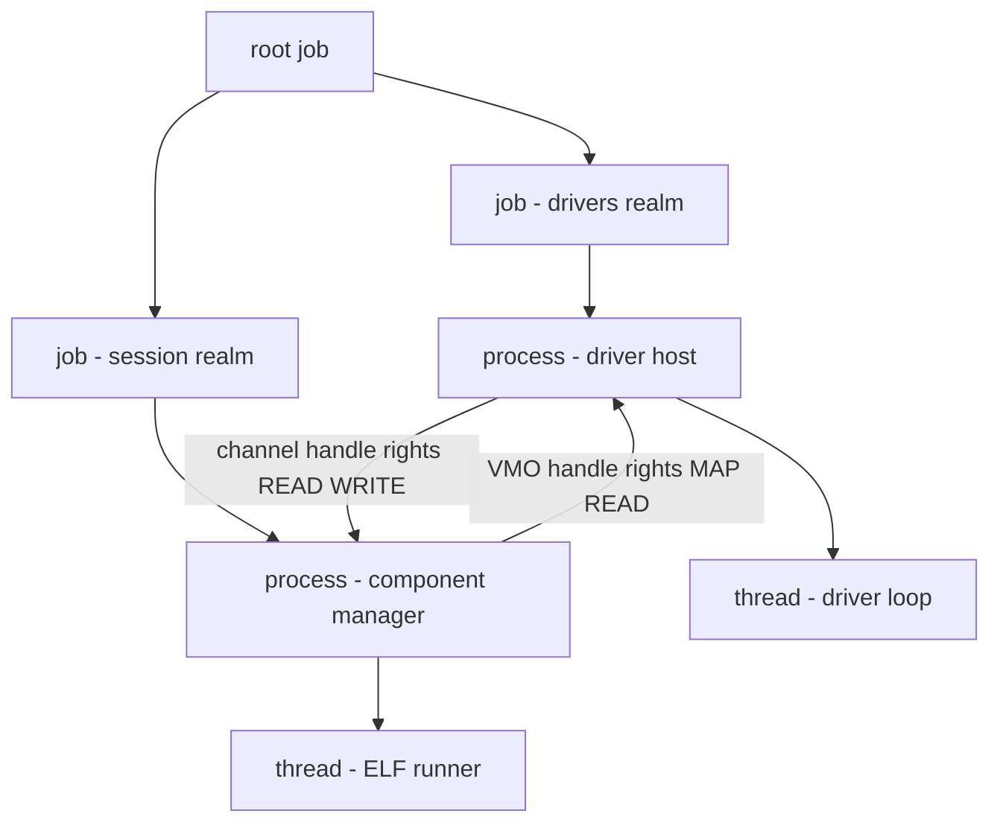
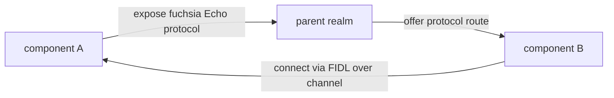
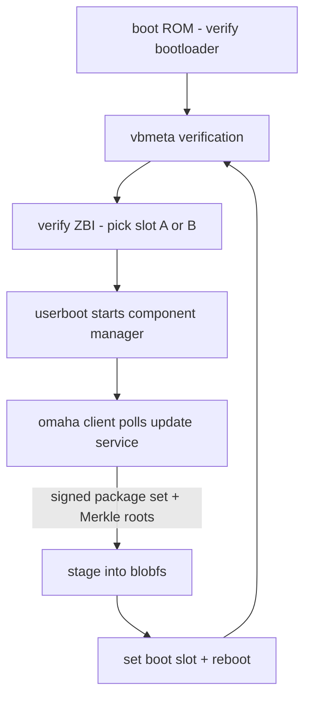

# Fuchsia & Zircon: A Capability-Based OS in Production

## Overview

Fuchsia is Google's general-purpose operating system, publicly developed since 2016–2017, whose kernel — Zircon — is a capability-based microkernel with a syscall surface an order of magnitude smaller than Linux. Unlike nearly every other "OS design" topic, this one shipped: Fuchsia has run in production on consumer hardware (Nest Hub devices) since 2021, making it the rare interview example of a *modern, from-scratch* OS that had to solve drivers, updates, and security at product quality. This page covers why Google built it, how Zircon's capability model works, the component framework and DFv2 driver framework, the software-assembly/OTA machinery, and the honest 2020s status report. For microkernel theory (message passing, the end-to-end argument, L4 lineage) start with [Kernel Architectures](./kernel-architectures.md); this page assumes those concepts.

## Why Google Built Fuchsia

Fuchsia is not a reskinned Linux and not an Android fork; its stated design goals follow from three frustrations with the incumbent stacks:

1. **No POSIX/Linux baggage.** Linux carries 30+ years of C ABI, a 450+ syscall surface, ambient root authority, and a driver model that runs in kernel space. Fuchsia starts from zero: no compatibility contract until explicitly provided (later, via Starnix — see below), so every core mechanism could be designed around capabilities and async IPC from day one. It also sidesteps licensing constraints: the kernel is BSD/MIT-style, and nothing forces GPLv2 into the boot chain.
2. **Updateability as a first-class goal.** Android devices update app packages but rarely the OS core; Chrome OS showed the value of whole-system A/B updates. Fuchsia generalizes the Chrome OS model: the OS is an immutable, verifiably-booted set of packages, updated atomically with rollback, with *all* OS functionality — drivers included — running as restartable userspace processes.
3. **Security-first defaults.** No ambient authority: a freshly started process can do *nothing* except what its startup handles explicitly grant. There is no root user, no "everything is a file with DAC" fallback, no kernel-addressable global namespace. Every privilege is a capability whose use is revocable and auditable.

The project began around 2016 (leaked in 2017, source published on GitHub in 2019), with Zircon evolving from the small "LK" (Little Kernel) embedded kernel — which is why Zircon's C code feels closer to an L4 than to Linux. Official documentation lives at [fuchsia.dev](https://fuchsia.dev/), with the conceptual map at [fuchsia.dev/fuchsia-src/concepts](https://fuchsia.dev/fuchsia-src/concepts).

## Zircon: The Microkernel Core

Zircon keeps in kernel mode only what genuinely cannot be userspace: scheduling, memory management primitives, IPC transport, interrupt routing, and object/handle management. Everything else — filesystems, network stacks, device drivers, the boot protocol itself — is userspace. Consequences visible in the source and docs:

- **Syscall surface.** The syscall reference at [fuchsia.dev/fuchsia-src/reference/syscalls](https://fuchsia.dev/fuchsia-src/reference/syscalls) lists on the order of 150 entry points, many of them small variants sharing one concept (`object_*`, `handle_*`, `vmo_*`), versus Linux's 450+. Every call goes through the single-file **vDSO** (`libzircon.so`) — user code never executes a `syscall` instruction directly, which is how Fuchsia controls, versions, and can vtable-swap the entire ABI.
- **Kernel objects.** The kernel instantiates typed objects: `job`, `process`, `thread`, `vmo` (virtual memory object), `vmar` (address region), `channel`, `port`, `event`, `eventpair`, `futex`, `socket`, `fifo`, `timer`, `stream`, `interrupt`, `bti` (bus transaction initiator, for DMA), `resource`, `profile`, `exception`. Objects are reference-counted C++ instances; none are reachable except through handles.
- **Handles and rights.** A handle is a (value, rights) pair in a per-process handle table. Rights are a bitmask — `DUPLICATE`, `TRANSFER`, `READ`, `WRITE`, `EXECUTE`, `MAP`, `WAIT`, `SIGNAL`, `DESTROY`, `MANAGE_PROCESS`, … — checked on *every* syscall use, not at open time. Duplicating narrows rights; passing a channel transfers handles (and therefore authority) in the message payload itself. `zx_handle_close` is the revocation primitive: drop the last handle and the kernel tears the object down.
- **Process/job tree.** Threads belong to processes; processes belong to jobs; jobs nest up to 32 levels and enforce resource policies (max memory, CPU shares, per-job kill). This tree is the containment unit — killing a job kills its whole subtree atomically, which is how component teardown works.
- **Scheduling.** Fair-share weighted scheduling by default across the job tree, with an optional deadline-profile mode for latency-critical threads — an explicit nod to mixed workloads (UI audio latency vs batch background work). Threads get priorities 0–31 (the upper band reserved for kernel-internal work); deadline scheduling is reservation-based — a thread declares its period, capacity, and relative deadline, and the scheduler guarantees it within the bandwidth it was granted, falling back to fair-share when the reservation is overcommitted.
- **Time.** Zircon exposes monotonic clock ticks via a syscall (`zx_clock_get_monotonic`), timer objects that signal ports asynchronously, and clock transformations for UTC estimates — the primitives a userspace time-service component builds on. There is no in-kernel NTP: like everything else, time policy is a userspace component's job.
- **Boot.** The kernel image (ZBI — Zircon Boot Image) carries a first userspace program, `userboot`, whose only specialness is being *loaded by the kernel*: it starts the next process over a plain channel with a bootstrap handle. The entire OS above the kernel is ordinary capability-passing software.



## The Capability Model: No Ambient Authority

In Unix, a process carries ambient authority: uid 0 plus the global filesystem namespace means every syscall is checked against a global policy. In Zircon, *all* authority is explicit:

- A process starts with a bootstrap channel; everything it can ever do — open files, talk to the network, draw to the display — comes from handles received over channels from other components.
- The **channel** is the one IPC primitive: an ordered, asynchronous message queue of bounded-size byte payloads plus up to 64 handles per message. Higher-level RPCs, filesystem access, driver protocols, and service discovery all compile down to channel messages. A **port** is the async wait primitive (wait on many handles/signals at once), making Zircon's programming model completion-based rather than thread-per-connection.
- **FIDL** (Fuchsia Interface Definition Language) defines the typed protocols that ride over channels: a schema language with bindings generated for C++, Rust, and Dart, a stable wire format, and built-in API versioning. If Protobuf/gRPC and CORBA had a security-conscious child designed by kernel engineers, it would be FIDL; interviews reward connecting it to IDL history (and to why the kernel itself needs no IDL — syscalls are the only non-FIDL interface).

The security payoff: a compromised component cannot "reach" anything it was never handed, the attack surface of any component is the union of its granted capabilities, and audit logs can name exactly which component transferred which authority. The operational cost: everything is composition — even "give me the current time" is a FIDL call to a clock component, which is the price of the model.

The closest Unix analogue — the file descriptor — is worth contrasting directly, because interviewers will ask "isn't this just file descriptors?":

| Property | Unix file descriptor | Zircon handle |
|----------|----------------------|---------------|
| Authority source | Ambient: open() against global namespace | Explicit: received via channel bootstrap/IPC |
| Rights attached | Fixed by file mode (rwx), checked at open | Fine-grained bitmask, checked at every use |
| Transfer | sendmsg/SCM_RIGHTS over sockets | Any channel message carries handles |
| Revocation | close() affects only the caller | close last handle destroys the object |
| Non-resource objects | no (fds are files/sockets/pipes) | yes (processes, jobs, VMOs, interrupts) |

The decisive row is the first: a descriptor obtained by `open("/etc/passwd")` proves nothing about who *authorized* the lookup, while a handle exists only because someone with the authority chose to send it.

The handle lifecycle looks like this in code (C-flavored pseudocode using real syscall names):

```c
zx_handle_t ch0, ch1;
zx_channel_create(0, &ch0, &ch1);        // pair of channel handles
zx_handle_t vmo = vmo_from_somewhere();
// send message + one handle, granting READ-only access:
zx_handle_t dup;
zx_handle_duplicate(vmo, ZX_RIGHT_READ, &dup);  // narrow rights
zx_channel_write(ch0, 0, payload, size, &dup, 1);
zx_handle_close(vmo);                    // we gave it away: revoke ours
// receiver side:
zx_channel_read(ch1, 0, buf, &rx_handle, ...);  // gets vmo w/ ZX_RIGHT_READ
zx_vmar_map(vmar, ..., rx_handle, ...);  // only succeeds because MAP was granted
```

Even **crash handling** is capability-shaped, which is a beautiful illustration worth retelling. Every thread has an exception channel; when a fault occurs (page fault, illegal instruction, `zx_task_kill`), the kernel packages the exception as a message — faulting thread handle, PC, registers — and delivers it to the process's exception handler, or up the job tree if unhandled. Crash reporting, debugging, and the debugger itself (`zxdb`) are therefore ordinary userspace programs that happen to hold exception handles, not special kernel modes. Compare this to Linux's ptrace/signal design (an ambient, process-wide contract — see [ptrace internals](../security-internals/ptrace.md)) and the design difference snaps into focus: Zircon has no special-case path for debugging because debugging is just capability-mediated IPC.

Every line of the zx example above is an authority transition an auditor could replay — there is no call in the sequence that bypasses the rights checks, which is the whole point of the design.

## Component Framework: The Unit Above the Kernel

Zircon provides mechanisms; the **Component Framework (CFv2)** provides the OS's policy and composition layer. A *component* is declared by a `.cml` manifest, resolved by URL (`fuchsia-pkg://...#meta/name.cm`), and run by a *runner* (ELF runner for native code, plus Dart/web/test runners). Components form a tree of *realms*; capabilities flow along that tree only via three manifest verbs:

| Verb | Direction | Meaning |
|------|-----------|---------|
| `use` | child → parent | This component requires a capability (e.g., `protocol: "fuchsia.net.http"`) |
| `offer` | parent → child | Parent grants a capability it holds to a specific child |
| `expose` | child → parent | Child makes a capability available upward for the parent to re-offer |

A component that does not declare `use` of the filesystem gets an empty namespace — not a restricted one, an *empty* one. Sandbox escape therefore requires a bug in capability routing itself rather than in a per-resource policy engine. Services are named FIDL protocols; directories and storage are routed as directory handles; `storage` capabilities abstract where component data lands, letting a product redirect it without touching component code.

A trimmed real-shape CML manifest shows the verbs in action:

```json
{
  "include": [ "syslog/client.shard-cml" ],
  "program": { "runner": "elf", "binary": "bin/netcfg" },
  "use": [
    { "protocol": "fuchsia.net.interfaces.State" },
    { "protocol": "fuchsia.posix.socket.Provider" },
    { "storage": "data", "path": "/data" }
  ],
  "expose": [
    { "protocol": "fuchsia.net.netcfg.Controller", "from": "self" }
  ]
}
```

Reading it top to bottom: this component runs as a native ELF binary, *needs* two FIDL protocols and a persistent storage backing routed to `/data`, and *publishes* one control protocol upward. Its parent realm decides whether those `use` entries get satisfied — delete the `offer` line for the socket protocol in the parent manifest and this component cannot open a single socket, at any privilege level.



## Drivers in Userspace: DFv2

Fuchsia's driver framework version 2 (DFv2) runs every driver inside a **driver host** — an ordinary userspace process — rather than in kernel space like Linux loadable modules (contrast: [xv6-teaching-kernel.md](./xv6-teaching-kernel.md) shows where Linux-style in-kernel drivers sit, and [bsd-family-internals.md](./bsd-family-internals.md) covers the classic UNIX device tree). Mechanics:

- A **driver index** matches hardware nodes against drivers' bind rules (compiled bytecode predicates over device properties); matched drivers are loaded into a shared or dedicated driver host.
- Drivers talk to the kernel (MMIO, interrupts, DMA) via narrow capabilities: mapped VMOs, `interrupt` handles, and `bti` objects that the IOMMU enforces — a driver physically cannot DMA outside its granted regions.
- Drivers expose and consume FIDL protocols like any component; DFv1's C-ABI "Banjo" IPC was replaced by FIDL in DFv2, unifying the IPC story.
- A crashing driver kills only its host process; the framework restarts it and re-offers its capabilities. Kernel bugs from driver code — historically the majority of Linux kernel CVEs — become ordinary userspace crashes.

Binding is declarative. Each driver ships bind rules compiled to bytecode predicates over node properties; a sketch:

```bind
fuchsia.BIND_PROTOCOL == fuchsia.pci.BIND_PROTOCOL.DEVICE;
fuchsia.BIND_PCI_VID == 0x8086;
fuchsia.BIND_PCI_DID == 0x1234;
```

The driver index evaluates these against each device node appearing in the composite node graph; matches schedule the driver into a host. **Composite drivers** declare multiple parent nodes (say, an Ethernet controller plus its PHY plus an MDIO bus), and the framework creates the node graph so that hardware topologies that Linux models with in-kernel bus logic become ordinary capability wiring between driver components.

This is the same isolation argument as microkernels generally (see [Kernel Architectures](./kernel-architectures.md)), but with the capability model making the driver's authority explicit and revocable, and the component framework handling lifecycle and routing.

## Software Assembly, Verified Boot, and OTA Updates

Fuchsia treats "an OS release" as an assembly problem: a *product* configuration (e.g., a smart display) plus a *board* configuration (SoC/drivers) are compiled into a tree of signed packages, with the core platform in the ZBI and `system_image` package. The update pipeline:

1. **Verified boot**: the SoC's boot ROM verifies the bootloader, which verifies signed metadata (`vbmeta`) that hashes the ZBI — the chain of trust concepts (ROM, measured/verified stages, signed manifests) are covered in [hardware-root-of-trust](../../arch/advanced/hardware-root-of-trust.md); Fuchsia is that theory applied to a shipped product.
2. **A/B slots**: system images live in two slots (plus recovery); the bootloader picks the slot whose metadata verifies, so a power cut mid-update leaves a bootable system. Update transactions are atomic per-package.
3. **OTA**: an Omaha-protocol client periodically fetches updates over HTTPS, verifies package Merkle roots against the signed metadata, stages packages into storage, then flips the active slot. Rollback protection can pin minimum security versions in hardware.
4. **Software assembly discipline**: because drivers and subsystems are packages, a product ships "the platform + my config", enabling the same OS core across hardware generations with per-device driver sets — the maintainability story interviewers want when you argue against forked Android trees.



### Storage: Blobfs and Friends

Storage underpins the update story. **FVM** (Fuchsia Volume Manager) slices block devices into virtual partitions. On top sit: **blobfs** — a content-addressed, immutable, Merkle-tree-verified store where every package blob is named by its own hash, giving free dedup and mandatory integrity; **minfs** — a mutable POSIX-like filesystem for user data; **f2fs** — used for larger flash-backed data partitions; and **fxfs** — the newer Rust-native filesystem. Combined with VMO-backed paging, the design principle is "immutable verified content + small mutable state", which is exactly what makes atomic OTA feasible. Filesystems being userspace servers over channels is the microkernel division of labor in action.

The **pager** mechanism completes the memory/storage picture: a VMO can be backed by a userspace pager service that supplies pages on demand — this is how blobfs serves executable code pages (verified lazily, page by page), how the filesystem cache stays coherent with memory pressure, and how an executable's text pages are only ever materialized after their Merkle proof checks out. Demand paging, page cache, and mmap semantics — classically kernel concerns on Linux (see [memory internals](./memory-internals.md) for that world) — are achieved here with a protocol instead of in-kernel machinery.

## Zircon vs seL4 vs QNX

Three production-grade microkernels with very different bets. Note the pattern: each kernel picked one axis — proofs, real-time certification, or product software engineering — and accepted weaknesses on the others:

| Aspect | Zircon | seL4 | QNX Neutrino |
|--------|--------|------|--------------|
| Origin/owner | Google, 2016+, C/C++ | NICTA/Data61, formally verified C | BlackBerry (QNX), 1980s lineage |
| Verification | None formal; heavy testing/fuzzing | Machine-checked functional correctness proofs | Certified (ISO 26262, IEC 61508) but not proved |
| Syscalls | ~150, vDSO-only | ~a dozen core calls (IPC, threads, caps) | POSIX + message-passing extensions |
| IPC | Async channels + ports, handle transfer | Synchronous endpoints + capabilities | Synchronous message passing |
| Drivers | Userspace, DFv2, FIDL | Userspace (in the L4 ecosystem) | Userspace, resource-manager model |
| Scheduling | Weighted fair + deadline profiles | Fixed priority/BFS variants, minimal | Adaptive partitioning, hard RT |
| Production | Nest Hub, Google smart home | Embedded/specialized (drones, seL4 Microkit) | Automotive, medical, industrial |

The nuanced interview answer: seL4 wins on *proven guarantees* (see [sel4-verification](../../formal-methods/sel4-verification.md) for the proof story), QNX wins on *hard real-time certification*, Zircon wins on *modern software engineering* — IDL-codegen everywhere, package-based updates, capability-routed composition, and a Rust-heavy userspace (netstack3, fxfs — see [Rust in the Kernel](../../os/modern/rust-in-kernel.md) for the broader Rust-in-systems trend). Zircon explicitly targets *product* workloads, not hard real-time: its scheduler offers deadline *profiles*, but Google's stated ambitions are consumer devices, not brake-by-wire.

One more axis the table hides: **scale of IPC**. QNX's synchronous message passing is superb for the small, latency-bounded request/response patterns of embedded control, and seL4's IPC endpoints are so cheap they substitute for function calls in some designs. Zircon chose *asynchronous* channels plus ports because its workloads are UI/media/network stacks where producers and consumers decouple — the same reason desktop OSes moved to async IO. Matching IPC semantics to workload is the transferable lesson; the specific kernel names matter less than the reasoning.

## What Happened to Fuchsia — the Honest 2020s Status

The realistic picture, useful for interviews because it shows product judgment:

| Year | Milestone |
|------|-----------|
| 2016–2017 | Project starts; "Magenta" kernel renamed Zircon; details leak publicly |
| 2019 | Source published; OS gains a public face |
| 2021 | First consumer hardware: Nest Hub devices receive Fuchsia OTA updates |
| 2022 | Google states scope is Google's smart-home ecosystem, not Android replacement; team reorgs reported |
| 2023 | Layoffs shrink the effort; work continues on an open, smaller scope |
| 2024–2026 | Maintenance and focused development; FIDL/CFv2/DFv2 stabilized; Starnix compatibility matures |

The narrative that matters:

- **Shipped, but niche.** First-generation Nest Hub devices received Fuchsia OTA updates starting 2021; subsequent Nest displays shipped with it. It runs real consumer hardware at Google scale — but that is roughly the extent of public production deployment.
- **Not an Android or Chrome OS replacement.** Google has said this repeatedly. 2022 reporting showed team reorganizations; 2023 layoffs shrank the effort; development continued afterward with a public source tree, regular integration commits, and community engagement. As of the mid-2020s, Fuchsia remains an active, open-source, *strategically scoped* platform — the testing ground for Google's OS ideas (updateable system images, capability security, driver isolation) rather than a volume consumer OS.
- **Starnix is the pragmatic twist.** To run Android/Linux software, Fuchsia implements Starnix: a userspace component that emulates the Linux kernel ABI by executing Linux binaries' syscalls against Zircon primitives — conceptually a cousin of gVisor's trap-and-emulate approach. It is the admission that *some* POSIX compatibility is worth having, delivered as an ordinary capability-scoped component rather than kernel baggage.
- **Lessons that outlived the roadmap.** Whole-image A/B updates with verified packages, drivers-as-userspace, IDL-first IPC, and no-ambient-authority sandboxes have all influenced how the industry talks about OS architecture — and all are explainable with the Zircon vocabulary this page built.

## Building and Shipping: the SDK View

Fuchsia's build is a GN/Ninja tree producing an **SDK**: FIDL libraries, sysroot, and tooling consumed by in-tree and out-of-tree developers alike. Products are described declaratively (product + board assemblies), and the systemimage that lands on a device is the composition of platform packages plus product config — the reason Google could rebase a Nest Hub from one Fuchsia version to another without a device-specific fork of the OS. Two engineering choices stand out for interviews: the build treats *drivers as product data* (board configs select driver packages, not kernel patches), and the SDK's FIDL-first surface means third parties integrate by generating bindings, not by linking against a libc-style stable ABI — the polar opposite of Linux's "libc is the contract" philosophy. The pragmatic consequence is a system whose compatibility story is explicit and versioned (`fuchsia-pkg` URLs, FIDL API levels) rather than accidentally frozen.

## Why Not Just Harden Linux?

The contrarian interview question deserves a prepared answer. Linux *can* be made nearly as isolated — namespaces, seccomp, LSMs, IOMMU passthrough — and Android already does much of it. The honest case for Zircon is not "impossible on Linux" but "structurally guaranteed versus policy-configured": on Linux, every isolation property must be assembled per-application and enforced by a trusted kernel whose drivers run in ring 0; on Zircon, isolation is the default semantics of the syscall layer, drivers are userspace by construction, and the update system treats the entire OS as a versioned artifact. The honest counter-case: Linux's ecosystem, hardware support, and 20 years of production hardening are unavailable to any from-scratch kernel, which is precisely why Fuchsia's niche stayed narrow. Framing the debate as *invariants versus configuration* is the answer that signals architectural maturity.

## Key Takeaways

- Zircon is a capability-based microkernel: ~150 syscalls via a single vDSO, all authority passed as handle+rights pairs, everything else (drivers, filesystems, network) in userspace.
- Channels are the universal IPC primitive; FIDL provides typed, versioned protocols over them; ports provide async waiting — the model is completion-based end to end.
- The component framework routes capabilities by manifest verbs (`use`/`offer`/`expose`); sandboxes are empty-by-default namespaces, not restricted global ones.
- DFv2 runs drivers in userspace driver hosts with FIDL protocols and IOMMU-enforced DMA (BTIs); a driver crash is a process crash.
- The OTA story is Chrome-OS-style A/B slots plus content-addressed blobfs packages gated by verified boot — updateability is the design's centerpiece.
- vs seL4: no proofs but product engineering; vs QNX: no hard-RT certification but modern composition; production reality (2021→) is Nest devices, not phones.
- Starnix shows the pragmatic endgame: Linux ABI compatibility as an ordinary userspace component.

## Cross-References

- [Kernel Architectures](./kernel-architectures.md) — microkernel theory, L4 lineage, and the monolithic-vs-micro trade-off table this page instantiates.
- [seL4 Verification](../../formal-methods/sel4-verification.md) — what machine-checked kernel proofs actually guarantee, the axis where Zircon makes no claim.
- [Hardware Root of Trust](../../arch/advanced/hardware-root-of-trust.md) — the verified-boot chain Fuchsia's OTA system builds upon.
- [xv6: A Teaching Kernel](./xv6-teaching-kernel.md) — the classic monolithic-in-miniature contrast: in-kernel drivers and ambient authority by design.
- [BSD Family Internals](./bsd-family-internals.md) — the mature UNIX lineage Fuchsia deliberately broke from, including its own sandboxing approaches.
- [Rust in the Kernel](../../os/modern/rust-in-kernel.md) — the memory-safety-in-systems trend Fuchsia's userspace (netstack3, fxfs) participates in.
- [Thread & Matter](../../edge/thread-matter.md) — the smart-home ecosystem context where Fuchsia's shipped devices actually live.

## References

- Fuchsia documentation portal: <https://fuchsia.dev/>
- Fuchsia concepts index (kernel, components, drivers, storage): <https://fuchsia.dev/fuchsia-src/concepts>
- Zircon kernel concepts: <https://fuchsia.dev/fuchsia-src/concepts/kernel>
- Syscall reference (handles, rights, objects): <https://fuchsia.dev/fuchsia-src/reference/syscalls>
- Component framework concepts: <https://fuchsia.dev/fuchsia-src/concepts/components>
- Driver framework (DFv2) concepts: <https://fuchsia.dev/fuchsia-src/concepts/drivers>

## Interview Questions

1. **What does "no ambient authority" mean concretely in Zircon, and how does it differ from Unix?** A Unix process carries its authority with it: the uid, the root/global mount namespace, and the syscall surface mean every process can *attempt* anything and policy is enforced against a global context. In Zircon a process starts with only a bootstrap handle; to read a file, draw a pixel, or open a socket it must receive a handle with appropriate rights over a channel from a component that was itself granted that authority. Rights are checked on every use, duplication can narrow them, and closing the last handle revokes access. The security consequence is that a component's attack surface is exactly its granted capability set, and compromise containment is structural rather than policy-configured.
2. **Why does Zircon route every syscall through a vDSO, and why does the small syscall count matter?** The vDSO (`libzircon.so`) means user code never executes privileged-mode entry instructions directly — the ABI is a library contract, which the kernel team can version, virtualize, or fast-path without breaking binaries. The small surface (roughly 150 calls versus Linux's 450+) exists because Zircon pushes policy into userspace: no filesystem, socket, or driver syscalls exist because those subsystems are userspace servers reached over channels. The interview point is the *ratio of mechanism to policy*: the kernel provides capability transport and object lifecycle; everything else is composition.
3. **Compare Fuchsia's driver isolation to Linux loadable kernel modules.** An LKM runs in kernel address space: a bug is a kernel panic or a kernel-level exploit, and its authority is ambient (it can touch essentially anything). A DFv2 driver runs inside a userspace driver host process, holds explicit capabilities (mapped VMOs for MMIO, interrupt handles, BTIs that the IOMMU enforces for DMA), and speaks FIDL protocols over channels to the rest of the system. A driver crash kills its host process and the framework restarts it — degraded service instead of downed kernel. The trade-offs to acknowledge: cross-driver communication pays IPC costs, and the driver framework's complexity (bind rules, host lifecycle) is real.
4. **How does Fuchsia achieve atomic OS updates, and what storage design enables them?** The OS is a set of signed, content-addressed packages stored in blobfs, where each blob's name is its Merkle root hash, making corruption detection automatic and deduplication free. Verified boot (ROM → bootloader → vbmeta → ZBI) establishes a hardware-rooted chain of trust; A/B slots make the switch atomic, so power loss leaves a bootable image; an Omaha-protocol client stages verified package sets and flips slots, with optional rollback protection pinning minimum versions. The enabling insight: immutability and verification of almost all content means the update transaction shrinks to "stage, verify, switch" — the mutable state (minfs/fxfs user data) is small and orthogonal.
5. **Where does FIDL sit in the stack, and what problems does an IDL-first design solve?** FIDL defines typed protocols that ride over Zircon channels; bindings generate C++/Rust/Dart code, and a stable wire format plus built-in versioning governs evolution. It solves the problems ad-hoc IPC creates: no hand-rolled serialization bugs, no version skew between client and server (versioned wire formats), uniform authz (capability transfer in messages), and a single audit point for system-wide interfaces. The kernel itself stays out — syscalls are the only non-FIDL interface — which keeps the kernel ABI minimal and stable while the FIDL protocol surface evolves quickly.
6. **Position Zircon against seL4 and QNX.** seL4 offers machine-checked correctness proofs but a deliberately austere mechanism set — the right answer when the requirement is provable isolation. QNX offers decades of hard real-time certification for automotive/medical — the right answer for certified determinism. Zircon bets on product-scale software engineering: capability security with modern tooling (FIDL codegen, package-based OTA, userspace drivers) targeting consumer devices rather than proofs or hard RT. All three agree on the core microkernel move — drivers and subsystems out of kernel space — which is worth stating before choosing sides.
7. **What is Starnix and what does it say about the project's strategy?** Starnix is a userspace component that implements the Linux kernel ABI — translating Linux syscalls to Zircon primitives — so unmodified Linux/Android binaries run as Fuchsia components. Strategically it is the pragmatic concession that application ecosystems beat ideological purity: instead of baking POSIX into the kernel (the Unix-worthiness trap) or forking a Linux compat layer into privileged space, compatibility is just another sandboxed component whose authority is explicit. It is also a great systems-design reference point against gVisor, which intercepts the same ABI inside a sandbox on *Linux* rather than on a microkernel.
8. **Given Fuchsia's niche status, why is it still a valuable interview topic?** Because it is the only from-scratch, capability-based OS with consumer production deployment in recent memory, it converts OS-theory talking points (microkernels, capabilities, verified boot, updateability) into concrete shipped mechanisms you can describe end to end. It also tests product judgment: the honest answer acknowledges the roadmap narrowed — Google's smart-home devices, not a platform war with Android — while the architectural ideas (empty-by-default sandboxes, IDL-first IPC, immutable verified packages, userspace drivers) continue to influence mainstream systems design. Candidates who can tell that story with both mechanisms and business context stand out.
