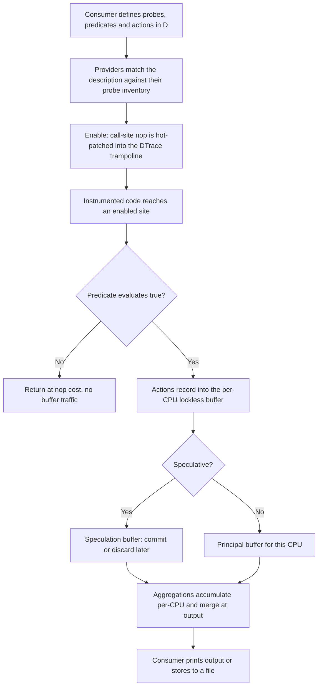
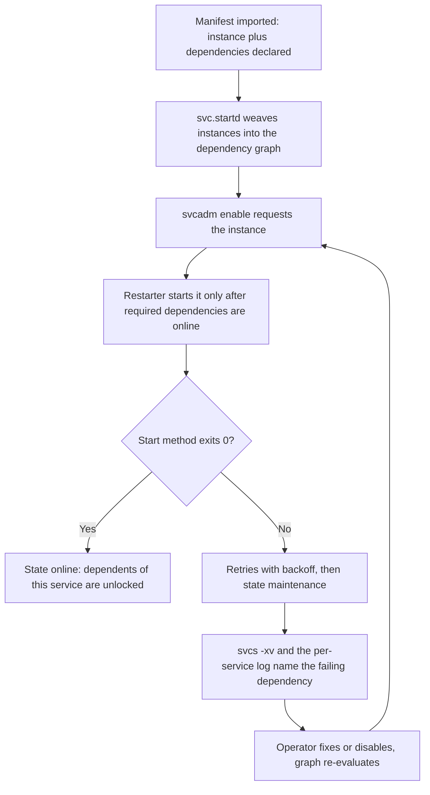

# illumos: OpenSolaris Heritage, DTrace, Zones

## Overview

illumos is the open-source continuation of the Solaris OS/Net gate — the codebase that produced DTrace, ZFS, Zones, SMF, and FMA, arguably the densest cluster of genuinely novel OS ideas shipped in the 2000s. Even engineers who will never administer an illumos system are interviewed about it indirectly, because those ideas migrated into everything they do use: bpftrace descends from DTrace, systemd descends from SMF, containers descend from Zones, and Btrfs/ZFS-on-Linux descend from ZFS. illumos also still runs production storage appliances and Joyent's Triton cloud, so it is a living kernel, not a museum piece. This page covers the history compressed, the DTrace architecture in depth (the zero-cost-probe principle is the core interview answer), Zones versus jails and Linux containers, SMF/FMA/MDB, and a table of idea provenance into Linux. The BSD-family comparison angle (jails, license effects) lives in [The BSD Family](bsd-family-internals.md), and ZFS mechanics live in [ZFS](../../os/filesystems/zfs.md).

## A Compressed History: Sun to illumos

Sun Microsystems open-sourced Solaris in June 2005 as **OpenSolaris** under the CDDL, publishing the OS/Net consolidation (kernel + core networking/libraries) — the same year Solaris 10 shipped DTrace and Zones. After Oracle acquired Sun (2009–2010), it closed OpenSolaris in August 2010: the distribution was discontinued and further development went private ahead of Solaris 11. Within weeks, Nexenta engineer Garrett D'Amore announced **illumos**, a fork of the last open OS/Net gate with the explicit goal of being the community continuation — *not* a distribution, but a core like the Linux kernel, from which distros assemble.

The compressed timeline, with the fork trigger visible:

| Year | Event | Why it mattered |
|---|---|---|
| 2004–2005 | Solaris 10 ships Zones, SMF, FMA; DTrace lands | The innovation cluster in one release |
| June 2005 | OpenSolaris launches, OS/Net under CDDL | Kernel source readable and modifiable by anyone |
| 2008–2010 | OpenSolaris distro, /dev branch, Crossbow prototyped | Community actually participating in the gate |
| Aug 2010 | Oracle closes OpenSolaris development | Development goes private ahead of Solaris 11 |
| Aug 3, 2010 | illumos announced (Garrett D'Amore, Nexenta) | Fork of the last open OS/Net gate |
| 2013 → | OpenZFS consolidates ZFS development cross-platform | The ideas escape the Solaris lineage entirely |

The distro ecosystem that formed is why the name still matters operationally:

| Distro | Niche | What it shows about the model |
|---|---|---|
| OpenIndiana | Desktop/general continuation of the OpenSolaris distro | The community replacement Oracle abandoned |
| OmniOS | Long-term-support server releases, storage and infrastructure | The "Debian-stable of illumos" — common on appliances |
| SmartOS | Live-booted hypervisor host: Zones + KVM + ZFS on a RAM-resident platform | Joyent's Triton cloud foundation; ephemeral host, persistent ZFS pool |
| NexentaStor | Storage appliance | The lineage where illumos earned its storage-industry keep |

The CDDL/GPL incompatibility shaped everything downstream: Linux never received DTrace directly, and the ZFS-on-Linux effort lived in legal gray zones for a decade — a rare case where lawyers, not engineers, decided which OS got which subsystem (see [The BSD Family](bsd-family-internals.md) for the license table). Meanwhile the ideas themselves were unencumbered: papers, books, and the freely readable source spread the *designs* into Linux and the BSDs even where the code could not follow. [The official docs hub](https://illumos.org/docs/) and [online books](https://illumos.org/books/) remain the canonical reading, and [illumos-gate](https://github.com/illumos/illumos-gate) is still an actively developed, reviewable kernel tree.

## DTrace Architecture: Probes at Zero Cost When Disabled

DTrace (Solaris 10, 2005; Cantrill, Shapiro, Leventhal) is the single most-cited Solaris innovation, and its core principle is the sentence to have ready: **the cost of an enabled probe is a patched call site, and the cost of a disabled probe is a single no-op instruction** — so instrumentation can ship compiled into production code and be toggled live. The team called the design constraint *delta enablement*: the only thing that matters is the delta between off and on, and that delta must be as close to zero as the hardware allows. This inverted the prevailing "enable verbose logging and reproduce" workflow, which changes system timing and usually hides the bug being chased.

The mechanics, layer by layer:

- **Probes and naming.** Every instrumentable point is a tuple `provider:module:function:name` — tens of thousands of kernel probes on a stock system, plus user-space coverage via the `pid` provider (arbitrary function entry/return/instruction offsets in any running process) and USDT static probes an application declares.
- **Providers** manufacture probes, and each has a distinct safety/coverage profile worth knowing by name:

| Provider | What it instruments | Typical use |
|---|---|---|
| `fbt` | Every kernel function entry/return | "Which path does the write(2) take through the kernel?" |
| `sdt` | Statically declared semantic probes | Stable, documented hook points (e.g., ZFS probe sets) |
| `syscall` | The syscall table, entry and return | Latency and error-rate analysis per call |
| `sched`, `proc`, `io` | Scheduler, process, and block I/O events | CPU migration, run-queue delay, I/O sizing |
| `profile` / `tick` | Time-based sampling at a rate | Whole-system on-CPU profiling without a target |
| `pid` / `fasttrap` | Any user-space function entry/return/offset | Tracing your own binary, library or not |
| USDT | Application-declared static probes | The app's own vocabulary ("query-start", "tx-commit") |

A probe description like `syscall::read:entry` is a *pattern* that matches many probes; `-P`/`-m`/`-f` selectors all compile down to the same matching.
- **Enablement is dynamic patching.** On enable, the provider rewrites the nop at the call site into a jump into the DTrace framework, with per-CPU synchronization; on disable it patches back. There is no recompilation, no reboot, no kernel module per probe — the same trick ftrace later used in Linux.
- **Safe in-kernel execution.** The D compiler *guarantees* before attaching that a script terminates and is memory-safe: loops are bounded, arbitrary pointer loads are rejected, and a fault at probe time aborts that firing harmlessly instead of panicking the kernel. That safety contract is what made operators comfortable enabling DTrace on production database servers.
- **Buffers and aggregations.** Action data lands in per-CPU lockless buffers, consumed asynchronously; `@count`, `@sum`, `@avg`, `@quantize`, `@lquantize` accumulate per-CPU and merge only at output time, which is what makes continuous whole-system histogramming affordable.
- **Speculative tracing.** A script can buffer actions speculatively and `commit()` or `discard()` the whole speculation later — the classic pattern is tracing syscalls and only committing the ones that ended in an error, so you keep the *interesting* prefix of every event without drowning in data.



The eBPF comparison is a guaranteed interview topic because eBPF is DTrace's intellectual heir rebuilt inside Linux's constraints — per-CPU maps, in-kernel aggregation, verifier-checked safety, one-liner ergonomics in bpftrace that mirror D one-liners. The differences are instructive: D was safe by *compiler construction* (a small language designed for the purpose), eBPF is safe by *verifier* (a general compiler backend over restricted C); DTrace had speculative tracing from day one, eBPF gained ring buffers much later; and licensing, not technology, decided which ecosystem got which system. A one-script tour of the language — predicate, action, aggregation, and speculation together:

```d
#pragma D option quiet

syscall::read:entry,
syscall::write:entry
/execname == "postgres" && arg2 > 65536/
{
    /* start a speculation: only commit if the call errors */
    self->spec = speculation();
    speculate(self->spec);
    printf("%s %s buf size %d\n", execname, probefunc, arg2);
    self->big = 1;
}

syscall::read:return,
syscall::write:return
/self->big/
{
    speculate(self->spec);
    printf("  returned %d errno %d\n", arg1, errno);
    self->big = 0;
}

syscall::read:return,
syscall::write:return
/self->spec/
{
    /* commit the speculation only when the call failed */
    (arg1 == -1) ? commit(self->spec) : discard(self->spec);
    self->spec = 0;
}

END
{
    printa(@);       /* dump the aggregation at exit */
}
```

Read it as the workflow it enables: attach to a running production database, record only the large-I/O failures with their full context, pay a few nops for everything else. The Linux-side mechanics live in [BPF and bpftrace](../../linux/observability/bpf-bpftrace.md) and the full DTrace-vs-eBPF property table is in [The BSD Family](bsd-family-internals.md).

## Zones: Isolation Before Containers Had a Name

Solaris shipped Zones (2004, as part of Solaris Containers) a decade before Docker: a **global zone** hosts the kernel and administers **non-global zones** — full user environments with their own process trees, hostnames, root filesystems, network stacks (shared-IP or exclusive-IP), and resource caps, all multiplexed over *one* kernel with zone identity checked in every relevant path. The design detail interviews probe is **sparse-root vs whole-root**:

| Layout | What the zone sees | Why you choose it |
|---|---|---|
| Sparse root | `/usr`, `/lib`, `/platform` (optionally `/opt`) loopback-mounted read-only from the global zone | Hundreds of zones on one box; near-zero per-zone disk; patch the global zone, patch them all |
| Whole root | Private copies of everything | Packages or OS content must diverge per zone; the flexible-but-fat option |

Because a zone shares the kernel, boot is seconds and density is enormous — but kernel bugs and resource-control gaps are shared risks, exactly the container trade-off familiar today. Provisioning from the command line shows how explicit the model is:

```text
# zonecfg -z app1
zonecfg:app1> create
zonecfg:app1> set zonepath=/zones/app1
zonecfg:app1> set autoboot=true
zonecfg:app1> add net
zonecfg:app1:net> set physical=vnic0
zonecfg:app1:net> set address=10.0.0.11/24
zonecfg:app1:net> end
zonecfg:app1> add capped-cpu
zonecfg:app1:capped-cpu> set ncpus=2
zonecfg:app1:capped-cpu> end
zonecfg:app1> verify
zonecfg:app1> commit
# zoneadm -z app1 install && zoneadm -z app1 boot
```

Every knob above — the dedicated vnic, the CPU cap — maps to a first-class kernel resource control, which is the design property containers-on-Linux spent a decade reassembling from separate primitives. **Branded zones** generalize the idea: the brand defines how syscalls and binaries are interpreted, and the famous `lx` brand emulated the Linux syscall ABI so unmodified Linux binaries ran on the Solaris kernel — userland-level binary translation with the host kernel underneath. Against FreeBSD jails ([The BSD Family](bsd-family-internals.md)) the difference is mostly packaging (jails are a lighter single mechanism, Zones integrate resource management and networking), and against Linux containers the difference is philosophical: Zones and jails are *kernel-integrated OS virtualization* with a stable boundary, while Linux composes independent namespaces + cgroups primitives that orchestrators assemble. The interview one-liner: Solaris integrated first (2004), Linux composability and ecosystem won (2013+), and the kernel-hardening lessons of both now live in every container runtime.

## ZFS Origin in One Paragraph

ZFS was designed at Sun (Bonwick, Moore, et al.) and shipped with Solaris 10/OpenSolaris in 2005 as the answer to a provocation: what if the filesystem *admitted* checksums, CoW transactions, snapshots, and pooled storage were the whole design instead of bolt-ons? Its 128-bit architecture, copy-on-write everything, end-to-end checksumming with self-healing against mirror/RAID-Z redundancy, and snapshots/clones made "the filesystem is the storage stack" mainstream — and after the CDDL kept it off Linux, the ports to FreeBSD and the Linux-native ZFS effort eventually formed OpenZFS in 2013. The mechanics (zpool/vdev layout, CoW transaction groups, scrubbing, send/receive) are covered in [ZFS](../../os/filesystems/zfs.md); the illumos angle is that uts/common/fs/zfs in [illumos-gate](https://github.com/illumos/illumos-gate) is still the reference lineage where the design is most directly readable alongside the original papers and the *Solaris Internals* books.

## SMF: Service Manifests, Dependency Graphs, Restarters

SMF (Service Management Facility, Solaris 10) replaced `rc` scripts and inetd with a dependency-graphed, self-healing service model — the design systemd later popularized on Linux. Services are named by **FMRI** (`svc:/network/http:apache2`), declared in **XML manifests** with methods and dependencies, stored in a transactional configuration repository, and supervised by **restarters**: `svc.startd` is the master restarter, and it can delegate service families (inetd delegated the `inetd:` services, so per-connection services are just graph nodes).



The systemd comparison is closer than people expect:

| Concept | SMF | systemd |
|---|---|---|
| Unit of management | Service + instance FMRI | Unit (`.service`, `.socket`, ...) |
| Declaration | XML manifest, imported to repo | INI-style unit files on disk |
| Dependencies | `require_all`, `require_any`, `optional_all`, `exclude_all` | `Requires`, `Wants`, `After`, `Conflicts` |
| Failure policy | Restarter retries, then `maintenance` state | `Restart=`, then failed state |
| Config storage | Transactional repository with snapshots | Files + runtime drop-ins |
| Supervision model | Pluggable restarters | Per-unit supervising PID 1 |

The distinctive SMF idea worth citing is the *pluggable restarter* and the transactional configuration repository with config snapshots — systemd chose simpler files and gained ubiquity, but the dependency-graph-with-maintenance-state mental model is SMF's.

## FMA: Ereports, Topology, Diagnosis Engines

FMA (Fault Management Architecture) addresses the problem "hardware is failing in probabilistic ways — what should the OS *say* about it?" Telemetry sources (CPU MCEs, DIMM ECC events, disk SCSI errors, PCIex errors) emit structured **ereports** into `fmd`, the fault manager daemon. Diagnosis engines — modular, per-subsystem, with the EFT (expert systems) engine encoding fault trees — correlate ereports against the **topology**: a dynamic physical inventory of the machine (which DIMM is in which slot, which disk is behind which expander). When correlation confidence crosses threshold, the DE produces a fault with a **suspect list** ("DIMM slot CPU0/CH2/D1") and actions: mark the resource degraded or retired, message the console, and record the diagnosis for service personnel. The operator-facing tools are `fmdump` (event log), `fmadm` (resource state), and `fmdump -eV` for raw ereports.

The interview-worthy framing: FMA moved the unit of response from "an error happened" to "a *fault* has been diagnosed, here are the suspects and the mitigations" — proactive retirement of degraded components before they cause data loss. Linux's later equivalents (rasdaemon, EDAC, NVMe error logging, MCE decoding) cover telemetry but never assembled the full ereports→topology→diagnosis-engine pipeline as a first-class subsystem; when a system design question touches predictive maintenance or hardware RAS, FMA is the strongest prior-art citation.

## MDB and the Crash-Dump Culture

Solaris engineering culture standardized on **MDB**, the Modular Debugger, for both live and post-mortem analysis of the kernel — the tradition behind the "we debug from crash dumps, not printk" reputation. MDB's model is a pipeline: **dcmds** (commands like `::ps`, `::pgrep`, `::cpuinfo`) produce structured output that can be filtered, and **walkers** (`::walk thread`, `::walk vnode`) iterate kernel data structures so complex traversals compose (`::walk thread | ::print kthread_t ...`). Combined with the always-on savecore discipline and CTF debug data baked into the kernel, an illumos crash dump is routinely analyzed down to "this thread held this mutex when this pointer was freed" — and because the kernel ships its own debugger modules, the dump analysis uses the same code paths as the live system. The habit to internalize for interviews: observability is not just metrics and traces; the maturity of a platform is visible in how well you can interrogate it *after* it has failed. Linux's rough equivalents (crash/kdump, drgn, BTF-based tooling) are younger and less integrated; the *Solaris Internals* + *Solaris Performance and Tools* books at [illumos.org/books](https://illumos.org/books/) remain the reference texts for this methodology.

## Crossbow: Virtualized Networking

Crossbow (Solaris 11-era, prototyped in OpenSolaris 2008–2009) virtualized the networking stack around **vnics** and **flows**: any physical NIC can spawn virtual NICs that look like hardware to the consumer (a zone gets an exclusive vnic with its own MAC), bandwidth is a schedulable resource per vnic and per *flow* (a classified packet stream), and classification/steering is pushed into NIC hardware when available. The consequence was that network QoS became a first-class kernel object — you could guarantee 500 Mbps to a zone the way you cap its CPU — and that zone networking stopped sharing a contention point. Modern NIC SR-IOV, macvtap, and per-cgroup/namespace traffic shaping echo the model; the general lesson (make the network a resource-managed virtual fabric rather than a shared pipe) is the part worth reproducing in design interviews.

## What Linux Took from Solaris

The idea migration is the reason illumos knowledge transfers, and the provenance is worth stating with evidence-strength honesty:

| Solaris idea (year) | Linux descendant | Strength of evidence |
|---|---|---|
| DTrace (2005): zero-cost probes, in-kernel aggregation | ftrace/perf tracepoints; eBPF + bpftrace (author cites DTrace as the model) | Documented — bpftrace's design and Gregg's books are explicit heirs |
| Zones (2004): integrated OS virtualization | namespaces + cgroups; container runtimes | Convergent-plus — Linux composed its own primitives, but the product concept and many semantics (exclusive network stack, resource caps) track Zones |
| ZFS (2005): CoW, checksums, pooled storage | Btrfs (explicitly "Linux's answer to ZFS"), ZFS-on-Linux/OpenZFS adoption | Documented — Btrfs was announced as the native ZFS counterpart |
| SMF (2004): dependency-graphed services, restarter | systemd (unit graph, automatic restart, maintenance-like failed states) | Acknowledged in lineage discussions — launchd + SMF are the cited precedents |
| Crossbow (2009): per-vnic/per-flow bandwidth as a resource | NIC queue steering, per-cgroup net_cls/shaping, SR-IOV workflows | Convergent — same economics, independent evolution |
| priocntl scheduler classes (RT/IA/TS) | `sched_setscheduler` policies + `prctl`/cgroup tuning knobs | Concept-level — class-based scheduling policy selection |
| MDB walkers/dcmds over crash dumps | crash/kdump, drgn, BTF — scriptable kernel-object introspection | Convergent — the culture migrated before the tooling |

The practical interview point: when asked "why does bpftrace feel like DTrace?" or "where did systemd's dependency graph come from?", naming the Solaris precedent with dates and the licensing reason the code itself couldn't move (CDDL vs GPL) demonstrates engineering history literacy that few candidates have.

## Reading illumos-gate: Where to Start

The tree at [github.com/illumos/illumos-gate](https://github.com/illumos/illumos-gate) is organized under `usr/src`, and unlike Linux, one gate contains kernel, commands, and libraries with a unified review process (`usr/src/uts` kernel, `usr/src/cmd`, `usr/src/lib`, `usr/src/common`). Suggested first readings, in order of payoff per hour:

1. `usr/src/uts/common/dtrace/dtrace.c` — the DTrace framework core: probe enabling, the safety checks, buffer handling. Large but the most-cited code in the tree.
2. `usr/src/uts/common/fs/zfs/` — the ZFS lineage: `arc.c` (the ARC cache), `dmu.c`, `zfs_vnops.c` pair naturally with [ZFS](../../os/filesystems/zfs.md) theory.
3. `usr/src/uts/common/os/sched.c` and the dispatcher — fixed-priority, TS/IA classes, and `priocntl` implementation in one readable file.
4. `usr/src/uts/common/os/zone.c` — `zone_enter`/`zone_create` and the zone-boundary checks that make the isolation argument concrete.
5. `usr/src/cmd/svc/startd/` — the SMF restarter: graph.c is the dependency engine behind the diagram above.
6. `usr/src/cmd/mdb/common/` — how walkers and dcmds are written; the best template for writing your own dump-analysis tooling on any OS.

Pair the reading with the manuals and books at [illumos.org/docs](https://illumos.org/docs/) and [illumos.org/books](https://illumos.org/books/) — *Solaris Internals, Second Edition* maps almost chapter-for-chapter onto the tree even fifteen years later.

## Cross-References

- [The BSD Family: What Linux Interviews Forget](bsd-family-internals.md) — jails, the DTrace-in-operation walkthrough, and the full DTrace-vs-eBPF comparison table
- [BPF and bpftrace](../../linux/observability/bpf-bpftrace.md) — the Linux-side instrumentation stack that descends from DTrace
- [ZFS](../../os/filesystems/zfs.md) — the filesystem designed here, in full mechanical detail
- [Kernel Architectures](kernel-architectures.md) — where the Zones-isolation model sits among monolithic/microkernel/unikernel designs

## Interview Questions

1. **"What is the delta-enablement principle in DTrace, and why did it matter?"** Delta enablement means the design goal for instrumentation is to make the *difference* between a probe being disabled and enabled as close to zero as possible: a disabled probe is a single no-op instruction in the instruction stream, and enabling hot-patches that nop into a call into the DTrace framework without recompiling or rebooting. The consequence was cultural as much as technical — because instrumentation cost nothing while off and stayed resident while on, engineers stopped reproducing bugs under debug builds and instead enabled probes on the live production system. That workflow change is the actual product DTrace shipped, and it is the design every later tracer (ftrace, eBPF, bpftrace) adopted.

2. **"Compare DTrace safety with eBPF safety."** DTrace achieves safety at compile time: the D language has no unbounded loops, rejects unsafe pointer loads, and the compiler refuses to attach a script it cannot prove terminates — so the kernel executes only pre-vetted code, and a runtime fault in an action aborts that firing rather than the kernel. eBPF achieves safety at load time via an in-kernel verifier that symbolically checks the bytecode for bounded execution, valid memory access, and stack discipline. D's approach made scripts easier to write and audits simpler; the verifier's approach supports a general compiler backend and richer program types (networking, LSM), at the cost of famously cryptic verification failures. The deeper point is that both solve the same problem — running third-party code in kernel context safely — with different trust anchors.

3. **"Zones, jails, and Linux containers — pick one and defend it."** They share one kernel and differ in integration versus composability. Zones bundle isolation, resource management, and networking into one supported abstraction with sparse-root disk sharing, giving huge density and simple patch semantics; jails are the minimal 25-year-proven kernel primitive; Linux containers are namespaces+cgroups composed by runtimes, which is harder to reason about but won the ecosystem. If the workload is a fixed set of long-lived services on storage hardware, I'd take Zones-style integration; if it's orchestrator-managed microservices, the Linux composition model is the only realistic choice. The kernel-sharing trade-off (fast boot and density, shared kernel risk) is identical across all three.

4. **"What does SMF do that SysV init scripts don't, and what did systemd keep?"** SMF models services as instances in an explicit dependency graph, so startup becomes topological ordering rather than sequence-number guesswork, and a service that fails enters a `maintenance` state with retries and a diagnosis pointer instead of silently not running. It stores configuration in a transactional repository with snapshots and supports pluggable restarters (inetd was just another restarter). systemd kept the dependency-graph core, automatic restart policy, and per-unit logging, but chose plain unit files over the repository. The restarter concept and the "a service is a graph node, not a script" abstraction are the durable SMF ideas.

5. **"Explain FMA's pipeline and why 'ereport' is not just 'log message'."** An ereport is structured telemetry from a hardware error source — a DIMM ECC event, a CPU MCE, a SCSI check condition — enriched with the topology coordinates of the resource. Diagnosis engines in fmd correlate ereports over time against the physical topology using encoded fault trees, and only when confidence is sufficient do they declare a *fault* with a suspect list and take action: retire or degrade the resource, message the operator, record the diagnosis. The difference from a log message is the model shift from events to diagnoses — the system states what is *suspected broken and what it did about it*, before the component fails outright. Linux has the telemetry halves (EDAC, rasdaemon, MCE) but never productized the diagnosis-engine layer the same way.

6. **"Why does illumos still matter if you work on Linux?"** Because its ideas are load-bearing in what you use daily and its code is the readable origin of several of them: bpftrace's aggregation and probe model descends from DTrace, systemd's unit graph from SMF, container semantics from Zones, and the expectation of checksummed CoW filesystems from ZFS. illumos also remains in production in storage appliances and Triton clouds, so its gate is a living reference for designs that Linux absorbed secondhand. For an interview, being the candidate who can connect "my tracing tool" to "DTrace, 2005, delta enablement, CDDL kept the code but not the idea from spreading" signals systems-history depth that maps directly to design judgment.

## Key Takeaways

- illumos is the community fork of OpenSolaris's OS/Net gate after Oracle closed it in 2010; OmniOS/SmartOS/OpenIndiana are distros, illumos itself is the kernel core, and it still runs storage and cloud products.
- DTrace's core principle: disabled probes are single nops (delta enablement), enabled probes are hot-patched call sites — instrumentation ships in production code and toggles live.
- D is safe by compiler construction (bounded loops, memory-safe actions); eBPF is safe by verifier — same goal, different trust anchor; bpftrace's aggregations are DTrace's design reborn.
- Zones (2004) shipped integrated OS virtualization with sparse-root/whole-root layouts and branded syscall emulation (lx ran Linux binaries); Linux later won with composability (namespaces + cgroups).
- SMF brought dependency-graphed services with restarters and a transactional config repo — the direct conceptual ancestor of systemd's unit graph.
- FMA shifted hardware failure handling from logging errors to diagnosing faults (ereports → topology → diagnosis engine → suspect list → proactive retirement).
- MDB's walker/dcmd pipeline and the crash-dump culture set the bar for post-mortem analysis; the *Solaris Internals* books remain the methodology's reference.
- CDDL vs GPL decided code flow, not idea flow — knowing which Solaris ideas landed in Linux (and when) is high-signal systems literacy.

## References

- illumos documentation hub: <https://illumos.org/docs/>
- illumos online books (Solaris Internals, Solaris Performance and Tools lineage): <https://illumos.org/books/>
- illumos-gate source repository: <https://github.com/illumos/illumos-gate>
- Cantrill, B., Shapiro, M., Leventhal, A. "Dynamic Instrumentation of Production Systems." *USENIX ATC*, 2004.
- McDougall, R., Mauro, J. *Solaris Internals: Solaris 10 and OpenSolaris Kernel Architecture*, 2nd ed., Prentice Hall, 2006.
- Gregg, B. *Systems Performance*, 2nd ed., Addison-Wesley, 2020 (DTrace methodology chapters).
