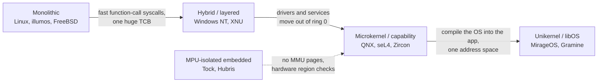

# Kernel Architectures

Monolithic kernels (Linux, FreeBSD) place all services — filesystems, drivers, networking — in a single address space with full hardware access. While performant, this design creates enormous attack surfaces and makes formal verification intractable. Alternative kernel architectures restructure where functionality lives: in separate address spaces (microkernels), in application libraries (exokernels/unikernels), or distributed across cores (multikernels). Understanding these designs is essential for reasoning about isolation, performance trade-offs, and the engineering constraints that shaped modern systems.

## Monolithic Kernels — The Baseline

Linux, FreeBSD, and Windows NT are monolithic: every kernel subsystem runs in ring 0 with shared address space and direct hardware access. System calls cross a single boundary via `syscall`/`sysenter` instructions, and inter-subsystem communication uses direct function calls. Linux mitigates the resulting stability risks with loadable kernel modules (LKM), `lockdep` for deadlock detection, and address sanitizer (KASAN) for memory bugs, but a single buggy driver can corrupt any kernel data structure.

The performance advantage comes from avoiding IPC overhead. A `read()` system call in Linux goes: VFS → filesystem → block layer → driver → hardware, all via function calls with pointer passing. No message serialization, no context switches between protection domains. The compensating discipline is observability rather than isolation: illumos bet on the same modular-monolithic shape and made it debuggable with DTrace's whole-system dynamic tracing (see [illumos and DTrace Heritage](./illumos-dtrace-heritage.md)), an idea Linux later re-derived with ftrace and eBPF.

## Microkernels

Microkernels move all non-essential services — filesystems, device drivers, network stacks — into user-space servers. Only scheduling, IPC, and address space management remain in the kernel. The canonical examples are MINIX 3, QNX Neutrino, and L4 family kernels (L4Ka::Pistachio, Fiasco.OC). Modern descendants push the idea further: Fuchsia's Zircon makes *capabilities* the core object model with all drivers in user space ([Fuchsia and Zircon](./fuchsia-zircon.md)), and the embedded world builds microkernel-style RTOSes around message passing (see [RTOS and Real-Time Systems](./rtos-real-time.md)).

The key mechanism is **IPC as the fundamental primitive**. In the L4 microkernel family, IPC maps directly to register-level message passing with a single `l4_ipc()` system call that atomically switches threads and transfers message registers. This is dramatically faster than the Mach microkernel's approach of copying messages through port rights.

```
┌─────────────────────────────────────────────────────┐
│                   User Space                         │
│  ┌──────────┐  ┌──────────┐  ┌──────────┐          │
│  │ FS Server│  │Net Server│  │Dev Driver│          │
│  └────┬─────┘  └────┬─────┘  └────┬─────┘          │
│       │              │              │                │
│       └──────────────┴──────────────┘                │
│                      │ IPC                           │
├──────────────────────┼──────────────────────────────┤
│            Microkernel (ring 0)                       │
│         IPC │ Scheduler │ AS Management              │
└──────────────────────┼──────────────────────────────┘
                       │                               │
                   Hardware                             │
```

### QNX Neutrino — Production Microkernel

QNX achieves hard real-time guarantees with a microkernel under 100 KB. Its `MsgSend`/`MsgReceive`/`MsgReply` operations implement **zero-copy message passing** where the kernel re-maps the sender's buffer into the receiver's address space without copying. QNX has been used in automotive (GM, Audi), medical devices, and industrial control systems where deterministic response times and fault isolation are mandatory.

### The L4 Family and Minimalism

Jochen Liedtke's L4 microkernel (1995) proved that microkernel IPC could be fast — 10x faster than Mach — by minimizing abstraction. L4Ka::Pistachio implements IPC in ~20 instructions on x86. The key insight: **minimize kernel code path length, not the number of abstractions**. The seL4 kernel (see below) extended this with formal verification.

## Exokernels

Exokernels (MIT, 1995) take the opposite approach from microkernels: instead of abstracting hardware away, they **expose hardware resources directly to applications** and multiplex at the lowest level. The kernel's only job is to securely multiplex CPU, memory, and disk — not to provide abstractions like files or sockets.

Applications implement their own OS abstractions as **library operating systems (libOS)** linked directly into the application. A database can implement a custom buffer cache that knows about its access patterns, rather than suffering through the kernel's generic page cache.

```
Traditional:  App → System Call → Kernel Abstraction → Hardware
Exokernel:   App + libOS → Secure Binding → Hardware
```

Aegis (1995) and XOS (2000) demonstrated that exokernels could match or beat monolithic kernel performance for specific workloads because the libOS eliminated cross-abstraction overhead. However, the lack of standardized abstractions made application portability difficult, and the approach never achieved mainstream adoption. The dedicated deep dive lives at [Exokernels](./exokernels.md).

## Unikernels

Unikernels compile the application and only the required OS components into a single, specialized machine image that runs directly on a hypervisor (Xen, KVM) or bare metal. There is no POSIX layer, no shell, no multi-process support — only what the application needs. Examples include MirageOS (OCaml), IncludeOS (C++), and Rumprun.

```
┌───────────────────────┐
│  Application Code     │
├───────────────────────┤
│  Required LibOS Only  │  ← no unused drivers, no shell
│  (network, libc stub) │
├───────────────────────┤
│  Minimal Hypervisor   │
└───────────────────────┘
  Image size: often < 1 MB
  Boot time:  milliseconds
  Attack surface: minimal
```

MirageOS compiles OCaml applications into Xen unikernels. A DNS server unikernel might be 1.2 MB with ~5 ms boot time. The security advantage is significant: there is no shell to escape to, no unused network stack to exploit. Docker uses unikernel principles in its `linuxkit` initiative for minimal container base images.

The trade-off: no fork/exec, no multi-process debugging, limited ecosystem. Unikernels excel for single-purpose cloud functions and network appliances, not general-purpose computing. The dedicated page at [Unikernels](./unikernels.md) covers the build and deployment mechanics.

## Multikernel — Barrelfish

Barrelfish (ETH Zurich / Microsoft Research, 2009) treats a multicore machine as a **distributed system**. Rather than sharing kernel data structures protected by locks, each core runs its own independent kernel instance with its own scheduler, memory allocator, and device driver. Inter-core communication uses explicit message passing — the same abstractions used in distributed systems.

```
Core 0          Core 1          Core N
┌──────────┐   ┌──────────┐   ┌──────────┐
│ Local    │   │ Local    │   │ Local    │
│ Scheduler│   │ Scheduler│   │ Scheduler│
│ Local MM │   │ Local MM │   │ Local MM │
├──────────┤   ├──────────┤   ├──────────┤
│ Message  │◄─►│ Message  │◄─►│ Message  │
│  Pass    │   │  Pass    │   │  Pass    │
└──────────┘   └──────────┘   └──────────┘
     │                               │
     └──────── Network-on-Chip ──────┘
```

The motivation is cache coherence scalability. As core counts grow (64, 128, 256+), hardware cache coherence protocols (MESI, MOESI) become bottlenecks. Barrelfish's message-passing model avoids shared-writer contention entirely. The research demonstrated that for core counts above ~32, message-passing outperforms shared-memory locking for many kernel workloads. However, the programming model is significantly more complex, and no mainstream OS has adopted this approach yet.

## seL4 — Formally Verified Microkernel

seL4 (NICTA/UNSW, now HENSOLDT Cyber) is a L4-family microkernel that was the **first general-purpose OS kernel with a machine-checked mathematical proof of implementation correctness** (2009). The proof covers: implementation adherence to specification (functional correctness), absence of uninitialized memory reads, absence of data type violations, and absence of certain information flows.

The seL4 capability system provides fine-grained access control. Every kernel object (page tables, IPC endpoints, interrupts) is accessed through unforgeable capabilities stored in a CSpace (capability space). Capabilities confer specific rights — read, write, grant — and cannot be forged because they are indexed, not pointer-based.

```
Capability Layout in CSpace:
┌──────┬──────┬──────┬──────┐
│ CSpace │ CPTR │Rights│ Type │
├──────┼──────┼──────┼──────┤
│       │  0x4 │ R/W  │ Page │
│       │  0x8 │ Grant│ EP   │
│       │ 0x10 │ R    │ PT   │
└──────┴──────┴──────┴──────┘
```

Performance: seL4 IPC is ~100 ns on ARM Cortex-A53, ~150 ns on x86-64. This is within 2-3x of a Linux system call, despite full isolation. seL4 is used in defense systems (HENSOLDT Cyber), aerospace, and is being evaluated for automotive use under ISO 26262.

## Library OS — Brief Deep Dive

A Library OS (libOS) links the operating system functionality directly into the application as a user-space library. Rather than making system calls, the application calls libOS functions that manage resources. **Graphene** (later renamed **Gramine**), a user-space library OS designed to run unmodified Linux applications inside Intel SGX enclaves, and gVisor's Sentry use libOS principles to provide compatibility layers. In the exokernel model, the libOS *is* the OS; in container runtimes like gVisor, the libOS translates POSIX semantics to host kernel primitives, providing a compatibility and isolation layer without full virtualization. (Note: GrapheneOS is a separate, unrelated project — a hardened Android mobile OS — and should not be confused with Graphene/Gramine.)

## A Survey of Real Kernels

The architecture labels above are abstractions; production kernels sit at specific, learnable points in the design space. The table below maps real systems to the decisions that define them — useful both for interviews ("compare XNU and Linux") and for reading kernel source without getting lost.

| Kernel | Design point | Address-space model | Syscall / entry path | Driver model | Isolation & failure containment | Verification status | Footprint |
|---|---|---|---|---|---|---|---|
| **Linux** | Modular monolithic | Shared kernel AS + per-process user AS | Direct `syscall` dispatch to ~460 syscalls | Loadable kernel modules in ring 0 | One kernel AS: any driver can corrupt anything; kdump/panic on fault | None — tested/fuzzed (syzkaller, KASAN, lockdep) | ~30M LoC, huge installed base |
| **Windows NT** | Hybrid layered (HAL, kernel, executive) + user-mode subsystems | Per-process AS; paged/non-paged kernel pools | `ntdll` stubs → `KiSystemService` | WDM/WDF kernel drivers; UMDF user-mode option | Kernel drivers share kernel AS (win32k legacy); bugcheck on fault | None — static analysis (SDV), fuzzing, certified processes | Large; Win32 + NT native API surface |
| **XNU (macOS/iOS)** | Hybrid: Mach 3.0 + BSD + IOKit fused in one kernel | Mach tasks/threads under BSD processes | Two syscall conventions: Mach traps + POSIX/BSD | IOKit C++ drivers in-kernel; DriverKit moves some to user space | In-kernel kexts panic the system; code-signed | None — fuzzing, code signing, sandbox profiles (see [XNU internals](./xnu-darwin-internals.md)) | Tens of M LoC ecosystem |
| **Zircon (Fuchsia)** | Capability-based object kernel, user-space drivers | Process per AS; handles are capabilities | ~60 syscalls, FIDL IPC | Drivers are restartable user-space driver hosts | Driver crash contained to its host process | Component contracts declared + validated; narrower research proofs of Zircon pieces (see [Fuchsia/Zircon](./fuchsia-zircon.md)) | Small, targeted |
| **seL4** | Verified L4 microkernel, end-cap capabilities | Capability-addressed objects, no raw pointers | Single IPC/syscall entry point | User-space drivers mandatory | Per-component isolation with proven integrity/confidentiality | Machine-checked functional correctness (Isabelle/HOL) | ~10K LoC C |
| **QNX Neutrino** | Message-passing RTOS microkernel | Drivers/servers in user ASes; kernel <100 KB | `MsgSend`/`MsgReceive`/`MsgReply` | User-space drivers via IPC + interrupt bindings | Driver restart (HA manager); ASIL D certified | None formal — safety-certification process instead | Tiny |
| **illumos** | Modular monolithic + DTrace | Shared kernel AS | Syscall table + probe points everywhere | Kernel-space modules; Zones for containment | Zones isolate tenants; FMA reports faults | None — DTrace is observability, not proof (see [illumos/DTrace](./illumos-dtrace-heritage.md)) | Large, mature |
| **MINIX 3** | Reliable microkernel, reincarnation server | Drivers in user ASes | IPC to user-space servers | All drivers user-space, restartable | Reincarnation server restarts dead drivers | None — reliability by restart, not proof | Small (~6K LoC kernel in v3 era) |
| **Tock / Hubris** | MPU-isolated embedded kernels in Rust | One task per MPU region set; no MMU assumed | Syscall + kernel-mediated IPC | Drivers are capsules (Tock) or tasks (Hubris) | MPU bounds every task; fault restarts one task | Memory safety by construction (Rust type system) | Designed for ≤64 KB MCUs |
| **Unikernels (MirageOS)** | LibOS compiled into the app, single AS | One AS total; hypervisor is the boundary | Hypercalls / virtio, no syscalls | Typed library drivers compiled in | No processes to isolate; hypervisor enforces | Type safety of source language, no kernel proof | Hundreds of KB – MB (see [Unikernels](./unikernels.md)) |

Three patterns fall out of the table. First, the syscall column tracks the architecture: monoliths dispatch directly into shared code, microkernels turn everything into IPC, unikernels eliminate the boundary entirely. Second, driver model is the best single predictor of failure behavior — in-kernel drivers mean any fault can panic the system, user-space drivers mean a fault restarts one process. Third, "hybrid" is not a compromise that failed: NT and XNU both kept microkernel concepts (layering, user-mode subsystems) but drew the line where performance demanded it — NT 4.0 moved graphics into the kernel (`win32k`), and XNU fused Mach into BSD rather than paying Mach IPC costs on every syscall.

## Isolation Mechanisms Across Designs

Every architecture answers one question differently: *what stops component A from corrupting component B?* The mechanisms differ in hardware cost, granularity, and what they actually contain:

| Mechanism | Example systems | Runtime cost | Granularity | What it contains |
|---|---|---|---|---|
| Separate address spaces (page tables) | Linux, NT, XNU, illumos | TLB fill on switch (mitigated by PCID/ASIDs) | Per process | Memory corruption stays inside one process |
| User-space servers + IPC | QNX, MINIX 3, seL4, Zircon | IPC round trip (~100 ns seL4) | Per subsystem/driver | Driver faults are restartable; kernel TCB small |
| Capabilities | seL4 CSpace, Zircon handles | Rights check per use | Per object/operation | Forgery and confused-deputy escalation |
| MPU regions | Tock, Hubris (Cortex-M class) | Region reprogramming, 8-16 regions | Per task | Out-of-region access faults without an MMU |
| Language-level isolation | Tock capsules, Hubris (Rust); MirageOS (OCaml) | None at runtime | Per component | Memory-safe code; logic bugs still possible |
| Hypervisor boundary | Unikernels, Gramine, gVisor | VM exits / interception | Per VM/sandbox | The host kernel itself is untrusted |

These compose rather than compete: seL4 = address spaces + capabilities + IPC; Tock = MPU + Rust capsules; a unikernel = hypervisor + language safety. The design choice is really about *where you pay*: page-table isolation costs context-switch cycles, capability checks cost a validation on every object use, language isolation costs build-time discipline and a restricted language. See [Memory Internals](./memory-internals.md) for the address-space mechanics and [Virtualization](./virtualization.md) for the hypervisor end of the spectrum.

## The Verification Spectrum

"Verified" and "safe" are claims on a ladder, and interviewers increasingly probe what each rung actually guarantees:

| Claim | What it actually means | Example | Cost / limits |
|---|---|---|---|
| Tested, not proven | Fuzzing, sanitizers, and deadlock detectors reduce bug density; says nothing definitive about unknown bugs | Linux (syzkaller, KASAN, lockdep); NT (Static Driver Verifier) | Continuous CI effort, forever; no completeness |
| Memory safety by construction | The source language's type system rules out whole bug classes (buffer overflows, UAF); concurrency and logic bugs remain | Tock, Hubris (Rust); MirageOS (OCaml) | Requires language discipline; `unsafe` blocks escape the guarantee |
| Machine-checked functional correctness | The C implementation provably refines an abstract specification in a proof assistant (Isabelle/HOL); seL4 adds proved integrity, confidentiality, and worst-case execution-time bounds | seL4, ~10K LoC, ~20 person-years of proof effort | Proves the model holds under assumptions: correct hardware, trusted boot state, some assembly paths; excludes hardware faults and (early) side channels |
| Declared, enforced contracts | Component wiring and capability routing are declared in manifests and validated before launch — a policy-level guarantee, not code correctness | Fuchsia component framework | Proves intended structure, not implementation behavior |

The honest summary: seL4's proof is the strongest *kernel* claim in production use, but it is a claim about ~10K LoC against a spec, not about your application, the compiler's backend, or failing RAM. Fuchsia ships a different, weaker-but-practical claim: the component model makes unauthorized capability flows structurally impossible, while academic work continues to verify individual Zircon primitives. Everything else on the ladder is evidence, not proof — valuable, but a different kind of statement.

## The Design-Space Spectrum



Moving right in the spectrum trades raw syscall throughput for isolation, containment, and (at the seL4 end) verifiability; the embedded branch trades generality for running without an MMU. No point dominates: Linux owns general-purpose computing, seL4/QNX own safety-critical, unikernels own minimal attack-surface appliances, and the MPU kernels own cheap silicon.

## Consequences for Practice

### Driver Debuggability and Blast Radius

The architecture determines what a driver bug costs. In Linux, a bad dereference in a driver panics the whole kernel — mitigated by kdump, crash dumps, and an extraordinary observability stack (ftrace, eBPF), but the recovery is a reboot. In QNX, seL4, or Zircon, the same bug kills one user-space driver process, which the system restarts while everything else keeps running — that is the entire selling point of the architecture for cars and medical devices. The trade is tooling maturity: monolithic ecosystems have decades of debugging infrastructure that microkernel ecosystems cannot match, which is a real operational cost when you evaluate "more reliable by construction" against "easier to debug in production."

### Security Architecture Answers

TCB size is the number to quote. A Linux kernel with drivers is on the order of 30M LoC, essentially all of it in ring 0 with full privilege; seL4 is ~10K LoC with everything else pushed out. Driver code accounts for the bulk of kernel CVEs, which is why user-space driver frameworks (DriverKit, Fuchsia driver hosts, USBIP/vhost-user on Linux) and capability systems (which structurally prevent a confused deputy from exercising rights it was never granted) keep recurring in security architecture questions. When asked "how would you sandbox X," knowing that a capability kernel makes the answer "grant exactly the handles it needs" — versus an LD_PRELOAD/seccomp apparatus on Linux — signals real depth (see [seccomp and BPF](./seccomp-bpf.md)).

### Choosing Embedded and Specialized Stacks

The stack choice follows from three constraints: certification, memory budget, and determinism. Automotive/medical with ISO 26262 requirements push toward QNX or seL4-class kernels with safety cases; MPU-class hardware (no MMU, tens-of-KB RAM) pushes toward Zephyr/Tock/Hubris (see [RTOS and Real-Time Systems](./rtos-real-time.md)); and soft real-time on commodity hardware is increasingly Linux with PREEMPT_RT, which merged into mainline around kernel 6.12. Unikernels and libOS systems (Gramine for SGX, gVisor for multi-tenant sandboxing) are the right answer when the threat model includes the host kernel itself. For a structured path through this material, see [Kernel Learning Path](./kernel-learning-path.md).

## Comparison

| Feature | Monolithic (Linux) | Microkernel (seL4) | Exokernel | Unikernel (MirageOS) | Multikernel (Barrelfish) |
|---------|-------------------|---------------------|-----------|----------------------|--------------------------|
| Kernel size | ~30M LoC | ~10K LoC | ~5K LoC | Minimal (app-only) | Per-core small |
| IPC mechanism | Function calls | Kernel IPC | Secure bindings | N/A (single process) | Message passing |
| Isolation | None (kernel-wide) | Full (per-server) | Per-application | Hypervisor-level | Per-core |
| Formal verification | No | Yes (seL4) | No | No | No |
| Performance | Best (raw) | ~2-3x syscall cost | Application-optimal | Near-bare-metal | Scales with cores |
| Ecosystem | Massive | Limited | Academic | Growing (cloud) | Academic |
| Use cases | General purpose | Safety-critical | Research | Serverless, IoT | Manycore research |

## Cross-References

- [Windows NT Internals](./windows-nt-internals.md) — the hybrid/layered design in full depth
- [XNU and Darwin Internals](./xnu-darwin-internals.md) — Mach + BSD + IOKit composition
- [Fuchsia and Zircon](./fuchsia-zircon.md) — capability-based kernel and component model
- [RTOS and Real-Time Systems](./rtos-real-time.md) — QNX, Zephyr, Tock, Hubris in context
- [illumos and DTrace Heritage](./illumos-dtrace-heritage.md) — modular monolithic + observability
- [Exokernels](./exokernels.md) — the secure-multiplexing research line
- [Unikernels](./unikernels.md) — build, boot, and deploy mechanics
- [xv6: the Teaching Kernel](./xv6-teaching-kernel.md) — a minimal monolithic kernel for learning
- [BSD Family Internals](./bsd-family-internals.md) — the other major monolithic family
- [Virtualization](./virtualization.md) — the hypervisor boundary unikernels and sandboxes rely on

## Interview Questions

1. **"Why doesn't Linux use a microkernel?"** Answer hint: Linux's monolithic design maximizes syscall throughput by avoiding IPC between protection domains. The LKM system provides modularity without the IPC cost. Torvalds' 1992 Tanenbaum-Torvalds debate centered on this: microkernels of that era (Mach) were 2-10x slower. Modern L4 microkernels narrowed the gap, but Linux's ecosystem lock-in makes migration impractical.

2. **"When would you choose a unikernel over a container?"** Answer hint: Unikernels eliminate the host OS kernel attack surface and reduce image size by 10-100x. Choose unikernels for single-purpose network functions (DNS, TLS termination, API gateways) where boot speed and minimal attack surface matter. Choose containers when you need the full POSIX ecosystem, multi-process support, and standard tooling.

3. **"What is the fundamental insight of the Barrelfish multikernel?"** Answer hint: That cache coherence doesn't scale to 100+ cores for kernel data structures, so treat the machine as a distributed system with message passing between core-local kernels. This trades programming complexity for scalability.

4. **"How does seL4's capability system prevent privilege escalation?"** Answer hint: Capabilities are unforgeable indices into a CSpace, not raw pointers. Even with a memory corruption bug, an attacker cannot fabricate a valid capability to access protected objects. The formal proof guarantees that the implementation enforces capability access control.

5. **"Windows NT and XNU are called hybrid kernels — hybrid between what, exactly?"** Between microkernel *structure* and monolithic *performance*: both borrow microkernel ideas (layering, user-mode subsystems, Mach's VM/IPC in XNU) but keep drivers and hot paths in kernel space, because the IPC tax on every call was unacceptable on 1990s hardware. The tell-tale evidence: NT 4.0 moved the graphics stack into the kernel (`win32k`), and XNU fused Mach into BSD instead of running them as separate servers with Mach-port IPC between them. The interview point: "hybrid" describes where services live, not a third fundamental architecture — ask "where do the drivers run?" and the picture clarifies immediately.

6. **"What does seL4's formal proof actually guarantee — and what doesn't it?"** It guarantees, machine-checked in Isabelle/HOL, that the C implementation refines an abstract specification (functional correctness), and on supported configurations it adds proved integrity, confidentiality, and worst-case execution-time bounds — you can state deadlines about kernel operations. It does not prove your user-space components correct, does not cover hardware faults or all side channels, and rests on assumptions (correct hardware, trusted initial state, some verified-assembly boundaries). Saying exactly that — claim, scope, assumptions — is what separates candidates who read the SOSP abstract from those who understand verification as engineering.

## Key Takeaways

- Architecture = a small set of decisions: where services live, how components communicate, and what stops one component from corrupting another.
- Monolithic wins syscalls (function calls in one AS), microkernels win containment and restartability (IPC between user-space servers); L4 proved the IPC tax can be ~20 instructions.
- "Hybrid" (NT, XNU) means microkernel concepts with monolithic driver placement — driven by performance, confirmed by NT 4.0's win32k and XNU's fused Mach.
- Capabilities (seL4, Zircon) replace ambient privilege with per-object rights; MPU regions and Rust type systems bring isolation to MMU-less embedded hardware (Tock, Hubris).
- The verification ladder: tested ≠ type-safe ≠ machine-checked refinement; only seL4 claims the last rung, and its proof has explicit assumptions and a ~20 person-year price tag.
- Driver model predicts failure behavior: in-kernel driver fault → panic; user-space driver fault → process restart. It also predicts most kernel CVEs.
- Practical selection: certification + determinism → QNX/seL4; no-MMU hardware → Tock/Hubris/Zephyr; soft real-time on commodity hardware → Linux + PREEMPT_RT; host-kernel distrust → unikernels/libOS sandboxes.

## References
- Liedtke, J. "On Micro-Kernel Construction." SOSP 1995.
- Engler et al. "Exokernel: An Operating System Architecture for Application-Level Resource Management." SOSP 1995.
- Baumann et al. "The Multikernel: A New OS Architecture for Scalable Multicore Systems." SOSP 2009.
- Klein et al. "seL4: Formal Verification of an OS Kernel." SOSP 2009.
- Madhavapeddy et al. "Unikernels: Library Operating Systems for the Cloud." ASPLOS 2013.
- Liedtke, J. "Improving IPC by Kernel Design." SOSP 1993.
- Tanenbaum, A.S., Herder, J.N., Bos, H. "Can We Make Operating Systems Reliable and Secure?" IEEE Computer, 2006.
- Klein, G. et al. "Comprehensive Formal Verification of an OS Microkernel." ACM TOCS 32(1), 2014.
- Levy, A. et al. "Multiprogramming a 64 kB Computer Safely and Efficiently." SOSP 2017.
