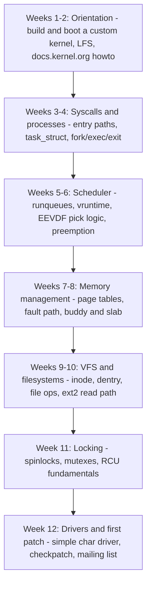
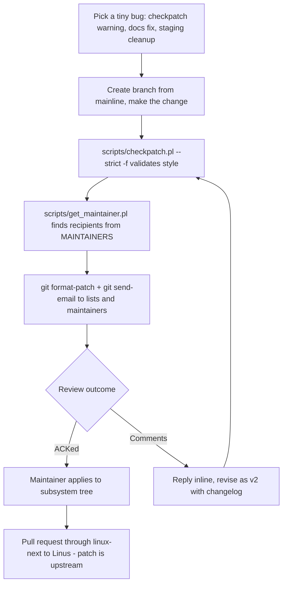

# How to Start Reading the Linux Kernel

The Linux kernel is ~30 million lines of code across ~70,000 files, and the single most common question from students aiming at systems roles is "where do I even begin?" The honest answer is that nobody reads the kernel linearly — experienced kernel developers navigate it like a city they know, entering through well-understood streets and building a mental map subsystem by subsystem. This page gives a concrete 12-week source-reading curriculum, the tooling that makes navigation feasible, the subsystems with the best learning-per-line-of-code ratio, and the first-patch workflow that turns reading into a verifiable credential for interviews. Pair it with the conceptual foundations in [kernel architectures](./kernel-architectures.md) and the [kernel overview](../../os/kernel/README.md); use it as the bridge between xv6-style whole-system understanding and production-scale reading (see [xv6: Anatomy of the Teaching Kernel](./xv6-teaching-kernel.md)).

## The Tooling That Makes It Possible

Six resources cover 90% of what you need. Learn them before touching code, because reading the kernel without cross-referencing tools is like reading a map without a legend:

| Tool | What it does | How to use it |
|------|--------------|---------------|
| [docs.kernel.org](https://docs.kernel.org/) | Official kernel documentation, rendered from `Documentation/` | Start with `process/howto.html` and `process/development-process.html`; every subsystem directory has its own docs |
| [LWN.net](https://lwn.net/) | Deep technical journalism: merge-window reports, API changes, subsystem deep dives | Search for a subsystem name + "LWN" before reading code; the Kernel Page and articles like the 2017 "CPU isolation" series explain *why* code looks the way it does |
| [elixir.bootlin.com](https://elixir.bootlin.com) | Hyperlinked cross-reference of the entire source tree, every version | Treat it as your IDE: click any symbol to see definitions, callers, and macros; switch versions to match your distro kernel |
| [KernelNewbies](https://kernelnewbies.org/) | Newcomer tutorials, first-patch guide, IRC/mailing community | Read "FirstKernelPatch" and "Kernel Hacking" tutorials; their FAQ answers the questions you're embarrassed to ask |
| [Bootlin training materials](https://bootlin.com/docs/) | Free PDFs of Bootlin's commercial kernel/driver/embedded training slides | The kernel and driver-development slides are the closest thing to a structured textbook; exercises reference real code paths |
| [Linux From Scratch](https://www.linuxfromscratch.org/) | Build a minimal distro by compiling each component yourself | Demystifies the kernel↔userland boundary; do it once to never fear boot/init questions again |

Plus the mothership: [kernel.org](https://www.kernel.org/) hosts the git trees, and `git log`/`git blame` are the most underrated documentation — commit messages in the kernel are technical essays, and reading the history of a file often teaches more than the file itself.

Two habits make these tools compound:

- **Pin your version.** Elixir lets you pick an exact release (say 6.6). Match it to the tree you build and the docs you read; subsystem code moves between versions and a mismatch wastes hours of confusion.
- **Read history as literature.** For any function you care about, run `git log --follow` and read two or three formative commits. The message that introduced EEVDF, or folios, or the dentry cache, explains constraints that the current code silently assumes.

### The Elixir Workflow, Step by Step

A ten-minute loop that turns Elixir from "a website" into your primary IDE:

1. Open [elixir.bootlin.com](https://elixir.bootlin.com) and pin the exact version you are building (say `linux/v6.6`) so line numbers and symbols match your tree.
2. Search for the function or struct — the box accepts identifiers and regexes — and you land on the definition with every token hyperlinked.
3. Click any *use* of a symbol to jump; click the symbol itself and toggle the declared/referenced filter to separate definitions from call sites across files.
4. Scope the index to a subtree (say `mm/` or `arch/x86/`) when a common symbol like `get_page` has hundreds of hits — path filters turn noise into signal.
5. For macros that defeat comprehension, open the Identifiers tab to see where each is `#define`d per architecture — the thing ctags and most LSP setups routinely get wrong in `include/linux/`.
6. Keep a notes file open and paste file:line anchors as you go — the discipline that turns reading into the written traces the curriculum asks for.

### Mining LWN Well

[LWN](https://lwn.net/) rewards a search strategy more than a subscription reflex: almost everything becomes free to read two weeks after publication, so the archive is effectively open — subscriber support funds the model, which is a nice sentence to say in interviews about sustainability. Three habits: search the subsystem name plus a year to find the deep dive that explains a design change (EEVDF, MGLRU, folios all have canonical articles); read the merge-window reports during weeks you feel lost — they summarize 10,000 commits into the twenty that matter; and use the Kernel Page as an index of long-form series you can queue for a subsystem month.

## A 12-Week Source-Reading Curriculum

The curriculum below assumes 8–10 hours/week, a throwaway VM or spare machine, and the discipline of *taking notes as file paths* — every insight should end with "I saw this in `kernel/fork.c:2890`." Elixir makes that cheap; your notes make it durable.



### The Curriculum as a Table

The same plan in lookup form — one row per week, with the docs.kernel.org path to read, the LWN article concept worth searching as a companion, and a concrete exercise that proves the week happened:

| Week | Subsystem | docs.kernel.org reading | LWN companion (search term) | Exercise |
|------|-----------|-------------------------|-----------------------------|----------|
| 1 | Build and boot | `/admin-guide/` — README, sysrq, kernel-parameters | "kbuild: the kernel build system" | Boot a self-built kernel in QEMU; add a `printk` to `start_kernel()` and see it live |
| 2 | Development process | `/process/howto.html`, `/process/development-process.html`, `/process/coding-style.html` | "How to participate in kernel development" | Read one full review thread in the lore archives; rewrite a commit message to house style |
| 3 | Syscall entry | `/userspace-api/` plus the entry-assembly comments for your arch | "anatomy of a system call" | strace a `write()`; map every register to the entry path; find `do_syscall_64` in Elixir |
| 4 | Process lifecycle | Code-first: `kernel/fork.c` and `fs/exec.c` beside Elixir | CLONE-flag coverage and "process creation" | Produce a fork→exec→exit→wait trace with file:line references |
| 5 | Scheduler I | `/scheduler/` — sched-design-CFS, sched-arch | "CFS and virtual runtime" | Read `/sys/kernel/debug/sched/`; explain enqueue-to-pick in your notes |
| 6 | Scheduler II | `/scheduler/` plus sched tunables in `/admin-guide/` | "EEVDF" (the 2023 replacement) | Trigger a preemption under `perf sched`; walk the pick-logic call chain |
| 7 | MM I — translation and faults | `/mm/` — gup, numa; pgtable comments in `arch/x86` | the VM series ("memory management") | Walk one page fault with ftrace; map error-code bits to fault-handler branches |
| 8 | MM II — allocation and reclaim | `/mm/` (slub) and `/admin-guide/mm/` | "MGLRU" coverage | Stress with a memory hog; watch PSI and `/proc/zoneinfo` react |
| 9 | VFS | `/filesystems/vfs.html` — the ops-struct contract | the "path walking" series | Trace `open()` through lookup to `struct file`; prove warm-dcache `stat` does zero I/O |
| 10 | Filesystems | `/filesystems/ext4/` on-disk layout docs | "ext4 delayed allocation" | Mount an ext2 image and hexdump an inode; find its data blocks by hand |
| 11 | Locking and RCU | `/RCU/whatisRCU.html` and `/locking/` | the "What is RCU" series | Convert a small rwlock design to RCU; argue the grace-period cost |
| 12 | Drivers and first patch | `/driver-api/` and `/process/submitting-patches.html` | "submitting patches" howto | Send one real patch; archive the lore link in your notes |

Treat the two MM weeks and the two scheduler weeks as pairs with a mid-point review: the single most common failure mode in self-study is drifting past week 8 with no artifacts, so every row's exercise produces something a reviewer could look at.

### Practice Loops Between Weeks

Reading without retrieval decays in days; each week needs a closing loop that takes under an hour:

- **Blank-page re-derivation**: from memory, draw the week's path (syscall entry, fault, open) with function names, then check against Elixir. The gaps are the study list.
- **Instrument, don't just read**: reproduce one dynamic behavior per subsystem — a latency trace for the syscall week, a `perf sched` record for the scheduler, PSI counters for MM. Tooling from [ftrace](../../linux/debugging/ftrace.md) and [bpftrace](../../linux/observability/bpf-bpftrace.md) makes the kernel answer back instead of staying silent prose.
- **Explain to one artifact**: write a 300-word explanation of the week's mechanism as if for a teammate; any sentence that needs hand-waving is the next reading target.
- **Carry one question forward**: park the question the week could not answer and resolve it within two weeks — unresolved questions are how self-study quietly collapses.

### What Good Notes Look Like

Format matters more than tool. A good reading note has four parts: a one-line mechanism summary in your own words; file:line anchors (Elixir makes these cheap); the open question it left you; and, once a fortnight, a diagram — the inode/dentry/file object graph or the fault-path flowchart drawn from memory. Notes keyed by *operation* rather than by file ("what happens on `write()`", "what happens on OOM") convert directly into interview answers, because interview questions are phrased as operations, never as source files.

### Build and Boot, in Eight Commands

The entire week-1 deliverable compresses to this (grab the latest longterm tarball linked from [kernel.org](https://www.kernel.org/)):

```bash
sudo apt install build-essential libncurses-dev flex bison libssl-dev bc dwarves
tar xf linux-6.6.tar.xz && cd linux-6.6
make defconfig                     # sane baseline; allnoconfig + menuconfig teaches more
make -j"$(nproc)"                  # vmlinux, bzImage, and modules
sudo make modules_install          # installs under /lib/modules/<version>
sudo make install                  # drops bzImage into /boot, hooks the bootloader
sudo reboot                        # pick your kernel in GRUB; verify with uname -a
qemu-system-x86_64 -kernel arch/x86/boot/bzImage \
  -initrd initramfs.cpio.gz -append "console=ttyS0" -nographic
```

Three troubleshooting patterns cover most first-build failures:

- **Boot hangs with no output**: add `earlyprintk` and `console=ttyS0,115200` to the command line, and test in QEMU before touching a real machine.
- **Root filesystem not found**: the initramfs lacks the storage driver your distro root uses — regenerate it (`dracut`/`mkinitramfs`) or build the driver in (`=y`, not `=m`) for a first kernel.
- **Modules seem missing or mismatched**: `/lib/modules/<version>` must match the running kernel's exact release string — `uname -a` is the arbiter, and `make modules_install` must come from the same tree that produced the bzImage.

Two accelerators worth learning immediately: `make M=drivers/leds` rebuilds one directory in seconds (your inner loop for driver weeks), and `make dir/file.i` shows preprocessed output — the only reliable way to read macro-heavy code.

**Weeks 1–2 — Orientation and the build.** Configure, compile, install, and boot a self-built kernel ([kernel build](../../linux/build/kernel-build.md), [build system](../../linux/kernel/build-system.md), [configuration](../../linux/kernel/configuration.md)). Add a `printk` in `init/main.c`'s `start_kernel()` and watch it appear at boot — this one act converts the kernel from a monolith into "code I modified." Work through Linux From Scratch in parallel to see what a distro actually assembles. Read `Documentation/process/howto.rst` and skim the [development model](../../linux/history/development-model.md) (how 4,000+ developers coordinate).

Concrete targets for these two weeks:

- Build from a pristine mainline tarball, not a distro-source package, so line numbers match Elixir's mainline view.
- Boot it in QEMU with `-kernel`/`-initrd` first; break it once on purpose (a null deref in a module) and read the oops with `Documentation/admin-guide/bug-hunting.rst` open.
- Skim `Documentation/` top level for 30 minutes daily during week 1 — most of the kernel's institutional knowledge is prose, not code.
- Deliverable: a booted custom kernel, a boot-time `printk` you added yourself, and one page of notes mapping `start_kernel()`'s calls to subsystem names.

**Weeks 3–4 — Syscalls and process lifecycle.** Trace `write(2)` from glibc through entry assembly to `sys_write` ([syscall table](../../linux/reference/syscall-table.md) is your index). Read `kernel/fork.c` end to end — `copy_process`, `dup_task_struct`, the clone flags — and `fs/exec.c`'s `do_execveat_common`/`exec_mmap` swap. The `task_struct` (see [task_struct deep dive](../../linux/kernel/processes/task-struct.md)) is huge; read it *field-cluster by field-cluster* with Elixir open. Deliverable: a written trace of fork→exec→exit→wait with file/line references.

The fork/exit quartet rewards a structured pass:

- `fork`: `kernel/fork.c` — `copy_process()`, what `CLONE_*` flags toggle, how the new task gets a PID and joins its groups ([process creation](../../os/processes/creation.md) for the theory).
- `exec`: `fs/exec.c` — ELF loading, the `bprm` machinery, and the atomic page-table swap that makes `exec` feel instantaneous.
- `exit`: `kernel/exit.c` — `do_exit()`, fd/file teardown, reparenting to `init`, and why zombies exist ([zombie/orphan](../../os/processes/zombie-orphan.md)).
- `wait`: `kernel/exit.c` again — `do_wait()`, the exit-state machine, and where the parent's sleep/wakeup completes the loop.

**Weeks 5–6 — Scheduler.** Start with `kernel/sched/core.c` (enqueue/dequeue, context_switch), then `fair.c` for the virtual-runtime model and the modern EEVDF pick logic (see [EEVDF](../../os/modern/eevdf-scheduler.md), [Linux scheduler](../../linux/kernel/processes/scheduler.md)). Understand per-CPU runqueues, why `schedule()` disables preemption, and where voluntary/involuntary preemption hooks live ([scheduler internals](../../os/advanced/scheduler-internals.md)). Deliverable: explain to a rubber duck how a process goes from `wake_up` to running on a CPU.

Guiding questions to answer in your notes (interviewers love these):

- What does a `vruntime` lag/eligibility mean under EEVDF, and why did it replace pure vruntime ordering?
- Where exactly does preemption happen — tick, wakeup, syscall return, `cond_resched()`?
- What is the cost model behind `sched_migration_cost_ns`, and why does too-aggressive balancing hurt cache locality?
- How do RT (`SCHED_FIFO`/`RR`) and deadline classes coexist with fair class on the same runqueue (see [SCHED_DEADLINE](../../os/modern/sched-deadline.md))?

**Weeks 7–8 — Memory management.** Walk the address-translation story: `mm/memory.c`'s `handle_mm_fault`, the four-level page table walkers, `alloc_pages` into the buddy allocator ([page allocation](../../linux/kernel/mm/page-allocation.md)), slab/SLUB for small objects, and the page-fault error codes that COW depends on ([memory internals](../../os/advanced/memory-internals.md), [COW](../../os/virtual-memory/cow.md)). This is the hardest fortnight; LWN's "VM 101"-era series and Mel Gorman's *Understanding the Linux VM* lineage help.

Break the fortnight into four climbs:

1. **Translation**: read `arch/x86/include/asm/pgtable*.h` types plus `mm/memory.c` walkers until `pgd→p4d→pud→pmd→pte` is reflexive.
2. **Allocation**: buddy free lists and per-CPU pagesets in `mm/page_alloc.c`; then SLUB's fast path in `mm/slub.c` — know why kmalloc(64) and alloc_pages(0) take different roads.
3. **Faulting**: `handle_mm_fault` → `do_wp_page` → `do_anonymous_page`; map each error-code bit to the branch it selects.
4. **Reclaim/THP**: skim `mm/vmscan.c` and [page reclaim](../../os/modern/page-reclaim.md) and [MGLRU](../../os/modern/mglru.md) at overview level — enough to answer "what happens under memory pressure?" without drowning.

**Weeks 9–10 — VFS and a filesystem.** Read `fs/namei.c` path walking (the dcache makes it fast — see [dentry cache](../../linux/kernel/filesystems/dentry.md)), `fs/inode.c`, `fs/read_write.c`, then a *simple* filesystem: ext2's code is the cleanest full-textbook example ([VFS](../../linux/kernel/filesystems/vfs.md), [journaling](../../linux/kernel/filesystems/journaling.md) for why ext4 is not ext2). Deliverable: draw the inode/dentry/file/ superblock object graph from memory and map each to its ops struct.

A useful exercise sequence:

- `open("/tmp/a", O_CREAT)`: watch `do_filp_open` consult the dcache, fall back to `->lookup`, and assemble the `struct file`.
- `write()` to an ext4 file: page-cache write path, `->write_iter`, dirty-page tracking, and where writeback picks it up later (see [io internals](../../os/advanced/io-internals.md)).
- `stat()`: prove to yourself it can complete with zero disk I/O when the dcache is warm — then explain *why* that is safe.
- Mount namespace touch: how `mount` attaches a superblock, and why containers get isolation almost for free here ([namespaces](../../os/containers/namespaces.md)).

**Week 11 — Locking and RCU.** `kernel/locking/`, then RCU: read the doc in `Documentation/RCU/whatisRCU.rst` and `kernel/rcu/tree.c`'s comments (Paul McKenney writes for readers). Know when RCU beats rwlocks and why readers never block ([RCU vs locks](../../os/synchronization/lock-free.md)).

**Week 12 — Drivers and the first patch.** Write the classic misc-character-device and a loadable module ([kernel modules](../../linux/kernel/modules.md), [module internals](../../os/kernel/modules.md)), then pivot to contribution: the first-patch workflow below.

Stretch goals if time remains: ftrace/kprobes instrumentation ([tracing](../../linux/debugging/ftrace.md), [probes](../../os/kernel-advanced/tracing-probes.md), [tracepoints](../../linux/observability/tracepoints.md)), eBPF tooling ([ebpf](../../linux/debugging/ebpf.md)), and the boot path from firmware handoff ([boot process](../../os/kernel-advanced/boot-process.md), [cmdline params](../../linux/kernel/cmdline-params.md)).

## Which Subsystems to Read First

Syscalls, scheduler, and VFS are the right first three, for reasons that double as interview strategy:

1. **The syscall entry path** is the kernel's front door: it touches entry assembly, argument validation, `copy_from_user`, and dispatch. Every later subsystem is reachable from it, and interviewers use "what happens between libc and the syscall handler?" as a seniority filter.
2. **The scheduler** is where data-structure design meets policy: rbtree-based runtime accounting, per-CPU locality, preemption semantics. It also forces you to understand context switching at the assembly level — the single most-cited "do you really know it" question.
3. **VFS** teaches the kernel's object-oriented style (`*_operations` structs, refcounted objects) and connects to storage, caching, and permissions. It is also where the most interview favorites live: what's in an inode vs a dentry, why the dcache exists, how `stat` can be served without disk I/O.

Avoid starting in drivers or networking: they're valuable but heavily indirection-laden (device model, kobjects, SKBs), and their interview payoff per hour is lower early on. Once the core three are mapped, drivers become readable because the object patterns repeat. The revision-level view of all of this for rapid pre-interview refresh is in [OS revision notes](../../revision/os.md).

### A Concrete Reading Order

A sequence that works in practice, tuned for payoff per hour:

1. **Simple drivers first (week-sized snacks).** Read three or four of the smallest class drivers — `drivers/leds/` and `drivers/rtc/` are canonical, most files 100–400 lines — purely to absorb the boilerplate every subsystem reuses: `module_init`/`module_exit`, ops structs, device-model registration, `copy_to_user` on a char device ([kernel modules](../../linux/kernel/modules.md)). Learning the patterns on tiny files costs hours, not weeks.
2. **The syscall entry path.** One traversal of entry assembly → `do_syscall_64` → one concrete `sys_*` function (see the [syscall table](../../linux/reference/syscall-table.md)). This is the front door that makes every later subsystem reachable.
3. **Scheduler, then VFS**, following the week plan above.
4. **Only now**, the subsystem you actually care about — networking, storage, bpf. With the core patterns mapped, its indirections resolve into known shapes instead of new vocabulary; an eBPF-oriented reader can jump straight to [bpftrace recipes](../../linux/observability/bpftrace-recipes.md) and read the tooling against the tracing subsystem.

Two techniques multiply every pass. Read *with the callers pane open* — knowing who calls a function states its invariants faster than the function body does (the Elixir workflow above). And apply the 20-minute rule: if a function resists understanding for twenty minutes, drop to its commit history or an LWN article before pushing harder — the kernel is written to be read with context, not heroically.

## The First-Patch Workflow

Getting one patch merged is the strongest artifact a candidate can point to: it proves you can build the kernel, navigate its culture, and survive review. The workflow is precise and tool-driven:



The mechanics, in order:

1. **Set up `git send-email`.** The kernel does not use GitHub pull requests for most subsystems; patches travel as plain-text email to maintainer-specific lists (the lists and their archives live on kernel.org infrastructure — [kernel.org](https://www.kernel.org/) hosts the trees, and lore.kernel.org archives everything publicly). Configure git's `sendemail.smtpserver` once, then `git format-patch -1` + `git send-email` becomes muscle memory.
2. **Run `scripts/checkpatch.pl`** on every patch. It enforces the coding style (80-column rules, `btw`-style commit-message wrapping, Signed-off-by via `git commit -s`, which legally asserts the Developer Certificate of Origin). Clean checkpatch output is table stakes; reviewers reject style-noise patches on sight.
3. **Run `scripts/get_maintainer.pl`** on the patch to get the exact recipient list from `MAINTAINERS` — sending to the wrong list is the #1 reason first patches get ignored. KernelNewbies' first-patch tutorial walks a docs fix through this pipeline.
4. **Choose a real first patch.** Documentation fixes and staging-driver cleanups are the traditional entry, but pure typo-bombing is now frowned upon by maintainers — pick something with *reasoning*: a checkpatch-corrected locking bug in staging, a missing error-propagation, a comment that misstates behavior. The commit message should answer "why," not "what" (`git log --oneline kernel/sched/` shows exemplary essays).
5. **Survive review.** Expect 2–4 revision cycles (v2, v3… with per-version changelogs below the `---` line). Reply *inline* under quoted context, never top-post. Acceptance ends with an "Applied, thanks" and the patch propagating through subsystem tree → linux-next → Linus's tree over 1–2 merge windows.

### The Commands, End to End

The same workflow as the muscle memory it becomes:

```bash
# one-time: identity + mail transport (git send-email ships as a separate package)
git config --global user.name "Your Name"
git config --global sendemail.smtpserver smtp.example.com

# branch from mainline, change, commit with a DCO sign-off
git checkout -b my-fix
git commit -s                      # subject: "subsys: imperative summary"

# validate before anyone else sees it
git format-patch -1
./scripts/checkpatch.pl 0001-subsys-imperative-summary.patch
./scripts/get_maintainer.pl 0001-subsys-imperative-summary.patch

# send as plain text to exactly those recipients
git send-email --annotate --to <first-maintainer> --cc <lists-from-get_maintainer> 0001-*.patch

# revise under review: v2 with changelog, threaded under v1
git format-patch -v2 -1 --in-reply-to="<message-id-of-v1>"
```

The division of labor is worth internalizing: `checkpatch.pl` is the style gate nobody should see you fail, `get_maintainer.pl` parses `MAINTAINERS` so you never guess recipients, `format-patch` turns a commit into a reviewable mail, and `send-email` closes the loop — plus KernelNewbies' first-patch tutorial ([kernelnewbies.org](https://kernelnewbies.org/)) walks a docs fix through this exact pipeline with screenshots.

### Beyond the First Patch

One merged patch is a credential; sustained contribution is a career track. After the first: pick one subsystem and review other people's patches there (reviewing teaches tree conventions faster than authoring), graduate from docs fixes to small behavioral changes with tests, and learn the release train — patches merged during a merge window land in the next rc cycle, and subsystem trees queue in linux-next before Linus's window opens. Knowing that calendar is what separates contributors from drive-by submitters, and it mirrors how kernel-adjacent teams at infrastructure companies actually run review.

LWN's multi-part "How to participate in kernel development" series is the canonical walkthrough, and `Documentation/process/development-process.html` is the same story from inside the project. Interview relevance is direct: "have you contributed to the kernel?" can now be answered with a lore.kernel.org link — the only systems credential that is publicly verifiable.

## Common Beginner Mistakes

Each of these costs someone weeks every year; all are avoidable:

1. **Reading linearly.** `mm/` in file order is a textbook nobody finished. Follow operations — a syscall, a fault, a mount — not directories.
2. **Version mismatch.** Reading 6.6 docs against a 6.1 tree (or vice versa) produces confusion indistinguishable from your own misunderstanding. Pin one version across docs, Elixir, and your build.
3. **Starting in networking or core filesystem code.** Highest indirection density (SKBs, kobjects, RCU-heavy lists) with the least scaffolding; the core three teach the patterns that make these readable later.
4. **Treating `task_struct` as one sitting.** It has hundreds of fields owned by a dozen subsystems — read it in clusters, on demand, via Elixir.
5. **Ignoring commit history.** The code shows *what*; the commit message shows *why*. Skipping `git log` is skipping half the documentation.
6. **Overbuilding in week 1.** A week hand-tuning a distro kernel config teaches less than one defconfig boot, one deliberate crash, and one oops read.
7. **Patch hygiene gaps.** No `Signed-off-by`, subjects not in imperative `subsys: summary` form, HTML mail (lists reject it on arrival), top-posted replies, or wrong-list submissions — checkpatch plus get_maintainer plus plain-text discipline prevents all five.
8. **Lurking without artifacts.** Asking "where do I start?" repeatedly instead of picking the curriculum and producing traces, modules, and a patch link every week — the artifacts are the point.

## How This Shows Up in Interviews

Systems interviewers rarely ask you to recite kernel code; they probe for *signals* that you have navigated real source. The reading plan above generates those signals deliberately:

- **End-to-end stories.** "I traced a `write()` from glibc to the block layer" beats "I took an OS course." Practice narrating one full path per subsystem with file names attached — the same skill the xv6 page builds at toy scale ([xv6 anatomy](./xv6-teaching-kernel.md)).
- **Design-history literacy.** Reading commit messages teaches the *why*: CFS→EEVDF motivation, the dcache's raison d'être, RCU's read-side cost argument. Interviewers reward candidates who say "the design changed in 2023 because…" over those reciting textbook CFS.
- **Tooling fluency.** Mentioning Elixir, ftrace, and lore.kernel.org in answers signals you operate, not just study. A one-liner like "I verified that in `handle_mm_fault` via Elixir on the 6.6 tree" is worth more than a paragraph of theory.
- **Verified contributions.** A merged patch is a public artifact you can link in your resume (see [projects section guidance](../../resume/projects.md)); even a docs fix demonstrates the workflow maturity interviewers associate with production engineers.
- **Concept bridges.** Every kernel subsystem here has a theory twin in the OS chapter of this book — scheduling theory in [OS overview](../../os/overview.md), page-replacement in [virtual memory](../../os/virtual-memory/page-replacement.md), sync in [synchronization](../../os/synchronization/README.md). Interviews alternate between theory and source; knowing both sides of each bridge lets you steer.

## Interview Questions

1. **"How would you go about understanding a 30M-line codebase like the Linux kernel?"** Answer: Never linearly. Pick three cross-cutting entry points — syscall entry, scheduler, VFS — and trace concrete operations end to end (one syscall, one scheduling decision, one `stat`) with a cross-referencer like Elixir, recording file/line notes. Use commit history as documentation, LWN for design rationale, and docs.kernel.org for contracts. Convert reading into writing (a module, a patch) to force completeness. This answer mirrors the 12-week curriculum above and shows you treat scale as a navigation problem, not a memorization problem.

2. **"What happens between a userspace `open()` call and the filesystem receiving the request?"** Answer: glibc places the syscall number and arguments in registers; the arch-specific entry instruction (e.g., `syscall` on x86-64) switches to ring 0 at a fixed entry point, which saves user context and switches stacks via per-CPU TSS. The generic `do_syscall_64` indexes the syscall table; `sys_openat` (the modern variant of open) copies the pathname with `strncpy_from_user`, resolves it through VFS path walking against the dentry cache (`link_path_walk` in `fs/namei.c`), invokes the filesystem's `lookup` on a miss, allocates a `struct file`, and installs it in the fd table, returning the lowest free descriptor.

3. **"Why does the kernel not guarantee a stable ABI for drivers, while FreeBSD does?"** Answer: A frozen in-kernel ABI would prevent internal refactoring — core kernel changes often require touching every driver. Linux's policy (no stable in-kernel ABI/KBI) lets maintainers restructure freely and keeps all drivers in-tree where they're maintained by the community; distro LTS kernels provide the de facto stability users need by patching forward. FreeBSD, with a smaller ecosystem and an integrated base system, guarantees KBI within a stable branch so third-party modules survive updates. Both are rational; they optimize for different ecosystems — a great answer acknowledges the trade-off rather than declaring one wrong.

4. **"What does checkpatch.pl actually check, and what does a good first kernel patch look like?"** Answer: checkpatch enforces the coding style: line-length rules, brace/spacing conventions, commit-message format (subject prefix, imperative mood, wrapped at 72), and it flags suspicious constructs like `sizeof` on types or usage of deprecated APIs. A good first patch is small, motivated, and reasoning-rich: a real bug fix or a behavior-clarifying comment rather than a drive-by typo, with a commit message explaining *why*, a proper `Signed-off-by` (DCO), recipients from `get_maintainer.pl`, and willingness to revise through review cycles. Mentioning that maintainers now discount typo-only patches shows current-culture awareness.

5. **"Which kernel subsystem would you read first and why?"** Answer: The syscall entry path first (the front door: entry assembly, argument validation, dispatch), then the scheduler (data structures plus policy, plus the assembly-level context switch), then VFS (the kernel's object-oriented style with ops structs and refcounting, plus the dcache/inode story). These three cross every other subsystem, carry the highest interview-question density, and make drivers and networking readable afterward because the object patterns repeat.

6. **"You found a suspected bug in the scheduler. What's your process from suspicion to upstream fix?"** Answer: Reproduce and instrument first — ftrace or a bpftrace one-liner to capture the misbehavior, plus a minimal reproducer. Verify against current mainline (the bug may be fixed or behavior changed); read the relevant code history with `git log`/`git blame` to check intent. Write the fix with a rationale-bearing commit message, run checkpatch, build and boot-test on the affected configs, then send via `git send-email` to `get_maintainer.pl` output with the reproducer and before/after numbers inline, and iterate through review (v2 with changelog). The emphasis on reproducibility and history-checking is what distinguishes a contributor from a reporter.

7. **"What's the difference between reading kernel source on Elixir versus reading it in an IDE?"** Answer: Elixir indexes every released version of the tree with macro-aware cross-references and zero setup — decisive when symbols are defined by preprocessor metaprogramming (`include/linux/` headers generating per-arch code) that defeats ctags/LSP indexing. An IDE on a configured tree gives better type navigation and completion for ordinary C, and is required for actual development. The realistic workflow combines both: Elixir to move across versions and subsystems quickly, a local build tree for the code you modify — and `git log` remains the third tool neither replaces, because the commit messages are where intent lives.

8. **"The kernel ships every ~9 weeks — how do you stay current once you've learned it?"** Answer: Follow cadence and structure, not individual lines. Read the LWN merge-window reports each release to see which subsystems changed and why; keep one deep path you re-trace per release (the fault path, say) as a diff-sensitivity probe; rely on docs.kernel.org, which updates with the tree; and treat design-level changes — EEVDF replacing CFS pick logic, MGLRU in reclaim, folios replacing pages — as the durable events worth studying, since line-level churn mostly reverts or stabilizes. The skill being demonstrated is triage: knowing which of ~50,000 changes per release matter for your subsystem, and having the tooling (Elixir version switch, lore archives, merge reports) to answer it in an hour.
