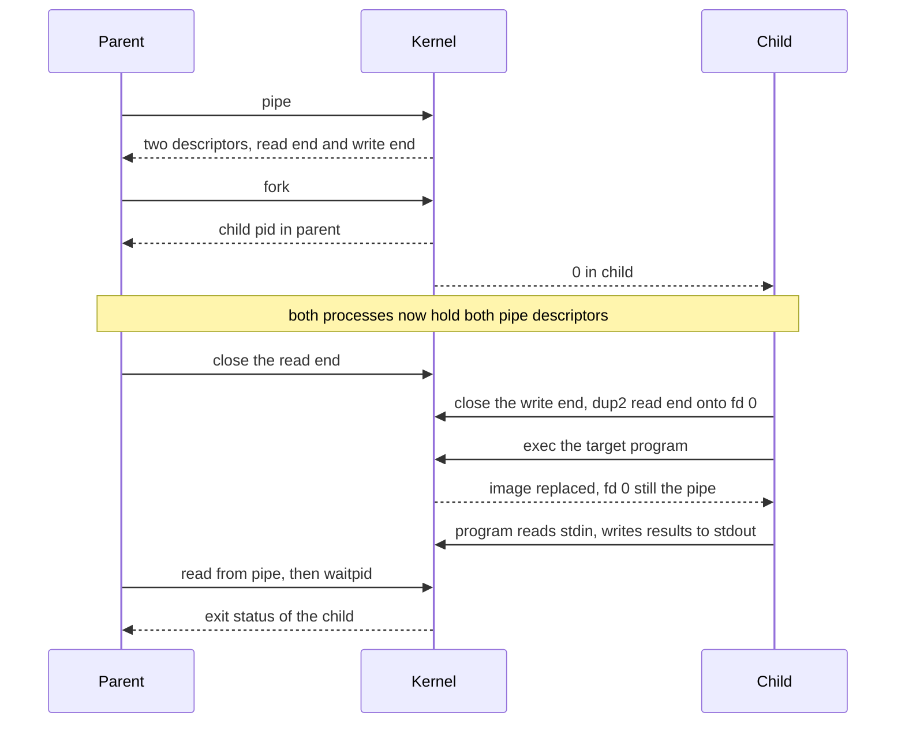
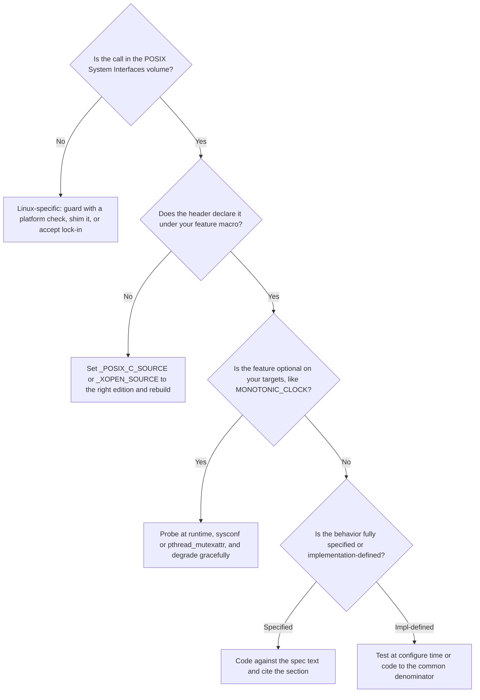

# POSIX & the Single UNIX Specification

## Overview

POSIX (IEEE 1003.1, jointly maintained with The Open Group as the Single UNIX Specification) is the contract that lets the same C program compile and behave identically on Linux, FreeBSD, macOS, illumos, AIX, and every other Unix-like system — and knowing where that contract starts and stops is what separates a senior systems engineer from someone who has only ever written Linux code. Interviewers probe it with questions like "is `dprintf` POSIX?", "why does `posix_spawn` exist alongside `fork`?", and "what actually breaks when `_XOPEN_SOURCE` is set wrong?" This page covers the standards landscape and how it is maintained, what POSIX specifies versus what it leaves implementation-defined, the man-page culture that documents the differences, feature-test macros, the realtime extensions, process lifecycle and signals per the spec, and the practical art of *reading the standard as the arbiter* when documentation and implementations disagree. The C-side usage patterns (file I/O, fork/exec code, sigaction structs) are in [POSIX and System Programming in C](../../languages/c/posix.md); this page is about the standards themselves and how to argue with them.

## The Standards Landscape

Three names, one document family. **POSIX** is the IEEE Std 1003.1 series ("Portable Operating System Interface"), dating to 1988. **The Single UNIX Specification (SUS)** is The Open Group's superset — everything POSIX requires plus XSI extensions and the UNIX trademark certification requirements. The **Austin Group** — a joint working group of IEEE, The Open Group, and ISO/IEC — maintains both as a single text, which is why the same content appears as IEEE 1003.1, ISO/IEC 9945, and SUS at once. The whole thing is free to read online at [pubs.opengroup.org](https://pubs.opengroup.org/onlinepubs/9699919799/) — a rare property for a standards body, and the reason "let's check the spec" is a practical answer rather than a joke.

| Edition | What it is | Notes |
|---|---|---|
| POSIX.1-2008 / SUSv4 base (Issue 7) | The edition most documentation targets | The URL above is its full text |
| POSIX.1-2017 | Issue 7 rolled up with errata and technical corrigenda | "2017" is the same spec, corrected — not new features |
| POSIX.1-2024 (Issue 8 / SUSv5) | First substantive revision since 2008 | Adds long-de-facto interfaces (e.g., `getentropy`, `closefrom`), retires more legacy interfaces, tightens process-creation and signal wording |
| Base Specifications "Issue 7, 2018 edition" | What the free online copy calls itself | Cite by issue number when disputing portability |
| (historical) POSIX.2 | The shell & utilities standard, folded into 1003.1 | Why `sh`, `grep`, `awk`, and `make` semantics are also specified |

The spec has multiple volumes: **Base Definitions** (concepts, headers, limits), **System Interfaces** (every function, with SYNOPSIS/DESCRIPTION/RETURN VALUE/ERRORS sections), **Shell & Utilities** (the command set `sh`, `grep`, `make`, ...), and **Rationale** (often the most readable part — it explains *why*). Optionality is marked: `_POSIX_MONOTONIC_CLOCK`, `_XOPEN_UNIX`, `_POSIX_THREADS`, and so on are compile-time feature gates a platform can decline, which is exactly why the feature-test macro system in a later section exists.

## What POSIX Specifies vs Leaves Implementation-Defined

The recurring interview trap is assuming POSIX pins down more than it does. The table is the honest map:

| Area | Specified by POSIX | Left to the implementation |
|---|---|---|
| Signals | Signal numbers for the mandatory set, `sigaction` semantics, blocked-mask rules | Extra signal numbers, delivery *ordering* among pending signals, which signal a specific hardware fault maps to (only SIGSEGV/SIGFPE/SIGILL/SIGBUS/SIGTRAP are arch-mapped) |
| pthreads | Thread creation/join/detach, mutex/condvar/rwlock semantics, cancellation points | Scheduling policy *defaults* (POSIX says what SCHED_FIFO means, not that your platform has it), thread stack addresses and default sizes beyond a minimum |
| fork/exec | Semantics of address-space duplication, descriptor inheritance, exec-on-failure rules | Whether fork even works well with threads+malloc locks (real implementations differ), vfork-like behaviors are explicitly messy |
| TTY | termios attribute model, line-discipline basics | Everything about job control polish: how your terminal actually renders, window size propagation beyond SIGWINCH existing |
| Files & dirs | `open`/`stat`/`opendir` semantics, `struct stat` *fields* (st_mode, st_size, st_mtime), PATH_MAX as a *limit* | `struct stat` *layout* (padding, order, extra fields), birth time (absent from the base spec), exact behavior when two writes race |
| Locale | The concept: LC_CTYPE etc. change behavior of ctype/strcoll/printf | Which locales exist, how UTF-8 is encoded, collation tables |
| Realtime extensions | mqueues, named/unnamed semaphores, clock_settime, aio, SCHED_FIFO/RR semantics — *if* the options are implemented | Whether they are implemented at all; priority ranges (query them with `sched_get_priority_min/max`) |
| Sockets | POSIX specifies `sys/socket.h` and XTI-adjacent parts | The Berkeley sockets API as universally practiced is only partially standardized (XSI marks much of it); IPv6 specifics came via RFCs |

The pattern to internalize: POSIX specifies *semantics* and *minimums* ("at least", "at most one of"), implementations supply *numbers and layouts*. Code that depends on the numbers (a fixed `struct stat` size, SIGRTMAX as a constant expression, `PATH_MAX` as a compile-time constant) is non-portable even though every individual call is POSIX.

## man-pages and Sectioning

The [Linux man-pages project](https://man7.org/linux/man-pages/) is the de-facto API documentation for Linux, and its sectioning scheme is an interview-ready shorthand:

| Section | Content | Portability status |
|---|---|---|
| 2 | System calls (`open(2)`, `fork(2)`) | Documents Linux behavior, often notes POSIX differences |
| 3 | Library functions (`printf(3)`, `pthread_create(3)`) | Section 3p pages (from `man-pages-posix`) are the POSIX text itself |
| 5 | File formats (`proc(5)`, `fstab(5)`) | quintessential Linux-isms |
| 7 | Overviews and conventions (`signal(7)`, `pthreads(7)`, `capabilities(7)`) | The best-written conceptual summaries in the whole corpus |

The working habit to describe in interviews: read section 2/3 for how Linux behaves, section 7 for the conceptual map, and the 3p/7p POSIX pages (or the Austin Group text directly) for what is *portable*. When the two disagree, the man page usually says so explicitly — `signal(2)`'s page is the classic example, spending half its length explaining why you should use `sigaction(2)` instead.

## Feature Test Macros: the Portability Layer

POSIX headers expose different declarations depending on which feature-test macros you define, because one header file must serve strict ISO C builds, XSI applications, and Linux-specific programs simultaneously. The four that matter:

| Macro | Meaning | Typical value |
|---|---|---|
| `_POSIX_C_SOURCE` | Expose POSIX functions up to a named edition | `200809L` (Issue 7), `202405L` (Issue 8) |
| `_XOPEN_SOURCE` | POSIX + XSI (SUS) extensions — sockets, curses-era extras | `700` = Issue 7, `800` = Issue 8 |
| `_DEFAULT_SOURCE` | glibc: POSIX *plus* BSD/SVID extras (`strdup` pre-POSIX, `sys/param.h` bits) | defined by default when nothing else is |
| (none) + `-std=c99` | Strict ISO C only — POSIX declarations vanish | breaks everything that assumed libc = POSIX |

What breaks when they're wrong is precise and worth having as a war story: compile with `-std=c99` and no macro, and `strdup`, `sigaction`, `pthread_create` all fail to declare (you get implicit-declaration warnings, then link errors, then — with threads — silently wrong behavior on some ABIs). Define `_POSIX_C_SOURCE=199309L` and you get the realtime extensions but not `readlinkat` (a 2008 addition). Define `_XOPEN_SOURCE=600` on Linux and `epoll` disappears from headers because it is not XSI. The fix is a discipline, not trivia: **set exactly one macro to the *oldest* edition your code requires, in the build system rather than per-file**, and let CI on a second OS (a BSD or macOS) be the portability test. The source-level rules this enforces are the same ones the C side of this book practices in [POSIX and System Programming in C](../../languages/c/posix.md).

## The Realtime Extensions (POSIX.1b)

The 1003.1b-1993 realtime additions are the part of POSIX embedded and HFT engineers actually live in, and the overview pages `mq_overview(7)` and `sem_overview(7)` document the Linux takes:

- **Message queues** (`mq_open`, `mq_send`, `mq_receive`, `mq_overview(7)`) — priority-ordered kernel-resident queues with `mq_notify` signal/thread notification; the portable alternative to pipes when messages must be discrete and prioritized.
- **Named and unnamed semaphores** (`sem_open`, `sem_init`, `sem_overview(7)`) — counting semaphores as first-class objects, unlike SysV semaphores' set-based API.
- **Clocks and timers** (`clock_gettime`, `clock_settime`, `timer_create`) — `CLOCK_REALTIME` (settable, jumpable, what wall clocks need) vs `CLOCK_MONOTONIC` (never goes backwards, what interval timing needs); choosing between them correctly is a classic interview check, and converting between them is undefined — they measure different things.
- **Asynchronous I/O** (`aio_read`, `aio_error`, `lio_listio`) — specified, portable, and historically disappointing on Linux (glibc thread-pool AIO; the kernel's `io_uring` is Linux-only and far better). Know that aio is the *portable* answer and io_uring the *fast* one.
- **Scheduling spans** — `SCHED_FIFO` and `SCHED_RR` with priority ranges queried at runtime, plus the process/thread scheduling functions (`sched_setscheduler`, `pthread_setschedparam`). POSIX defines what these policies *mean*; Linux's more modern deadline scheduler (`SCHED_DEADLINE`, EDF + CBS with admission control) is beyond POSIX entirely — see [SCHED_DEADLINE](../modern/sched-deadline.md) for that design, and [Scheduler Internals](scheduler-internals.md) for where the classes live in the kernel.

The clock-choice decision, compressed to the table that settles most arguments:

| Clock | Jumps on set/NTP? | Measures | Use for |
|---|---|---|---|
| `CLOCK_REALTIME` | Yes | Wall time since epoch | Timestamps, calendar scheduling |
| `CLOCK_MONOTONIC` | Never | Unspecified absolute, non-decreasing | Timeouts, interval measurement |
| `CLOCK_MONOTONIC_RAW` (Linux) | Never, no NTP rate adjustment | Raw hardware ticks | Latency benchmarking |
| `CLOCK_PROCESS_CPUTIME_ID` | n/a | CPU time consumed by the process | Profiling, usage accounting |

The synchronization primitives underneath (`pthread_mutex` with `PTHREAD_PRIO_INHERIT`, the futex syscall Linux implements them on) are covered in [Futex Deep Dive](../modern/futex-deep-dive.md) — POSIX specifies the mutex contract; the futex page shows the kernel machinery that honors it.

## Process Lifecycle per POSIX

The canonical lifecycle is `fork` → `exec` → `wait`: `fork()` duplicates the calling process (returning twice — 0 in the child, the child's PID in the parent), the child typically calls one of the `exec` family to replace its image, and the parent reaps status via `wait`/`waitpid`, with the zombie state existing between child exit and reap. File descriptors are *shared* across fork (offsets move together), which is precisely what makes the pipe-wiring pattern below work:



`posix_spawn` exists because `fork+exec` has three structural problems: fork of a large multithreaded process is expensive (page-table copying) even though the child immediately destroys most of it; in the child-between-fork-and-exec only **async-signal-safe** operations are legal, which forbids malloc and makes safe composition genuinely hard; and on MMU-less embedded systems fork cannot be implemented at all. `posix_spawn` exposes the composite operation (with file-actions for descriptor remapping — the `dup2` steps above — and attribute objects for scheduling and signals) as a single syscall-level primitive that kernels can implement without fork:

```c
posix_spawn_file_actions_t fa;
posix_spawn_file_actions_init(&fa);
posix_spawn_file_actions_addclose(&fa, pipefd[1]);      /* child drops write end */
posix_spawn_file_actions_adddup2(&fa, pipefd[0], 0);    /* read end becomes stdin */
posix_spawn_file_actions_addclose(&fa, pipefd[0]);

posix_spawnattr_t attr;
posix_spawnattr_init(&attr);

pid_t pid;
extern char **environ;
posix_spawn(&pid, "/usr/bin/sorter", &fa, &attr, argv, environ);
/* no fork, no async-signal-safe window, no address-space duplication */
```

The interview-worthy judgment: interactive shells and anything needing copy-on-write *state* still want fork; daemons spawning helper programs want posix_spawn; and `system()`/`popen` are just fork+exec + a shell parsing your command line — a quoting hazard, not a primitive.

## Signals Done Right

Signal handling is where portable C code most often silently diverges, and the standard answers are specific. Use **`sigaction`, never `signal`**: `signal`'s semantics (whether the disposition resets, whether syscalls restart) varied historically across System V and BSD and POSIX only obligates it to exist; `sigaction` with explicit flags is deterministic. The essential flags and rules:

- **`SA_RESTART`** makes interruptible syscalls auto-restart after a handler; without it (or for interfaces that never restart, like `select`/`poll` historically), calls return `-1`/`EINTR` and *you* must restart. Production loops wrap blocking calls in an EINTR-retry idiom rather than assuming either behavior.
- **Async-signal-safe only.** Inside a handler you may call only functions listed as async-signal-safe (the `sigaction` spec and `signal-safety(7)`: `write`, `_exit`, `sigaction` itself, ...). `printf` and `malloc` are not on the list — a handler that allocates can deadlock the very lock your interrupted thread holds. State shared with the handler is `volatile sig_atomic_t` at most, or a self-pipe/eventfd write for anything richer.
- **Realtime signals** (`SIGRTMIN`..`SIGRTMAX`, queued, delivered in order) exist for signal-as-message designs; `SIGKILL`/`SIGSTOP` remain non-catchable by definition.
- **The Linux escape hatch** is `signalfd`: turn signals into a readable file descriptor so they integrate with `epoll` event loops instead of interrupting them asynchronously. It is Linux-only — the portable pattern is the self-pipe trick — but knowing when to reach for each is exactly the portability judgment this page teaches.

The sigaction incantation itself, with the flags that carry the semantics:

```c
struct sigaction sa;
sa.sa_handler = on_term;          /* or sa.sa_sigaction with SA_SIGINFO */
sigemptyset(&sa.sa_mask);
sigaddset(&sa.sa_mask, SIGINT);   /* block SIGINT during the handler */
sa.sa_flags = SA_RESTART;         /* resuming, not EINTR — a policy decision */

if (sigaction(SIGTERM, &sa, NULL) == -1) {
    perror("sigaction");
}
```

Every line encodes a decision the standard makes explicit: the mask is what gets blocked *during* the handler, `SA_RESTART` is the choice between auto-restart and explicit `EINTR` handling, and swapping in `sa_sigaction` + `SA_SIGINFO` is how you receive the richer fault context (faulting address, sender PID) that hardware-generated signals carry.

## Error Handling Conventions

POSIX error reporting is a contract: functions return `-1` (or NULL, or an error number directly for pthreads), set `errno`, and document the **exact error set** in their ERRORS section. The taxonomy worth knowing by heart: `EINTR` (interrupted — retryable), `EAGAIN`/`EWOULDBLOCK` (try later — the non-blocking idiom), `EINVAL` (bad arguments), `ENOMEM`, `EACCES` vs `EPERM` (permission denied by access control vs by policy/ownership), `EEXIST`, `ENOENT`, `EPIPE`, `ESRCH`. Three disciplines make code correct rather than lucky:

```c
/* 1. The EINTR retry loop: never assume SA_RESTART was set. */
ssize_t r;
do {
    r = read(fd, buf, len);
} while (r == -1 && errno == EINTR);

/* 2. Save errno before any call that may clobber it. */
int saved = errno;
fprintf(stderr, "open: %s\n", strerror(saved));

/* 3. pthreads return errors; they do not set errno. */
int rc = pthread_mutex_lock(&m);
if (rc != 0) { /* rc IS the error number, e.g. EDEADLK */ }
```

The subtlety interviewers probe: `errno` is thread-local (POSIX requires it), it is *only meaningful* after a failing call, and any library call — including `strerror`-adjacent helpers — may overwrite it, which is why the save-before-log pattern exists. `strerror` is locale-dependent and not signal-safe; `strerror_r` exists precisely because of the async-signal-safe list above.

## Portability Gotchas in Practice

The gotchas that actually burn teams, each traceable to the specifies-vs-implementation-defined table:

- **`PATH_MAX`.** POSIX defines it as a *limit* a system *may* not define (path names can exceed any fixed buffer on systems without a limit). Portable code uses `pathconf(path, _PC_PATH_MAX)` and dynamic allocation, and treats fixed `PATH_MAX` buffers as a latent truncation bug.
- **Struct layout and ABI.** `struct stat`, `siginfo_t`, and friends have implementation-defined layouts — padding, field order, and extra fields differ between glibc and musl, between LP64 and ILP32, and between OSes. Never serialize raw structs over a wire or into files; define your wire format or use an encoding.
- **Endianness and integer size.** POSIX gives you `htonl`/`ntohl` for network byte order and fixed-width types via `<stdint.h>`, but nothing about generic in-memory representation. `long` is 64-bit on Linux/macOS LP64 but 32-bit on Windows LLP64 and many 32-bit platforms — another reason the fixed-width types matter.
- **`/proc` and `/sys` are Linux-isms.** Reading `/proc/self/status` or `/sys/class/net` for introspection is common and entirely non-portable: FreeBSD/illumos expose equivalent data through `sysctl`/`kstat` and different tooling. Code that must be portable queries documented interfaces (`sysconf`, `uname`, `getrlimit`) first and treats procfs as a Linux-specific fast path behind a platform check.
- **Serialization of timestamps and ids.** `time_t` width, `struct timespec` field order, and pid/uid ranges all vary; the same raw-struct rule that protects `struct stat` protects anything with a `time_t` in it. Convert to a defined encoding (seconds + nanoseconds as fixed-width integers) at the boundary.



## How to Argue with a Standard

Reading [pubs.opengroup.org](https://pubs.opengroup.org/onlinepubs/9699919799/) effectively is a skill with specific moves:

1. **Use the Index.** The alphabetical index of functions and headers jumps straight to the binding text; the "Shell & Utilities" volume is separate from "System Interfaces" — `sh`, `make`, and `awk` live there.
2. **Read the five sections in order**: SYNOPSIS (which header, which macros gate it), DESCRIPTION (semantics), RETURN VALUE, ERRORS (the *only* errors you may portably expect — anything else is "may" territory), and APPLICATION USAGE.
3. **Respect the marks.** Shaded "OB" text is obsolescent (still specified, discouraged — `creat`, `mktemp`); CX/XSI markings denote extensions beyond strict POSIX that SUS adds; `[Option Start/End]` fences mark optional features.
4. **Distinguish shall/should/may.** "shall" is a requirement on implementations; "should" is advice; "may" is permission. Most portability flame wars dissolve once you notice both sides are arguing about a "may".
5. **Read the Rationale.** Why `fork` was kept despite its problems, why `daemon()` is obsolescent, why `PATH_MAX` is not required — the rationale volume is the written history of the committee's trade-offs, and citing it in a review discussion is the strongest form of "this is settled".
6. **Cite precisely.** "POSIX.1-2017 §2.9.7 Thread Interactions with Regular File I/O" or "sigaction ERRORS, EINTR" ends arguments; "I read somewhere that..." does not.

A worked citation, because the format is half the skill: to defend "our retry loop must handle EINTR on connect", the chain is — System Interfaces volume → `connect()` page → ERRORS section → `[EINTR] The attempt to establish a connection was interrupted...` — plus the Rationale note that connect is one of the interfaces the standard permits to be interruptible. That is a checkable claim; "connect sometimes fails randomly" is not.

## Cross-References

- [POSIX and System Programming in C](../../languages/c/posix.md) — the code-level companion: fork/exec/sigaction/pipe patterns in full
- [Thread Models](../threads/models.md) — the 1:1 mapping pthreads standardizes and the M:N designs it does not
- [Kernel Architectures](kernel-architectures.md) — how monolithic vs microkernel design choices surface as POSIX optionality
- [Futex Deep Dive](../modern/futex-deep-dive.md) — the kernel machinery beneath the pthread primitives POSIX specifies
- [SCHED_DEADLINE](../modern/sched-deadline.md) — Linux's EDF+CBS scheduler, beyond the POSIX SCHED_FIFO/RR span

## Interview Questions

1. **"Is this call POSIX? Walk me through how you'd check."** First I check the Austin Group System Interfaces index at pubs.opengroup.org — if the function is there, the SYNOPSIS shows the exact header and any gating macros, and the ERRORS section lists the errors I may portably handle. Then I check whether the feature is optional (marked with an Option fence like MONOTONIC_CLOCK) or an XSI extension, because a platform can legally omit it. Finally I check the Linux man page for a noted divergence — man pages flag Linux-specific behavior explicitly. A concrete example: `dprintf` is POSIX.1-2008; `epoll` is not POSIX at all; `strdup` is POSIX.1-2008 but vanishes from headers under strict ISO C unless a feature macro exposes it.

2. **"Why does `posix_spawn` exist when `fork`+`exec` works everywhere?"** Fork+exec has three structural costs: duplicating a large multithreaded process's page tables for a child that immediately replaces its image, the async-signal-safety restriction on everything the child does between fork and exec (malloc is forbidden), and the impossibility of implementing fork at all on MMU-less systems. posix_spawn expresses the composite operation — image replacement plus file-actions that do the descriptor remapping — as one primitive a kernel can implement without fork. The nuance worth adding: code that genuinely wants copy-on-write state sharing (shells, forking servers) still wants fork, so POSIX keeps both, and the spec's rationale says exactly this.

3. **"What actually goes wrong when feature-test macros are set incorrectly?"** The failure is declarations, not code: headers gate every POSIX declaration on the macros, so `-std=c99` with no macro hides `sigaction` and `pthread_create` entirely — you see implicit-declaration warnings and then link failures. Setting an *older* edition than your code needs (`_POSIX_C_SOURCE=199309L`) hides later functions like `readlinkat`; setting `_XOPEN_SOURCE` on Linux hides Linux-only APIs like epoll because they are not XSI. The discipline is to set exactly one macro, in the build system, to the oldest edition the code requires, and to run CI on a second OS to catch accidental Linux-isms.

4. **"You must call `printf` from a signal handler — what's the correct response?"** You don't: `printf` and `malloc` are not async-signal-safe, and a handler calling them can deadlock on the very heap or stdio lock the interrupted thread holds. The correct patterns are: set a `volatile sig_atomic_t` flag the main loop checks, or write a single byte to the self-pipe (write is async-signal-safe) so the event loop wakes and handles the signal synchronously — and on Linux, `signalfd` folds signals into epoll as ordinary readable events. If terminal output from a handler is truly unavoidable, `write` to a file descriptor is the sanctioned tool. The deeper point: handlers exist to record that a signal happened, not to do work.

5. **"Why is `CLOCK_MONOTONIC` usually the right clock, and when isn't it?"** `CLOCK_REALTIME` is wall-clock time: it can jump forward or backward on NTP corrections or a manual set, so measuring an interval with it can produce negative durations. `CLOCK_MONOTONIC` advances without jumps, which is what timeouts, rate limiting, and scheduling intervals need. It's not the right tool when you need to display absolute time, schedule against the wall clock, or coordinate timestamps across machines — that's REALTIME's job, ideally with an NTP-disciplined source. POSIX also leaves which clocks a platform implements as an option (probe with `sysconf`/`clock_getres`), which is exactly the kind of optionality the spec table in this page is about.

6. **"Give an example where the standard and the man page disagree, and which wins."** The classic is `signal()`: the man page documents Linux semantics — System V-style disposition reset with SA_RESTART-less behavior — while POSIX only requires that signal exist, historically allowing BSD-style restart semantics on other systems. The spec wins for portability reasoning: portable code uses `sigaction` with explicit flags because signal's behavior is genuinely implementation-dependent. A second example is `PATH_MAX`: Linux defines a constant in limits.h, but POSIX says a system may not define it at all (paths can exceed any fixed limit), so portable code uses pathconf and dynamic buffers. The rule: the man page describes this implementation; the standard defines the portable contract.

## Key Takeaways

- POSIX.1 (IEEE 1003.1), the Single UNIX Specification, and ISO/IEC 9945 are one text maintained by the Austin Group — free online, citeable by issue number (Issue 7 = 2008/2017/2018 editions; Issue 8 = POSIX.1-2024).
- POSIX specifies semantics and minimums; layouts, sizes, priority numbers, and locale content are implementation-defined — the recurring source of portability bugs.
- Feature-test macros (`_POSIX_C_SOURCE`, `_XOPEN_SOURCE`, `_DEFAULT_SOURCE`) are the portability layer: set one, in the build system, to the oldest edition you need.
- The realtime extensions (mqueues, semaphores, `CLOCK_MONOTONIC`, aio, SCHED_FIFO/RR) are optional features — probe, don't assume; Linux's SCHED_DEADLINE goes beyond POSIX.
- fork/exec/pipe wiring works because descriptors are shared across fork; posix_spawn exists because fork is expensive, restrictive (async-signal-safety), and unimplementable without an MMU.
- Signals done right: sigaction with explicit flags, EINTR handling or SA_RESTART, async-signal-safe handlers only, self-pipe/signalfd for event-loop integration.
- `/proc` and `/sys` are Linux-isms; `PATH_MAX`, `struct stat` layout, and `long` size are traps — use `pathconf`, wire formats, and fixed-width types.
- Read the standard like an engineer: Index → SYNOPSIS → ERRORS → marks (OB/XSI/Options) → Rationale, and cite section numbers to settle portability disputes.

## References

- POSIX.1-2017 / SUSv4 base specifications, free full text: <https://pubs.opengroup.org/onlinepubs/9699919799/>
- Linux man-pages project: <https://man7.org/linux/man-pages/>
- Stevens, W. R., Rago, S. *Advanced Programming in the UNIX Environment*, 3rd ed., Addison-Wesley, 2013 (chapters on signals, process control, and the POSIX realtime extensions).
- Kerrisk, M. *The Linux Programming Interface*, No Starch Press, 2010 (feature-test macros, signalfd, and man-pages methodology throughout).
- Austin Group (maintainer body) — see the specification front matter for its charter and revision process.
