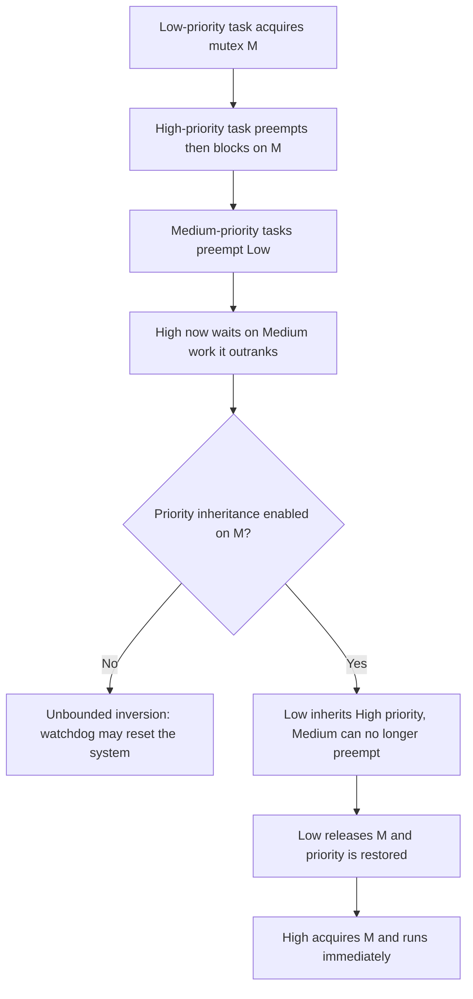
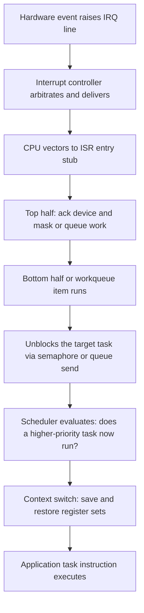

# Real-Time Operating Systems: Zephyr, FreeRTOS, and the RT Landscape

## Overview

A real-time operating system (RTOS) is a small kernel whose defining promise is *bounded, predictable latency* rather than high throughput: every scheduling decision, interrupt path, and lock acquisition completes within a computable worst case. When a control loop must run every 100 microseconds and a missed deadline is a functional failure, general-purpose Linux — with its page cache, RCU callbacks, and non-preemptible sections — is the wrong tool, and something like Zephyr, FreeRTOS, or NuttX takes over. This page covers the RTOS landscape as an interview topic: the scheduling theory you must state precisely, the latency anatomy that separates RTOS from GPOS, and the concrete architecture of Zephyr, FreeRTOS, NuttX, Tock, and Hubris. The pure scheduling math (RMS timelines, EDF traces, CBS details) lives in [Real-Time Scheduling](../scheduling/realtime.md) and [SCHED_DEADLINE](../modern/sched-deadline.md); this page is about the kernels that implement it on microcontrollers.

## When a General-Purpose OS Stops Being Enough

The dividing line is not speed — it is variance. A Cortex-M4 at 180 MHz running FreeRTOS can service an interrupt more predictably than a 5 GHz x86 core running standard Linux, because predictability is a property of the kernel's code paths, not the clock rate. Linux has thousands of code paths where a thread can be delayed arbitrarily long: page faults on memory that was swapped, mmap writeback stalls, scheduler-lock hold times, and non-preemptible regions under spinlocks. An RTOS eliminates the worst offenders by construction: no virtual memory (no page faults), bounded interrupt-disabled sections, and fixed-priority preemptive scheduling as the primary policy.

The requirements taxonomy matters because it drives the whole platform decision:

| Class | Definition | Consequence of a miss | Examples |
|---|---|---|---|
| **Hard** | Deadlines verified by analysis (WCET + schedulability) | System failure, possibly catastrophic | Airbag trigger, pacemaker, flight control |
| **Firm** | A late result has zero value but the system survives | Wasted computation | Packet inspection, sensor fusion frames |
| **Soft** | Occasional deadline misses degrade quality | Gradual degradation | Audio playback, UI responsiveness |

Embedded job roles cluster around this split. Automotive ECUs, medical devices, and avionics run RTOSes with certification evidence (DO-178C, IEC 61508, ISO 26262); consumer IoT firmware runs FreeRTOS or Zephyr because the footprint and power budget demand it; and industrial Linux with PREEMPT_RT sits in the middle where a full network stack is needed but 100-microsecond worst-case latency is also required. The interview framing to remember: **determinism is not throughput** — an RTOS will happily waste 60% of its CPU to make the remaining 40% predictable, and that is a feature.

## The Theory You Must State Precisely

Interviewers use a handful of terms as a shibboleth; get these exactly right.

- **Jitter** is the variation of a periodic event's actual start time around its ideal start time. A 1 kHz loop with ±5 µs of jitter is often a better system than a 1 kHz loop that runs *on average* on time but occasionally slips 2 ms — control loops and DAC output care about the variance, not the mean.
- **WCET (worst-case execution time)** is the longest possible execution of a code segment on given hardware, measured or analyzed statically. Real-time analysis is built on WCET, not average-case; caches, branch predictors, and DRAM refresh all make WCET estimation harder than average-case timing.
- **Rate-monotonic scheduling (RMS)** assigns static priorities inversely to period: shorter period, higher priority. Liu & Layland (1973) proved it is the optimal static-priority algorithm and that a task set with utilization `U = ΣCᵢ/Tᵢ ≤ n(2^(1/n) − 1)` is always schedulable — the bound converges to **ln 2 ≈ 69.3%** as n → ∞. The bound is sufficient, not necessary: real task sets above 69.3% frequently still meet deadlines.
- **EDF (earliest deadline first)** assigns dynamic priority by nearest absolute deadline and is optimal among all uniprocessor algorithms: any task set with `U ≤ 1.0` is schedulable. Its cost is fragility under overload (the domino effect) and harder-to-certify dynamic behavior.
- **Priority inversion** occurs when a high-priority task blocks on a mutex held by a low-priority task that medium-priority tasks can preempt — the high-priority task then waits for *medium* work it should outrank. **Priority inheritance** fixes it: the mutex holder temporarily boosts to the highest priority of any waiter. Unbounded inversion is what famously reset the **Mars Pathfinder** rover repeatedly in 1997: the low-priority meteorological thread held a mutex the high-priority bus-management thread needed, a mid-priority communications thread kept preempting the holder, and the watchdog reset the box. JPL enabled priority inheritance on that mutex from VxWorks and the resets stopped — it remains the canonical war story because the fix was one flag on one mutex.



| Property | RMS | EDF |
|---|---|---|
| Priority basis | Static (period) | Dynamic (absolute deadline) |
| Schedulability bound | 69.3% (sufficient, n→∞) | 100% (necessary and sufficient) |
| Overload behavior | Only low-priority tasks slip | Domino effect |
| Certification friendliness | High (fixed table of priorities) | Lower (runtime-dependent) |
| Linux embodiment | `SCHED_FIFO` | `SCHED_DEADLINE` |

The full worked examples — RMS timelines, utilization arithmetic, and the CBS server Linux uses — are in [Real-Time Scheduling](../scheduling/realtime.md); be able to reproduce the 69.3% derivation sketch (`n(2^(1/n)−1)`, take the limit) on a whiteboard.

## Latency Anatomy: From Interrupt Pin to Task Instruction

Every RTOS claim of "microsecond determinism" decomposes into the same pipeline, and interviews reward engineers who can name the stages and their magnitudes:



| Stage | Typical cost (Cortex-M class RTOS) | Notes |
|---|---|---|
| Interrupt latency (event → first ISR instruction) | ~12–100 CPU cycles | Exception entry, stacking registers; MCU-dependent |
| ISR execution (top half only) | Tens of cycles to a few µs | RTOS discipline: mask nothing long, defer everything |
| Scheduler decision | ~1 µs or less | Fixed-priority bitmap/ring lookup, O(1) |
| Context switch | ~1–2 µs | Fewer registers to save than a GPOS with FPU lazy stacking nuances |
| End-to-end (event → task) | 2–10 µs typical, µs-scale worst case | The number vendors quote in the datasheet |

Two design axes shape those numbers. **Tickful vs tickless**: a classic RTOS fires a periodic timer tick (1 kHz is typical) that wakes the scheduler even with nothing to do, giving simple timeouts but constant power draw; tickless idle suppresses the tick and programs a one-shot timer for the next deadline, trading slightly coarser timeout granularity for orders-of-magnitude lower sleep power — mandatory on battery devices. **Interrupt latency vs dispatch latency**: interrupt latency is hardware-dominated (how fast the CPU vectors), while *dispatch latency* is the scheduler-side delay before the highest-priority ready task actually runs — it is what priority inversion inflates, and the part the RTOS is engineered to bound.

The measurement ritual is part of the discipline. On Linux you run `cyclictest`; on a bare RTOS you toggle a GPIO at the top of the target task and trigger the event from a timer pin, then read the scope histogram:

```c
/* RTOS-side worst-case probe: timer ISR posts a semaphore;
   the measured task toggles a GPIO as its first instruction. */
void timer_isr(void *arg) {
    k_sem_give(&loop_sem);          /* unblock the control-loop task */
}

void control_loop_task(void) {
    for (;;) {
        k_sem_take(&loop_sem, K_FOREVER);
        gpio_pin_set_dt(&probe_gpio, 1);   /* scope measures pin-to-pin */
        run_controller_step();
        gpio_pin_set_dt(&probe_gpio, 0);
    }
}
```

The pin-to-pin scope delta over millions of cycles is the honest worst-case number; anything quoted without that measurement is a datasheet marketing claim. Note what the snippet also encodes: the ISR does no work beyond unblocking — the RTOS idiom of "do nothing in the top half" is what keeps the rest of the system's latency budget intact.

## Zephyr: the Linux Foundation's RTOS

Zephyr is the RTOS with the most Linux-like development model and the widest vendor governance: it is a Linux Foundation project, its releases are time-based, and its [supported board count](https://docs.zephyrproject.org/latest/) exceeds 750 boards across ARM, RISC-V, x86, ARC, and Xtensa. Three tooling pillars make it "feel like a small Linux":

- **West** is the meta-tool (build, flash, debug, and multi-repo manifest management) — the equivalent role `repo` + `make` play in a Linux BSP workflow.
- **Devicetree** describes hardware declaratively: board `.dts` files define peripherals, and Zephyr overlays let you reconfigure them per application. GPIO, sensor, and driver bindings resolve at build time into generated C macros — no runtime device probing on an MCU.
- **Kconfig** selects features and drives `CONFIG_*` pruning, so a minimal kernel image can be a few tens of KB; the configuration system is visibly inherited from the Linux kernel.

The kernel object set is deliberately small and POSIX-adjacent:

| Object | Zephyr API | Semantics an interviewer will probe |
|---|---|---|
| Thread | `k_thread_create` | Fixed priority, own stack; cooperative (negative prio) or preemptive tiers |
| Semaphore | `k_sem` | Counting semaphore, no owner — can't do priority inheritance |
| Mutex | `k_mutex` | Owner-tracked; **priority inheritance built in** (the Pathfinder lesson, default-on) |
| Message queue | `k_msgq` | Copy-by-value fixed-size slots; blocks sender when full |
| Workqueue | `k_work` | Deferred ISR bottom-half execution in a thread context |
| ISR | `IRQ_CONNECT` | Static registration; defers via semaphores or work items |

Scheduling is fixed-priority preemptive with 32 priority levels by default, optional time-slicing at equal priority, an EDF class for cooperative workloads, and a meta-IRQ facility that breaks priority order for deadline-critical deferred work. A minimal application config shows how the Kconfig/devicetree halves meet:

```text
# prj.conf — Kconfig feature selection
CONFIG_GPIO=y
CONFIG_I2C=y
CONFIG_SENSOR=y
CONFIG_MAIN_THREAD_PRIORITY=5

# app.overlay — devicetree override binding a sensor to I2C bus 0
&i2c0 {
    bme280@76 {
        compatible = "bosch,bme280";
        reg = <0x76>;
        status = "okay";
    };
};
```

`west build -b nucleo_f411re app` then resolves the board's `.dts`, merges the overlay, prunes by Kconfig, and emits a single image — one command from source to flashed binary. For interviews, the governance angle matters as much as the tech: [the Zephyr project](https://www.zephyrproject.org/) has Nordic, NXP, TI, and Google shipping it in production silicon SDKs, which is why job posts increasingly name Zephyr specifically, and the [source tree](https://github.com/zephyrproject-rtos/zephyr) is the readable one to study after FreeRTOS.

## FreeRTOS: the Minimal Kernel

FreeRTOS is the volume leader — shipped in effectively every MCU vendor's SDK — and its lesson is that a credible RTOS scheduler fits in a few thousand lines. The [kernel](https://github.com/FreeRTOS/FreeRTOS-Kernel) is small enough to read the scheduler in an afternoon, and the [official documentation](https://www.freertos.org/Documentation/00-Overview) plus the free *Mastering the FreeRTOS* PDF cover the rest. Vocabulary differs from POSIX precisely where interviews probe:

- **Tasks, not threads**: `xTaskCreate(fn, "name", stackDepth, params, priority, &handle)` — each task gets its own statically-sized stack and the scheduler preempts on priority. There is no fork, no MMU-enforced address spaces; all tasks share one flat address space, so a stray pointer in task A corrupts task B. That is the single most important FreeRTOS fact.
- **Queues are the primitive**: `xQueueSend`/`xQueueReceive` implement copy-by-value message passing, and *everything else is derived* — semaphores are queues of length zero-with-count, mutexes are semaphores with priority inheritance, and queue sets let one task block on multiple queues.
- **Stream buffers and message buffers** (later additions) pass byte streams and sized messages with better single-reader/single-writer performance than queues.
- **The tick hook** (`vApplicationTickHook`) runs inside the tick interrupt — the place to implement lightweight time-based work, and also the place where mistakes cost latency for the whole system.

The canonical create-and-communicate snippet compresses the API surface:

```c
void sensor_task(void *pvParameters) {
    QueueHandle_t q = (QueueHandle_t) pvParameters;
    sensor_sample_t s;
    for (;;) {
        read_sensor(&s);
        /* block up to 10 ticks if the queue is full — bounded, not infinite */
        if (xQueueSend(q, &s, pdMS_TO_TICKS(10)) != pdPASS) {
            /* count the drop; do not block the sensor forever */
        }
        vTaskDelay(pdMS_TO_TICKS(100));   /* 10 Hz period */
    }
}

/* xTaskCreate(sensor_task, "sensor", 512, queue, 3, NULL);
   priority 3, 512-word stack — stack size is a static budget you own */
```

Memory policy is explicit and testable, and the five canonical heaps compress the whole "dynamic memory in hard real-time" argument into five names:

| Scheme | Behavior | Determinism | Verdict |
|---|---|---|---|
| `heap_1` | Allocate only, never free | Exact | Safest; set-and-forget deployments |
| `heap_2` | Free without coalescing | Exact per-op | Fragmentation grows over time |
| `heap_3` | Wraps libc `malloc` | Unbounded | Disqualifying for hard RT |
| `heap_4` | First-fit with coalescing | Bounded by heap size | The practical default |
| `heap_5` | heap_4 across non-contiguous regions | Bounded | Multi-RAM-bank parts |

Know that heap_4 is usual, heap_1 is safest, and that serious products trend to fully static allocation (`xTaskCreateStatic`) everywhere — which is also what the certification auditors want to see.

## NuttX: POSIX Semantics on a Microcontroller

Apache NuttX is the outlier: an RTOS whose API is deliberately POSIX — `pthread_create`, `open`/`read`/`write`, `socket`, `mqueue`, even a small shell (`nsh`) — running on microcontrollers with tens or hundreds of KB of RAM. Per the [official docs](https://nuttx.apache.org/docs/latest/), the goal is near-standard code on an MCU, and the [source](https://github.com/apache/nuttx) implements the subset honestly rather than decorating an incompatible API with POSIX names. What that buys you is concrete:

- Existing portable C libraries (parsers, codecs, protocol stacks) often compile against NuttX with a header tweak — the "portable code" dividend that bare-metal SDKs and FreeRTOS cannot offer, because there `open()` does not exist or means something vendor-specific.
- Application logic can be developed and unit-tested on Linux (the POSIX surface is close enough) and deployed to the MCU with the same source — a genuine workflow advantage for teams without hardware-in-the-loop CI.
- It exposes the standard concepts — processes vs threads, file descriptors, TTY semantics — making it the bridge teaching tool between "embedded firmware" and "operating systems" thinking.

The cost is honest to state: filesystem and socket layers add footprint versus FreeRTOS's few-KB kernel, and POSIX on an MCU is a subset with sharp edges (no fork — use `posix_spawn`-style process creation where supported; limited MMU support means most ports are flat address spaces like everyone else). A rule of thumb for the interview: NuttX is the right answer when the workload already looks like "small Unix service" (logging, config files, sockets, multiple cooperating daemons), and FreeRTOS is the right answer when the workload is a hard-RT loop with a radio attached.

## Tock and Hubris: the Rust and Capability Wave

Two recent designs attack the RTOS weak point — one flat address space shared by all tasks — using Rust and MPUs instead of MMUs.

**Tock** ([tockos.org](https://www.tockos.org/), [the Tock Book](https://book.tockos.org/)) runs the kernel as a set of Rust *capsules* compiled into the kernel image (memory-safe by language guarantee) alongside untrusted *processes* that the **MPU** isolates: each process gets fixed regions, and any access outside them faults instead of corrupting the kernel. Grants and callbacks give capsules controlled ways to hand memory to processes. The design point per the [source tree](https://github.com/tock/tock): type safety replaces the MMU for kernel integrity on hardware that has no MMU at all.

**Hubris** (Oxide Computer) goes further into capability discipline: there is no shared kernel address space at all — each task runs isolated by the MPU, and *every* interaction with another task or the kernel goes through explicitly granted IPC endpoints, so a task cannot even name a resource it was not granted. Interrupts are delivered as messages to a supervisor task, making priority inversion structurally difficult. Oxide ships Hubris in production as the management-controller firmware for its servers, including as flight software on NASA's **Pressure Suit Component (PSC) rover** program — a commercial-from-day-one RTOS with unusually candid design documentation at the [reference manual](https://hubris.oxide.computer/reference/) and [source](https://github.com/oxidecomputer/hubris). The interview-worthy contrast: FreeRTOS trusts application code and spends nothing on isolation; Tock/Hubris spend MPU regions and IPC cycles to make untrusted components safe — the embedded analogue of the microkernel debate.

## QNX, seL4, and PREEMPT_RT: the Other RT Paths

Three additional answers complete the landscape. **QNX Neutrino** is the commercial microkernel RTOS that owns automotive infotainment and much safety-critical market share: drivers and filesystems run in userspace over a <100 KB message-passing microkernel, so a driver crash is a process death, not a kernel panic. **seL4** is the formally verified L4 microkernel — machine-checked proofs of functional correctness — where real-time guarantees meet mathematical evidence; see [Fuchsia & Zircon](fuchsia-zircon.md) for the capability-based microkernel theory and [Kernel Architectures](kernel-architectures.md) for the monolithic-vs-microkernel trade. **PREEMPT_RT** is the opposite philosophy applied to Linux: instead of a small kernel, make the big kernel preemptible — threaded interrupt handlers, spinlocks converted to RT-mutexes (priority-inheriting), and volatiles removed until worst-case scheduling latencies land in the 10–100 µs range; the upstreaming effort concluded with much of the work merged into mainline, and Linux 6.12 marked the "full RT" configuration's arrival for all architectures. For how Linux schedules deadline work inside that big kernel, see [SCHED_DEADLINE](../modern/sched-deadline.md) and [Scheduler Internals](scheduler-internals.md). The honest trade: PREEMPT_RT inherits the entire Linux ecosystem but cannot offer microsecond-scale worst cases on all drivers; an RTOS offers small verified paths but you write (and trust) all the drivers yourself — which is also why the unikernel direction in [Unikernels and Library OSes](unikernels.md) rhymes with RTOS footprint arguments.

## Comparison and When Not to Use an RTOS

| Dimension | Zephyr | FreeRTOS | NuttX | Tock | Hubris | Linux + PREEMPT_RT |
|---|---|---|---|---|---|---|
| Footprint | Tens of KB, Kconfig-pruned | Few KB kernel | Larger (POSIX layers) | Small + MPU tables | Small, per-task | MBs, full GPOS |
| License | Apache 2.0 | MIT | Apache 2.0 | Apache 2.0 / MIT mix | MIT | GPL-2.0 |
| Governance | Linux Foundation + vendors | Amazon (AWS) | Apache Foundation | Community (academia-rooted) | Oxide (single vendor) | Community + distros |
| Scheduling | Fixed-prio preemptive, EDF option, meta-IRQ | Fixed-prio preemptive | Fixed-prio + optional RR, POSIX policies | Cooperative + time-sliced processes | Fixed-prio, IPC-driven, no sharing | Full range incl. `SCHED_DEADLINE` |
| Memory protection | Optional MPU/MMU userspace | None (flat address space) | Optional (MMU ports have processes) | MPU-enforced processes | MPU-enforced, capability IPC | Full MMU |
| POSIX | Subset (native + POSIX layer) | Minimal (atomic/queue-like) | Strong — the design goal | None | None (custom syscalls) | Full |
| Certification story | Growing safety tooling; Zephyr used in safety work | Widely used in certified products (evidence is per-product) | Limited | Research-grade | Audited, FOSS-verified (OpenSSF) | PREEMPT_RT out-of-tree/ELISA project effort ongoing |

**When *not* to use an RTOS** is the higher-order interview question, and the honest answers are: (1) when you need a full network stack, filesystems, TLS, and dynamic loading — Linux is more secure *per feature* because thousands of contributors fuzz it, while your RTOS BSP's TCP stack has ten maintainers; (2) when your "real-time" requirement is really soft (rendering, analytics, telemetry) and a GPOS with `SCHED_FIFO` + CPU isolation meets the p99.9 target; (3) when team skills and supply chain dominate — an unfamiliar RTOS can be a bigger project risk than a slower-but-known platform. The counter-rule: if you can state a worst-case latency as a *requirement* (not a hope), a GPOS is out, and the RTOS decision becomes which flavor of small you can certify and staff.

## Cross-References

- [Real-Time Scheduling](../scheduling/realtime.md) — the full RMA/EDF/priority-inversion math with worked timelines (companion theory page)
- [SCHED_DEADLINE: EDF + CBS in the Linux Kernel](../modern/sched-deadline.md) — Linux's admission-controlled deadline scheduler
- [Fuchsia & Zircon](fuchsia-zircon.md) — capability-based microkernel theory in production (Zircon vs seL4 vs QNX table)
- [Kernel Architectures](kernel-architectures.md) — monolithic vs microkernel vs exokernel framing behind the RTOS trade-offs
- [Scheduler Internals](scheduler-internals.md) — CFS/EEVDF, scheduler classes, and the PREEMPT_RT mechanics in Linux
- [Unikernels and Library OSes](unikernels.md) — the other "small, single-purpose kernel image" philosophy

## Interview Questions

1. **"Your product needs a control loop every 1 ms with worst-case jitter under 20 µs. Walk through the platform decision."** Start by making the requirement falsifiable: worst-case, not average, so standard Linux is excluded because page faults, non-preemptible sections, and driver code paths have unbounded tails. The realistic candidates are an RTOS (Zephyr/FreeRTOS) if the application is firmware-shaped, or Linux + PREEMPT_RT with CPU isolation and `SCHED_FIFO` if you need the network stack. On an RTOS, budget the path: interrupt latency (~µs) plus ISR plus scheduler dispatch plus context switch must total well under 20 µs, which a Cortex-M-class MCU meets. Then close with verification: cyclictest or an RTOS-side GPIO-toggle-plus-scope measurement over millions of cycles, because a latency claim without a measurement is marketing.

2. **"Explain priority inversion and how Mars Pathfinder fixed it."** Priority inversion is when a high-priority task blocks on a mutex held by a low-priority task, and unrelated medium-priority tasks preempt the holder, so the high-priority task waits for work it outranks. On Pathfinder, the low-priority meteorological thread held a mutex the high-priority bus-management thread needed, while the medium-priority communications thread kept running on the VxWorks system; the watchdog interpreted the bus task's starvation as failure and reset the spacecraft. JPL reproduced it on the ground, identified the classic pattern, and enabled priority inheritance on that mutex — the holder then runs at the waiter's priority and releases promptly. The interview lesson is that the fix was a mutex attribute flag that already existed in the system, so "we had the mechanism, we didn't enable the policy."

3. **"What does FreeRTOS's heap_1–heap_5 scheme tell you about dynamic memory in real-time systems?"** Each scheme encodes a determinism/fragmentation trade: heap_1 allocates and never frees (fully deterministic), heap_2 frees without coalescing (fragmentation grows over time), heap_3 wraps libc malloc (arbitrary latency, disqualifying for hard RT), heap_4 adds first-fit with coalescing (the practical default), and heap_5 extends the heap across non-contiguous RAM regions. The scheme exists because the underlying truth is that allocation time and fragmentation bounds must be computable in hard real-time. A senior answer goes further: production firmware trends to fully static allocation, and dynamic memory — where unavoidable — is confined to initialization or to pools with bounded block sizes.

4. **"Why does Zephyr use devicetree and Kconfig on a microcontroller, where nothing is plug-and-play?"** Because build-time knowledge is free at runtime: on an MCU there is no bus enumeration, so describing hardware in devicetree and resolving it into generated C macros moves all discovery cost to compile time, which costs zero cycles and zero bytes in flash. Kconfig does the same for features — every `CONFIG_` choice prunes code paths, keeping the image small and the analysis surface small. The result is a system where the linker, not the loader, decides what exists, which also helps safety analysis: you can enumerate exactly which drivers and kernel objects are in the binary. It is the same intellectual move as a unikernel's dead-code elimination, applied to embedded.

5. **"Compare running POSIX on NuttX versus writing vendor-SDK firmware on FreeRTOS."** NuttX gives you real `open`/`read`/`socket`/`pthread` semantics, so portable C libraries compile nearly unchanged and the same application source can be tested on Linux — that is a testing and reuse dividend, not just aesthetics. FreeRTOS gives you a tiny, auditable kernel and maximal vendor support (every MCU ships a port), but no filesystem/POSIX substrate, so you compose vendor HALs and hand-rolled abstractions. The trade is footprint and kernel-auditability versus portability and standard tooling. A good closing point: NuttX's POSIX subset also narrows the skills gap between firmware and OS engineers, which matters for team composition more than for benchmarks.

6. **"What do Tock and Hubris do differently, and why does it matter?"** Both reject the shared-flat-address-space model that FreeRTOS assumes, using the MPU instead of an MMU. Tock runs Rust capsules in-kernel for memory safety by construction and isolates untrusted user processes into MPU regions with grant-based memory sharing. Hubris goes capability-first: tasks interact only through explicitly granted IPC endpoints, interrupts are messages to a supervisor, and priority inversion is structurally hard because there is no shared state to lock around. It matters because embedded systems increasingly integrate third-party code (sensor fusion blobs, radio stacks), and "trust all tasks" stops being viable; Hubris shipping as Oxide's production management controller — and as rover flight software — shows the model is production-grade, not a research toy.

## Key Takeaways

- Real-time means *bounded worst case*, not fast: the platform decision is driven by variance (jitter, WCET) and certification needs, never average throughput.
- RMS: static priorities by period, Liu & Layland sufficient bound 69.3% as n→∞; EDF: dynamic priorities by deadline, optimal at U ≤ 100% but fragile under overload.
- Priority inheritance bounds the unbounded-wait disaster class; Mars Pathfinder (1997) is the canonical one-flag fix story — know it cold.
- Latency anatomy: interrupt latency (hardware) + ISR + dispatch latency (scheduler) + context switch; RTOS datasheets quote the end-to-end worst case in single-digit microseconds on MCU-class silicon.
- Zephyr = devicetree + Kconfig + west, 750+ boards, Linux Foundation governance; FreeRTOS = few-KB kernel, tasks/queues, heap_1–5 memory policy, no isolation.
- NuttX runs near-standard POSIX on MCUs (portability dividend); Tock and Hubris use Rust + MPU-enforced isolation to fix the shared-address-space weakness; Hubris ships on rover flight software.
- PREEMPT_RT is the "make the big kernel preemptible" alternative (threaded IRQs, RT-mutexes, 10–100 µs worst cases); QNX/seL4 are the microkernel answers to fault isolation and proof-carrying correctness.
- Don't reach for an RTOS when the requirement is soft or when the full Linux stack is a security feature; reach for it when a worst-case latency is a stated, verifiable requirement.

## References

- Zephyr Project documentation: <https://docs.zephyrproject.org/latest/>
- Zephyr development guide (contribution and tooling): <https://docs.zephyrproject.org/latest/develop/>
- Zephyr source repository: <https://github.com/zephyrproject-rtos/zephyr>
- Zephyr Project (governance, members): <https://www.zephyrproject.org/>
- FreeRTOS documentation overview: <https://www.freertos.org/Documentation/00-Overview>
- FreeRTOS kernel source: <https://github.com/FreeRTOS/FreeRTOS-Kernel>
- Apache NuttX documentation: <https://nuttx.apache.org/docs/latest/>
- Apache NuttX source repository: <https://github.com/apache/nuttx>
- Tock OS: <https://www.tockos.org/> · The Tock Book: <https://book.tockos.org/> · Source: <https://github.com/tock/tock>
- Hubris reference manual: <https://hubris.oxide.computer/reference/> · Source: <https://github.com/oxidecomputer/hubris>
- seL4 documentation: <https://docs.sel4.systems/>
- Liu, C. L. & Layland, J. W. "Scheduling Algorithms for Multiprogramming in a Hard-Real-Time Environment." *Journal of the ACM*, 20(1), 1973.
- Sha, L., Rajkumar, R., Lehoczky, J. "Priority Inheritance Protocols: An Approach to Real-Time Synchronization." *IEEE Transactions on Computers*, 39(9), 1990.
