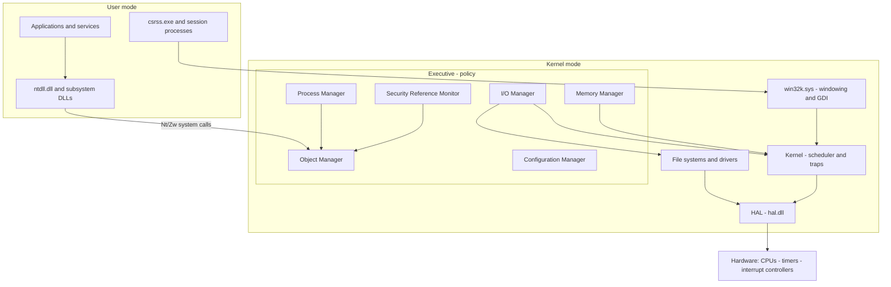
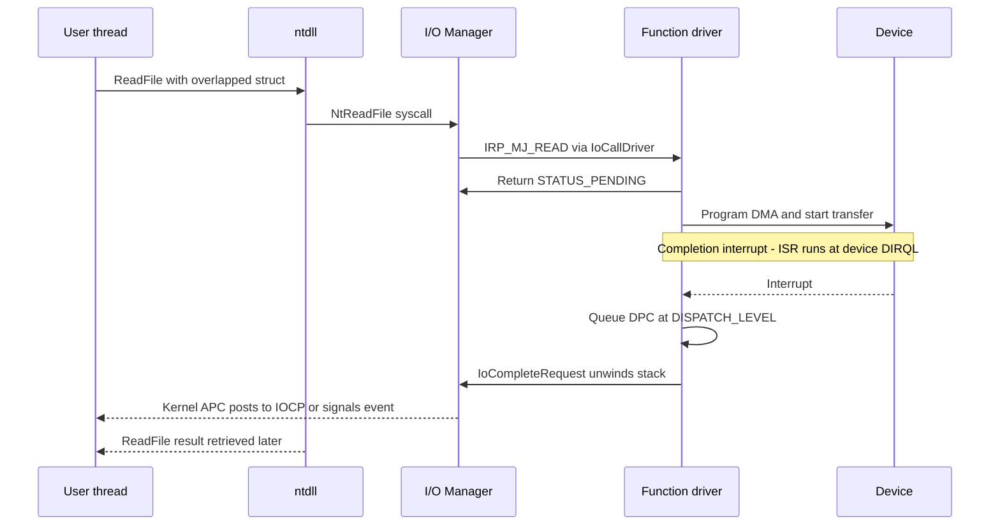

# Windows NT Kernel Internals

## Overview

Windows runs an entire vertical of industry most Unix-centric candidates never see: Azure (a large fraction of VMs there are Windows guests), Active Directory estates, Windows Server fleets, and every kernel-driver role at storage, AV, and EDR vendors. Interviews at those shops probe NT mechanics — IRQLs, IRPs, the object manager, working-set behavior — the way Linux shops probe scheduling and page cache. NT is also the best-documented closed-source kernel in existence: the driver and Win32 documentation on Microsoft Learn is precise enough to reconstruct the internals, and ReactOS gives you a readable open reimplementation of the same architecture. This page covers the design lineage, the layered architecture, processes and the object manager, IRQLs and DPCs, the scheduler, the memory manager, the I/O stack, and the NT-vs-Linux comparison interviewers actually ask.

## Design Lineage — VMS in a New Suit

NT was built by Dave Cutler and roughly 20 engineers he brought from DEC, hired in 1988 after Digital canceled their PRISM/Mica OS project. NT 3.1 shipped in July 1993. The VMS heritage is not a rumor: the two designs share the IRQL concept, the I/O request packet model (VMS IRP → NT IRP), asynchronous system traps (VMS AST → NT APC), and the general executive/kernel split. The reported name anecdote — VMS shifted one letter forward in the alphabet gives WNT — is apocryphal but summarizes the lineage accurately enough to be a good interview aside.

The influence matters because it explains NT's design center: NT was conceived as a portable, secure (C2-targeted), SMP-capable OS with a hardware abstraction layer — not as a Unix. There is no fork heritage; process creation is expensive and explicit, and the primitive IPC substrate is kernel objects and handles, not file descriptors in a shared namespace. When comparing designs, frame it as: POSIX optimized for cheap process creation and a global file namespace; NT optimized for explicit resource ownership via handles and per-object security.

## Layered Architecture

User mode contains processes, their subsystem DLLs, `ntdll.dll` (the native API stubs), and session processes (`csrss.exe` hosts the user-mode side of the Win32 subsystem; `winlogon`, `services.exe`, and friends are ordinary processes started by the session manager). Kernel mode contains four distinct layers that interviewers expect you to name separately:

| Layer | Binary | Responsibility |
|---|---|---|
| Executive | `ntoskrnl.exe` (upper) | Policy: I/O manager, memory manager, process manager, object manager, configuration manager (Registry), cache manager, security reference monitor, PnP and power managers |
| Kernel | `ntoskrnl.exe` (lower, `Ke*`) | Mechanism: thread scheduling and dispatching, trap/interrupt dispatch, DPCs, dispatcher objects (events, semaphores, mutexes) |
| win32k | `win32k.sys` | Window manager and GDI; moved into kernel mode in NT 4.0 for graphics performance |
| HAL | `hal.dll` | Platform differences: interrupt controllers, bus probing, DMA, firmware interfaces |

The executive/kernel distinction is a policy-vs-mechanism split inside one binary — a favorite interview question because it shows NT is *not* a microkernel. The "Kernel" (`Ke*` functions) resembles a microkernel core (scheduling, interrupt handling, synchronization primitives) but runs in the same address space as the executive and exports no IPC; the NT design docs historically called it "the kernel" precisely to avoid claiming microkernel status.

### What Each Executive Component Owns

| Component | Owns | Interview hook |
|---|---|---|
| Object Manager | Object namespace, handle tables, refcounts, quotas, default security | The substrate everything else allocates from |
| Process Manager | EPROCESS/ETHREAD lifecycle, jobs, worker threads | Deliberately does not define the thread scheduling policy (that is Kernel) |
| Memory Manager | VADs, PTEs, page lists, working sets, pools, sections | Prototype PTEs for shared pages; compression store |
| I/O Manager | IRPs, device stacks, IOCP, volume mount points | Filter model is how AV/EDR hook the system |
| Cache Manager | File-system cache on top of mapped sections | Caches *file objects*, not block ranges like Linux |
| Configuration Manager | Registry hives, lazy flush, KTM transactions | Boot-critical state; `SYSTEM` hive is loaded by winload |
| Security Reference Monitor | Token vs security-descriptor checks, audit events (SACL) | `SeAccessCheck` — the choke point for authorization |
| PnP / Power managers | Device enumeration, IRP_MN_* requests, sleep transitions | Driver verification requires handling these correctly |

The division to state out loud: the executive components are *callers* of the object manager for anything with a handle, and *users* of Kernel primitives (dispatcher objects, spinlocks, DPC queues) for synchronization. Nothing in the executive talks to hardware directly — drivers and the HAL sit between it and the machine.

## Processes, Threads, Jobs — and the Object Manager

Every process and thread is both a Windows-handle-visible object and an in-kernel data structure: `EPROCESS`/`KPROCESS` for processes, `ETHREAD`/`KTHREAD` for threads. The `K*` block holds what the scheduler and trap layer need (dispatch state, kernel stack, directory-table base); the `E*` block holds everything else (PID, handle table pointer, `VadRoot` for the virtual address descriptors, access token, working-set bookkeeping). Unlike POSIX, kernel objects are not reached through a global name table: each process has a private handle table (an object manager structure with permissions granted at open time), and names live in a separate object-manager namespace (`\Device`, `\BaseNamedObjects`, `\??`).

Reference counting is a per-object invariant you must be able to state precisely. The object header keeps a pointer reference count and a handle count. Opening by name or duplicating a handle takes a handle reference; `ObReferenceObjectByPointer`/`ObReferenceObjectByHandle` take a pointer reference held by kernel code that will dereference later (typically across an asynchronous operation). `ObDereferenceObject` drops pointer references. When the last handle closes, the object may still be alive due to outstanding pointer references; when the pointer count hits zero, the delete procedure runs and memory is freed. A classic driver bug is completing an IRP whose buffers are backed by an object the driver forgot to reference — user space closes the handle, the object dies, and the deferred operation dereferences freed memory. Handles can be closed even while I/O is outstanding; the reference model is what makes that survivable.

Jobs group processes for accounting and limits (CPU rate caps, memory limits, UI restrictions); nested jobs arrived in Windows 8. The POSIX comparison table:

| Concept | POSIX/Linux | Windows NT |
|---|---|---|
| Creation | `fork()`+`exec()` — cheap, COW address space | `CreateProcess` — one call, no fork; new address space built from the image |
| Identity | PID + uid/gid, inherited ambient authority | PID plus an access token (SIDs, privileges) checked per object |
| Handles | fds in a shared kernel table, often global names | Private per-process handle table, rights fixed at open |
| Name space | One filesystem namespace, `/proc`-visible | Object-manager namespace separate from filesystem |
| Grouping | process groups, cgroups | Job objects (nested since Win8) |
| Threads | tasks sharing fds/signals, clone(2) flags | `ETHREAD` sharing process handles/token, explicit affinity/masks |

## IRQL — NT's Real Concurrency Primitive

Windows formalizes per-CPU interrupt priority into IRQLs (Interrupt ReQuest Level). Code states its required IRQL; raising IRQL masks interrupts at that level and below on that CPU. On x64 the map is: PASSIVE (0), APC (1), DISPATCH (2), device DIRQLs (3–11), IPI (12), clock (13), synchronization (14), HIGH (15). The rules, which are what interviews test:

- At DISPATCH and above: no waiting, no paged-pool or pageable-code access (the pager itself runs below DISPATCH), nonpaged pool only, and no calls that lower IRQL.
- Waiting on dispatcher objects is legal only at PASSIVE. APC-level allows some blocking I/O but not waits.
- A device ISR runs at its DIRQL, so it must grab state and get out — which is exactly why DPCs exist.
- TLB shootdowns and urgent inter-processor work run at IPI level, above every device.

| IRQL | Who runs here | Forbidden here |
|---|---|---|
| PASSIVE 0 | User code, most executive code, file systems | Nothing — can wait, can fault |
| APC 1 | Kernel APCs, paging I/O, some worker callbacks | Waits on dispatcher objects |
| DISPATCH 2 | Scheduler, DPCs, timer dispatch, most spinlock-protected code | Paged memory, waits, anything that blocks |
| DIRQL 3–11 | Device ISRs | Everything above, plus touching shared structures without the device's own sync |
| IPI/clock/HIGH 12–15 | Inter-processor interrupts, tick, Hal internals | Application-visible work |

The DPC watchdog makes the DISPATCH-level contract enforceable: if a DPC or ISR routine overruns its slice or a CPU spends too long cumulative at DISPATCH, the machine bugchecks with 0x133 `DPC_WATCHDOG_VIOLATION`. Linux has no equivalent numbered-level system; it approximates the guarantee with per-CPU preemption state, softirqs, and IRQ-disabling spinlocks — a fair "compare the models" answer notes both enforce the same invariant (interrupt latency bounded), with NT's version auditable per call site.

## DPCs — Bottom Halves, NT Style

A Deferred Procedure Call is a callback queued to run at DISPATCH_LEVEL, normally at the end of an interrupt or timer processing. The ISR at DIRQL queues a DPC and returns immediately; the DPC later does the slow part — completing IRPs, releasing locks, signaling events — without holding the device interrupt masked. DPCs run on the CPU they were queued to, in whatever thread context happens to be current, which is why they must not wait or touch paged memory. Queues are per-CPU with a "target" CPU attribute so a driver can funnel completion to the interrupting CPU and keep cache lines local.

The comparison to Linux softirqs is direct: both are deferred, non-preemptible bottom-half contexts below device interrupts, run in no particular process context, and self-permit re-raise of themselves (DPC re-queue / `raise_softirq`). Differences worth stating: Linux softirqs process pending work at the end of interrupts and in `ksoftirqd` under load, with a per-softirq concurrency model that allows parallel execution on different CPUs (hence the per-CPU data discipline); DPC objects are individually allocated, queueable, and cancelable, with ordering and target-CPU control. Timer processing is the canonical shared consumer: NT runs timer expiration and scheduler yields off a clock-driven DPC, while Linux runs `TIMER_SOFTIRQ` and `SCHED_SOFTIRQ` analogues.

## The Scheduler — 32 Priorities and a Bag of Boosts

NT schedules with 32 priority levels: 16–31 are the "real-time" band (fixed priorities, no boosts), 1–15 are the "variable" band (subject to boosts), and 0 is reserved for the zero-page thread (the idle workhorse). Threads carry a base priority (from process priority class + relative offset) and a current priority that boosts decay back to base. Quanta are per-process (client SKUs default short, Windows Server defaults roughly 6× longer), and modern Windows accounts quantum in CPU cycles rather than ticks, with a partial-quantum boost on wakeup so short interactive bursts are not charged a full quantum.

The boost machinery is the interview material:

- **Wait-completion boosts**: a thread unblocked by an event or by I/O gets a small boost (e.g., +1) above base for one quantum, decaying on subsequent yields.
- **Foreground quantum**: threads in the foreground window process get a longer quantum window rather than a raw priority bump.
- **Starvation rescue**: the balance set manager scans once per second; any variable-band thread starved for ~4 seconds is boosted to priority 15 for a single quantum.
- **MMCSS** (Multimedia Class Scheduler Service): user-mode service that promotes registered audio/playback/capture threads into the real-time band (priorities in the 16–23 range) during their scheduled bursts — how Windows keeps pro-audio DPC-free without making audio threads permanently RT.

The philosophical contrast with Linux: NT encodes responsiveness in heuristics over 32 levels (no nice weights, no fair-share accounting), Linux encodes fairness (CFS/EEVDF vruntime with weights) plus separate RT and deadline classes. Neither is wrong; NT's model is simpler to reason about per-thread and is tuned for interactive desktop latency, and it is worth saying both systems ended up with a user-mode-adjacent escape hatch (MMCSS / `SCHED_DEADLINE`) for application-specific guarantees.

## Memory Manager — PTEs, Lists, Compression

On x64 with 4-level paging, NT exposes a 256 TB user / 256 TB kernel VA split (48-bit VAs). The hardware PTE is standard x86-64: present (0), writable (1), user/supervisor (2), accessed (5), dirty (6), global (8), PFN in bits 12–51, NX in bit 63. Windows claims the three available software bits (9–11) for its own page-state encoding — valid, transition, prototype (shared page resolved through a prototype PTE), demand-zero, and deleted — which is how the memory manager tracks pages that are not currently mapped without extra side tables.

Physical pages live in lists you should be able to draw: **zeroed**, **free**, **modified**, **modified-no-write**, **standby**, and **bad**. Working-set trimming pushes pages to the modified list; the modified page writer flushes them (to pagefile or mapped file) and they land on standby. The standby list is the page cache — and its distinctive feature is per-page **priority 0–7**, inherited from the faulting process/thread, so a background service's pages are repurposed before a foreground app's. A process's working set has minimum/maximum sizes, and hard faults replenish from standby.

On top of this sit two genuinely NT-flavored subsystems:

- **SuperFetch/SysMain**: a service that keeps historical access traces and proactively populates the standby list (including at boot, via ReadyBoot tracing) — prefetching as a system service rather than per-block heuristics.
- **Memory compression** (Windows 10 1607+): trimmed private pages are compressed into a store hosted in the System process instead of being written to the pagefile, trading CPU for hard-fault latency; typical ratios are ~2:1 and Task Manager surfaces "compressed" explicitly. The design point to compare against Linux zram/zswap (compressed swap or compressed cache backed by a block device — see [Memory Internals](./memory-internals.md)) is that NT's store is an in-process first-class consumer with its own accounting, not a swap device.

## I/O Manager and the Driver Stack

Every I/O is an **IRP** — an I/O request packet with one stack location per driver in the device stack. User `ReadFile` reaches `NtReadFile` in `ntdll`, the I/O manager allocates an IRP, and `IoCallDriver` invokes the top driver's dispatch routine. Function drivers (via WDM) may process synchronously, queue the IRP into `StartIo`, or pend it; filter drivers (upper/lower, or FS minifilters with altitude-ordered registration) observe or rewrite the request. Completion runs `IoCompleteRequest`, unwinding stack locations top-down so each filter sees the result; finally a special kernel APC runs on the requesting thread to release MDLs and buffers and, for overlapped I/O, to post the completion to an **I/O completion port** (IOCP) — NT's native scalable completion model, decades before io_uring.

The driver models stack on each other: **WDM** (kernel, bus/function/filter device objects, PnP and power IRPs) is the substrate; **KMDF** wraps it with a queue-and-callback framework so drivers do not manage IRP plumbing directly; **UMDF** moves drivers to user mode for device classes that tolerate it. Interview framing: Linux's device model wires drivers to buses with probe callbacks and `file_operations`; NT wires device *stacks* and routes request *packets* through them, which makes layering (filters, interceptors, EDR products) first-class. That difference is why on Windows you discuss "driver stacks" and on Linux you discuss "subsystems and hooks."

## Registry, Boot, and the Observability Story

### Configuration Manager in One Paragraph

The Configuration Manager implements the Registry as a set of hive files (`SYSTEM`, `SOFTWARE`, `SAM`, plus per-user `NTUSER.DAT`) mapped into paged pool, with a lazy flusher, kernel transactions (KTM), and the object-manager namespace bridging (`HKLM` etc. are symbolic links into `\Registry\...`). Cells, key control blocks, and index structures make it a small database engine, not a config file parser. It is NT's policy-and-state database — service control manager entries, driver start types, device configuration — and the boot process depends on it, which is why hive corruption is a boot blocker and why `SYSTEM` has a mirrored `SYSTEM.alt`/transaction log for recovery.

### Boot Chain

1. UEFI firmware validates and launches the Windows Boot Manager (`bootmgfw.efi`).
2. `winload.efi` loads `ntoskrnl.exe`, the HAL, boot-start drivers, and the `SYSTEM` hive, and passes a loader block describing what it loaded.
3. Kernel initialization runs in two phases: phase 0 sets up interrupts and per-CPU structures; phase 1 initializes the executive and starts the PnP tree.
4. `smss.exe` (session manager) creates sessions, launches `csrss.exe`, and starts `wininit.exe`, which brings up `services.exe` (SCM), `lsass.exe`, and the logon stack (`winlogon.exe`).

The practical takeaway is driver start types: boot-start drivers load in step 2 and must not page in from a disk whose driver is not yet alive; system-start, auto-start, and demand-start load progressively later, driven by Registry entries the SCM honors.

### Observability

Observability is one of NT's genuinely strong interview stories, because the closed source is offset by instrumentation:

- **ETW** (Event Tracing for Windows): kernel and manifest providers, controller sessions with per-CPU circular buffers, and consumers — the substrate under WPR/WPA (Windows Performance Recorder/Analyzer) boot and CPU flame analysis. It powers most Windows performance engineering the way ftrace/perf do on Linux.
- **Sysinternals**: Process Monitor (filesystem/registry/network ops with full stack attribution), Process Explorer, VMMap — the standard triage kit.
- **WinDbg**: kernel debugging over network, `!analyze -v` on bugchecks, and extension commands that read the same structures this page named: `!process`, `!thread`, `!pte`, `!irql`, `!object`. Live kernel dumps (`LiveKernelEvent`) let you capture a consistent kernel-state snapshot without a crash — the NT analogue of `echo c > /proc/sysrq-trigger` with kdump, minus the reboot.

## WSL2 and Containers — the 2020s Additions

WSL2 runs a real Linux kernel inside a lightweight utility VM (Virtual Machine Platform), with 9P-based `/mnt/c` file access, localhost forwarding, GPU compute, and (since 2022) systemd support. Architecturally it is not a syscall translation layer like WSL1 — it is paravirtualized isolation with a shared user experience, which makes the "how do you run Linux workloads on Windows" answer honest: you schedule a VM that happens to boot in milliseconds.

Windows containers come in two modes: process-isolation containers share the NT kernel through **silos** (a Job-object superset with per-container namespace views), while Hyper-V isolation gives each container its own utility-VM kernel. The trade-off table mirrors Linux containers vs microVMs (Firecracker): density and startup versus isolation boundary. Both WSL2 and silos build on the same Hyper-V virtualization stack — worth noting that NT's "root partition" is itself a virtualization client of its hypervisor.

## NT vs Linux — The Interview Table

| Dimension | Windows NT | Linux |
|---|---|---|
| Loadable modules | `.sys` drivers; kernel-mode code signing, WHQL certification; no stable driver ABI across releases | LKMs; per-version rebuild, vermagic checks; GPL-only symbol namespace |
| Syscall mechanism | `ntdll.dll` stubs (`Nt*`/`Zw*` — `Zw*` sets previous mode to kernel); ~450 native calls | glibc wrappers, `syscall` instruction, vDSO fast paths; ~450 calls |
| Scheduling | 32 levels, variable-band boosts, MMCSS, cycle quanta | CFS/EEVDF weighted fair share + RT FIFO/RR + `SCHED_DEADLINE` |
| FS layering | Object-manager namespace, volume mount points, reparse points, minifilter altitudes | VFS, mount namespaces, overlayfs, stacked/cache layers |
| Security model | Access tokens (SIDs, privileges) checked against per-object security descriptors (DACL/SACL) | uid/gid + capability bits + LSMs (SELinux/AppArmor) + namespaces |
| Driver model | WDM/KMDF/UMDF; device stacks; PnP + power IRPs | Device model (kobjects, bus probe), DT/ACPI, `file_operations` |
| Async I/O | Overlapped I/O + IOCP since NT 4 | io_uring (2019), plus epoll for readiness |
| Crash handling | Bugcheck → BSOD; minidump/kernel/complete dumps; live kernel dumps; WinDbg | `panic()` → kdump/kexec capture kernel; `crash`; livepatch for fix-first |
| Tracing | ETW sessions, WPR/WPA, Sysinternals | tracepoints/kprobes, ftrace, eBPF/bpftrace, perf |
| IPC substrate | Kernel objects via handles: events, ALPC, sections | fds: pipes, Unix sockets, futexes, io_uring |

## Cross-References

- [Kernel Architectures](./kernel-architectures.md) — where NT sits in the monolithic-vs-microkernel taxonomy and why the executive/kernel split is not a microkernel.
- [Sync Primitives](./sync-primitives.md) — the Linux-side primitives (futex, qspinlock, RCU) to contrast with NT dispatcher objects and IRQL-protected spinlocks.
- [Memory Internals](./memory-internals.md) — Linux reclaim, zram/zswap, and PSI as the comparison set for standby lists and the compression store.
- [Fuchsia & Zircon](./fuchsia-zircon.md) — a capability/handle model pushed further than NT's object manager, with drivers in user space.
- [Exploit Mitigations](../../security/advanced/exploit-mitigations.md) — CFG, ACG, and XFG: how NT's user/kernel hardening story maps to the mitigations landscape.

## Interview Questions

1. **"Why does NT need IRQLs when Linux doesn't have them?"** Linux enforces the same invariant — bounded interrupt latency, no sleeping while holding raw spinlocks — implicitly through per-CPU preemption state, softirq masking, and `spin_lock_irqsave`. NT makes it explicit and numbered: at DISPATCH you cannot touch paged pool or wait, and the compiler-visible `IRQL` annotations plus runtime checks (`PAGED_CODE()`) let drivers assert their context. The enforceability point is the payoff: violating the contract yields a named bugcheck (0x133 DPC watchdog, or paging-fault-at-DISPATCH), whereas Linux violations show up as latent latency or `BUG: sleeping in atomic`. The senior answer adds that NT's model documents *call-site* requirements — you can read a driver and know what it may call at each level.

2. **"Walk me through ReadFile to data arriving on Windows."** `ReadFile` → `ntdll` stub → `NtReadFile` syscall; the I/O manager builds an IRP with a stack location per driver and calls the top of the device stack. The function driver either completes synchronously, pends (returning `STATUS_PENDING` for overlapped I/O), and programs the hardware; on completion the ISR at DIRQL masks the interrupt, records state, queues a DPC, and exits. The DPC at DISPATCH_LEVEL does the heavy completion and calls `IoCompleteRequest`, unwinding the stack so filters see the result. Finally a special kernel APC on the requesting thread frees the MDLs/buffers and posts to the IOCP or signals the event the caller waits on.

3. **"Difference between a handle and a pointer reference in the object manager — and why should a driver author care?"** Handles are per-process table entries carrying granted rights; pointer references are kernel-side claims on the object header's refcount taken via `ObReferenceObjectBy*` and released with `ObDereferenceObject`. All handle references can disappear while pointer references remain, so deferred or asynchronous work must hold a pointer reference across the wait. Miss the reference and a user process can close the handle (or exit) and trigger use-after-free — a canonical driver vulnerability class. Mention `ObDereferenceObjectDeferDelete` for cleanup-from-callback contexts and you sound like someone who has shipped a driver.

4. **"How does NT stay interactive without nice values or fair-share scheduling?"** Responsiveness is encoded in boosts and quanta: wait-completion and I/O boosts raise current priority for one quantum, the foreground process gets a longer quantum window, and the balance set manager rescues threads starved for ~4 seconds by boosting to 15 for one quantum. MMCSS adds application-driven guarantees by promoting audio threads into the real-time band in scheduled bursts. Contrast with Linux's EEVDF/CFS, where fairness emerges from vruntime accounting with weights and responsiveness from latency-sensitive heuristics; NT instead bets on per-event heuristics over 32 fixed levels — simpler per-thread reasoning, less global fairness.

5. **"What changed in the memory manager with Windows 10's compression, and how does it compare to zram?"** Working-set trimming of private pages now compresses them into an in-kernel store hosted by the System process rather than writing to the pagefile, cutting hard-fault latency at the cost of CPU and wired accounting; typical ratios are around 2:1 and the store is visible in Task Manager. zram compresses into a RAM-backed swap *block device*, so it composes with existing swap semantics and per-cgroup swap accounting; NT's store is a first-class consumer with its own lists instead. Both bet the same way — memory is cheap to compress, disk round-trips are not — and both trade deterministic CPU spend for fewer storage faults.

6. **"Compare WSL2 and Windows containers for running Linux-style workloads."** WSL2 boots a real Linux kernel in a utility VM — full syscall compatibility, systemd, GPU compute — at the cost of a VM boundary; Windows process-isolation containers share the NT kernel via silos and cannot run Linux binaries natively at all. Hyper-V isolation containers sit between: per-container kernel, slower start. The honest framing: WSL2 answers "I need Linux semantics" with virtualization, while silos answer "I need NT-native deployment density"; Linux containers get both from one namespace/cgroup stack, which is a real architectural advantage of the Linux design worth conceding.

## Key Takeaways

- NT is a Cutler-designed VMS descendant: executive (policy) over kernel (mechanism) over HAL, all in one address space — monolithic, not microkernel.
- The object manager is the substrate: private handle tables, per-object security descriptors, and dual handle/pointer reference counting that drivers must get right.
- IRQL is NT's concurrency contract: PASSIVE/APC/DISPATCH/DIRQL with hard rules (no waits or paged memory at DISPATCH) enforced by watchdogs and bugchecks.
- DPCs are NT's bottom halves — queued at ISR time, run at DISPATCH in arbitrary thread context — the direct analogue of Linux softirqs.
- Scheduling is 32 levels with boosts (wait, foreground, 4-second starvation rescue, MMCSS real-time band), not weighted fair share.
- Memory: standby list with priorities 0–7 as the page cache, prototype PTEs for shared pages, and a Windows 10+ compression store as a pagefile offload.
- I/O is IRP packets through device stacks (WDM/KMDF, filters, minifilters), completed via DPCs and kernel APCs, surfaced to apps through IOCP.
- ETW + Sysinternals + WinDbg are the observability triad; WSL2 (utility VM) and silo/Hyper-V containers are the 2020s additions to know.

## References

- Windows Driver Kit / kernel-mode driver architecture: <https://learn.microsoft.com/en-us/windows-hardware/drivers/kernel/>
- Windows hardware driver documentation root (WDK): <https://learn.microsoft.com/en-us/windows-hardware/drivers/>
- Win32 API documentation: <https://learn.microsoft.com/en-us/windows/win32/>
- Processes and threads (procthread): <https://learn.microsoft.com/en-us/windows/win32/procthread/processes-and-threads>
- Event Tracing for Windows portal: <https://learn.microsoft.com/en-us/windows/win32/etw/event-tracing-portal>
- Sysinternals documentation: <https://learn.microsoft.com/en-us/sysinternals/>
- Windows Subsystem for Linux: <https://learn.microsoft.com/en-us/windows/wsl/>
- ReactOS wiki (open NT reimplementation): <https://reactos.org/wiki/Main_Page>
- ReactOS source: <https://github.com/reactos/reactos>
- Russinovich, Solomon, Ionescu, Yosifovich — *Windows Internals*, 7th Edition, Parts 1–2 (Microsoft Press, 2017/2021).
