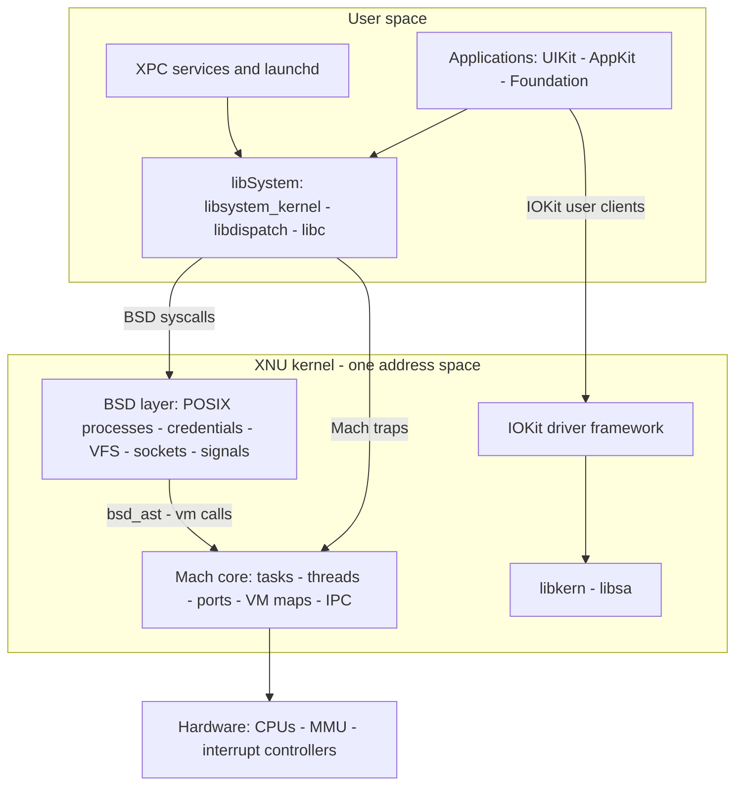
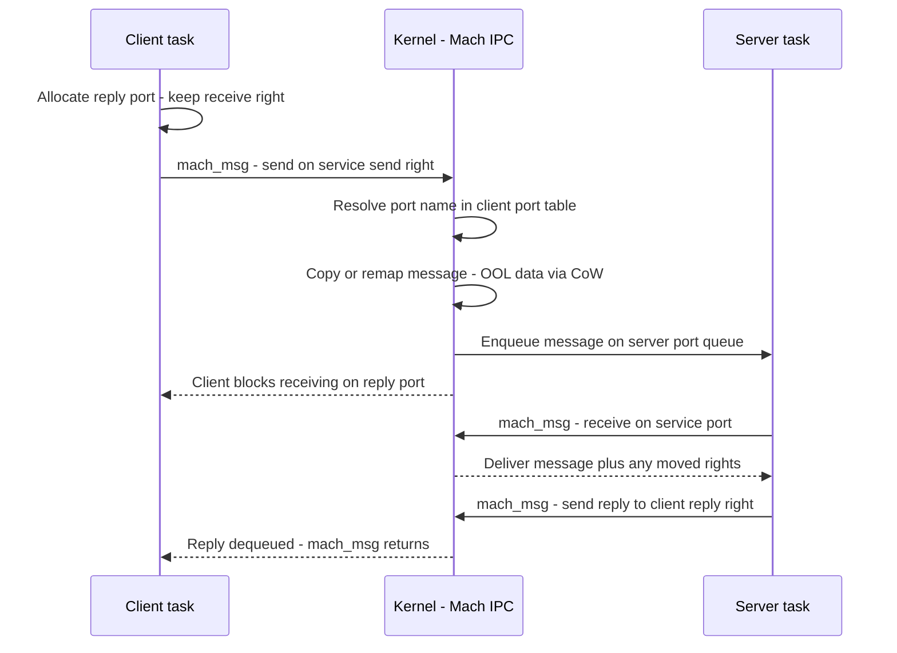

# XNU & Darwin: the Apple Kernel

## Overview

XNU is the kernel under macOS, iOS, iPadOS, tvOS, watchOS, and visionOS — a fleet measured in well over a billion active devices, which makes Apple the largest shipper of a non-Linux kernel in the world. Interviews touch it in three settings: platform teams building for Apple hardware (where launchd, kqueue, and Mach IPC are daily vocabulary), performance work on Apple Silicon (E/P cores, CLPC, the compressor), and systems-design questions where the Mach-port capability model makes a striking contrast to Linux fds. The source is published per release at the [apple-oss-distributions/xnu](https://github.com/apple-oss-distributions/xnu) repository, but with almost no prose documentation — you read code alongside the old Mach papers, which is itself the reason this topic separates deep candidates. This page covers XNU's composition, Mach ports, virtual memory, scheduling, kqueue, launchd, the security model, GCD, the Apple Silicon boot chain, and a four-kernel comparison.

## Composition — Mach 3.0 + 4.4BSD + IOKit

The name XNU is a recursive acronym ("X is Not Unix"). Darwin descended from NeXTSTEP (Mach 2.5 over 4.3BSD) and became the hybrid you see today in Mac OS X 10.0 (2001): a Mach 3.0 microkernel core providing tasks, threads, ports, IPC, and virtual memory, with a 4.4BSD layer layered *in the same kernel address space* providing the Unix process model, credentials, VFS, sockets, and signals. IOKit, a C++ driver framework using a deliberately restricted dialect (the libkern `OSObject` base — no exceptions, no STL, reference-counted objects), supplies drivers. This is not a microkernel: BSD calls into Mach via function calls, and the whole thing runs monolithically in supervisor mode. The interview framing: XNU is "hybrid" in a precise sense — Mach *mechanisms* (VM, IPC, scheduling primitives) with BSD *policy* (POSIX semantics) welded on in-kernel, which is exactly the compromise Linus rejected in the Tanenbaum debate and Apple shipped profitably.



### Tasks, Threads, and the BSD Marriage

A **Mach task** owns a VM map, a port namespace, and a set of threads; a **BSD process** (`proc`) wraps exactly one task and adds credentials, file descriptors, signals, and the process-group/session hierarchy. Every Mach thread (`thread_act`) has an optional BSD `uthread` attached when it executes through the BSD layer. The two worlds interlock at defined seams:

- `fork(2)` is implemented in the BSD layer (`bsd/kern/kern_fork.c`) by asking Mach to clone the task's VM map copy-on-write, then wrapping the new task in a fresh `proc` with inherited credentials and fd table.
- Hardware traps raise **Mach exceptions** to thread/task exception ports; the BSD layer's handler (`ux_exception`) translates them into Unix signals, which is why a `SIGSEGV` and a debugger stop share one kernel path.
- POSIX threads (`pthread`) are Mach threads plus BSD state; scheduling policy requested via pthreads is translated into Mach bands underneath.

The interview point: this marriage is why `ps` on macOS shows a coherent Unix world even though the kernel's identity and IPC substrate is Mach, and why some operations (e.g., Mach exceptions in a crash reporter) can observe a process state no POSIX interface exposes.

## Mach Ports — the IPC Substrate

The Mach primitive is the **port**: a kernel-protected message queue referenced by *rights* held inside per-task port tables. Three right kinds matter: a **receive right** (unique — one holder per port, the right to dequeue), a **send right** (many holders may enqueue), and a **send-once right** (a one-shot send grant that destroys itself after use — how replies are granted safely). Port *names* are per-task integers; the same port appears under different names in different tasks, and a name is meaningless outside its task — a capability property, weaker than Zircon's per-handle rights but structurally similar (compare [Fuchsia & Zircon](./fuchsia-zircon.md)).

`mach_msg` is one trap that can send and/or receive atomically — and optionally time out — which makes RPC-shaped sync-over-async natural: client sends on the service port's send right and immediately blocks receiving on its reply port. Complex messages carry descriptors: out-of-line (OOL) memory is transferred by the VM subsystem with copy-on-write remapping rather than byte copies, and port rights themselves are transferred *in* messages, which is how authority is delegated through the system. This machinery is not academic: XPC services, AppleEvents, `NSDistributedNotificationCenter`, and effectively every cross-process API on Apple platforms ride Mach IPC; launchd's bootstrap namespace is how service lookup works. The contrast to state in an interview: Linux IPC is fd-based and namespace-scoped (pipes, unix sockets, binder on Android as a separate design); Mach IPC is right-based and task-scoped, so *passing the right is passing the permission*.



## Virtual Memory — the Mapper and the Compressor

Mach's VM layer gives each task a VM map of named regions backed by memory objects; BSD's anonymous memory rides on Mach pagers, with the dynamic pager creating swap files in `/var/vm`. The distinctive piece is the **VM compressor** (since OS X 10.9): when memory pressure rises, reclaimable anonymous pages are compressed in-kernel (WKdm-family compression, typical ~2–3:1) into compressed pools instead of being written to swap, trading CPU for much cheaper refaults. Only sustained pressure evicts compressed pages to disk. The comparison set from Linux: zram compresses into a swap *block device*, zswap fronts disk swap with a compressed cache, and PSI provides pressure signals — see [Memory Internals](./memory-internals.md) for the Linux side. macOS exposes pressure through `DISPATCH_SOURCE_TYPE_MEMORYPRESSURE` and a footprint API instead of PSI's stall counters.

On iOS (and now across Apple platforms), the **jetsam** memory-status manager adds policy the Linux kernel deliberately leaves to userspace: processes carry priority bands and footprint limits, and the kernel kills highest-idle/lowest-priority processes under pressure, with high-watermark kills even when the system is not yet thrashing. Purgeable memory (`NSPurgeableData`) lets apps volunteer cache pages for zero-cost reclaim. The honest summary: Apple accepted "the kernel chooses victims" because mobile products demanded it; Linux pushed the same decision into cgroups oom-score policies and user-space agents.

## Scheduler — QoS, Priority Bands, and Two Kinds of Cores

Mach scheduling is fixed-priority with 128 priority bands (0–127, higher wins), decay-usage aging for timeshare threads, and a real-time band for time-constraint policy threads (audio clients with deadlines use `thread_policy_set(TIME_CONSTRAINT)`). Above this sits the user-facing abstraction: **QoS classes** map onto bands — user-interactive ≈ 46, user-initiated ≈ 37, default ≈ 31, utility ≈ 20, background ≈ 4 — and QoS propagates through GCD queues and XPC messages so a UI click's whole dependency chain is scheduled ahead of a background sync. There is no nice/sched_setscheduler analogue exposed by default; Apple's model is "declare importance, the system arbitrates."

| QoS class | Mach band (base) | Typical producer |
|---|---|---|
| user-interactive | 46 (+boosts) | UI event handling, first-frame work |
| user-initiated | 37 | Actions the user is explicitly waiting on |
| default | 31 | Unspecified work |
| utility | 20 | Long-running visible progress (downloads) |
| background | 4 | Prefetch, indexing, maintenance |

Timeshare threads decay their current priority as they accumulate CPU, so boosts are transient by construction; fixed-band threads (and the real-time time-constraint band) never decay. On Apple Silicon the scheduler is heterogeneous-aware: efficiency (E) and performance (P) cores, with thread QoS and recent behavior influencing placement, and **CLPC** (closed-loop performance control, out of Apple's Juniper research) coordinating DVFS and core scheduling against real measured latency/throughput rather than static tables. The interview-worthy observation is the stack: GCD sets block QoS → thread QoS → Mach band → core class, one importance signal flowing from API to hardware — Linux reaches a comparable place only with a lattice of cgroup weights, schedutil hints, and explicit uclamp settings.

## kqueue vs epoll/select

kqueue (FreeBSD 2000, inherited by XNU) is an ident-based, filter-based event delivery API: you register `struct kevent` entries — `(ident, filter)` pairs — into a single `kqueue` fd, and each returned event tells you what happened to that ident. Filters go far beyond fd readiness: `EVFILT_READ`/`EVFILT_WRITE` (sockets, pipes), `EVFILT_VNODE` (file rename/truncate/delete events), `EVFILT_PROC` (child exit/fork/exec), `EVFILT_SIGNAL` (queued signal delivery), `EVFILT_TIMER` (kernel timers), `EVFILT_MACHPORT` (Mach message arrival), `EVFILT_USER` (user-triggered events), and `EVFILT_FS`/`EVFILT_AIO`. epoll covers fd readiness (plus timers via timerfd and signals via signalfd); select/poll rescan and rebuild the interest set on every call.

| Capability | kqueue | epoll |
|---|---|---|
| Interest set | Registered once per `(ident, filter)` | Registered once per fd+epoll_ctl |
| Coverage | fds, files, processes, signals, timers, Mach ports, user events | fds (incl. eventfd/timerfd/signalfd shims) |
| Edge vs level | Level or clear-on-return (`EV_CLEAR`) | `EPOLLET` edge / default level |
| Batch semantics | One syscall returns changed events; `EV_ONESHOT` for re-arm | epoll_wait same shape |
| Ecosystem | nginx, libuv/libevent on BSD/macOS, launchd, GCD workloops | nginx, every Linux event loop, io_uring succession |

```c
int kq = kqueue();
struct kevent changes[2], events[16];

/* fd readiness and child-exit watching in ONE interest set */
EV_SET(&changes[0], conn_fd, EVFILT_READ,  EV_ADD | EV_ENABLE, 0, 0, NULL);
EV_SET(&changes[1], child_pid, EVFILT_PROC, EV_ADD, NOTE_EXIT, 0, NULL);

struct timespec timeout = { 5, 0 };             /* EVFILT-style timeout arg */
int n = kevent(kq, changes, 2, events, 16, &timeout);
for (int i = 0; i < n; i++) {
    if (events[i].filter == EVFILT_READ) handle_conn(events[i].ident);
    if (events[i].filter == EVFILT_PROC) reap_child(events[i].ident);
}
```

The reason nginx and the BSDs champion it: one kernel interface terminates an entire event loop's event set — process exit, file change, socket readiness, and Mach messages in one list — which is exactly what an application server needs and what Linux reassembles piecemeal with epoll + eventfd + signalfd + inotify. Trade-off to concede: epoll's simpler model plus io_uring's submission/completion queues outperform kqueue on raw network throughput at scale today.

## launchd vs systemd

launchd (2005, Mac OS X 10.4) and systemd (2010) are the two dominant "init as a service manager" designs; both do socket activation and supervision, and comparing them is a fair systems-design exercise:

| Dimension | launchd | systemd |
|---|---|---|
| Origin | Apple (2005), replaced mach_init/init | Lennart Poettering et al. (2010) |
| Config | XML property lists, agents vs daemons | INI-style unit files, generators |
| Socket activation | Built-in since inception: `Sockets` dict, fd check-in at job start | `.socket` units + `LISTEN_FDS` protocol |
| Supervision | `KeepAlive` dictionaries (paths, sockets, exits) | `Restart=`, `Type=`/`sd_notify` |
| Dependencies | Implicit — job existence + IPC lookup | Explicit `After=`/`Wants=`/targets |
| Resource control | No cgroup equivalent; sandbox + limits per job | cgroups v2 slices, `MemoryMax`, `CPUQuota` |
| Logging | none in launchd; os_log unified logging nearby | journald integrated |
| Model | Per-user launchd instances, one per login session | `user@.service` per user, system manager per host |

The structural difference to articulate: launchd is *service-discovery-shaped* (programs are found by mach lookup, so jobs can start on demand when their service is first needed — inetd-style generalized), while systemd is *dependency-graph-shaped* (units and ordering edges). Linux needed cgroups integration to get per-service resource accounting; macOS gets isolation a different way — each job runs inside sandbox/container machinery (next section), so the resource and isolation concerns are split rather than unified.

## Code Signing, AMFI, and Sandboxes — the Mac Security Model

On Apple platforms, **code signing is mandatory**: every executable page must trace to a validly signed binary, enforced in-kernel (unsigned JIT requires explicit entitlements; ad-hoc signed local binaries are permitted with constraints). **AMFI** (Apple Mobile File Integrity) is the kernel component validating signatures, trust caches, and **entitlements** — signed key-value grants (many `com.apple.*` are reserved for Apple's own platform binaries, a hard platform-operator privilege line). The **App Sandbox** is a mandatory-access framework configured in SBPL (a Scheme-like policy DSL) combining per-app profiles over file/network IPC — the ancestor-in-spirit of Linux's Landlock/seccomp profiles but bundled per-application at install time. The **Hardened Runtime** (`codesign --options runtime`) adds library validation, hardened JIT, and DYLD environment restrictions for distributed apps; notarization/Gatekeeper gate first-run at install.

Sandbox policy is written in SBPL, a Scheme-like DSL compiled to kernel-evaluated operations:

```scheme
(deny network-outbound)                        ; default-deny for this app
(allow network-outbound
   (remote tcp "api.example.com:443"))
(allow file-read* (subpath "/usr/share"))
(allow file-write* (subpath (param "HOME") "/Library/Containers"))
```

**SIP** (System Integrity Protection, 2015) protects the platform from root itself: system paths, kernel-extension loading, and process instrumentation are restricted even for root, which is why the debugging workflow below needs `csrutil` exceptions. The conceptual contrast to state: Linux composes ambient-identity security (uid/gid) with opt-in mandatory layers (LSMs) and namespaces; Apple's model assumes an app-distribution platform — authority is *provisioned per binary* by signature and entitlement, closer to Zircon's capability goal than to Unix (see [Fuchsia & Zircon](./fuchsia-zircon.md) for the fully capability-based version).

## Grand Central Dispatch — User-Space Scheduling on Kernel Primitives

GCD (`libdispatch`, 2009) exposes serial and concurrent dispatch queues; applications submit blocks with a QoS, and libdispatch manages a thread pool sized to machine cores, parking threads when idle. Underneath, XNU's workqueue mechanism hands GCD kernel-scheduled worker threads, and thread QoS (the previous section) flows from block QoS — so user-space queue order and kernel priority stay coherent. OperationQueue wraps the same machinery with dependencies and cancellation.

```c
/* Queue inherits QOS_CLASS_USER_INITIATED for every block on it */
dispatch_queue_attr_t attr =
    dispatch_queue_attr_make_with_qos_class(DISPATCH_QUEUE_SERIAL,
                                            QOS_CLASS_USER_INITIATED, 0);
dispatch_queue_t q = dispatch_queue_create("com.example.render", attr);

dispatch_async(q, ^{ render_frame(frame); });   /* QoS flows to the kernel band */
```

The comparison interviewers want: GCD is a *kernel-cooperative thread pool* where the unit is a block and concurrency is implicit; tokio (Rust) and epoll-based event loops are *reactor* designs where the unit is a continuation (future/task) multiplexed over kqueue/epoll readiness. GCD abstracts threads away entirely — you never size the pool — while reactor runtimes make I/O readiness explicit and give the programmer executor control. Both are answers to the same problem (C10K-era thread explosion); the honest trade-off is that GCD's model hides blocking (a blocking call stalls a kernel-managed worker) whereas reactor runtimes force async I/O discipline end to end.

## Apple Silicon Boot Chain

On Apple Silicon, the chain is short and fully verified:

1. **SecureROM** — immutable Boot ROM carrying Apple's Root CA; loads and verifies the next stage. It cannot be patched, so vulnerabilities there are permanent by design (the checkm8-era lesson, before Apple Silicon's ROM was hardened).
2. **iBoot** — the second-stage bootloader, itself signature-checked; verifies and loads the kernelcache, applies LocalPolicy (boot security mode, kext allowances).
3. **XNU** — enters with the platform already measured; the kernel then mounts the OS volume.

The root filesystem lives on a **Sealed System Volume** (SSV, macOS 11+): an APFS volume whose per-file hash tree is verified at read time and mounted as a read-only snapshot, so OS files cannot diverge from their sealed state; user data volumes mount alongside. Each stage verifies the next — a hardware-rooted chain of trust comparable in structure to Android Verified Boot and Fuchsia's verified boot (see [Fuchsia & Zircon](./fuchsia-zircon.md)). The interview takeaway: Apple treats OS integrity as a *storage* property (verify every read) plus a verified boot chain, not as a post-hoc tripwire like classic package-manager integrity checks.

## Reading the Source — a Map of the xnu Tree

Because Apple publishes source without narrative documentation, the tree map is the orientation tool:

| Directory | Contents | Where to start |
|---|---|---|
| `osfmk/` | Mach: VM (`vm/`), scheduler (`kern/sched_prim.c`), IPC (`ipc/`), console | `kern/sched_prim.c`, `vm/vm_fault.c` |
| `bsd/` | Syscall table (`kern/syscalls.master`), VFS, networking, security, launchd check-in | `kern/bsd_init.c`, `syscalls.master` |
| `iokit/` | Driver families (IOStorage, IONetworking), user-client glue | `IOKit/IOService.h` plus a simple family |
| `libkern/` | Kernel C++ runtime: `OSObject`, `OSDictionary`, atomic ops | `libkern/c++/OSObject.h` |
| `pexpert/` | Platform Expert — firmware interface, boot args, device discovery | `pexpert/i386/pe_init.c` |
| `libsa/` | Early bootstrap library used before the kernel is self-sufficient | skim only |
| `config/` | Per-arch/per-machine compile-time configurations | read for build shapes |

A practical reading order for interviews: `syscalls.master` (the actual Unix surface), then `vm_fault.c` (how a page fault crosses BSD→Mach), then `sched_prim.c` (bands and QoS in code). Each drop is large but navigable — roughly 3–4 MLoC including drivers — and headers under `bsd/sys/` and `osfmk/mach/` are self-documenting enough to answer most mechanism questions without any second source.

## Debugging — dtrace Under Lock, ktrace, and Instruments

DTrace exists on macOS but SIP blunts it: attaching to system binaries and loading the DTrace kernel provider require disabling SIP (`csrutil disable`) or entitlements, so production tracing usually relies on Apple's own stack: **ktrace/kperf** (the modern kernel tracing substrate) powering **Instruments** — Time Profiler, Allocations, Leaks, and System Trace (scheduler-level, the closest thing to a perf-sched view). `sample`, `footprint`, and `log stream` (os_log) cover everyday triage. Kernel debugging uses lldb with KDP against a second machine or VM. XNU source drops per release (e.g., `xnu-11215.x` for macOS 15 Sequoia) at [apple-oss-distributions/xnu](https://github.com/apple-oss-distributions/xnu), and the [Apple developer documentation](https://developer.apple.com/documentation/) covers the user-side APIs ([kernel](https://developer.apple.com/documentation/kernel), [XPC](https://developer.apple.com/documentation/xpc), [Dispatch](https://developer.apple.com/documentation/dispatch)). The eBPF comparison is unavoidable: where Linux built a programmable, verifier-checked in-kernel tracing platform (see [bpf & bpftrace](../../linux/observability/bpf-bpftrace.md)), Apple kept tracing closed and tool-mediated — flexibility traded for enforcement consistency.

## XNU vs Linux vs NT vs FreeBSD

| Dimension | XNU (Darwin) | Linux | Windows NT | FreeBSD |
|---|---|---|---|---|
| Composition | Mach 3.0 core + 4.4BSD + IOKit, monolithic hybrid | Monolithic, everything-as-C-in-tree | VMS-lineage executive + kernel + HAL | Unified 4.4BSD-descended tree |
| IPC primitive | Mach ports (rights in per-task tables) | fds: pipes/sockets, binder (Android) | Kernel objects via handles, ALPC | fds + POSIX IPC, `lio_listio` |
| Drivers | IOKit C++ kexts; DriverKit moving drivers user-space | LKMs, C, in-tree or out-of-tree | WDM/KMDF/UMDF, signed `.sys` | In-base modules, conservative KBI |
| Scheduler | 128 Mach bands, QoS classes, E/P cores + CLPC | EEVDF/CFS weighted fair + RT/DL classes | 32 levels + boosts, MMCSS | ULE: interactivity + topology-aware |
| Memory story | VM compressor, jetsam kills, purgeable memory | zram/zswap, PSI, cgroups v2 | Standby priorities, compression store | UMA allocator, ARC under ZFS |
| Security model | Mandatory signing, AMFI, entitlements, sandbox | Capabilities + LSMs + namespaces | Tokens + security descriptors | Capsicum + MAC framework + jails |
| Event delivery | kqueue (ident + filters) | epoll + eventfd/signalfd, io_uring | IOCP completion ports | kqueue (the original) |
| Tracing | DTrace (SIP-limited), ktrace/Instruments | tracepoints + eBPF/bpftrace | ETW + WPR/WPA + WinDbg | DTrace first-class, no SIP friction |

## Cross-References

- [Kernel Architectures](./kernel-architectures.md) — the monolithic/hybrid/microkernel taxonomy and the L4 line Mach inspired but did not become.
- [BSD Family Internals](./bsd-family-internals.md) — the 4.4BSD lineage XNU embeds, jails/pf/DTrace, and why FreeBSD runs the same kqueue design without restrictions.
- [Fuchsia & Zircon](./fuchsia-zircon.md) — ports vs channels: where Apple's right-based IPC stops and true per-object capability rights begin.
- [Memory Internals](./memory-internals.md) — the Linux compressor set (zram, zswap, PSI) that macOS's compressor and jetsam should be benchmarked against.
- [bpf & bpftrace](../../linux/observability/bpf-bpftrace.md) — the programmable-tracing contrast to DTrace-under-SIP and ktrace.

## Interview Questions

1. **"Is XNU a microkernel?"** No — it is a hybrid: Mach 3.0 supplies mechanisms (tasks, threads, ports, VM, IPC) but BSD runs in the same kernel address space and calls Mach directly, and IOKit drivers run in-kernel. The microkernel pedigree shows up in the IPC substrate (ports with rights, OOL copy-on-write messages) and in the VM design, not in fault isolation — a panicking driver kills the kernel. The useful comparison is intent: Mach-as-designed (CMU) put servers in user space; Apple's synthesis kept the abstractions and dropped the address-space separation for performance, which is the same pragmatic call NT and later hybrid systems made.

2. **"Explain Mach port rights and why reply patterns are safe."** A receive right is unique per port, send rights are shareable, and send-once rights grant exactly one send before self-destructing. The canonical RPC: the client allocates a reply port (holding its receive right), sends a request carrying a send-once right to that reply port, blocks in `mach_msg` receiving, and the server sends the reply through the one-shot — after which the reply path is gone, so no other task can spoof a response. Rights move inside messages, so authority delegation is explicit; and OOL data rides the VM system via copy-on-write remapping, making large payload IPC cheap. Contrast with a unix socket: the peer identity is a credential check, not an unforgeable per-conversation right.

3. **"How does macOS keep a machine responsive under memory pressure compared to Linux?"** Three layers: the in-kernel compressor converts reclaimable anonymous pages to ~2–3:1 compressed copies (refault cost is decompression, not disk), swap files in `/var/vm` absorb sustained pressure, and jetsam applies product policy — per-process priority bands and footprint high-water marks that kill background apps deterministically on iOS. Linux reaches the same shape differently: zram/zswap for compression, PSI for pressure signals, and cgroup/oom policies where user space (systemd, Android's lmkd) picks victims. The design difference is where policy lives: Apple built victim selection into the kernel; Linux provides counters and makes it someone else's job.

4. **"Why do BSDs and nginx still care about kqueue, and what does epoll lack?"** kqueue is ident-and-filter based, so one registration API covers fd readiness plus `EVFILT_VNODE` file events, `EVFILT_PROC` child lifecycle, `EVFILT_SIGNAL`, `EVFILT_TIMER`, and `EVFILT_MACHPORT` on XNU — an entire server's event set in one kernel list, which is why nginx's BSD path and libuv use it. epoll covers only fd readiness, so Linux applications reassemble the same functionality from eventfd, timerfd, signalfd, and inotify. Concede the counterpoint: epoll's ecosystem plus io_uring's submission/completion model now leads raw network throughput, so the argument is about interface elegance, not performance supremacy.

5. **"What makes the Mac security model different from standard Unix protections?"** Authority is provisioned per binary: mandatory code signing means executable pages must trace to a signed image; AMFI checks signatures and entitlements in-kernel; sandbox profiles (SBPL) restrict filesystem/network/IPC per app; Hardened Runtime adds library validation for distributed apps; and SIP restrains even root over system content. Unix/MLS systems instead start from ambient identity (uid/gid) and add opt-in mandatory layers (LSMs) or namespaces. The conceptual bridge: Apple's model is closer to a capability/platform-operator design — signature plus entitlement as grant — which is why comparing it to Zircon or Android's app model is more illuminating than comparing it to a plain Linux box.

6. **"Where does GCD sit relative to tokio or an epoll event loop?"** GCD is a kernel-cooperative thread pool: blocks carry QoS into dispatch queues, libdispatch maintains core-sized worker threads via XNU workqueues, and the programmer never sizes or owns the pool. Tokio and epoll loops are reactor designs: tasks are continuations multiplexed over kernel readiness events, with explicit async I/O discipline and user-controlled executors. The trade-off to name: GCD hides threading so well that blocking work silently stalls workers, while reactor runtimes force non-blocking I/O everywhere but give predictable, profileable concurrency. Both are post-C10K answers; Apple's adds kernel-integrated QoS propagation, which tokio approximates only with userland priorities.

## Key Takeaways

- XNU = Mach 3.0 mechanisms + 4.4BSD policy + IOKit drivers, monolithic in one address space — "hybrid" is a precise claim, not marketing.
- Mach ports are right-based IPC (receive/send/send-once); rights transfer inside messages and OOL data moves via copy-on-write — the substrate under XPC and most Apple IPC.
- The VM compressor (WKdm, ~2–3:1) plus jetsam priority bands is Apple's memory-pressure answer; Linux splits the same job across zram/zswap, PSI, and user-space oom policy.
- Scheduling flows from one importance signal: GCD block QoS → thread QoS → Mach band → E/P core placement under CLPC.
- kqueue is ident+filter event delivery — processes, signals, files, timers, Mach ports in one API; epoll covers fds and won on throughput via io_uring instead.
- launchd is discovery-shaped init (on-demand via mach lookup); systemd is dependency-graph-shaped with cgroup accounting — the difference drives each OS's service model.
- Security is per-binary: mandatory signing, AMFI, entitlements, sandbox profiles, Hardened Runtime, SIP — provisioned authority rather than ambient uid.
- Apple Silicon boots SecureROM → iBoot → XNU with a Sealed System Volume verifying every read — integrity as a storage property, not a tripwire.

## References

- XNU source (per-release drops): <https://github.com/apple-oss-distributions/xnu>
- Apple developer documentation: <https://developer.apple.com/documentation/>
- XNU kernel API reference: <https://developer.apple.com/documentation/kernel>
- Grand Central Dispatch (libdispatch) reference: <https://developer.apple.com/documentation/dispatch>
- XPC services reference: <https://developer.apple.com/documentation/xpc>
- Accetta et al., "Mach: A New Kernel Foundation for UNIX Development," USENIX Summer 1986.
- Draves et al., "Using Continuations to Implement Thread Management and Communication in Operating Systems," SOSP 1991 (Mach scheduler stubs/continuations).
- Zarzycki, "launchd" — Mac OS X 10.4 design notes (WWDC 2005 sessions; no primary URL).
