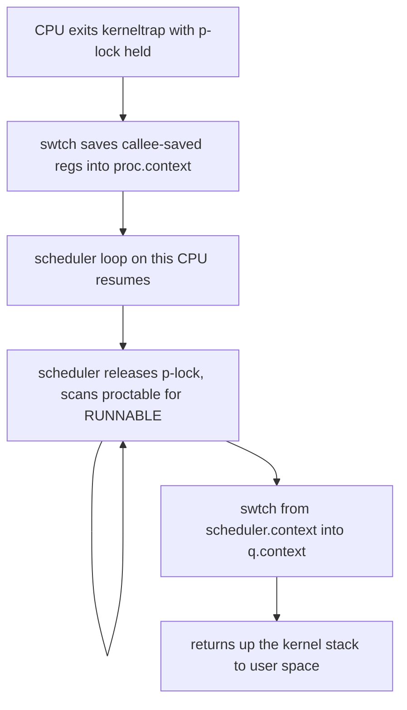
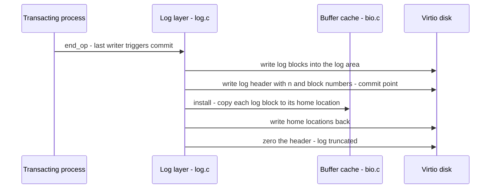
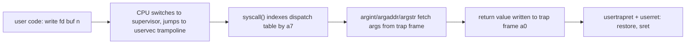

# xv6: Anatomy of the Teaching Kernel

xv6 is a small Unix-like operating system maintained by MIT's PDOS group for the graduate operating systems course 6.1810 (formerly 6.828). It is a modern re-implementation of the ideas in Unix Sixth Edition, targeted at the RISC-V architecture, with roughly 10,000 lines of code for the whole system — kernel plus user utilities. Unlike every production kernel, xv6 can be read completely: every function, every data structure, every assembly trick is small enough to hold in your head. This makes it the single best OS-learning artifact in existence, because it converts abstract textbook material (page tables, trap frames, file-system logs) into concrete code you can modify, break, and debug. This page walks through each xv6 subsystem, maps it to its Linux counterpart, and explains how it prepares you for kernel-focused interviews.

Primary sources:

- Course homepage: [MIT 6.1810](https://pdos.csail.mit.edu/6.1810/) — lecture notes, xv6 book PDF, lab assignments.
- Source code: [xv6-riscv on GitHub](https://github.com/mit-pdos/xv6-riscv) — the maintained RISC-V port.

## Why xv6 Is the Best OS-Learning Artifact

Three design decisions make xv6 uniquely valuable:

1. **Lineage, not novelty.** xv6 descends conceptually from Unix 6th Edition (1975), the system John Lions famously annotated line by line. The concepts it teaches — processes, fork/exec, file descriptors, block buffers — are exactly the POSIX concepts production kernels implement, so nothing you learn is throwaway.
2. **Complete readability.** At ~10k lines (Linux is ~30M), you can grep every function, trace any syscall end to end in an afternoon, and understand the *whole* system rather than one corner. No kernel project with commercial users can offer this.
3. **A maintained book and labs.** The xv6 book (Russ Cox, Frans Kaashoek, Robert Morris) explains the design chapter by chapter against the actual source, and the 6.1810 labs force you to implement — lazy allocation, COW fork, file-system logging, mmap. Implementation is where interview-level understanding comes from.

The trade-off: xv6 omits real-world complexity — no SMP scalability work beyond per-CPU structures, no threads (processes only), no dynamic loading, no swap, no network stack in the base version, minimal driver support. Those gaps are the syllabus of production-kernel reading, not reasons to skip xv6.

## Layout of the Source Tree

Everything lives in one flat kernel directory; each file is one subsystem:

```
kernel/
  main.c      -- entry after boot: init per-CPU state, start first process
  proc.c      -- process table, fork, exit, wait, scheduler, sleep/wakeup
  swtch.S     -- the context-switch primitive (17 registers, ~30 lines)
  spinlock.c  -- acquire/release, push_off/pop_off interrupt management
  sleeplock.c -- sleep locks built on spinlocks + sleep channels
  vm.c        -- kernel page table, walk(), mappages, uvm (user address space)
  kalloc.c    -- free-list physical page allocator (4 KiB pages)
  trap.c      -- uservec/userret trampoline, kernel trap dispatch, timer ticks
  syscall.c   -- syscall dispatch table, argument fetch from trap frame
  sysfile.c   -- file-related syscalls: open, read, write, exec, chdir
  sysproc.c   -- process syscalls: fork, exit, wait, kill, sbrk
  fs.c        -- on-disk FS: inodes, directories, pathname resolution, bmap
  log.c       -- the write-ahead logging / crash-recovery layer
  bio.c       -- buffer cache: LRU-ish eviction, disk block caching
  file.c      -- in-memory file table, file descriptor refcounting
  virtio_disk.c -- the only device driver (virtio block device)
  exec.c      -- ELF loader, builds a fresh address space for exec
  pipe.c      -- the pipe implementation (a ring buffer + sleep channels)
user/
  sh.c, cat.c, grep.c, ...  -- user programs; usys.pl generates syscall stubs
```

That listing is the whole OS. If a concept in your OS course has a file above, you can read its implementation in under an hour.

## Processes and the Scheduler

xv6 has one `struct proc` per process (max 64, `NPROC`), containing the trap frame (user registers saved at trap entry), the kernel stack, a saved `struct context` for scheduler switches, page-table pointer, exit state, and parent pointer. There are no kernel threads; interrupts are effectively "the only threads," plus one per-CPU scheduler loop.

The context-switch dance is the classic xv6 teaching moment, because it shows that "scheduling" is just careful register saving with the right locks held:



Key facts worth reciting in interviews:

- **Every switch goes through the per-CPU scheduler.** A yielding process never hands the CPU to another process directly; it `swtch`es to the scheduler, which picks the next process. This double-hop keeps invariants simple (a process's lock is released by the same CPU that acquired it).
- **Spinlocks disable interrupts** (`push_off`/`pop_off`) while held on a CPU, preventing deadlock when both an interrupt handler and the interrupted code want the same lock.
- **Sleep/wakeup uses channels**: a process sleeps on a wait channel (often an address), and wakeups target the channel. Avoiding lost wakeups requires a lock whose acquire happens between checking the condition and sleeping — the same "check-then-sleep must be atomic" rule as Linux wait queues.
- The scheduler is round-robin over the whole process table: O(NPROC) scan, no priorities, no fairness guarantees. xv6 is optimizing for legibility, and that is a legitimate design choice worth articulating.

### The Context-Switch Path, Step by Step

Follow one process that blocks on disk I/O, then runs again:

1. The file-system code misses the buffer cache and calls `sleep(chan, lk)`. Before sleeping, `sleep` acquires the process's own `p->lock` *inside* the same critical section where it releases `lk`, sets `p->state = SLEEPING`, and records the wait channel — that lock handoff is precisely what makes check-then-sleep atomic and defeats lost wakeups.
2. `sleep` calls `sched()`, which panics unless four invariants hold: the caller has already set the new state (so `p->state != RUNNING`), it holds its own `p->lock`, it holds no *other* spinlock (`mycpu()->noff == 1`), and interrupts are off (`intr_get()` false). These are the exact conditions under which swapping stacks is safe.
3. `swtch(&p->context, &c->context)` pushes the 17 RISC-V callee-saved registers — `ra`, `sp`, `gp`, `tp`, and `s0`–`s11` — into `p->context` and pops the per-CPU scheduler's. Only callee-saved registers are saved because every `swtch` call site is an ordinary C call: the compiler already spilled caller-saved registers per the calling convention, so the ABI pays for half the save.
4. The scheduler thread, now running on the per-CPU scheduler stack, releases `p->lock` (the same CPU that acquired it — a hard xv6 rule), scans the process table for `RUNNABLE`, marks the winner `RUNNING`, and `swtch`es into *its* saved context, resuming inside that process's own earlier `sched()` call.
5. The woken process returns up its kernel stack — `sleep` re-acquires `lk` before returning — through the file system, `usertrapret`, and `sret` back to user space. Two `swtch` calls, zero process-to-process handoffs.

The teaching point: a context switch is ~30 lines of assembly plus a locking contract; everything else is bookkeeping. The same skeleton hides inside Linux's `__schedule()` (see [context switching](../../os/processes/context-switching.md) and the register-level detail in [the Linux fork/switch path](../../linux/kernel/processes/context-switching.md)).

Compare with production kernels: Linux's `task_struct` is the fat version of `struct proc` (see [Linux task_struct](../../linux/kernel/processes/task-struct.md)), and per-CPU runqueues with EEVDF replace the global scan (see [scheduler internals](../../os/advanced/scheduler-internals.md) and [Linux CFS/EEVDF](../../linux/kernel/processes/scheduler.md)). The mechanics of the switch itself — save callee-saved registers, swap stack pointers — are identical in kind to what Linux does in `__switch_to` (see [context switching](../../os/processes/context-switching.md)).

## Virtual Memory and Traps

Each process has its own RISC-V three-level page table stored in `satp`; the kernel builds and frees it with `uvmcreate`-style helpers around the core page-table walker `walk()`. Physical pages come from `kalloc.c`, a free list of 4 KiB frames, with a guard value pattern that catches use-after-free in the labs. The kernel runs in supervisor mode with its own page table that maps all of RAM plus per-process kernel stacks; since 2020, each process *also* carries a private kernel page table so that kernel execution is page-mapped rather than direct-mapped — a deliberate preview of KPTI-style isolation (see [KPTI](../../os/advanced/kpti.md)).

Two details of the trap path are interview gold:

1. **The trampoline.** Both user→kernel and kernel→user transitions happen through one shared page mapped at the same virtual address (`TRAMPOLINE`) in every page table, because the switch needs to run code while the old page table is still active. `uservec` saves user registers into the trap frame, swaps `satp`, jumps into the kernel; `userret` reverses it. This is a miniature of every production kernel's entry trampoline and of Linux's `entry_SYSCALL_64` machinery.
2. **Page faults are a first-class feature, not just errors.** The `sbrk` lab makes allocations lazy; the COW lab marks forked pages read-only and clones them on fault (see [copy-on-write](../../os/virtual-memory/cow.md)); the mmap lab implements file-backed regions. Each teaches that a fault handler is a policy engine — the same shape as Linux `handle_mm_fault` (see [demand paging](../../os/virtual-memory/demand-paging.md)).

TLB consistency is handled by RISC-V's `sfence.vma`, the analog of `invlpg`/TLB shootdown IPIs in Linux (see [TLB shootdowns](../../os/advanced/tlb-shootdowns.md)). xv6 flushes the whole TLB on context switch — correct, but a benchmark lab shows why real kernels use ASIDs.

### Sv39: The Page-Table Layout xv6 Uses

xv6 runs RISC-V Sv39: 39-bit virtual addresses, three-level page tables, 4 KiB pages. Everything interview-relevant about the layout fits in two pictures.

```text
39-bit virtual address under Sv39
+------------------+------------------+------------------+------------+
| VPN[2] (9 bits)  | VPN[1] (9 bits)  | VPN[0] (9 bits)  | off (12)   |
+------------------+------------------+------------------+------------+
        |                   |                  |               |
        v                   v                  v               v
  root PTE (satp)  ->  mid-level PTE  ->  leaf PTE  ->  physical address
  512 entries per page: 9 index bits x 3 levels = 27-bit VPN
```

A 64-bit RISC-V PTE packs its flags into bits 0-9 and the physical page number (PPN) into bits 10-63:

| Bits | Field | Meaning |
|------|-------|---------|
| 0 | V | Valid — if 0, the entry is not consulted at all |
| 1-3 | R W X | Read / write / execute permission for leaf pages |
| 4 | U | Accessible from user mode |
| 5 | G | Global — not flushed on `sfence.vma` by ASID |
| 6 | A | Accessed — set by hardware; software cleans for reclaim |
| 7 | D | Dirty — set on a store to a leaf page |
| 8-9 | RSW | Reserved for software (hypervisors claim these) |
| 10-63 | PPN | Physical page number, or next level's root for non-leaves |

Three facts worth deriving on a whiteboard:

- **Leaf and non-leaf PTEs are the same 64 bits.** If V=1 and R/W/X are all 0, the PTE is a *pointer* to the next level; if any of R/W/X is 1, it is a *leaf*. That is why a level-1 leaf is a 2 MiB megapage and a level-2 leaf a 1 GiB gigapage — xv6 never uses them, but Linux THP is exactly this mechanism (see [THP and khugepaged](../../os/modern/thp-khugepaged.md)).
- **xv6's address-space layout is two constants.** In the user map, `TRAPFRAME` sits at `MAXVA - 2*PGSIZE` and the `TRAMPOLINE` page at `MAXVA - PGSIZE`, mapped in *every* page table so trap entry has code to run before `satp` changes. In the kernel map, `KERNBASE` (0x80000000) starts RAM; devices (UART, VIRTIO, PLIC, CLINT) are identity-mapped at their physical addresses, and each process's kernel stack is mapped with an unmapped guard page below it.
- **A/D bits and `sfence.vma` are the consistency contract.** xv6 ignores A/D (the pgtbl lab makes you use A), flushes the whole TLB on every context switch by rewriting `satp`, and issues `sfence.vma` after every PTE change — correctness first, exactly the trade real kernels replace with ASIDs and targeted shootdown IPIs.

## The File System: Seven Layers and a Log

The xv6 file system is the clearest public implementation of classic Unix FS design, organized bottom-up:

| Layer | File | Responsibility |
|-------|------|----------------|
| Disk/virtio | `virtio_disk.c` | 1024-byte block I/O to the block device |
| Buffer cache | `bio.c` | Cache disk blocks in RAM, evict LRU, serialize access via `sleeplock` per buffer |
| Logging | `log.c` | Write-ahead log making multi-block updates atomic across crashes |
| Inode | `fs.c` | On-disk + in-memory inode table, block mapping (`bmap`), refcounts |
| Directory | `fs.c` | Directories are inodes whose contents are name→inum records |
| Pathname | `fs.c` | `namex` walks path components one `ilock` at a time |
| File descriptor | `file.c` | Per-process fd table → shared file objects → inode or pipe |

The log layer is the part interviews probe hardest, because it is the pedagogical version of ext4/XFS journaling (see [journaling](../../linux/kernel/filesystems/journaling.md)). The protocol:

1. All writes during a syscall go to buffer cache *and* are pinned as log records; the FS block for the log area is sized to hold \\( \\lceil \\text{MAXOPBLOCKS} \\rceil \\)-worth of worst-case writes per transaction.
2. On `end_op`, if this process is the last in the transaction, `commit()` runs: first write log headers + blocks to disk, then (after a `write` barrier) write the commit block — the atomic marker — then install blocks to their home locations, then truncate the log.
3. On recovery after crash, `install_transcripts` replays any committed log; if there is no valid commit block, the log is discarded and the FS stays at the pre-transaction state.

The result is write-ahead logging with **the commit block as the atomicity point** — exactly the invariant production journals maintain, minus checksums, variable-sized transactions, and batching. If you can draw the xv6 commit sequence from memory, you can explain ext4 `data=ordered` semantics (see [VFS internals](../../os/kernel-advanced/vfs-internals.md) for where journals sit relative to the VFS).

Buffer cache (`bio.c`) completes the picture: `bread`/`bwrite` with a per-buffer sleeplock teach the "cache line as lock" pattern; the eviction scan is a toy LRU, which motivates why Linux replaced naive LRU with multi-generational reclaim (see [MGLRU](../../os/modern/mglru.md)).

### A Transaction Walkthrough: One Write, Six Blocks

Take `write(fd, buf, 100)` to a regular file whose append must allocate a data block and an indirect block — suppose that touches six FS blocks in total (inode, indirect block, two bitmap blocks, old and new data blocks).

1. `filewrite` wraps the whole write in `begin_op()` / `end_op()`. `begin_op` reserves `MAXOPBLOCKS` (10) slots in the log; if the reservation would overflow the 30-slot log (`LOGSIZE = MAXOPBLOCKS*3`), the process *sleeps until the running transaction commits* — admission control by log capacity, not a queue.
2. Every path that dirties a block calls `log_write(b)`. The block stays mapped in the buffer cache and is *absorbed*: if the same block is dirtied twice in one transaction, the log records it once (last write wins). `log_write` also pins the buffer so eviction cannot race the commit.
3. `end_op` decrements the outstanding-op count; only the process that drives it to zero triggers `commit()` — everyone else's writes ride in the same transaction, xv6's crude group commit.

`commit()` then runs the five-step dance whose *ordering* is the entire correctness argument:



The header write is the atomicity point. Recovery (`initlog` → `recover_from_log` at boot) reads the header and replays exactly `n` blocks to their homes if it is valid; a crash before the header lands leaves the old (or invalid) header and the disk keeps the pre-transaction state, while a crash after it lands replays the whole transaction. One atomic sector decides between two consistent worlds — classic xv6-public used a separate explicit commit block after the header, while current xv6-riscv folds the marker into the header write, but the invariant is identical. Only after installation does xv6 zero the header (truncating the log) and unpin the buffers, freeing the log for the next transaction.

What the toy lacks is what production journals spend their complexity budget on, and each gap is an interview story: a fixed-size log (ext4 reuses its journal circularly and checkpoints continuously), whole-block logging (ext4 logs metadata with ordered data and checksums), no batching across syscalls (JBD2 coalesces thousands of transactions per second), and no atomicity-vs-durability nuance (xv6 logs everything; ext4 trades `fsync` semantics deliberately). Map the design onto the real thing with [journaling](../../linux/kernel/filesystems/journaling.md), [ext4 internals](../../os/filesystems/ext4.md), and the general vocabulary in [crash consistency](../../storage/advanced/crash-consistency.md).

## System Calls and the Trap Path

A user program compiled against `user/user.h` links against stubs generated by `usys.pl`, each doing the RISC-V `ecall` instruction. Control flows:



Points worth internalizing (and re-deriving for Linux — see the [syscall table](../../linux/reference/syscall-table.md)):

- Arguments arrive in registers and are validated by `copyin`/`copyout`, which walk the *user* page table manually (with `copyinstr` bounding string length). The manual walk is slow but simple; Linux does the same job with `copy_from_user` and exception-fixup tables. The security lesson — never trust a user pointer, always copy through a validated path — is identical (compare [seccomp-BPF](../../os/advanced/seccomp-bpf.md) for how Linux filters syscalls entirely).
- `exec`/`fork`/`exit`/`wait` interact: `fork` clones the address space and trap frame so the child returns 0; `exec` builds a fresh page table and swaps it in atomically under the process lock; `exit` closes fds, reparents children to `init`, and wakes `wait`.
- The syscall dispatch table (`syscalls[]`) is the simplest possible function-pointer table — the same pattern Linux uses, scaled to hundreds of entries with 32-bit IDs preserved for ABI stability.

### Concrete Trace: `write(1, "hi\n", 3)`

Ten hops, each with the exact state that changes — practice reciting this until it takes under a minute:

1. The stub that `usys.pl` generated into `user/usys.S` executes `li a7, SYS_write` (64 in `kernel/syscall.h`), loads `a0=1`, `a1=&buf`, `a2=3`, and executes `ecall`.
2. The CPU switches to supervisor mode, sets `sepc` to the `ecall` address, `scause` to 8 (ecall from U-mode), and jumps to the address in `stvec` — which is `uservec` on the `TRAMPOLINE` page.
3. `uservec` swaps `sscratch` (which holds this hart's `TRAPFRAME` address) into `sp`, saves all 31 user registers plus `sepc` into the trapframe, loads `satp` from the `kernel_satp` field stashed in the trapframe, and jumps to `usertrap` via the `kernel_trap` field.
4. `usertrap` sees `scause == 8`, so it first points `stvec` at `kernelvec` (kernel traps now go directly — we are already on kernel page tables), then calls `syscall()`.
5. `syscall()` reads `p->trapframe->a7`, checks the number against the `syscalls[]` table, and calls `sys_write()`. A bad number returns -1 rather than crashing — the kernel must survive its users.
6. `argint`/`argaddr`/`argstr` fetch arguments *from the trapframe* — saved registers, not memory the user can still mutate — and `filewrite` resolves fd 1 through the fd table to a `struct file`, checking the writable flag first.
7. For the console this ends in `consputc` and the UART driver; for a regular file, `writei` copies user bytes with `copyin` — which *manually walks the user page table* instead of dereferencing the pointer — into buffer-cache blocks, dirtying each through `log_write`.
8. For the file case, `end_op` commits the log (the dance above), making the multi-block update crash-atomic before the syscall returns.
9. The return value lands in `p->trapframe->a0`; `usertrap` calls `usertrapret`, which resets `stvec` to `uservec`, stores the kernel-entry fields into the trapframe, and jumps to `userret` with the user page table loaded.
10. `userret` `sret`s: the CPU returns to U-mode at `sepc`, registers restored from the trapframe, and `write` returns 3.

Notice what made each hop safe: a table lookup bounded by a check (5), arguments read from saved registers and copied only through validated paths (6-7), and a commit protocol for multi-block state (8). Every production syscall path — including Linux's `entry_SYSCALL_64` and its `copy_from_user` exception-fixup tables (see the [syscall table](../../linux/reference/syscall-table.md) and [seccomp](../../os/advanced/seccomp-bpf.md)) — is this skeleton with 30 years of hardening.

## What the 6.1810 Labs Teach

The labs are the curriculum's core: each modifies the kernel in a way that forces understanding of one subsystem. The current sequence:

| Lab | Theme | What you implement | Production concept it maps to |
|-----|-------|--------------------|-------------------------------|
| Util | Boot + shell | First contact: add a syscall-ish utility, read `sh.c` | The kernel/userland boundary; init and login (see [boot process](../../os/kernel-advanced/boot-process.md)) |
| Syscall | Trap path | Trace and add two syscalls; print mask-filtered trace | Syscall dispatch, argument validation, ptrace-style tracing hooks |
| Pgtbl | Page tables | Print a page table; detect which user pages are accessed; simplify `copyin` with a user-mapped kernel page table | Hardware page-table walks, accessed/dirty bits for reclaim, SMAP-style copy discipline |
| Traps | Interrupts | Backtrace via frame pointers; alarm handler with saved context | Signal delivery, kernel backtraces in oops output, timer-driven preemption |
| Lazy | Demand allocation | Lazy `sbrk`, zero-page faults, handling invalid accesses | Demand paging, overcommit and the `MAP_NORESERVE` posture |
| Cow | Fork efficiency | Copy-on-write fork with refcounts on physical pages | `do_wp_page`, folio refcounts, split-on-COW edge cases |
| Thread | Concurrency | User-level thread switching; locks vs atomics vs barriers | 1:1 vs N:1 threading models, memory-ordering bugs ([threading models](../../os/threads/models.md)) |
| Lock | Parallelism | Memory allocator and buffer-cache sharding for multicore scalability | Per-CPU allocator (SLUB), sharded locks, MCS queue locks |
| Fs | Crash consistency | Enlarge the file (double-indirect blocks) or symlinks; log internals | ext4 journaling, inode/buffer layering, `fsync` contracts |
| Mmap | VM integration | Lazy file-backed mmap with dirty-page writeback | File-backed faulting, page-cache coherence, dirty tracking and writeback |
| Network | Drivers | NIC driver rings for the e1000 (optional/alternate years) | DMA descriptor rings, interrupt coalescing, zero-copy receive |

The progression is deliberate: labs 1–4 teach *reading and tracing*, 5–7 teach *memory as policy*, 8–10 teach *concurrency and durability at scale*. Solving Cow and Lazy is roughly equivalent to understanding Linux's `do_wp_page` and anonymous-fault paths at a conceptual level. A 12-week plan to continue this trajectory into Linux source reading is covered in [How to Start Reading the Linux Kernel](./kernel-learning-path.md), and building larger OS artifacts from scratch is catalogued in [OS build-it-yourself projects](../../projects/build-it-yourself/os-projects.md).

Two planning notes: the net lab is the only one that touches device drivers, and DMA descriptor rings plus interrupt coalescing are the pattern every high-throughput driver shares (see [network stack](../../os/kernel-advanced/network-stack.md)); the thread lab is the only one done partly in user space, which makes it the cheapest place to *feel* a memory-ordering bug before meeting one in kernel code.

## How xv6 Maps to Production Kernels

Use this table to translate every xv6 concept into its Linux equivalent — and to answer the inevitable "so how does Linux actually do this?" follow-up:

| xv6 concept | Linux equivalent | Where to read more |
|-------------|------------------|--------------------|
| `struct proc` | `task_struct` | [task_struct](../../linux/kernel/processes/task-struct.md) |
| Global round-robin scan | Per-CPU runqueues, EEVDF | [EEVDF scheduler](../../os/modern/eevdf-scheduler.md) |
| `swtch` + `struct context` | `__switch_to` + per-arch switch_to | [context switching](../../os/processes/context-switching.md) |
| `spinlock.c` | `raw_spinlock_t`, qspinlocks | [MCS/qspinlocks](../../os/advanced/mcs-qspinlocks.md) |
| Sleep channels | Wait queues, `wait_event` | [sync primitives](../../os/advanced/sync-primitives.md) |
| `kalloc` free list | Buddy allocator + slab/SLUB | [page allocation](../../linux/kernel/mm/page-allocation.md) |
| `walk()` page-table walker | Hardware walk + `gup`, THP | [memory internals](../../os/advanced/memory-internals.md) |
| Trampoline page | Entry trampolines, vDSO | [vDSO/vsyscall](../../linux/kernel/core/vdso-vsyscall.md) |
| `bio.c` buffer cache | Page cache + block layer | [block layer](../../os/kernel-advanced/block-layer.md) |
| `log.c` | JBD2/ext4, XFS log | [journaling](../../linux/kernel/filesystems/journaling.md) |
| `fs.c` inodes/dentries | VFS inode/dcache | [VFS](../../linux/kernel/filesystems/vfs.md) |
| `syscall.c` table | Syscall entry + dispatch | [syscall table](../../linux/reference/syscall-table.md) |
| `proc.c` fork/exec | `kernel/fork.c`, `do_execveat_common` | [fork](../../linux/kernel/processes/fork.md) |
| `sleeplock.c` | `mutex` (sleeping, non-spinning) | [sync primitives](../../os/advanced/sync-primitives.md) |
| `file.c` refcounted file objects | `struct file` with atomic refcounts | [VFS](../../linux/kernel/filesystems/vfs.md) |
| `usys.pl` generated stubs | glibc wrappers + vDSO fast paths | [vDSO/vsyscall](../../linux/kernel/core/vdso-vsyscall.md) |

The differences are instructive too. xv6 allocates a contiguous kernel stack per process at build time; Linux uses vmalloc'd stacks with guards. xv6's buffer cache holds disk blocks; Linux caches *pages* with readahead and writeback. xv6's log commits per syscall; ext4 batches thousands of transactions per second with delayed allocation. Each difference exists because of scale, and being able to name *why* (throughput, memory pressure, multicore) is exactly what separates a book-smart from a source-smart candidate. For the architecture-level picture of where monolithic kernels like Linux and the ideas xv6 teaches fit, see [kernel architectures](./kernel-architectures.md) and the [kernel overview](../../os/kernel/README.md).

## Interview Questions

1. **"Walk me through what happens between a `write()` in user space and bytes reaching the disk in xv6."** Answer: The user stub loads the syscall number into `a7` and issues `ecall`; the CPU traps to the trampoline page, which saves user registers into the trap frame and switches to the kernel page table. `usertrap` sees the syscall cause, `syscall()` indexes the dispatch table, and `sys_write` fetches arguments from the trap frame via `argint/argaddr`. The fd is resolved through the fd table to a file object, then to an inode; `writei` copies user data through `copyin` into blocks via the buffer cache; `end_op` commits the log so the multi-block update is crash-atomic. Return value lands in the trap frame's `a0` and `userret` resumes the process.

2. **"Why does xv6's scheduler route every context switch through a per-CPU scheduler loop instead of switching process-to-process directly?"** Answer: Invariant simplification. Locks in xv6 must be released by the CPU that acquired them, and switching stacks while transferring ownership of a spinlock is a classic deadlock source. The double-hop (yielding process → scheduler → next process) means each `swtch` only ever exchanges context with code that is not holding conflicting locks, and interrupt state is managed uniformly by `push_off`/`pop_off`. Linux avoids the double hop with careful lock handoff but keeps the same "you cannot sleep holding a spinlock" rule.

3. **"Explain the role of the trampoline page. Why can't the kernel just jump to its trap handler directly?"** Answer: At trap time the CPU has not yet switched page tables, so the only code it can safely execute is code mapped identically in the user page table. The trampoline is one page mapped at the same virtual address in every address space precisely so the transition code can run while still using user mappings, save registers into the trap frame, and then swap `satp` to the kernel page table. The same chicken-and-egg problem forces production kernels to use entry trampolines and is a key reason KPTI-style isolation maps kernel entry code into user address spaces.

4. **"How does the xv6 log provide atomicity, and what exactly is the commit point?"** Answer: During a transaction, writes update the buffer cache and are recorded as log blocks in the on-disk log area. Commit writes the log header (block-number vector) and log blocks, then writes the commit block — a single sector whose presence marks the transaction as complete. The commit block *is* the atomicity point: recovery replays the log only if the commit block is valid, so a crash before it lands reverts to pre-transaction state, and a crash after it lands replays all logged writes. Installation then moves blocks home and truncates the log. This is write-ahead logging in miniature, the same invariant JBD2 maintains.

5. **"What does implementing COW fork teach you that reading about it doesn't?"** Answer: The edge cases: you need physical-page refcounts because two page tables now reference one frame, and freeing on exit must decrement rather than free; you must mark PTEs read-only *and* handle the fault from either child; faults in kernel mode (via `copyout` or the scheduler touching user memory) hit the same path; and O(1) memory-ordered refcount decrement determines who frees. It converts "COW is an optimization" into "COW is a distributed-ownership protocol" — which is exactly how Linux `do_wp_page` and folio refcounts behave.

6. **"xv6 uses sleep channels; Linux uses wait queues. What's the shared invariant?"** Answer: Check-then-sleep must be atomic with respect to the waker. If you check a condition, then sleep, and the wakeup fires in between, you sleep forever (lost wakeup). xv6 enforces this by requiring the condition check and `sleep()` to hold a lock the waker also uses, with `sleep` atomically releasing it. Linux wait queues encode the same rule via `wait_event`'s loop plus the queue's lock, and both systems wake only when the condition truly changed. This is the concurrency question interviewers use to test whether you understand *why* primitives are shaped the way they are, not just their API.

7. **"Given 3 months to prepare for a kernel role, why start with xv6 rather than Linux?"** Answer: Because feedback loops matter more than coverage. In xv6 you can add a syscall, print a page table, or implement COW in hours, with the entire system comprehensible — that builds the mental model of traps, VM, and FS layers that makes Linux's 30M lines navigable. Then the Linux phase is pattern-matching familiar shapes at scale: task_struct vs proc, page cache vs bio, JBD2 vs log.c. Starting in Linux produces scattered knowledge with no end-to-end story; xv6 first produces the story.

8. **"Why does xv6's `swtch` save only callee-saved registers — and what would break if it saved none?"** Answer: `swtch` is invoked as an ordinary C function, so the RISC-V calling convention already guarantees the compiler spilled every caller-saved register to the stack at each call site; only `ra`, `sp`, `gp`, `tp`, and `s0`-`s11` live across calls and need explicit saving. Saving caller-saved registers too would be harmless but wasteful. Saving *none* breaks instantly: the compiler assumes callee-saved registers survive a function call, so the first `swtch` would corrupt the interrupted context's locals. The deeper lesson is that context switching is correct *because of the ABI* — which is why Linux's `switch_to` is architecture-specific assembly manipulating the same register classes, and why switch code is never ordinary C.
