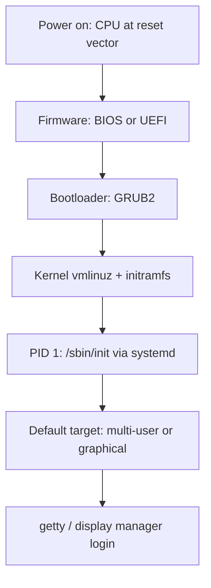
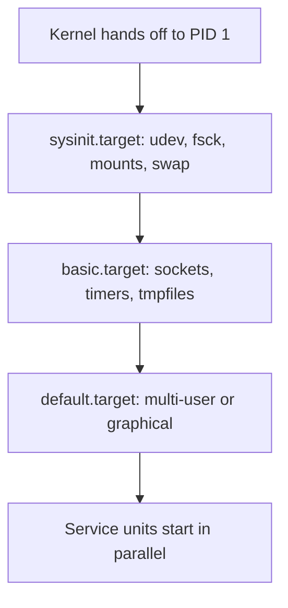

# System Boot Process

## Overview

The boot process is the sequence of events that occurs from pressing the power button to having a fully operational operating system. Understanding boot is essential for system administration, troubleshooting, and OS interviews — it's where hardware and software meet.

## Motivation

When you press the power button, the CPU has no software running and no memory content. The boot process must:
1. Initialize hardware (CPU, memory, peripherals)
2. Find and load the bootloader
3. The bootloader loads the OS kernel
4. The kernel initializes the system and starts services
5. The system is ready for user login

Each stage must hand off control to the next in a reliable, well-defined manner.

## Boot Sequence Overview

```
┌──────────────────────────────────────────────────────────────┐
│                    Boot Sequence                              │
│                                                              │
│  ┌──────────────────────────────────────────────────────┐    │
│  │  1. Power On → Hardware Initialization                │    │
│  │     POST (Power-On Self-Test)                         │    │
│  │     CPU starts at reset vector (0xFFFFFFF0 on x86)    │    │
│  └───────────────────────┬──────────────────────────────┘    │
│                          ▼                                   │
│  ┌──────────────────────────────────────────────────────┐    │
│  │  2. Firmware (BIOS/UEFI)                              │    │
│  │     Initialize hardware, find boot device             │    │
│  │     BIOS: MBR (first 512 bytes of disk)               │    │
│  │     UEFI: EFI System Partition (ESP)                  │    │
│  └───────────────────────┬──────────────────────────────┘    │
│                          ▼                                   │
│  ┌──────────────────────────────────────────────────────┐    │
│  │  3. Bootloader (GRUB)                                 │    │
│  │     Present boot menu, load kernel + initramfs        │    │
│  └───────────────────────┬──────────────────────────────┘    │
│                          ▼                                   │
│  ┌──────────────────────────────────────────────────────┐    │
│  │  4. Kernel Initialization                             │    │
│  │     Decompress, initialize subsystems, mount root fs  │    │
│  └───────────────────────┬──────────────────────────────┘    │
│                          ▼                                   │
│  ┌──────────────────────────────────────────────────────┐    │
│  │  5. Init System (systemd / SysVinit)                  │    │
│  │     Start services, reach target runlevel             │    │
│  └───────────────────────┬──────────────────────────────┘    │
│                          ▼                                   │
│  ┌──────────────────────────────────────────────────────┐    │
│  │  6. Login Prompt                                      │    │
│  │     Display manager or TTY login                      │    │
│  └──────────────────────────────────────────────────────┘    │
└──────────────────────────────────────────────────────────────┘
```

## The Boot Chain as a Diagram

The same chain, compressed to what you should be able to draw from memory. The key insight: every arrow is a *contract* — a fixed convention for what the next stage expects (the 512-byte MBR signature, the boot protocol's struct `boot_params`, the init binary path on the kernel command line), which is why "the bootloader didn't hand off correctly" produces such different symptoms than "the kernel panicked."



### Inside the Bootloader Handoff

GRUB2 is staged: on a BIOS disk, a 446-byte `boot.img` in the MBR loads `core.img` (placed in the post-MBR gap or a BIOS boot partition), which knows just enough filesystem to find `/boot/grub`, draw the menu, and load the kernel and initramfs. On UEFI there is no 512-byte magic — the firmware executes the `.efi` binary on the ESP directly, and NVRAM boot entries decide which one. The Linux handoff follows the documented boot protocol: GRUB fills `struct boot_params` (the memory map, framebuffer info), then jumps to the kernel entry. Kernel command-line parameters worth recognizing:

```
root=UUID=...  ro  quiet  splash  init=/sbin/init  console=ttyS0
```

- `root=` — the real root filesystem (by UUID/LABEL; the initramfs resolves it)
- `ro` — mount the root read-only first; fsck and journal replay happen before rw
- `init=` — override PID 1 (`init=/bin/bash` is the classic recovery trick)
- `console=` — redirect kernel output (serial console debugging on servers)

The full loader mechanics, GRUB config files, and recovery procedures are in [Bootloader](bootloader.md).

## Topics in This Chapter

| Topic | Description |
|-------|-------------|
| [BIOS/UEFI](bios-uefi.md) | Firmware interfaces |
| [Bootloader](bootloader.md) | GRUB and boot loading |
| [Init Systems](init-systems.md) | systemd, SysVinit, OpenRC |

## BIOS vs UEFI

| Aspect | BIOS | UEFI |
|---|---|---|
| Era | 1981 (IBM PC), legacy | 2000s (EFI → UEFI), current standard |
| CPU mode at boot | 16-bit real mode, then kernel switches | 32/64-bit, flat memory model |
| Boot source | First 512 bytes (MBR boot sector, `0x55AA` signature) | `.efi` executables from the FAT32 EFI System Partition |
| Partition scheme | MBR: 4 primary partitions, ~2 TiB disk limit | GPT: 128 partitions by default, 2^64 sectors |
| Secure Boot | Not possible | Signature chain: PK/KEK/db verify bootloader |
| Pre-OS services | Interrupts (INT 13h disk access) | Boot/runtime UEFI services, graphics output |
| Network boot | PXE | PXE + HTTP Boot |
| Configuration | Text menu, keyboard only | Graphical setup, mouse, diagnostics |

The single most quoted line: **BIOS boots from the first sector; UEFI boots from a filesystem**. UEFI's approach means the bootloader is just a file on the ESP (`/boot/efi/EFI/*/grubx64.efi`) that firmware can find by NVRAM boot entries — which is also why "reset the NVRAM boot order" fixes half of all dual-boot problems. Full firmware mechanics live at [BIOS/UEFI](bios-uefi.md).

## initramfs: Why It Exists

The kernel needs a driver to read the root filesystem — NVMe controller, RAID controller, LVM volume group, dm-crypt volume — but drivers are modules, and modules live *on* the root filesystem. That chicken-and-egg problem is solved by the **initramfs**: a gzipped cpio archive the bootloader loads alongside `vmlinuz`, which the kernel unpacks into a tmpfs and executes as the temporary root.

1. Bootloader loads `vmlinuz` + `initrd.img` into memory and jumps to the kernel.
2. Kernel decompresses itself, sets up virtual memory, unpacks initramfs to `rootfs` (RAM-backed tmpfs).
3. `/init` inside the archive runs as PID 1: loads storage/crypto modules (`modprobe`), assembles LVM/RAID, prompts for disk decryption if needed.
4. `/init` mounts the real root (by UUID/LABEL), then calls `switch_root` to pivot and exec the real `/sbin/init` (systemd).

The insight interviewers look for: initramfs exists so the *same* generic kernel can boot on arbitrary hardware — all the machine-specific drivers are resolved at boot time from the archive instead of being compiled in. Regenerate it after driver or firmware changes with `update-initramfs -u` (Debian family) or `dracut --regenerate-all --force` (RHEL family); inspect one with `lsinitramfs /boot/initrd.img-$(uname -r)`. Kernel-side documentation: [initrd/initramfs admin guide (kernel.org)](https://www.kernel.org/doc/html/latest/admin-guide/initrd.html).

## systemd Targets vs SysV Runlevels

The classic placement question is mapping old vocabulary to new. Runlevels were numbered states SysVinit entered by executing ordered script sets (`/etc/rc*.d/`); systemd replaced them with named **targets** — units that group dependencies and are activated in parallel rather than in sequence.

| SysV runlevel | systemd target | Meaning |
|---|---|---|
| 0 | `poweroff.target` | Halt and power off |
| 1, s, single | `rescue.target` | Single-user rescue shell |
| 2, 3, 4 | `multi-user.target` | Full multi-user, network, no GUI |
| 5 | `graphical.target` | Multi-user + display manager |
| 6 | `reboot.target` | Reboot |
| — | `emergency.target` | Minimal shell on root fs only (no SysV equivalent) |

Commands that replace the old `/etc/inittab` edits:

```bash
systemctl get-default                    # e.g. graphical.target
systemctl set-default multi-user.target  # change boot default
systemctl isolate rescue.target          # switch now, like `telinit 1`
```

Two differences worth stating beyond the mapping: targets are *not* mutually exclusive levels — `graphical.target` simply depends on `multi-user.target` — and systemd starts units concurrently where dependencies allow, which is why parallel boot replaced the runlevel-ordered script chain. Ordering is expressed as dependencies (`After=`, `Requires=`, `Wants=`), not S/K script numbering:



`systemd-analyze critical-chain` shows the actual dependency critical path, and `systemd-analyze blame` ranks slow units — both are the standard answers to "how would you speed up a slow boot?". Deep dive at [Init Systems](init-systems.md).

## Secure Boot and the Locked-Down Boot Path

UEFI **Secure Boot** turns the first handshake into a verification: firmware checks each bootloader's signature against databases in its own NVRAM (`db` allowlist, `dbx` revocation list) before executing it. Linux fits into this with the signed `shim` loader, which chains to GRUB, which loads the signed kernel; user-enrolled keys (MOK) let admins trust custom kernels. Once booted with signatures enforced, the kernel can enter **lockdown mode**, restricting interfaces an attacker could use after the fact — `/dev/mem`, kernel module loading without valid signatures, hibernation, and hardware debug ports. Verification then extends into userland via IMA appraisal. The chain firmware → lockdown → IMA is exactly the "extend trust past the bootloader" story; see [Kernel Lockdown](../security-internals/lockdown.md) and [IMA Signing](../security-internals/ima-signing.md).

## Where Boot Problems Surface

Troubleshooting skill = locating the fault *stage* from the symptom. Each row is a stage boundary, and the tool column is the first command you should reach for:

| Symptom | Failing stage | First tool |
|---|---|---|
| No video, beep codes | POST / hardware | Firmware diagnostics, reseat RAM |
| "Operating system not found" | Firmware → bootloader boundary | `efibootmgr`, check boot order / MBR signature |
| `grub rescue>` prompt | Bootloader can't find its files | Live USB, `grub-install`, `grub-mkconfig` |
| Kernel panic: "unable to mount root" | initramfs / `root=` mismatch | Check cmdline `root=`, storage modules in initramfs |
| Drops to emergency.target shell | fsck failed / fstab error | Read the journal on screen, fix `/etc/fstab` |
| Boots, but services fail late | Units under the default target | `systemctl --failed`, `journalctl -b -u <unit>` |

## Quick Revision

- **BIOS**: Legacy firmware, MBR boot, 16-bit real mode
- **UEFI**: Modern firmware, GPT/ESP boot, 32/64-bit
- **GRUB**: Most common Linux bootloader
- **Kernel**: Initializes hardware, mounts root filesystem
- **Init**: First user-space process (PID 1), starts all other services
- **systemd**: Modern init system (parallel startup, dependency management)

## Interview Questions

1. **Walk me through the boot chain end-to-end.** Power on → CPU begins at the reset vector → firmware (BIOS reads the MBR boot sector; UEFI launches a `.efi` file from the ESP) → bootloader (GRUB loads `vmlinuz` and the initramfs, passes the kernel command line) → kernel initializes memory, drivers, and unpacks initramfs → the initramfs `/init` loads storage modules, assembles LVM/RAID, mounts the real root, and `switch_root`s → systemd runs as PID 1 and activates the default target → login prompt. The exam-quality answer names the handoff contract at each arrow, not just the stage names.
2. **Why is the initramfs necessary? Can't the kernel just load drivers?** Drivers are kernel modules stored on the root filesystem, but reading the root filesystem may itself require one of those drivers (NVMe, RAID, LVM, dm-crypt) — a boot-time chicken-and-egg. The initramfs is a RAM-resident temporary root containing exactly the modules and userspace helpers needed to locate and mount the real root. It also keeps the shipped kernel generic: hardware specifics are resolved at boot instead of compiled in.
3. **Runlevel 3 vs runlevel 5 — what does that mean on a modern systemd machine?** Both map to one target family: runlevel 5 is `graphical.target`, which has the same dependencies as `multi-user.target` (the runlevel-3 equivalent) plus a display manager. Unlike SysV levels, targets are not exclusive states — `graphical.target` *pulls in* `multi-user.target` — and units start in parallel subject to dependencies. `systemctl get-default` / `set-default` / `isolate` replace the old `inittab`/`telinit` workflow.
4. **What actually changes with UEFI Secure Boot enabled?** Firmware no longer blindly executes the bootloader: every stage (shim → GRUB → kernel) must carry a signature in the firmware's `db` (with `dbx` for revocations), so boot-level rootkits that patch the loader cannot survive. After boot, the kernel may enter lockdown mode, closing post-boot bypasses such as unsigned module loading and `/dev/mem`, and IMA can extend verification to executables. The trade-off is tooling friction — custom kernels need MOK enrollment or Secure Boot disabled.
5. **The machine hangs with a blinking cursor after firmware POST — where in the chain is the fault, and why?** The bootloader stage: firmware found *a* boot device but could not get a handoff-able loader (wrong MBR signature, bad ESP boot entry, or GRUB's stage files missing after a partition change). Diagnose by reasoning along the chain: firmware POST completed (beeps/spash gone), so the failure is between firmware and kernel handoff — check NVRAM boot entries (`efibootmgr`), the ESP contents, and GRUB config (`grub-mkconfig`). Knowing which stage each symptom belongs to is the troubleshooting skill interviews are probing for.

## Key Takeaways

- The boot chain is firmware → bootloader → kernel+initramfs → PID 1 → default target; every arrow is a defined handoff contract.
- BIOS boots a 512-byte MBR sector in 16-bit real mode; UEFI launches `.efi` files from the FAT32 ESP in 32/64-bit mode and pairs with GPT disks.
- The initramfs is a RAM-backed temporary root that breaks the driver-on-root-filesystem chicken-and-egg and keeps one kernel image hardware-generic.
- SysV runlevels map to systemd targets (3→`multi-user.target`, 5→`graphical.target`), but targets are dependency graphs started in parallel, not exclusive numbered states.
- Secure Boot verifies shim → GRUB → kernel signatures before execution; kernel lockdown and IMA extend that trust chain into runtime.
- Troubleshooting skill = locating the fault *stage* from the symptom: POST ok + no GRUB = firmware/bootloader boundary; kernel panic on init = initramfs/root mount.

## References

- [initrd / initramfs documentation (kernel.org)](https://www.kernel.org/doc/html/latest/admin-guide/initrd.html)
- [boot(7) man page — system boot process (man7.org)](https://man7.org/linux/man-pages/man7/boot.7.html)
- [systemd bootup(7) — boot sequence and targets (freedesktop.org)](https://www.freedesktop.org/software/systemd/man/latest/bootup.html)
- [UEFI Forum specifications](https://uefi.org/specifications)
- Linux kernel documentation: <https://www.kernel.org/doc/html/latest/>

## Cross-References

- [BIOS/UEFI](bios-uefi.md) — Firmware deep dive
- [Bootloader](bootloader.md) — GRUB configuration and usage
- [Init Systems](init-systems.md) — systemd and alternatives
- [Kernel Lockdown](../security-internals/lockdown.md) — post-boot restrictions when Secure Boot is enforced
- [IMA Signing](../security-internals/ima-signing.md) — extending signature verification into userland
- [Boot Process (Kernel-Advanced)](../kernel-advanced/boot-process.md) — the same chain from the kernel's perspective
- [Daemons](../processes/daemons.md) — what systemd launches after the default target is reached
- [cgroups](../containers/cgroups.md) — the resource-control substrate systemd slices services into
