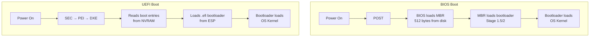

# BIOS vs UEFI

## Overview

When you press the power button, the CPU doesn't immediately run your operating system. It first executes **firmware** — low-level software stored on a chip on the motherboard. The two dominant firmware standards are **BIOS** (Basic Input/Output System) and **UEFI** (Unified Extensible Firmware Interface). Understanding the difference between them is fundamental to understanding the boot process.

| Feature | BIOS | UEFI |
|---|---|---|
| Introduced | 1975 (IBM PC) | 2005 (Intel's EFI evolved) |
| Firmware Interface | 16-bit real mode | 32/64-bit protected mode |
| Partition Table | MBR (max 2 TB, 4 primary partitions) | GPT (max 9.4 ZB, 128 partitions) |
| Boot Device Detection | Sequential | Parallel, faster |
| User Interface | Text-only | Graphical + mouse support |
| Secure Boot | No | Yes |
| Network Boot | Limited | Built-in, full TCP/IP stack |
| Driver Model | Built into firmware | Modular, stored on disk (EFI System Partition) |

---

## BIOS (Basic Input/Output System)

### What is BIOS?

BIOS is firmware stored on an **EEPROM/flash chip** on the motherboard. It is the first software that runs when the computer is powered on. The name comes from its original purpose: providing basic input/output routines for hardware communication.

### BIOS Architecture

```
┌──────────────────────────────────┐
│         BIOS Firmware            │
│  ┌────────────────────────────┐  │
│  │    POST (Power-On Self     │  │
│  │         Test)              │  │
│  └────────────┬───────────────┘  │
│               ▼                  │
│  ┌────────────────────────────┐  │
│  │   BIOS Setup / CMOS       │  │
│  │   Configuration            │  │
│  └────────────┬───────────────┘  │
│               ▼                  │
│  ┌────────────────────────────┐  │
│  │   Bootstrap Loader         │  │
│  │   (reads MBR from disk)    │  │
│  └────────────────────────────┘  │
└──────────────────────────────────┘
```

### Key Characteristics

1. **16-bit Real Mode**: BIOS operates in the CPU's original 16-bit real mode, limiting it to 1 MB of addressable memory.
2. **MBR Partition Scheme**: Uses the Master Boot Record — a 512-byte sector at the start of the disk containing:
   - 446 bytes: Bootstrap code
   - 64 bytes: Partition table (4 entries × 16 bytes)
   - 2 bytes: Boot signature (`0x55AA`)
3. **Interrupt-Driven I/O**: Uses software interrupts (e.g., `INT 13h` for disk access, `INT 10h` for video).
4. **CMOS Settings**: Configuration stored in a small amount of battery-backed SRAM (the CMOS chip).

### POST (Power-On Self-Test)

POST is the first phase of BIOS execution:

1. **CPU verification** — checks the processor is functional
2. **ROM checksum** — validates firmware integrity
3. **DMA/PIC initialization** — sets up Direct Memory Access and Programmable Interrupt Controllers
4. **Memory detection and test** — counts and tests RAM
5. **Device enumeration** — discovers and initializes keyboard, video, storage
6. **Plug-and-Play device initialization**
7. **Boot device selection** — reads the boot order from CMOS

If POST fails, BIOS emits **beep codes** (patterns of beeps indicating the type of failure).

---

## UEFI (Unified Extensible Firmware Interface)

### What is UEFI?

UEFI is a modern replacement for BIOS, developed by the **UEFI Forum** (originating from Intel's EFI specification). It is essentially a small operating system that runs before the OS boots.

### UEFI Architecture

```
┌──────────────────────────────────────────┐
│              UEFI Firmware               │
│  ┌────────────────────────────────────┐  │
│  │  SEC (Security Phase)              │  │
│  └────────────┬───────────────────────┘  │
│               ▼                          │
│  ┌────────────────────────────────────┐  │
│  │  PEI (Pre-EFI Initialization)      │  │
│  └────────────┬───────────────────────┘  │
│               ▼                          │
│  ┌────────────────────────────────────┐  │
│  │  DXE (Driver Execution Environment)│  │
│  └────────────┬───────────────────────┘  │
│               ▼                          │
│  ┌────────────────────────────────────┐  │
│  │  BDS (Boot Device Selection)       │  │
│  └────────────┬───────────────────────┘  │
│               ▼                          │
│  ┌────────────────────────────────────┐  │
│  │  TSL (Transient System Load)       │  │
│  │  → Loads OS bootloader from ESP    │  │
│  └────────────────────────────────────┘  │
└──────────────────────────────────────────┘
```

### Key Characteristics

1. **64-bit Native**: Operates in protected/long mode, can address full system memory.
2. **GPT Partition Scheme**: GUID Partition Table supports drives up to 9.4 zettabytes and 128 partitions.
3. **EFI System Partition (ESP)**: A dedicated FAT32 partition (typically 100–500 MB) containing bootloaders as `.efi` executables.
4. **Modular Driver Model**: Drivers are PE (Portable Executable) files stored on the ESP, loadable at runtime.
5. **Built-in Networking**: Full TCP/IP stack for network booting and remote diagnostics.
6. **Shell Environment**: UEFI includes a built-in command shell for diagnostics.

### UEFI Boot Process

1. **SEC Phase**: Establishes root of trust, initializes temporary memory (Cache-as-RAM)
2. **PEI Phase**: Initializes main memory (DRAM), chipset, and platform hardware
3. **DXE Phase**: Loads UEFI drivers, provides full boot services and runtime services
4. **BDS Phase**: Selects the boot device based on boot order variables stored in NVRAM
5. **TSL Phase**: Loads the OS bootloader (e.g., `grubx64.efi`, `shimx64.efi`) from the ESP

---

## Secure Boot

### What is Secure Boot?

Secure Boot is a UEFI security feature that ensures only **digitally signed** and **trusted** code runs during the boot process. It prevents **rootkits** and **bootkits** from hijacking the boot sequence.

### How Secure Boot Works

```
┌─────────────┐     ┌──────────────┐     ┌──────────────┐
│  Platform    │────▶│  Key         │────▶│  Verify      │
│  Key (PK)    │     │  Exchange    │     │  Bootloader  │
│  (Owner)     │     │  Key (KEK)   │     │  Signature   │
└─────────────┘     └──────────────┘     └──────┬───────┘
                                                 │
                                          ┌──────▼───────┐
                                          │  db: Allowed │
                                          │  dbx: Denied │
                                          │  Signatures  │
                                          └──────────────┘
```

- **PK (Platform Key)**: Root key, typically owned by the hardware manufacturer
- **KEK (Key Exchange Key)**: Used to sign updates to the signature database
- **db (Signature Database)**: Contains allowed signing certificates and hashes
- **dbx (Forbidden Signatures Database)**: Contains revoked/blacklisted keys

### Linux and Secure Boot

Linux distributions use **shim** — a small, Microsoft-signed bootloader that then verifies and loads GRUB:

```
UEFI Firmware
  └── shim.efi (Microsoft-signed)
        └── grubx64.efi (distribution-signed)
              └── Linux kernel (distribution-signed)
```

---

## BIOS vs UEFI: Side-by-Side Boot Flow



---

## Linux Examples

### Check BIOS or UEFI

```bash
# Method 1: Check if EFI variables exist
ls /sys/firmware/efi/
# If directory exists → UEFI; if not → BIOS/Legacy

# Method 2: Check firmware type
[ -d /sys/firmware/efi ] && echo "UEFI" || echo "BIOS"

# Method 3: Detailed info
dmesg | grep -i efi
```

### View EFI Boot Entries

```bash
# List boot entries
efibootmgr -v

# Example output:
# Boot0000* ubuntu    HD(1,GPT,...)/File(\EFI\ubuntu\shimx64.efi)
# Boot0001* Windows   HD(1,GPT,...)/File(\EFI\Microsoft\Boot\bootmgfw.efi)
```

### View Partition Table Type

```bash
# Check if disk uses GPT or MBR
sudo fdisk -l /dev/sda
# Look for "Disklabel type: gpt" or "Disklabel type: dos" (MBR)

# Or use parted
sudo parted /dev/sda print
```

### Inspect the ESP (EFI System Partition)

```bash
# Mount the ESP
sudo mount /dev/sda1 /mnt

# Typical ESP contents:
# /mnt/EFI/
#   ├── ubuntu/
#   │   ├── shimx64.efi
#   │   ├── grubx64.efi
#   │   └── grub.cfg
#   └── Microsoft/
#       └── Boot/
#           └── bootmgfw.efi
```

### View UEFI Variables

```bash
# List all UEFI variables
efivar -l

# Read a specific variable (e.g., BootOrder)
efivar -p -n 8BE4DF61-93CA-11d2-AA0D-00E098032B8C-BootOrder
```

---

## Interview Questions

### Q1: What is the main difference between BIOS and UEFI?
**A:** BIOS is 16-bit firmware using MBR partitioning with a 2 TB disk limit. UEFI is 32/64-bit firmware using GPT partitioning supporting disks up to 9.4 ZB. UEFI also supports Secure Boot, a graphical interface, modular drivers, and faster boot times.

### Q2: What is the EFI System Partition (ESP)?
**A:** The ESP is a FAT32-formatted partition that stores UEFI bootloaders as `.efi` executables. It is required for UEFI boot and typically 100–500 MB in size. The firmware reads boot entries from NVRAM that point to files on the ESP.

### Q3: How does Secure Boot work with Linux?
**A:** Linux uses a chain of trust: the UEFI firmware verifies `shim.efi` (signed by Microsoft), which in turn verifies GRUB (signed by the distribution), which verifies the Linux kernel. This allows Linux to boot on Secure Boot-enabled systems without requiring each distribution to get Microsoft to sign their kernel directly.

### Q4: Can a system support both BIOS and UEFI?
**A:** Yes, many motherboards offer a "Legacy" or "CSM" (Compatibility Support Module) mode that emulates BIOS behavior on UEFI hardware. However, you must choose one per boot — you can't mix MBR and GPT boot on the same disk for the same OS.

### Q5: What happens if the UEFI firmware is corrupted?
**A:** Modern motherboards often include a **dual-BIOS** or **BIOS recovery** mechanism. Some boards have a physical switch or a USB recovery method. UEFI firmware updates are more resilient because the update process can be done from within the OS, and some implementations have a recovery partition.

---

## Common Mistakes

1. **Confusing firmware with bootloader**: BIOS/UEFI is firmware; GRUB/systemd-boot is a bootloader loaded by firmware.
2. **Thinking UEFI is only for new computers**: UEFI has been standard since ~2012; most modern systems use it.
3. **Assuming GPT = UEFI**: While UEFI typically uses GPT, some UEFI implementations can boot from MBR (and BIOS can technically access GPT data disks, just not boot from them).
4. **Forgetting about CSM**: The Compatibility Support Module allows UEFI firmware to boot in BIOS mode, but it's being phased out.
5. **Not understanding the boot chain**: The full chain is: Power → Firmware (BIOS/UEFI) → Bootloader (GRUB) → Kernel → Init system (systemd) → User space.

---

## Summary

| Aspect | BIOS | UEFI |
|---|---|---|
| Mode | 16-bit real | 32/64-bit protected |
| Partitioning | MBR (2 TB, 4 partitions) | GPT (9.4 ZB, 128 partitions) |
| Boot file | MBR (446 bytes) | `.efi` files on ESP |
| Security | None | Secure Boot |
| Interface | Text-only | Graphical + shell |
| Speed | Slower (sequential) | Faster (parallel init) |
| Extensibility | Fixed | Modular drivers |
| Network | Limited | Full TCP/IP stack |

**Key Takeaway**: UEFI is the modern standard that replaces BIOS. It provides faster boot, larger disk support, Secure Boot for tamper protection, and a modular architecture. For placement interviews, focus on understanding the boot chain (firmware → bootloader → kernel → init), the role of the ESP, and how Secure Boot establishes a chain of trust.


## Cross References

- [Bootloader](../os/boot/bootloader.md)
- [Init Systems](../os/boot/init-systems.md)
- [I/O Hardware](../os/io/hardware.md)
