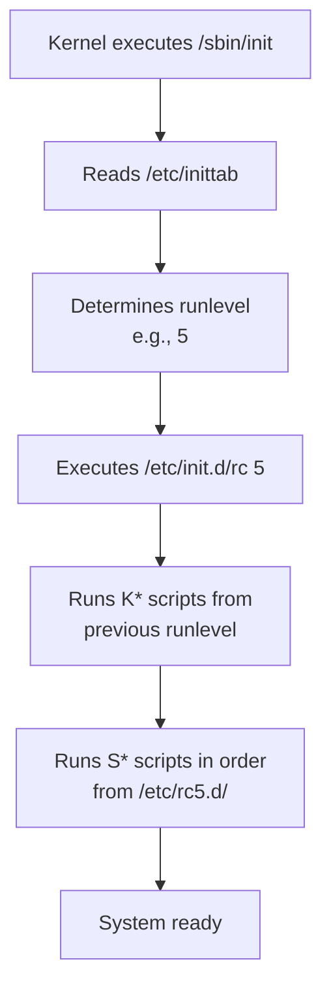
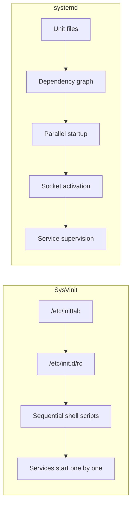

# Init Systems (systemd, SysVinit, runlevels)

## Overview

After the bootloader loads the kernel and the kernel initializes hardware, it needs to start the first **user-space process** — the **init system**. The init system (always **PID 1**) is responsible for:

1. Starting and managing all other system services
2. Bringing the system to a usable state
3. Handling service dependencies
4. Managing system states (boot, shutdown, rescue)

The two major init systems in Linux are **SysVinit** (traditional) and **systemd** (modern, now dominant).

---

## SysVinit (System V Init)

### History

SysVinit comes from AT&T UNIX System V (1983). It was the standard Linux init system for decades until systemd replaced it starting around 2010–2015.

### Architecture

```
Kernel
  └── /sbin/init (SysVinit)
        └── Reads /etc/inittab
              └── Determines default runlevel
                    └── Executes /etc/rc.d/rcN.d/ scripts
                          ├── K* scripts (Kill/stop)
                          └── S* scripts (Start)
```

### Runlevels

SysVinit uses **runlevels** — predefined system states:

| Runlevel | Purpose | Description |
|---|---|---|
| 0 | Halt | System shutdown |
| 1 | Single-user | Maintenance mode, no network |
| 2 | Multi-user | No networking (Debian: full multi-user) |
| 3 | Multi-user + networking | Full CLI mode (default on servers) |
| 4 | Undefined | Customizable |
| 5 | Multi-user + GUI | Graphical desktop (default on desktops) |
| 6 | Reboot | System restart |

The default runlevel is set in `/etc/inittab`:
```
id:5:initdefault:
```

### Init Scripts

Each service has a script in `/etc/init.d/`:

```bash
#!/bin/bash
# /etc/init.d/apache2

case "$1" in
    start)
        echo "Starting Apache..."
        /usr/sbin/apache2ctl start
        ;;
    stop)
        echo "Stopping Apache..."
        /usr/sbin/apache2ctl stop
        ;;
    restart)
        $0 stop
        sleep 1
        $0 start
        ;;
    status)
        pidof apache2 && echo "Running" || echo "Stopped"
        ;;
    *)
        echo "Usage: $0 {start|stop|restart|status}"
        exit 1
        ;;
esac
```

### How SysVinit Boots



The `S*` and `K*` scripts are **symbolic links** to scripts in `/etc/init.d/`, prefixed with a number that determines execution order:

```bash
$ ls /etc/rc5.d/
K10apache2      S20ssh      S20rsyslog
S10networking   S20cron     S23ntp
S12syslog       S20dbus     S99rc.local
```

- `S20ssh` → starts SSH (runs `/etc/init.d/ssh start`)
- `K10apache2` → kills Apache (runs `/etc/init.d/apache2 stop`)

### Commands

```bash
# Check current runlevel
runlevel
# Output: N 5  (previous=N/A, current=5)

# Change runlevel
sudo init 3          # Switch to runlevel 3
sudo telinit 3       # Same thing

# Manage services
sudo service apache2 start
sudo service apache2 stop
sudo service apache2 status
sudo service --status-all
```

---

## systemd

### What is systemd?

systemd is a modern init system and service manager developed by **Lennart Poettering** and **Kay Sievers** (first released 2010). It has become the default init system on most major distributions: Ubuntu (since 15.04), Debian (since 8), RHEL/CentOS (since 7), Fedora (since 15), Arch Linux, and SUSE.

### Why systemd Replaced SysVinit

| Problem with SysVinit | systemd Solution |
|---|---|
| Sequential startup (slow) | Parallel startup with dependency resolution |
| Shell scripts are slow | Compiled C binaries for core functionality |
| No service supervision | Automatic restart of crashed services |
| Runlevels are coarse | Fine-grained targets |
| Manual dependency management | Automatic dependency resolution |
| No socket activation | Socket and D-Bus activation |

### Architecture

```
systemd (PID 1)
  ├── Manager process
  ├── Reads unit files from:
  │     /usr/lib/systemd/system/  (package defaults)
  │     /etc/systemd/system/      (admin overrides)
  │     /run/systemd/system/      (runtime)
  ├── Unit types:
  │     .service    → services
  │     .socket     → socket-activated services
  │     .target     → groups of units (like runlevels)
  │     .mount      → filesystem mounts
  │     .timer      → scheduled tasks (like cron)
  │     .device     → device units
  │     .swap       → swap partitions/files
  │     .path       → path-based activation
  ├── journalctl    → centralized logging
  ├── loginctl      → session management
  └── timedated     → time/date management
```

### Unit Files

A service unit file:

```ini
# /etc/systemd/system/myapp.service
[Unit]
Description=My Application
After=network.target postgresql.service
Requires=postgresql.service

[Service]
Type=simple
User=www-data
Group=www-data
WorkingDirectory=/opt/myapp
ExecStartPre=/opt/myapp/check-config.sh
ExecStart=/opt/myapp/bin/server --config /etc/myapp/config.yaml
ExecReload=/bin/kill -HUP $MAINPID
Restart=on-failure
RestartSec=5s
StandardOutput=journal
StandardError=journal

[Install]
WantedBy=multi-user.target
```

**Key directives:**

- `After=` / `Before=`: Ordering dependencies (doesn't require)
- `Requires=`: Hard dependency (fail if dependency fails)
- `Wants=`: Soft dependency (continue even if dependency fails)
- `Type=simple|forking|oneshot|notify|idle`: How the service starts
- `Restart=on-failure|always|on-abnormal`: Auto-restart policy
- `WantedBy=`: Which target "enables" this service

### Targets (Replacing Runlevels)

systemd uses **targets** instead of runlevels:

| SysVinit Runlevel | systemd Target | Purpose |
|---|---|---|
| 0 | `poweroff.target` | Shutdown |
| 1 | `rescue.target` | Single-user |
| 3 | `multi-user.target` | Multi-user CLI |
| 5 | `graphical.target` | GUI desktop |
| 6 | `reboot.target` | Reboot |

```bash
# View current target
systemctl get-default
# Output: graphical.target

# Change default target
sudo systemctl set-default multi-user.target

# Switch to a target
sudo systemctl isolate rescue.target
```

### systemctl Commands

```bash
# Service management
sudo systemctl start nginx
sudo systemctl stop nginx
sudo systemctl restart nginx
sudo systemctl reload nginx          # Reload config without restart
sudo systemctl status nginx          # Detailed status with recent logs

# Enable/disable (start on boot)
sudo systemctl enable nginx
sudo systemctl disable nginx
sudo systemctl enable --now nginx    # Enable + start immediately

# List units
systemctl list-units --type=service
systemctl list-units --type=service --state=running
systemctl list-unit-files --type=service

# Failed services
systemctl --failed
systemctl reset-failed

# Mask/unmask (completely prevent a service from starting)
sudo systemctl mask nginx
sudo systemctl unmask nginx

# Show unit file contents
systemctl cat nginx.service

# Reload systemd after editing unit files
sudo systemctl daemon-reload
```

### journalctl (Logging)

```bash
# View all logs
journalctl

# Logs for a specific service
journalctl -u nginx.service

# Follow logs in real-time
journalctl -f -u nginx.service

# Logs since last boot
journalctl -b

# Logs from previous boot
journalctl -b -1

# Logs in the last hour
journalctl --since "1 hour ago"

# Logs with priority error or higher
journalctl -p err

# Disk usage of journal
journalctl --disk-usage

# Vacuum old logs
journalctl --vacuum-size=500M
journalctl --vacuum-time=30d
```

---

## Comparison: SysVinit vs systemd



---

## Practical Examples

### Create a systemd Service

```bash
# 1. Create the service file
sudo tee /etc/systemd/system/myapp.service << 'EOF'
[Unit]
Description=My Custom Application
After=network.target

[Service]
Type=simple
ExecStart=/usr/bin/python3 /opt/myapp/server.py
Restart=on-failure
RestartSec=10
User=myapp
Group=myapp
Environment=PYTHONUNBUFFERED=1

[Install]
WantedBy=multi-user.target
EOF

# 2. Reload systemd
sudo systemctl daemon-reload

# 3. Start and enable
sudo systemctl enable --now myapp.service

# 4. Check status
sudo systemctl status myapp.service
```

### Create a systemd Timer (Cron Replacement)

```ini
# /etc/systemd/system/backup.timer
[Unit]
Description=Daily backup timer

[Timer]
OnCalendar=*-*-* 02:00:00
Persistent=true

[Install]
WantedBy=timers.target

# /etc/systemd/system/backup.service
[Unit]
Description=Daily backup

[Service]
Type=oneshot
ExecStart=/opt/scripts/backup.sh
```

```bash
sudo systemctl enable --now backup.timer
systemctl list-timers
```

### Override a Service

```bash
# Edit drop-in override (don't modify package unit files)
sudo systemctl edit nginx.service
# Opens an editor, add:
#   [Service]
#   LimitNOFILE=65536

# Creates: /etc/systemd/system/nginx.service.d/override.conf
sudo systemctl daemon-reload
sudo systemctl restart nginx
```

---

## Interview Questions

### Q1: What is PID 1 and why is it special?
**A:** PID 1 is the init process — the first user-space process started by the kernel. It is special because:
- It is the ancestor of all other processes (all processes are children or descendants of PID 1)
- If PID 1 dies, the kernel panics
- Orphaned processes are reparented to PID 1
- It is responsible for reaping zombie processes

### Q2: What are runlevels in SysVinit?
**A:** Runlevels are predefined system states (0–6) that determine which services are running. For example, runlevel 3 is multi-user CLI, runlevel 5 is graphical desktop, runlevel 0 is shutdown, and runlevel 6 is reboot. Each runlevel has a directory of symbolic links to init scripts that are started (S*) or killed (K*) when entering that runlevel.

### Q3: How does systemd achieve parallel startup?
**A:** systemd builds a **dependency graph** of all units and starts independent services in parallel. Services that don't depend on each other (or only depend on sockets) can start simultaneously. Socket activation allows a service to accept connections before it's fully started — systemd holds the socket and passes it to the service when ready.

### Q4: What is the difference between `systemctl enable` and `systemctl start`?
**A:** `systemctl start` starts the service immediately for the current session. `systemctl enable` creates symlinks so the service starts automatically on boot (adds it to the appropriate target's `Wants`). `systemctl enable --now` does both.

### Q5: What is the difference between `Requires=` and `Wants=` in systemd unit files?
**A:** `Requires=` is a hard dependency — if the required unit fails, the current unit also fails. `Wants=` is a soft dependency — if the wanted unit fails, the current unit continues. `After=` controls ordering (which starts first) but doesn't imply dependency.

### Q6: How does systemd handle zombie processes?
**A:** As PID 1, systemd is responsible for reaping zombie processes (calling `wait()` on terminated children). In SysVinit, this was handled by the `init` process's main loop. systemd also provides `KillMode=` and `KillSignal=` directives to control how service processes are terminated.

---

## Common Mistakes

1. **Editing unit files without daemon-reload**: After editing unit files in `/etc/systemd/system/`, always run `systemctl daemon-reload` before restarting the service.
2. **Using `service` on systemd systems**: The `service` command is a compatibility wrapper. Use `systemctl` directly for full functionality.
3. **Confusing `enable` with `start`**: Enabling a service doesn't start it; starting a service doesn't enable it for boot.
4. **Not using `systemctl edit`**: Directly editing files in `/usr/lib/systemd/system/` will be overwritten on package updates. Use `systemctl edit` to create overrides in `/etc/systemd/system/`.
5. **Misunderstanding targets vs runlevels**: Targets are not exactly runlevels — multiple targets can be active simultaneously, while only one runlevel can be active at a time.

---

## Summary

| Feature | SysVinit | systemd |
|---|---|---|
| Startup | Sequential shell scripts | Parallel with dependency resolution |
| Configuration | `/etc/init.d/` scripts + `/etc/inittab` | Unit files in `/etc/systemd/system/` |
| System states | Runlevels (0–6) | Targets (multiple active) |
| Service supervision | None (manual) | Automatic restart on failure |
| Logging | Syslog (`/var/log/`) | Journal (`journalctl`) |
| Socket activation | No | Yes |
| Timer support | cron | systemd timers |
| Status | Legacy/deprecated | Standard on most distributions |

**Key Takeaway**: systemd is the modern standard init system. For interviews, understand the unit file structure, the difference between `enable` and `start`, how targets replace runlevels, and how systemd achieves parallel startup through dependency resolution and socket activation.


## Cross References

- [Bootloader](bootloader.md)
- [Daemons](../processes/daemons.md)
- [Kubernetes Pods](../../cloud/kubernetes/pods.md)
- [Process Creation](../processes/creation.md)
