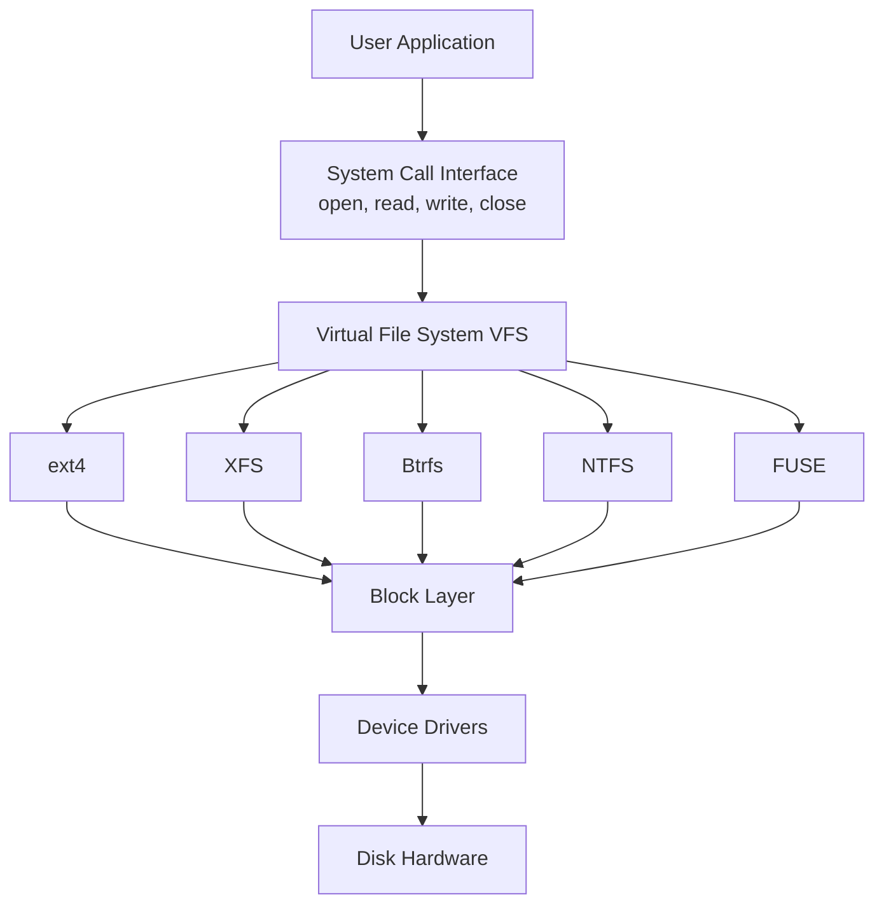

# Filesystems

A **filesystem** is the method and data structure an operating system uses to organize, store, retrieve, and manage data on storage devices. It bridges the gap between raw disk blocks and the logical files and directories that users and applications interact with.

## Why Filesystems Matter

Without a filesystem, a disk is just a massive array of numbered blocks. A filesystem imposes structure:

- **Naming** — files have human-readable names, not just block numbers
- **Hierarchy** — directories organize files into a tree
- **Metadata** — permissions, timestamps, ownership, size
- **Allocation** — which blocks belong to which file
- **Free-space tracking** — which blocks are available

## Key Concepts at a Glance

| Concept | Description |
|---------|-------------|
| File | A named collection of bytes with metadata |
| Directory | A special file that maps names → inodes/entries |
| Inode | On-disk structure holding file metadata (not the name) |
| Superblock | Filesystem-level metadata (size, state, layout) |
| Block allocation | Strategy for assigning disk blocks to files |
| Journaling | Write-ahead log for crash consistency |

## Chapter Contents

- [File Concepts](file-concepts.md) — what a file is, types, attributes
- [Directory Structure](directory-structure.md) — single-level, tree, DAG, acyclic graph
- [Disk Allocation](disk-allocation.md) — contiguous, linked, indexed
- [Free Space Management](free-space.md) — bitmaps, linked lists, grouping
- [Virtual File System](vfs.md) — the kernel abstraction layer
- [ext4](ext4.md) — Linux workhorse filesystem
- [XFS](xfs.md) — high-performance journaling filesystem
- [Btrfs](btrfs.md) — copy-on-write, snapshots, checksums
- [NTFS](ntfs.md) — Windows NT filesystem
- [ZFS](zfs.md) — pooled storage, RAID-Z, checksums everywhere
- [Journaling](journaling.md) — crash consistency mechanisms
- [RAID](raid.md) — redundant arrays of independent disks
- [FUSE](fuse.md) — filesystem in userspace

## Interview Quick Facts

1. **Inode vs directory entry**: An inode stores metadata + block pointers. A directory entry is just a mapping from filename → inode number.
2. **Hard link vs symlink**: Hard link = another directory entry pointing to the same inode (same filesystem only). Symlink = a special file containing a path (can cross filesystems).
3. **VFS** lets the kernel support multiple filesystem types through a uniform interface.
4. **Journaling** prevents filesystem corruption after a crash by logging intended changes before applying them.

## Diagram: Filesystem Layers

## Cross-References

- [I/O System](../io/README.md) — how blocks reach the disk
- [Synchronization](../synchronization/README.md) — concurrent file access
- [Security](../security/README.md) — file permissions and access control
- [Containers](../containers/README.md) — filesystem namespaces

## Cross References

- [VFS](vfs.md)
- [File Concepts](file-concepts.md)
- [Disk Allocation](disk-allocation.md)
- [File Organization (DBMS)](../../dbms/storage/file-organization.md)
- [Storage Overview](../../storage/overview.md)
