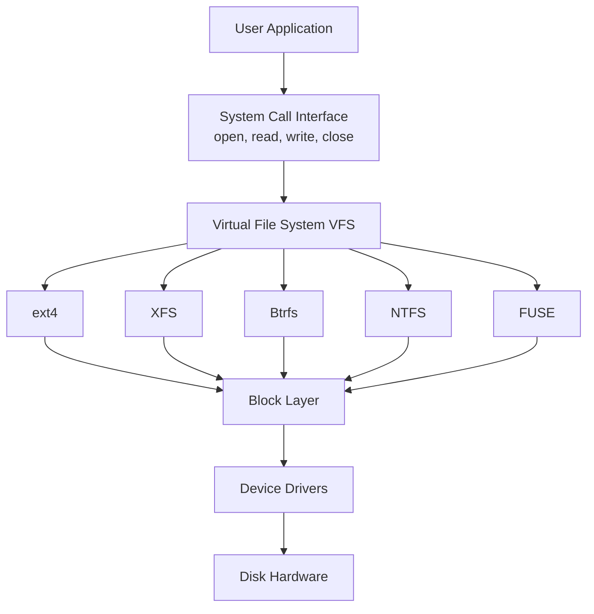
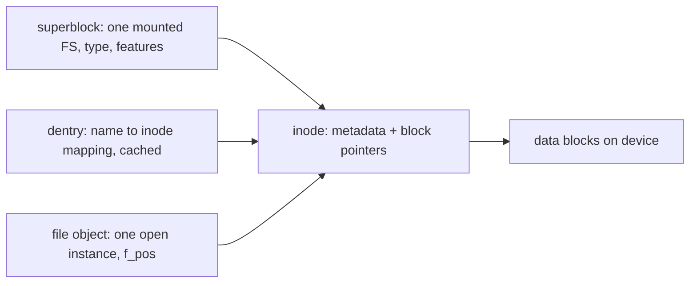
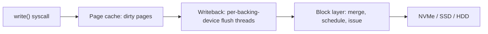

# Filesystems

A **filesystem** is the method and data structure an operating system uses to organize, store, retrieve, and manage data on storage devices. It bridges the gap between raw disk blocks and the logical files and directories that users and applications interact with.

## Why Filesystems Matter

Without a filesystem, a disk is just a massive array of numbered blocks. A filesystem imposes structure:

- **Naming** — files have human-readable names, not just block numbers
- **Hierarchy** — directories organize files into a tree
- **Metadata** — permissions, timestamps, ownership, size
- **Allocation** — which blocks belong to which file
- **Free-space tracking** — which blocks are available

## Key Concepts at a Glance

| Concept | Description |
|---------|-------------|
| File | A named collection of bytes with metadata |
| Directory | A special file that maps names → inodes/entries |
| Inode | On-disk structure holding file metadata (not the name) |
| Superblock | Filesystem-level metadata (size, state, layout) |
| Block allocation | Strategy for assigning disk blocks to files |
| Journaling | Write-ahead log for crash consistency |

## Chapter Contents

- [File Concepts](file-concepts.md) — what a file is, types, attributes
- [Directory Structure](directory-structure.md) — single-level, tree, DAG, acyclic graph
- [Disk Allocation](disk-allocation.md) — contiguous, linked, indexed
- [Free Space Management](free-space.md) — bitmaps, linked lists, grouping
- [Virtual File System](vfs.md) — the kernel abstraction layer
- [ext4](ext4.md) — Linux workhorse filesystem
- [XFS](xfs.md) — high-performance journaling filesystem
- [Btrfs](btrfs.md) — copy-on-write, snapshots, checksums
- [NTFS](ntfs.md) — Windows NT filesystem
- [ZFS](zfs.md) — pooled storage, RAID-Z, checksums everywhere
- [Journaling](journaling.md) — crash consistency mechanisms
- [RAID](raid.md) — redundant arrays of independent disks
- [FUSE](fuse.md) — filesystem in userspace

## Interview Quick Facts

1. **Inode vs directory entry**: An inode stores metadata + block pointers. A directory entry is just a mapping from filename → inode number.
2. **Hard link vs symlink**: Hard link = another directory entry pointing to the same inode (same filesystem only). Symlink = a special file containing a path (can cross filesystems).
3. **VFS** lets the kernel support multiple filesystem types through a uniform interface.
4. **Journaling** prevents filesystem corruption after a crash by logging intended changes before applying them.

## Diagram: Filesystem Layers


```mermaid
graph TD
    A[User Application] --> B[System Call Interface<br>open, read, write, close]
    B --> C[Virtual File System VFS]
    C --> D[ext4]
    C --> E[XFS]
    C --> F[Btrfs]
    C --> G[NTFS]
    C --> H[FUSE]
    D --> I[Block Layer]
    E --> I
    F --> I
    G --> I
    H --> I
    I --> J[Device Drivers]
    J --> K[Disk Hardware]
```

## Inside the VFS Layer

VFS is not one abstraction but four cooperating kernel objects — knowing their names and relationships is what separates a memorized answer from a real one. The generic **inode** caches on-disk file metadata; the **dentry** (directory entry) caches a path component name → inode mapping and enables the dentry cache that makes repeated path lookups nearly free; the **file object** represents one *open* instance with its own offset (`f_pos`) — which is exactly why two processes that open the same file have independent write positions; the **superblock** represents one mounted filesystem instance. Each object carries an operations table (`inode_operations`, `file_operations`, `dentry_operations`), and VFS dispatches through whichever table the concrete filesystem installed.


```mermaid
graph LR
    SB["superblock: one mounted FS, type, features"] --> INO["inode: metadata + block pointers"]
    D["dentry: name to inode mapping, cached"] --> INO
    F["file object: one open instance, f_pos"] --> INO
    INO --> DATA["data blocks on device"]
```

Path resolution walks component by component (`/a/b.txt` → root dentry → `a` → `b.txt`), consulting the dentry cache first and falling back to the filesystem's `lookup`. Hard links work because a directory entry is just a name pointing at an inode number — two names in two directories can point at one inode, and the kernel refuses to cross mount points when resolving them. The full resolution rules (mount-point crossing, symlinks, `..`) are documented in [path_resolution(7)](https://man7.org/linux/man-pages/man7/path_resolution.7.html). Deep dives live at [Virtual File System](vfs.md) and [VFS Internals](../kernel-advanced/vfs-internals.md).

### The Two Write Paths: Page Cache vs Direct I/O

VFS never pushes application bytes straight to the disk in the default path. A `write()` copies into the **page cache** and marks pages dirty; kernel writeback threads flush them later. This buffering is why a crashed *process* usually loses nothing (data was in the OS cache), while an unclean *machine* shutdown is the scenario that actually tests journaling. The durability knobs:

| Call / flag | What it guarantees |
|---|---|
| `fsync(fd)` | File data **and** metadata durable on storage |
| `fdatasync(fd)` | Data durable, skips non-essential metadata (e.g., mtime) — cheaper |
| `syncfs(fd)` | Every dirty page of that filesystem |
| `O_DIRECT` | Bypasses the page cache; DMA into app buffers; requires alignment |
| `mmap` write | Goes through the same page cache via the memory manager — one cache, not two |

Databases (Postgres, InnoDB) manage their own buffer pools and use `O_DIRECT` or strict fsync ordering precisely so the OS cache does not double-buffer or reorder their WAL. That single sentence answers the recurring "why doesn't Postgres trust the page cache?" interview question — see [I/O Internals](../advanced/io-internals.md) and [mmap](../memory/mmap.md).


```mermaid
flowchart LR
    APP["write() syscall"] --> PC["Page cache: dirty pages"]
    PC --> WB["Writeback: per-backing-device flush threads"]
    WB --> BLK["Block layer: merge, schedule, issue"]
    BLK --> DISK["NVMe / SSD / HDD"]
```

## Journaling Modes

The problem journaling solves: a filesystem write touches multiple on-disk structures (data blocks, inode, bitmaps, directory entry), and a crash between them leaves the on-disk image inconsistent. The fix is a write-ahead journal: record intended changes, commit a transaction marker, then apply. The interview-level detail is *what* gets journaled — ext4's three modes:

| Mode (`data=`) | What the journal records | Crash behavior | Relative cost |
|---|---|---|---|
| `journal` | Metadata **and** file data | Strongest: replays everything from the log | Roughly double writes — data is written twice |
| `ordered` (ext4 default) | Metadata only; data blocks are flushed to disk **before** the metadata commit | No stale data exposure (file never contains someone else's old blocks); file may be short or empty but not corrupt | Best balance; default for a reason |
| `writeback` | Metadata only; no ordering vs data | Metadata consistent, but file contents may contain *stale garbage* blocks after crash | Fastest |

XFS journals metadata only (writeback-style) but orders data before metadata commit for consistency, which is why it survives crashes with metadata integrity but can leave truncated files — a deliberate throughput-over-guarantee choice. Btrfs and ZFS take a different route entirely: copy-on-write makes every write atomic at the transaction root, so there is no journal to replay (see the comparison below). Set modes in `/etc/fstab`:

```
UUID=...  /data  ext4  defaults,data=ordered  0  2
```

Full mechanics — transaction structure, recovery replay, and the `tune2fs -o journal_data` escape hatch — are covered at [Journaling](journaling.md).

## Filesystem Family Comparison

| Filesystem | Design | Max file size | Checksums | Snapshots | Where you meet it |
|---|---|---|---|---|---|
| [ext4](ext4.md) | Journaling, extents, delayed allocation | 16 TB (4 KiB blocks) | Metadata only (optional) | No | Default on most Linux distros |
| [XFS](xfs.md) | Journaling, B+trees, highly parallel | 8 EiB | Metadata only | No (dump/restore instead) | RHEL default; large media/parallel workloads |
| [Btrfs](btrfs.md) | Copy-on-write, B-trees, subvolumes | 16 EiB | Data + metadata | Yes, cheap | openSUSE/Fedora defaults, snapshot-based rollback |
| [ZFS](zfs.md) | CoW pooled storage, RAID-Z, ARC cache | 16 EiB | Data + metadata, end-to-end | Yes | NAS (TrueNAS), data dedup/backup boxes |
| [NTFS](ntfs.md) | Journaling, Master File Table | 8 PB (16 TiB practical) | Optional | VSS-based | Windows, dual-boot volumes |
| [F2FS](https://www.kernel.org/doc/html/latest/filesystems/f2fs.html) | Flash/append-friendly, log-structured | 3.94 TB (typical) | Checksummed segments | No | Android, eMMC/SSD devices |

Reading the table as trade-offs: journaling filesystems (ext4/XFS/NTFS) patch a classic in-place design with a log; CoW filesystems (Btrfs/ZFS) never overwrite live blocks, which buys atomic writes, free snapshots, and checksum-verified data at the cost of fragmentation and worse small-random-write behavior. "Checksums everywhere" is ZFS/Btrfs's answer to silent corruption (bit rot) that journaling filesystems cannot even detect.

### Picking a Filesystem in an Interview

System-design and ops questions often end with "what would you store this on?" Defensible defaults:

| Requirement | Reasonable pick | Why |
|---|---|---|
| General-purpose Linux default | ext4 | Predictable latency, battle-tested, easy recovery |
| Huge, parallel, append-heavy streams (media, HPC) | XFS | B+tree allocation scales with concurrent writers |
| Snapshots and rollback on plain Linux (OS upgrades) | Btrfs | Native CoW subvolumes, `snapper`-style rollback |
| Storage appliance with end-to-end integrity | ZFS | Pooled storage, RAID-Z, checksums with self-heal |
| Windows-only environment | NTFS | Native, MFT, VSS for point-in-time copies |
| Flash-native embedded device | F2FS | Log-structured layout matches flash erase blocks |

## Crash Consistency: The Core Problem

Appending one line to a log file requires at minimum three independent disk writes: the data block, the inode (new size/block pointer), and the directory entry (new file length). Power loss between writes leaves a torn state — data with no metadata, or metadata pointing at unallocated blocks. Different designs give different guarantees about *which* torn states you can observe after recovery:

- **Journaling (ext4/XFS)**: replay the log to roll metadata (and, in `data=journal`, data) to a committed point; result is pre-crash or post-crash, never corrupt.
- **Copy-on-write (Btrfs/ZFS)**: write new copies of modified blocks, then atomically flip the transaction root pointer; a crash simply abandons the incomplete transaction — no replay needed.
- **fsync discipline (application level)**: none of the above helps if the *application* assumes ordering. Databases fsync the data file before fsyncing the WAL record that references it — the classic Postgres/SQLite durability chain. The kernel page cache silently reorders until an fsync arrives; that is the lesson behind the famous "fsync() with delayed allocation" ext4 controversy (2009).

Crashes are only half the risk: **silent corruption** (bad sector, controller bug) writes plausible-looking garbage. Checksummed CoW filesystems detect it at read time and, with redundancy (RAID-Z, mirrors), self-heal from the good copy — whereas a journaling FS happily returns the corrupted bytes. The interaction matters: RAID-5 has a write hole during power loss that ZFS closes with checksum verification, covered at [RAID](raid.md).

### Key Numbers Worth Memorizing

| Number | Value | Note |
|---|---|---|
| ext4 max file size | 16 TiB | With 4 KiB blocks (extent-based) |
| ext4 max volume | 1 EiB | |
| XFS max file / volume | 8 EiB / 8 EiB | The scale-out answer |
| Filename length | 255 bytes | Nearly universal on Linux FS |
| Full path length | 4096 bytes | `PATH_MAX` in `limits.h` |
| ext4 default inode size | 256 bytes | metadata + inline xattr space |
| Page cache page | 4 KiB base, large folios to 2 MiB | Modern kernels merge into folios |

## Interview Questions

1. **What exactly happens in the kernel when a process calls `open("/var/log/app.log")`?** VFS walks the path component by component, consulting the dentry cache first, then each directory's `lookup` in the mounted filesystem; permissions are checked against the inode at each step. On success the kernel allocates a `struct file` (with its own `f_pos`) and returns the lowest free file descriptor from the process's table. Two processes opening the same file get two independent file objects — and therefore independent offsets — which is the root cause of many "concurrent append" race discussions.
2. **Why can't a hard link cross filesystems?** A hard link is a directory entry mapping a name to an inode number, and inode numbers are only unique within one filesystem. A second filesystem has its own inode space and its own superblock, so "inode 42" is ambiguous across the boundary. Symlinks store a *path string* instead, which resolves through VFS and therefore can cross mounts (and dangle if the target disappears).
3. **Compare ext4's journaling modes. Why is `data=ordered` the default?** `data=journal` writes data through the journal — strongest guarantee, ~2× write cost. `writeback` journals metadata only with no data ordering — fastest, but after a crash files can contain stale garbage blocks. `ordered` journals metadata only but flushes data before the metadata commit: you avoid both the double write and the stale-data exposure, which is the best performance/consistency trade-off for general workloads — hence the default.
4. **Why do CoW filesystems get "free" snapshots?** Because a CoW write never modifies blocks in place — it allocates new blocks and atomically republishes the transaction root. A snapshot is just a pinned reference to an old root: zero copying, O(1) creation, and the space cost is only the delta of blocks that later change. The same mechanism provides checksum-verified reads and atomic crash recovery without a journal replay.
5. **Your application writes records and loses the last few after a power cut — filesystem bug?** Almost certainly not. The kernel page cache buffers and reorders writes; data reaches stable storage only after an explicit `fsync()`/`fdatasync()` (or `O_SYNC`). A durable application must fsync the data before fsyncing any metadata or WAL record that references it. Journaling protects *filesystem structure*, not application-level transaction ordering — blaming ext4 for lost unflushed records is a classic misdiagnosis.

## Key Takeaways

- VFS is four objects: superblock (mount), inode (metadata), dentry (name→inode cache), file (open instance with `f_pos`); each concrete filesystem plugs in its operations tables.
- Path resolution is cached (dentry cache) and governed by documented rules — [path_resolution(7)](https://man7.org/linux/man-pages/man7/path_resolution.7.html).
- Journaling modes are a data-ordering dial: `journal` (safest, 2× writes), `ordered` (ext4 default, best trade-off), `writeback` (fastest, stale-data risk).
- ext4/XFS patch in-place designs with a log; Btrfs/ZFS use copy-on-write for atomic transactions, cheap snapshots, and end-to-end checksums.
- Crash consistency is a layered contract: the filesystem guarantees structural consistency; only application `fsync` ordering guarantees *your* data's durability.
- Silent corruption is invisible to journaling FS but detectable (and with redundancy, self-healing) on checksummed CoW FS.
- Know the numbers: ext4 16 TB max file, XFS 8 EiB, 398-day TLS-of-storage equivalent is the CA max validity — if asked limits, cite block size × pointer-width math rather than magic values.

## References

- [inode(7)](https://man7.org/linux/man-pages/man7/inode.7.html) — inode semantics on Linux
- [path_resolution(7)](https://man7.org/linux/man-pages/man7/path_resolution.7.html) — VFS path walking rules
- [ext4 documentation (kernel.org)](https://www.kernel.org/doc/html/latest/filesystems/ext4/index.html) — journaling modes and mount options
- [XFS documentation (kernel.org)](https://www.kernel.org/doc/html/latest/filesystems/xfs.html)
- [Btrfs documentation (kernel.org)](https://www.kernel.org/doc/html/latest/filesystems/btrfs.html)
- V. Prabhakaran, A. Arpaci-Dusseau, R. Arpaci-Dusseaau, "Journaling versus Copy-on-Write for I/Os," FAST 2005 workshop (title + venue; no stable URL cited)

## Cross-References

- [I/O System](../io/README.md) — how blocks reach the disk
- [Synchronization](../synchronization/README.md) — concurrent file access
- [Security](../security/README.md) — file permissions and access control
- [Containers](../containers/README.md) — filesystem namespaces
- [Virtual File System](vfs.md) — the kernel abstraction in depth
- [Journaling](journaling.md) — transaction structure and recovery
- [VFS Internals](../kernel-advanced/vfs-internals.md) — dentry cache, RCU path walk
- [Block Layer](../kernel-advanced/block-layer.md) — the layer VFS filesystems sit on
- [mmap](../memory/mmap.md) — memory-mapped files: another path through VFS
