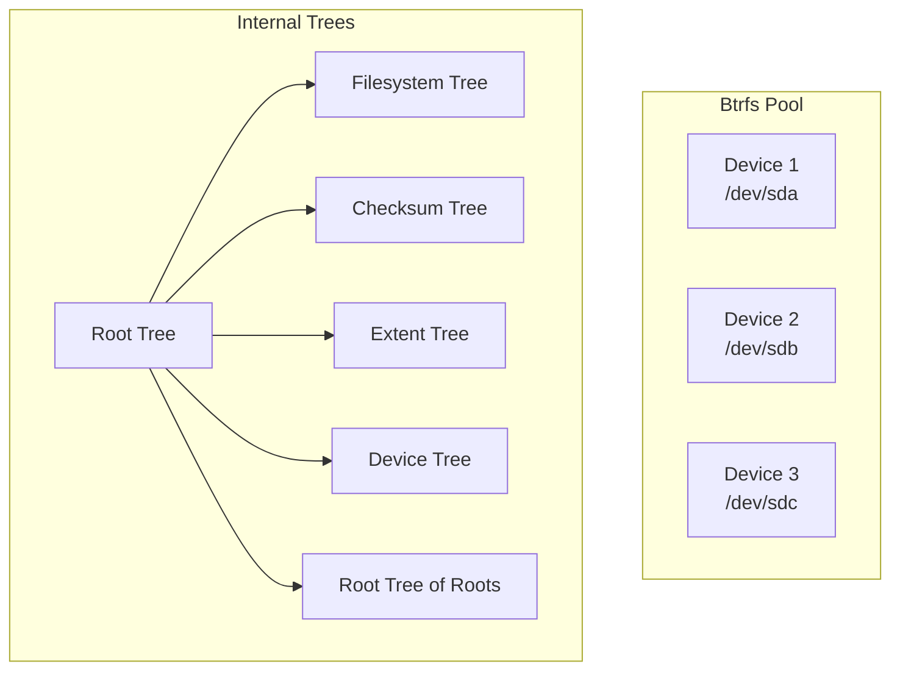
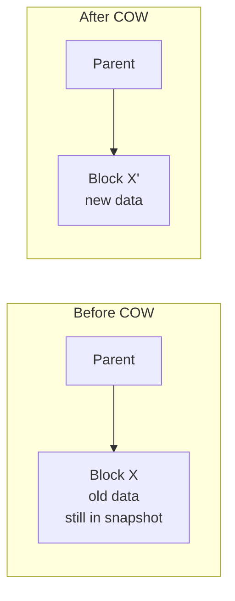

# Btrfs (B-Tree File System)

## Overview

**Btrfs** is a modern copy-on-write (COW) filesystem for Linux, designed from the ground up for advanced features: snapshots, checksums, compression, RAID, subvolumes, and online defragmentation. It's inspired by ZFS but designed to work within the Linux kernel's constraints.

## Key Features

| Feature | Description |
|---------|-------------|
| **Copy-on-Write (COW)** | Never overwrite data in place; always write to new location |
| **Snapshots** | Instant, space-efficient point-in-time copies |
| **Checksums** | CRC32C for data and metadata; detects silent corruption |
| **Subvolumes** | Independent filesystem trees within a single pool |
| **Compression** | Inline zlib, lzo, zstd compression |
| **RAID** | Built-in RAID 0, 1, 10, 5, 6 (5/6 still experimental) |
| **Online balancing** | Redistribute data across devices while mounted |
| **Send/receive** | Efficient incremental replication |

## Architecture Overview



## Core Data Structures

### Btrfs Items

Everything in Btrfs is stored as **items** in B-trees. Each item has a key:

```
Key = (objectid, type, offset)
```

| objectid | type | Meaning |
|----------|------|---------|
| inode number | INODE_ITEM | File metadata |
| inode number | EXTENT_DATA | File data extent |
| inode number | DIR_ITEM | Directory entry |
| 5 (first subvol root) | ROOT_ITEM | Subvolume descriptor |
| 1 (extent tree) | METADATA_ITEM | Metadata block reference |

### Copy-on-Write (COW)

When a block is modified:

1. Allocate a new block
2. Write the modified data to the new block
3. Update the parent's pointer to the new block
4. The old block remains unchanged (referenced by snapshots if any)



**Benefits:**
- Snapshots are instant (just copy the root pointer)
- Crash consistency without journaling (old data is always valid)
- No need for fsck (metadata is always consistent)

**Cost:**
- Write amplification (modified blocks are relocated)
- Potential fragmentation over time
- Need for periodic balancing/defragmentation

## Subvolumes and Snapshots

### Subvolumes

A subvolume is an independent filesystem tree with its own root directory:

```bash
# Create subvolume
btrfs subvolume create /mnt/@home
btrfs subvolume create /mnt/@snapshots

# List subvolumes
btrfs subvolume list /mnt

# Mount a specific subvolume
mount -o subvol=@home /dev/sda1 /home
```

### Snapshots

A snapshot is a subvolume that shares data with its parent via COW:

```bash
# Create snapshot
btrfs subvolume snapshot /mnt/@home /mnt/@snapshots/home-2026-08-01

# Create read-only snapshot
btrfs subvolume snapshot -r /mnt/@home /mnt/@snapshots/home-readonly

# Delete snapshot
btrfs subvolume delete /mnt/@snapshots/home-2026-08-01
```

**Why snapshots are fast**: Only the root tree node is copied. All data blocks are shared via reference counting. When a block's refcount drops to 0, it's freed.

## Checksums and Self-Healing

Btrfs checksums **every** data and metadata block:

```
Data block → CRC32C checksum → stored in checksum tree
Metadata block → CRC32C checksum → embedded in the block header
```

**Detection**: On every read, the checksum is verified. Mismatch → return error.

**Self-healing** (with RAID 1/10):
1. Read block from disk A → checksum mismatch
2. Read same block from disk B → checksum match
3. Return good data to user
4. Write correct data back to disk A (repair)

```bash
# Scrub all data (verify checksums)
btrfs scrub start /mnt

# Check scrub status
btrfs scrub status /mnt
```

## Built-in RAID

Btrfs has native RAID support:

| Profile | Copies | Min Devices | Space Efficiency |
|---------|--------|-------------|-----------------|
| single | 1 | 1 | 100% |
| RAID 0 | striped | 2 | 100% |
| RAID 1 | 2 copies | 2 | 50% |
| RAID 10 | striped mirrors | 4 | 50% |
| RAID 5 | parity | 3 | (n-1)/n |
| RAID 6 | double parity | 4 | (n-2)/n |

```bash
# Create RAID1 filesystem
mkfs.btrfs -d raid1 -m raid1 /dev/sda /dev/sdb

# Add device
btrfs device add /dev/sdc /mnt

# Balance to redistribute
btrfs balance start /mnt

# Convert metadata to RAID1
btrfs balance start -mconvert=raid1 /mnt
```

**⚠️ RAID 5/6 is still experimental** — known issues with the write hole and rebuild process.

## Compression

```bash
# Mount with compression
mount -o compress=zstd:3 /dev/sda1 /mnt      # zstd level 3
mount -o compress=lzo /dev/sda1 /mnt          # fast compression
mount -o compress=zlib /dev/sda1 /mnt         # good ratio

# Check compression ratio
btrfs filesystem df /mnt
```

Compression is transparent — applications don't need to change.

## Useful Commands

```bash
# Create filesystem
mkfs.btrfs -L "mydata" -d single -m dup /dev/sdb1

# Filesystem info
btrfs filesystem show /dev/sdb1
btrfs filesystem usage /mnt
btrfs device stats /mnt

# Defragment
btrfs filesystem defragment -r /mnt

# Resize
btrfs filesystem resize +10G /mnt

# Send/receive (incremental backup)
btrfs send /mnt/@snapshots/snap1 | ssh remote btrfs receive /backup/
btrfs send -p /mnt/@snapshots/snap1 /mnt/@snapshots/snap2 | ssh remote btrfs receive /backup/
```

## Btrfs vs ext4 vs ZFS

| Feature | Btrfs | ext4 | ZFS |
|---------|-------|------|-----|
| COW | Yes | No | Yes |
| Snapshots | Yes | No | Yes |
| Checksums | Data + metadata | Metadata only | Data + metadata |
| Compression | zstd, lzo, zlib | No (ext4 doesn't) | lz4, zstd, gzip |
| RAID | Built-in 0/1/10/5/6 | Needs mdadm | Built-in RAID-Z |
| Subvolumes | Yes | No | Yes (datasets) |
| Max volume | 16 EB | 1 EB | 256 ZB |
| Maturity | Stable (most features) | Very stable | Stable (OpenZFS) |
| License | GPL | GPL | CDDL (incompatible with GPL) |

## Interview Questions

**Q1: What is copy-on-write and why does Btrfs use it?**

COW means data is never modified in place — changes are written to new locations, and the old data is preserved until no longer referenced. Btrfs uses COW to enable instant snapshots (just share the root pointer), crash consistency without journaling, and self-healing with checksums.

**Q2: How are snapshots implemented in Btrfs?**

A snapshot is a subvolume that shares its initial data blocks with the parent. Both subvolumes reference the same blocks via refcount. When a block is modified, COW creates a new copy, and the old block's refcount decrements. When refcount hits 0, the block is freed. Snapshots are instant because only the root tree node is copied.

**Q3: What is Btrfs's checksum and self-healing mechanism?**

Every data and metadata block has a CRC32C checksum. On read, the checksum is verified. If it fails and RAID 1/10 is configured, Btrfs reads the copy from another device, returns the good data, and writes it back to the corrupted device. This is "self-healing." Periodic `btrfs scrub` proactively verifies all data.

**Q4: Why is Btrfs RAID 5/6 considered experimental?**

The "write hole" problem: if a power loss occurs during a RAID 5/6 write, the parity may be inconsistent with the data. Btrfs doesn't yet have a reliable solution for this. Additionally, rebuild after device failure can be slow and may encounter issues. RAID 1/10 is recommended for production.

**Q5: What is the difference between a subvolume and a directory?**

A subvolume has its own inode number space, can be snapshotted independently, and can be mounted separately. It appears as a directory but has independent lifecycle management. You can't hard-link across subvolumes (different inode spaces), and quotas can be applied per subvolume.

## Common Mistakes

- Using Btrfs RAID 5/6 in production — it's experimental and has known issues
- Not running `btrfs balance` periodically — can lead to out-of-space errors even with free space (due to unbalanced allocation across devices)
- Confusing Btrfs subvolumes with LVM snapshots — subvolumes are filesystem-level, more efficient
- Not enabling compression — free performance for compressible data

## Summary

- Btrfs is a COW filesystem with snapshots, checksums, RAID, compression, and subvolumes
- Everything is stored as items in B-trees
- COW enables instant snapshots and crash consistency without journaling
- CRC32C checksums on all data and metadata enable self-healing with RAID
- Built-in RAID 0/1/10/5/6 (5/6 experimental)
- Best for: snapshots, data integrity, flexible storage management

## Cross-References

- [ZFS](zfs.md) — similar feature set, different implementation
- [ext4](ext4.md) — comparison filesystem
- [Disk Allocation](disk-allocation.md) — extent-based allocation
- [Journaling](journaling.md) — Btrfs uses COW instead of journaling
- [RAID](raid.md) — hardware vs. software RAID
