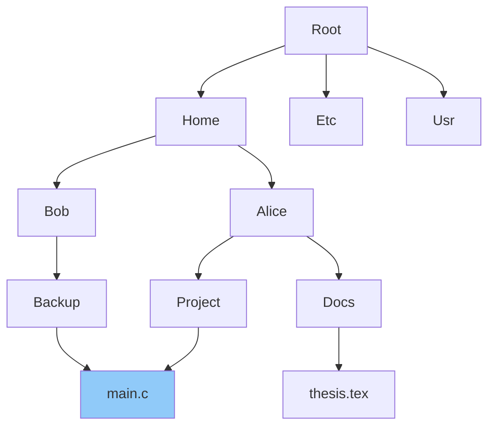

# Directory Structure

## Overview

A **directory** is a special file that maps human-readable names to inode numbers. The directory structure defines how files are organized and located within a filesystem. The evolution from flat to hierarchical to DAG structures reflects increasing demands for flexibility and usability.

## Directory Organization Schemes

### 1. Single-Level Directory

All files in one flat directory. Simple but limiting.

```
┌─────────────────────────────┐
│         Root Directory       │
├──────────┬──────────────────┤
│  Name    │   Inode          │
├──────────┼──────────────────┤
│ file1    │   1001           │
│ file2    │   1002           │
│ file3    │   1003           │
└──────────┴──────────────────┘
```

**Problems:**
- All files must have unique names
- No organization (no subdirectories)
- Doesn't scale beyond a handful of files

### 2. Two-Level Directory

Each user gets their own directory (like early UNIX `~`).

```
        ┌──────────┐
        │   Root   │
        └────┬─────┘
       ┌─────┴──────┐
  ┌────┴────┐  ┌────┴────┐
  │  User A │  │  User B │
  ├─────────┤  ├─────────┤
  │ file1   │  │ file1   │  ← same name OK!
  │ file2   │  │ report  │
  └─────────┘  └─────────┘
```

**Advantage:** Users can have files with the same name.
**Limitation:** No sharing between users without path copying.

### 3. Tree-Structured Directory

The modern standard. Directories can contain files AND subdirectories.

```
                    /  (root)
                   /|\
                  / | \
                etc home usr
                |   |    |
             passwd |   bin
                    / \
                 alice bob
                  |    |
                doc  photo.jpg
                 |
              thesis.tex
```

**Properties:**
- Each file has a unique **absolute path** from root: `/home/alice/doc/thesis.tex`
- **Current working directory** enables relative paths
- Natural hierarchy mirrors organizational structure

### 4. Acyclic Graph Directory (DAG)

Adds shared files via hard links and symbolic links.

```
         /home/alice              /home/bob
              |                        |
          project/                 backup/
              |                        |
           main.c ──────────────────────┘  (hard link)
              |
           util.c ←── /shared/lib/util.c  (symlink)
```

**Sharing mechanisms:**

| Mechanism | How it works | Cross-filesystem | Link to directory |
|-----------|--------------|-------------------|-------------------|
| Hard link | New directory entry → same inode | No | No (by default) |
| Symbolic link | File containing a path string | Yes | Yes |

### Example: Creating links

```bash
# Hard link — both point to same inode
ln /home/alice/project/main.c /home/bob/backup/main.c
ls -i /home/alice/project/main.c /home/bob/backup/main.c
# 1234567 /home/alice/project/main.c
# 1234567 /home/bob/backup/main.c    ← same inode!

# Symbolic link — contains path
ln -s /shared/lib/util.c /home/alice/project/util.c
ls -la /home/alice/project/util.c
# lrwxrwxrwx 1 alice alice 20 Aug  1 10:00 util.c -> /shared/lib/util.c
```

### 5. General Graph Directory

Allows arbitrary cycles (hard links to directories). **Dangerous** — most OSes prevent this.

**Problems with cycles:**
- `find`, `ls -R`, `rm -r` can loop infinitely
- Reference counting no longer works (cycles keep counts > 0)
- Garbage collection needed instead



## Directory Implementation

### Linear List

Simplest approach: directory is a list of (name, inode) entries.

```
┌──────────────────────────────────────────┐
│ name: "file1.txt"  inode: 1001           │
│ name: "file2.txt"  inode: 1002           │
│ name: "subdir"     inode: 2001           │
│ name: "data.bin"   inode: 1003           │
└──────────────────────────────────────────┘
```

- **Lookup**: O(n) — linear scan
- **Delete**: O(n) — find entry, then remove
- Simple but slow for large directories

### Hash Table

Directory entries stored in a hash table keyed by filename.

- **Lookup**: O(1) average
- **Insert/Delete**: O(1) average
- **Challenge**: Hash table can grow, may need resizing

### B-Tree (ext4, Btrfs, XFS)

Entries sorted in a B-tree indexed by filename.

- **Lookup**: O(log n)
- **Range queries**: efficient (e.g., `ls` with prefix)
- **Scalability**: excellent for millions of entries

### ext4 Directory Entry (dir_entry2)

```c
struct ext4_dir_entry_2 {
    __le32 inode;         // Inode number
    __le16 rec_len;       // Length of this record
    __u8   name_len;      // Name length
    __u8   file_type;     // File type (regular, dir, symlink...)
    char   name[EXT4_NAME_LEN]; // Filename (variable length, NOT null-terminated)
};
```

## Path Resolution

When you call `open("/home/alice/doc/thesis.tex")`:

1. Start at root inode (inode 2 on ext4)
2. Look up "home" in root directory → get inode for `/home`
3. Look up "alice" in `/home` directory → get inode for `/home/alice`
4. Look up "doc" in `/home/alice` → get inode for `/home/alice/doc`
5. Look up "thesis.tex" in `/home/alice/doc` → get inode for the file
6. Return file descriptor

**Each component lookup requires:**
- Read the directory's data blocks
- Search for the name (linear scan or hash/B-tree lookup)
- Permission check at each level (execute permission on directories)

### Example: Permission check during path resolution

```
/home/alice/doc/thesis.tex
```
To open this file, the process needs:
- `+x` on `/` (traverse)
- `+x` on `/home` (traverse)
- `+x` on `/home/alice` (traverse)
- `+x` on `/home/alice/doc` (traverse)
- `r` on `/home/alice/doc/thesis.tex` (for reading)

If any intermediate directory lacks `+x`, resolution fails with `EACCES`.

## Special Directory Entries

| Entry | Inode | Description |
|-------|-------|-------------|
| `.` | Current directory's inode | Self-reference |
| `..` | Parent directory's inode | Parent reference |
| Root `..` | Points to itself | `/.` = `/` |

```bash
ls -ia /
# 2 .
# 2 ..        ← root's .. points to itself
```

## Mount Points

A filesystem is mounted at a directory, making the mounted filesystem's root appear at that point.

```
Before mount:          After mount /dev/sdb1 on /mnt:
    /                      /
   / \                    /|\
  etc mnt               etc mnt
   (empty)                  |
                          (contents of /dev/sdb1)
                           / \
                         data backup
```

```bash
mount /dev/sdb1 /mnt        # Mount
umount /mnt                  # Unmount
mount --bind /src /dst       # Bind mount (same filesystem at two points)
```

## Interview Questions

**Q1: What is the difference between a hard link and a soft link at the filesystem level?**

A hard link creates a new directory entry pointing to the same inode. The inode's link count increases. Deleting one entry just decrements the count; data is freed only when count reaches 0. A soft link (symlink) is a separate inode of type "symlink" that stores the target path as its data. If the target is deleted, the symlink becomes dangling.

**Q2: Why can't you create a hard link to a directory?**

It would create a cycle in the filesystem graph. Tools like `find` and `du` traverse the tree and rely on it being acyclic. A cycle would cause infinite loops. The root inode's `..` pointing to itself is the only permitted "cycle."

**Q3: How does `..` work in the root directory?**

In the root directory, `..` points to the root inode itself. This is a special case hard-coded in the filesystem implementation. So `cd /..` stays at `/`.

**Q4: What happens when you mount a filesystem on a non-empty directory?**

The existing contents are hidden (covered by the mounted filesystem). They reappear when the filesystem is unmounted. The existing files are not deleted — they're just inaccessible while the mount is active.

**Q5: Explain the path resolution algorithm for `/home/alice/../../etc/passwd`.**

1. Start at root (inode 2)
2. Resolve `home` → inode for `/home`
3. Resolve `alice` → inode for `/home/alice`
4. Resolve `..` → go to parent of `/home/alice` → `/home`
5. Resolve `..` → go to parent of `/home` → `/`
6. Resolve `etc` → inode for `/etc`
7. Resolve `passwd` → inode for `/etc/passwd`

Result: `/etc/passwd`

## Common Mistakes

- Assuming `.` and `..` are actual files stored on disk — they're directory entries maintained by the filesystem
- Forgetting that each path component requires execute (`+x`) permission
- Not understanding that `mv` across filesystems = copy + delete (not just rename)
- Thinking `ls -l` link count shows the number of hard links to the file — it does, but for directories it shows the number of subdirectories + 2 (itself + parent)

## Summary

- Directories map names to inodes, forming the filesystem's namespace
- Organization evolved: flat → two-level → tree → DAG
- Tree structure with symlinks gives flexibility without cycles
- Path resolution walks the tree component by component, checking permissions at each level
- Implementations range from linear lists to hash tables to B-trees
- Mount points allow multiple filesystems to form a single namespace

## Cross-References

- [File Concepts](file-concepts.md) — what files and inodes are
- [VFS](vfs.md) — kernel abstraction for multiple filesystem types
- [Disk Allocation](disk-allocation.md) — how directory blocks are allocated
- [ext4](ext4.md) — HTree directory indexing
- [Access Control](../security/access-control.md) — permission checking
