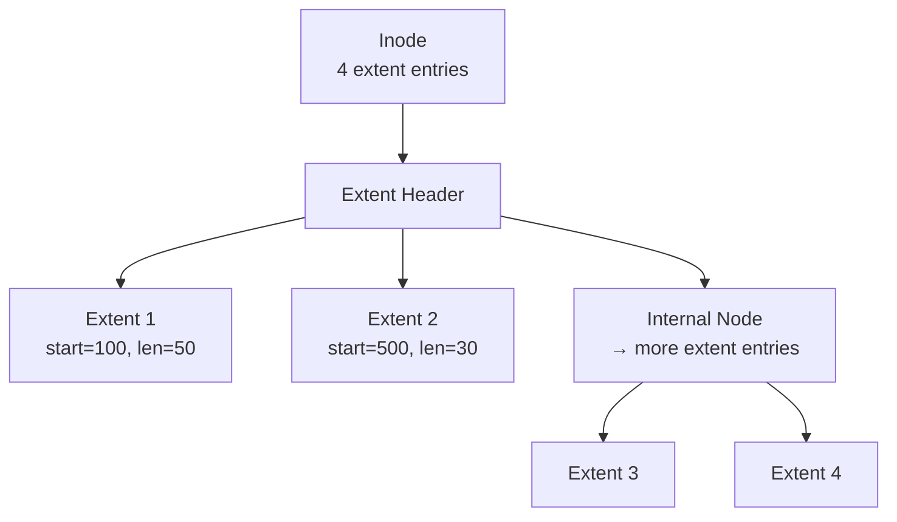

# Disk Allocation Methods

## Overview

When a file grows, the filesystem must allocate disk blocks to hold its data. The allocation strategy profoundly affects performance (sequential vs. random access), space efficiency (fragmentation), and maximum file size. This page covers the three classical methods and modern variations.

## The Problem

A disk has millions of blocks (typically 4 KB each). A file might need 1 block or 1 million blocks. How do we:

1. Track which blocks belong to which file?
2. Support efficient sequential reads?
3. Support efficient random access?
4. Minimize wasted space (fragmentation)?
5. Handle files that grow over time?

## Method 1: Contiguous Allocation

Each file occupies a **contiguous run** of blocks. The inode stores just (start block, length).

```
File A: start=0, length=5
File B: start=8, length=3
File C: start=14, length=4

Disk blocks:
┌───┬───┬───┬───┬───┬───┬───┬───┬───┬───┬───┬───┬───┬───┬───┬───┬───┐
│ A │ A │ A │ A │ A │ . │ . │ B │ B │ B │ . │ . │ . │ . │ C │ C │ C │ C │
└───┴───┴───┴───┴───┴───┴───┴───┴───┴───┴───┴───┴───┴───┴───┴───┴───┘
```

### Advantages
- **Excellent sequential read**: One seek, then streaming
- **Simple random access**: Block `i` of file is at `start + i`
- **Minimal metadata**: Just start block + length

### Disadvantages
- **External fragmentation**: Free space gets broken into small holes
- **File size must be known at creation** (or complex reallocation needed)
- **Difficult to grow files**: No space adjacent? Must relocate the entire file

### Where It's Used
- CD-ROMs (ISO 9660) — files never change size
- Some embedded systems
- Swap partitions (fixed-size)

## Method 2: Linked Allocation

Each file is a **linked list** of blocks. Each block contains a pointer to the next block.

```
File A: 1 → 7 → 4 → 10

Disk:
┌───┬───┬───┬───┬───┬───┬───┬───┬───┬───┬───┐
│ . │ . │ . │ . │ . │ . │ . │ . │ . │ . │ . │
└───┴───┴───┴───┴───┴───┴───┴───┴───┴───┴───┘
Block 1: [data...|next=7]
Block 7: [data...|next=4]
Block 4: [data...|next=10]
Block 10: [data...|next=null]
```

### Advantages
- **No external fragmentation**: Any free block can be used
- **Files can grow easily**: Just allocate another block and link it
- **No preallocation needed**

### Disadvantages
- **Terrible random access**: Must follow the chain from the beginning
- **Pointer overhead**: Each block loses space to the next-pointer
- **Reliability**: One corrupted pointer → rest of file is lost
- **Scattered seeks**: Blocks can be anywhere on disk

### FAT (File Allocation Table)

A variation where all next-pointers are stored in a separate table (the FAT) at the start of the disk, rather than inside each block.

```
FAT Table:
Block:  0  1  2  3  4  5  6  7  8  9  10
Next:   -  7  -  -  10  -  -  4  -  -  EOF
        ↑  ↑              ↑        ↑     ↑
      free chain          free   chain   end

File A: starts at block 1 → 7 → 4 → 10 → EOF
```

**Advantage over simple linked list:**
- FAT can be cached in memory → random access becomes fast
- No pointer space wasted in data blocks

**Used by:** FAT12, FAT16, FAT32 (USB drives, SD cards, Windows legacy)

## Method 3: Indexed Allocation

Each file has an **index block** containing an array of block pointers.

```
File A (5 blocks):

Inode:
┌──────────────┐
│ Index block: 5│
└──────┬───────┘
       │
       ▼
Block 5 (index block):
┌──────┬──────┬──────┬──────┬──────┬──────┐
│ ptr→2│ ptr→9│ ptr→1│ ptr→8│ ptr→3│unused│
└──┬───┴──┬───┴──┬───┴──┬───┴──┬───┴──────┘
   │      │      │      │      │
   ▼      ▼      ▼      ▼      ▼
 Block2  Block9 Block1 Block8 Block3
```

### Advantages
- **Good random access**: Follow one indirection
- **No external fragmentation**: Any block can be allocated
- **File can grow**: Add more entries to index block

### Disadvantages
- **Index block overhead**: Small files waste a full block for the index
- **Maximum file size limited** by index block capacity
- **Index block itself needs space**

### Multi-Level Indexed Allocation

For large files, the index block points to second-level index blocks, which point to data blocks.

```
Inode
 ├── Direct block 0 → data
 ├── Direct block 1 → data
 ├── ...
 ├── Direct block 11 → data
 ├── Single indirect → index block → [ptr, ptr, ...] → data blocks
 ├── Double indirect → index block → [index → data, index → data, ...]
 └── Triple indirect → index block → index → index → data blocks
```

### UNIX ext2/ext3/ext4 Scheme

```
Inode block pointers:
┌─────────────────────────────────────────────────────────┐
│ Direct 0-11  │ Single Indirect │ Double │ Triple       │
│ (12 entries) │ (1 entry)       │(1 entry)│ (1 entry)   │
└──────────────┴─────────────────┴─────────┴──────────────┘
```

**With 4 KB blocks and 4-byte pointers:**
- Direct: 12 × 4 KB = 48 KB
- Single indirect: 1024 × 4 KB = 4 MB
- Double indirect: 1024 × 1024 × 4 KB = 4 GB
- Triple indirect: 1024³ × 4 KB = 4 TB

**Maximum file size** = 48 KB + 4 MB + 4 GB + 4 TB ≈ 4 TB

## Comparison Table

| Feature | Contiguous | Linked | Indexed | Multi-level Indexed |
|---------|-----------|--------|---------|-------------------|
| Sequential access | ★★★ | ★ | ★★ | ★★ |
| Random access | ★★★ | ★ | ★★ | ★★ |
| External fragmentation | Yes | No | No | No |
| File growth | Hard | Easy | Easy | Easy |
| Metadata overhead | Minimal | Minimal | Medium | Medium-High |
| Max file size | Limited by space | Unlimited | Limited by index | Very large |
| Used by | CD-ROM, swap | FAT | ext2, UFS | ext4, NTFS, XFS |

## Extent-Based Allocation (Modern Approach)

Instead of tracking individual blocks, track **extents** (contiguous runs of blocks):

```
Inode extents:
┌────────────────────────────────────┐
│ Extent 1: start=100, len=50        │  ← blocks 100-149
│ Extent 2: start=500, len=30        │  ← blocks 500-529
│ Extent 3: start=1000, len=100      │  ← blocks 1000-1099
└────────────────────────────────────┘
```

**Advantages:**
- Fewer metadata entries needed (one extent vs. hundreds of block pointers)
- Better sequential performance (blocks are contiguous within an extent)
- Used by ext4, XFS, Btrfs, NTFS

### ext4 Extent Tree



## Fragmentation

### Internal Fragmentation
- Space wasted **within** an allocated block
- A 1-byte file wastes 4095 bytes (in a 4 KB block)
- Inevitable with block-based allocation

### External Fragmentation
- Free space broken into non-contiguous holes
- A file needing 5 contiguous blocks might fail even with 100 free blocks scattered around
- Contiguous allocation suffers most
- Extent-based and indexed methods are immune

### Defragmentation
- Reorganizes files to be contiguous again
- Windows: `defrag` tool
- Linux: `e4defrag` (ext4), rarely needed (ext4 uses extents and delayed allocation to minimize fragmentation)

## Interview Questions

**Q1: Why does ext4 use extent-based allocation instead of traditional block pointers?**

Extents reduce metadata overhead (one extent entry covers many contiguous blocks), improve sequential I/O performance, and reduce fragmentation. A file with 1000 contiguous blocks needs 1 extent entry instead of 1000 block pointers.

**Q2: A file system uses 4 KB blocks and 4-byte pointers. What is the maximum file size with single-level indexed allocation?**

One index block holds 4096/4 = 1024 pointers. Maximum file = 1024 × 4 KB = 4 MB.

**Q3: Why is linked allocation bad for random access?**

To read byte N, you must follow N/block_size pointers from the head of the list. This is O(n) and requires potentially reading every block. FAT improves this by caching the pointer table in memory.

**Q4: What is the difference between extent-based and indexed allocation?**

Indexed allocation stores individual block pointers in an index block. Extent-based allocation stores (start, length) pairs — runs of contiguous blocks. Extents are more compact and encourage sequential layout, but partially overlap with contiguous allocation's benefits.

**Q5: How does the ext4 multi-level index scheme calculate maximum file size?**

- 12 direct blocks: 12 × 4 KB = 48 KB
- 1 single indirect: 1024 × 4 KB = 4 MB
- 1 double indirect: 1024² × 4 KB = 4 GB
- 1 triple indirect: 1024³ × 4 KB = 4 TB
- Total ≈ 4 TB

## Common Mistakes

- Confusing internal and external fragmentation
- Thinking contiguous allocation is always bad — it's optimal for read-heavy, static files (like databases)
- Forgetting that FAT is a form of linked allocation, not indexed
- Not realizing that extent-based allocation can also suffer from external fragmentation (extents must be contiguous)

## Summary

| Method | Best for | Worst for |
|--------|----------|-----------|
| Contiguous | Sequential read of static files | Growing files, random allocation |
| Linked | Simple sequential files | Random access |
| Indexed | General-purpose | Very small files (index block overhead) |
| Extent-based | Large files, mixed workloads | Highly fragmented free space |

Modern filesystems (ext4, XFS, Btrfs, NTFS) use **extent-based allocation** as the primary strategy, falling back to traditional block pointers for small files.

## Cross-References

- [Free Space Management](free-space.md) — how to find free blocks to allocate
- [ext4](ext4.md) — extent-based allocation in practice
- [Disk Scheduling](../io/disk-scheduling.md) — how I/O requests are ordered
- [RAID](raid.md) — block allocation across multiple disks
