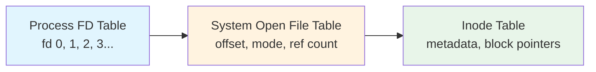

# File Concepts

## Overview

A **file** is the fundamental unit of persistent storage in an operating system. It is a named collection of related data with associated metadata. The OS abstracts away the physical disk layout and presents files as a contiguous sequence of bytes, even though the underlying blocks may be scattered across the disk.

## What Is a File?

A file consists of:

1. **Data** — the actual content (text, binary, image, etc.)
2. **Metadata** (stored in the inode or equivalent):
   - File type (regular, directory, symlink, device, socket, pipe)
   - Size (bytes)
   - Ownership (UID, GID)
   - Permissions (read, write, execute for owner/group/other)
   - Timestamps:
     - **atime** — last access time
     - **mtime** — last modification time (content change)
     - **ctime** — last status change (metadata change)
   - Block pointers (which disk blocks hold the data)
   - Link count

### Example: Linux `stat` output

```
$ stat /etc/passwd
  File: /etc/passwd
  Size: 2847       Blocks: 8          IO Block: 4096   regular file
Device: 802h/2050d Inode: 131074      Links: 1
Access: (0644/-rw-r--r--)  Uid: (    0/    root)   Gid: (    0/    root)
Access: 2026-08-01 10:15:23.000000000 +0800
Modify: 2026-07-15 09:30:00.000000000 +0800
Change: 2026-07-15 09:30:00.000000000 +0800
```

## File Types

| Type | Symbol | Description | Example |
|------|--------|-------------|---------|
| Regular file | `-` | Contains user data | `report.txt`, `a.out` |
| Directory | `d` | Maps names → inodes | `/home`, `/etc` |
| Symbolic link | `l` | Contains a path to another file | `/usr/bin/python → python3` |
| Block device | `b` | Buffered device access | `/dev/sda` |
| Character device | `c` | Unbuffered, byte-stream device | `/dev/tty`, `/dev/null` |
| Named pipe (FIFO) | `p` | Inter-process communication | Created with `mkfifo` |
| Socket | `s` | Network or local IPC | `/var/run/docker.sock` |

### Example: Listing file types

```bash
ls -la /dev/
# brw-rw---- 1 root disk 8, 0 Aug  1 10:00 sda      # block device
# crw-rw-rw- 1 root root 1, 3 Aug  1 10:00 null      # char device
# prw-r--r-- 1 root root    0 Aug  1 10:00 mypipe     # named pipe
# srw-rw-rw- 1 root root    0 Aug  1 10:00 docker.sock # socket
```

## File Attributes (Metadata)

### POSIX Permissions

Each file has permission bits for three categories:

```
Owner  Group  Other
 rwx    rwx    rwx
```

| Octal | Binary | Meaning |
|-------|--------|---------|
| 7 | 111 | rwx |
| 6 | 110 | rw- |
| 5 | 101 | r-x |
| 4 | 100 | r-- |
| 0 | 000 | --- |

```bash
chmod 755 script.sh   # rwxr-xr-x
chmod 644 config.txt   # rw-r--r--
```

### Special Permission Bits

| Bit | Octal | Effect |
|-----|-------|--------|
| **SetUID** | 4000 | Execute as file owner (e.g., `passwd`) |
| **SetGID** | 2000 | Execute as file group; new files in dir inherit group |
| **Sticky bit** | 1000 | Only owner can delete files in directory (e.g., `/tmp`) |

```bash
chmod 4755 /usr/bin/passwd    # SetUID
chmod 1777 /tmp               # Sticky bit
```

## File Operations

The POSIX API provides these core system calls:

```c
int fd = open("file.txt", O_RDWR | O_CREAT, 0644);  // Open/create
ssize_t n = read(fd, buffer, sizeof(buffer));          // Read
ssize_t n = write(fd, buffer, count);                  // Write
off_t pos = lseek(fd, 0, SEEK_SET);                    // Seek
int rc = close(fd);                                    // Close
int rc = unlink("file.txt");                           // Delete
int rc = rename("old.txt", "new.txt");                 // Rename
int rc = stat("file.txt", &statbuf);                   // Get metadata
int rc = fchmod(fd, 0600);                             // Change permissions
```

### Open File Table

When a process opens a file, the kernel creates entries in three tables:



- **Per-process FD table**: maps fd numbers → open file table entries
- **System-wide open file table**: current offset, access mode, reference count
- **Inode table**: in-memory copy of the inode

When `dup2(1, 3)` is called, fd 3 points to the same open file table entry as fd 1 (shared offset).

### Example: Shared offset with fork

```c
int fd = open("output.txt", O_WRONLY | O_CREAT | O_TRUNC, 0644);
if (fork() == 0) {
    write(fd, "child\n", 6);   // advances shared offset
} else {
    write(fd, "parent\n", 7);  // continues from where child left off
}
```

## Internal vs. External Fragmentation

- **Internal fragmentation**: Space wasted within an allocated unit (e.g., a file of 1001 bytes occupies 2 blocks of 1024, wasting 1047 bytes in the second block)
- **External fragmentation**: Free space is scattered in small chunks, making large contiguous allocations impossible

## File Allocation Strategies (Preview)

| Strategy | Pros | Cons |
|----------|------|------|
| Contiguous | Fast sequential + random access | External fragmentation, file size must be known |
| Linked | No external fragmentation, simple | Slow random access, pointer overhead |
| Indexed | Fast random access, no external frag | Index block overhead, limits max file size |
| Multi-level indexed | Supports very large files | Extra indirection for large files |

(Detailed in [Disk Allocation](disk-allocation.md))

## Interview Questions

**Q1: What is the difference between `mtime`, `ctime`, and `atime`?**

- `mtime` changes when file **content** is modified
- `ctime` changes when file **metadata** (permissions, ownership) or content changes
- `atime` changes when the file is **read** (can be disabled with `noatime` mount option for performance)

**Q2: What happens when you delete a file that is still open?**

The file's directory entry is removed (link count drops), but the inode and data blocks are not freed until the last file descriptor is closed. This is why `df` shows space used even after `rm` on an open file.

**Q3: What is the difference between a hard link and a symbolic link?**

| Aspect | Hard Link | Symbolic Link |
|--------|-----------|---------------|
| Points to | Same inode | A path string |
| Cross-filesystem | No | Yes |
| Link count | Increases inode link count | Does not affect target's link count |
| Target deletion | Data survives (link still valid) | Dangling/broken link |
| Directories | Not allowed (to prevent cycles) | Allowed |

**Q4: Why can't regular users create hard links to directories?**

It would create cycles in the filesystem graph, breaking the acyclic tree structure and making tools like `find` and `rm -r` potentially infinite.

**Q5: What are the three tables involved in file I/O and what does each contain?**

1. **Process file descriptor table** — maps fd numbers to open file descriptions
2. **System open file table** — current file offset, access mode, reference count, pointer to inode
3. **Inode table (in-memory vnode)** — cached inode data, block pointers, dirty flag

## Common Mistakes

- Confusing `ctime` with "creation time" — it's **change** time, not creation time
- Thinking `rm` immediately frees disk space — it doesn't if the file is still open
- Using `0777` for files — most systems apply umask, but explicitly setting 777 is a security risk
- Not understanding that `O_APPEND` atomically seeks to end before each write (important for concurrent writes)

## Summary

- A file = data + metadata (stored in an inode on POSIX systems)
- Files come in multiple types: regular, directory, symlink, device, pipe, socket
- File operations go through three kernel tables: FD table → open file table → inode table
- Permissions use a 9-bit model (rwx for owner/group/others) plus special bits
- Hard links share inodes; symlinks store paths
- File allocation strategies trade off between sequential access speed, random access speed, and fragmentation

## Cross-References

- [Directory Structure](directory-structure.md) — how files are organized
- [Disk Allocation](disk-allocation.md) — how blocks are assigned to files
- [Inodes and VFS](vfs.md) — kernel-level file abstraction
- [ext4](ext4.md) — a real-world implementation
- [Access Control](../security/access-control.md) — permissions in depth


## Cross References

- [VFS](vfs.md)
- [Directory Structure](directory-structure.md)
- [File Organization](../../dbms/storage/file-organization.md)
- [Record Formats](../../dbms/storage/record-formats.md)
