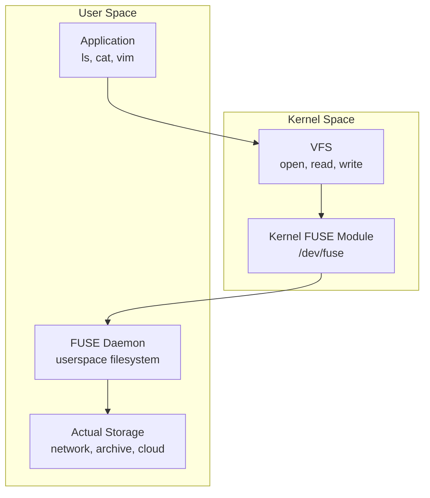
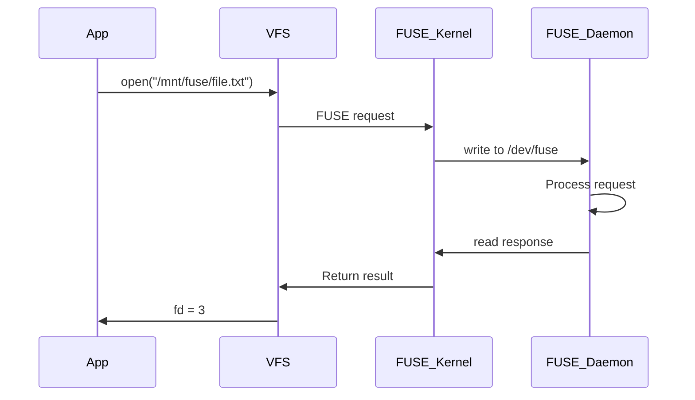

# FUSE (Filesystem in Userspace)

## Overview

**FUSE** (Filesystem in Userspace) allows implementing filesystems entirely in user-space programs, without writing kernel code. The kernel module (`/dev/fuse`) acts as a bridge: it receives VFS requests and forwards them to a userspace daemon, which processes them and sends responses back.

## Why FUSE?

| Benefit | Description |
|---------|-------------|
| **Safety** | Bugs crash the daemon, not the kernel |
| **Rapid development** | Use any language (Python, Go, Rust, C) |
| **Easy debugging** | Standard debuggers, no kernel build needed |
| **Stable API** | FUSE ABI is stable across kernel versions |
| **Flexibility** | Implement any filesystem logic in userspace |

**Trade-off**: Performance overhead due to kernel-userspace context switches.

## Architecture



### How It Works

1. Application calls `open("/mnt/fuse/file.txt")`
2. VFS routes to FUSE kernel module
3. FUSE kernel sends request to `/dev/fuse` (the daemon is reading from it)
4. Daemon processes the request (e.g., fetch from S3)
5. Daemon writes response to `/dev/fuse`
6. FUSE kernel returns result to VFS
7. Application gets file descriptor



## FUSE Operations

A FUSE daemon implements callbacks for filesystem operations:

```c
struct fuse_operations {
    int (*getattr)(const char *path, struct stat *stbuf);
    int (*readdir)(const char *path, void *buf, fuse_fill_dir_t filler,
                   off_t offset, struct fuse_file_info *fi);
    int (*open)(const char *path, struct fuse_file_info *fi);
    int (*read)(const char *path, char *buf, size_t size, off_t offset,
                struct fuse_file_info *fi);
    int (*write)(const char *path, const char *buf, size_t size, off_t offset,
                 struct fuse_file_info *fi);
    int (*create)(const char *path, mode_t mode, struct fuse_file_info *fi);
    int (*unlink)(const char *path);
    int (*mkdir)(const char *path, mode_t mode);
    int (*rmdir)(const char *path);
    int (*rename)(const char *from, const char *to);
    int (*chmod)(const char *path, mode_t mode);
    int (*chown)(const char *path, uid_t uid, gid_t gid);
    int (*truncate)(const char *path, off_t size);
    int (*release)(const char *path, struct fuse_file_info *fi);
    int (*fsync)(const char *path, int isdatasync, struct fuse_file_info *fi);
    int (*statfs)(const char *path, struct statvfs *stbuf);
    // ... many more
};
```

## Minimal Example (C)

```c
#define FUSE_USE_VERSION 31
#include <fuse3/fuse.h>
#include <string.h>
#include <errno.h>

static const char *content = "Hello from FUSE!\n";

static int hello_getattr(const char *path, struct stat *stbuf,
                         struct fuse_file_info *fi) {
    memset(stbuf, 0, sizeof(struct stat));
    if (strcmp(path, "/") == 0) {
        stbuf->st_mode = S_IFDIR | 0755;
        stbuf->st_nlink = 2;
    } else if (strcmp(path, "/hello") == 0) {
        stbuf->st_mode = S_IFREG | 0444;
        stbuf->st_nlink = 1;
        stbuf->st_size = strlen(content);
    } else {
        return -ENOENT;
    }
    return 0;
}

static int hello_read(const char *path, char *buf, size_t size,
                      off_t offset, struct fuse_file_info *fi) {
    if (strcmp(path, "/hello") != 0)
        return -ENOENT;
    size_t len = strlen(content);
    if (offset >= len) return 0;
    if (offset + size > len) size = len - offset;
    memcpy(buf, content + offset, size);
    return size;
}

static int hello_readdir(const char *path, void *buf,
                         fuse_fill_dir_t filler, off_t offset,
                         struct fuse_file_info *fi,
                         enum fuse_readdir_flags flags) {
    if (strcmp(path, "/") != 0) return -ENOENT;
    filler(buf, ".", NULL, 0, 0);
    filler(buf, "..", NULL, 0, 0);
    filler(buf, "hello", NULL, 0, 0);
    return 0;
}

static const struct fuse_operations hello_ops = {
    .getattr = hello_getattr,
    .read    = hello_read,
    .readdir = hello_readdir,
};

int main(int argc, char *argv[]) {
    return fuse_main(argc, argv, &hello_ops, NULL);
}
```

**Compile and run:**
```bash
gcc -o hello_fuse hello_fuse.c -lfuse3
mkdir /tmp/mountpoint
./hello_fuse /tmp/mountpoint
cat /tmp/mountpoint/hello    # "Hello from FUSE!"
fusermount -u /tmp/mountpoint  # Unmount
```

## libfuse vs High-Level Bindings

| Binding | Language | Notes |
|---------|----------|-------|
| libfuse3 | C | Official library, low-level and high-level API |
| fusepy | Python | Simple Python bindings |
| fuse-rs | Rust | Safe Rust bindings |
| go-fuse | Go | Google's Go FUSE library |
| macFUSE | macOS | FUSE for macOS |

### High-Level vs Low-Level API

| Aspect | High-Level | Low-Level |
|--------|-----------|-----------|
| Path handling | Path strings | Inode numbers |
| Complexity | Simpler | More control |
| Performance | Slightly slower | Better for large directories |
| Use case | Simple filesystems | Performance-critical |

## Popular FUSE Filesystems

| Filesystem | Description |
|------------|-------------|
| **sshfs** | Mount remote directories over SSH |
| **rclone** | Mount cloud storage (Google Drive, S3, Dropbox) |
| **gcsfuse** | Mount Google Cloud Storage |
| **s3fs** | Mount Amazon S3 buckets |
| **ntfs-3g** | Read/write NTFS on Linux |
| **CryFS** | Encrypted filesystem |
| **gocryptfs** | Encrypted overlay filesystem |
| **squashfuse** | Mount SquashFS archives |
| **bindfs** | Bind mounts with permission remapping |
| **archivemount** | Mount archive files as filesystems |
| **WikipediaFS** | Mount Wikipedia as filesystem |
| **gmailfs** | Mount Gmail as filesystem |

### Example: sshfs

```bash
# Mount remote directory
sshfs user@remote:/home/user /mnt/remote

# Unmount
fusermount -u /mnt/remote
```

### Example: rclone

```bash
# Mount Google Drive
rclone mount gdrive: /mnt/gdrive --daemon

# Mount S3 bucket
rclone mount s3:mybucket /mnt/s3 --daemon
```

## Performance Considerations

### Overhead Sources

1. **Context switches**: Kernel → userspace → kernel for every operation
2. **Data copying**: Data must cross kernel-userspace boundary twice
3. **Serialization**: Requests are serialized through `/dev/fuse`

### Optimizations

```bash
# Mount with performance options
mount -o fuse.sshfs,allow_other,kernel_cache,auto_cache,max_read=65536

# Use direct I/O (bypass page cache)
mount -o direct_io

# Enable writeback caching (Linux 4.20+)
mount -o writeback_cache
```

### FUSE passthrough (Linux 6.x+)

Recent kernels added **FUSE passthrough** for read operations: data can be read directly from the backing file descriptor without copying through userspace, dramatically improving read performance.

## Security Considerations

| Concern | Mitigation |
|---------|-----------|
| Running as root | Use `allow_other` with proper permissions |
| Path traversal | Validate all paths in daemon |
| Symlink attacks | Use `follow_symlinks=no` if needed |
| Denial of service | Implement timeouts for operations |
| File permissions | Respect `allow_other`, `default_permissions` |

```bash
# Allow non-root users to access the mount
mount -o allow_other /dev/fuse /mnt/fuse
# Requires user_allow_other in /etc/fuse.conf
```

## Interview Questions

**Q1: What is FUSE and why would you use it?**

FUSE allows implementing filesystems in userspace without kernel code. The kernel FUSE module intercepts VFS calls and forwards them to a userspace daemon via `/dev/fuse`. Use cases include: mounting cloud storage, SSH filesystems, encrypted filesystems, and custom formats. Benefits: safety (bugs don't crash kernel), easy development (any language), and rapid prototyping.

**Q2: What is the performance overhead of FUSE compared to kernel filesystems?**

FUSE has overhead from: (1) context switches between kernel and userspace for every operation, (2) data copying across the kernel-userspace boundary, (3) serialization through the `/dev/fuse` device. Typical overhead: 2-10x slower for metadata operations, less for sequential data I/O. Linux 6.x passthrough mode reduces read overhead significantly.

**Q3: How would you implement a read-only filesystem using FUSE?**

Implement `getattr`, `readdir`, and `read` callbacks. Return `-EROFS` (read-only filesystem) for `write`, `create`, `unlink`, `mkdir`, `rmdir`, `rename`, `chmod`, `chown`, and `truncate` operations. The filesystem source can be anything: an archive, a database, a network service.

**Q4: What is the difference between FUSE's high-level and low-level APIs?**

The high-level API uses path strings (e.g., `/dir/file`) and is simpler to implement. The low-level API uses inode numbers and provides more control and better performance for large directories. The high-level API is suitable for simple filesystems; the low-level API is for performance-critical ones.

**Q5: Can FUSE filesystems be used as root filesystems?**

Not directly, because the FUSE daemon runs in userspace and needs the kernel to be running first. However, some initramfs setups can use FUSE for early boot (e.g., mounting an encrypted root). In practice, FUSE filesystems are used for non-root mounts.

## Common Mistakes

- Not handling `getattr` for all file types — must return proper `st_mode` for regular files, directories, symlinks
- Forgetting to handle `..` in `readdir` — the filler must include `.` and `..`
- Not implementing `release` — file descriptor leaks
- Using FUSE for performance-critical workloads — kernel filesystems are faster
- Not setting `allow_other` when multiple users need access

## Summary

- FUSE allows implementing filesystems in userspace via a kernel module bridge
- The kernel module intercepts VFS calls and forwards them to a userspace daemon
- Popular uses: sshfs, rclone (cloud storage), encrypted filesystems
- Trade-off: safety and flexibility vs. performance overhead
- Available in C (libfuse), Python (fusepy), Rust, Go, and more
- Linux 6.x passthrough mode reduces read overhead

## Cross-References

- [VFS](vfs.md) — the kernel layer that FUSE plugs into
- [File Concepts](file-concepts.md) — files and operations
- [Device Drivers](../io/device-drivers.md) — kernel vs. userspace I/O
- [Security](../security/README.md) — FUSE security considerations


## Cross References

- [VFS](../os/filesystems/vfs.md)
- [Device Drivers](../os/io/device-drivers.md)
- [User vs Kernel](../os/threads/user-vs-kernel.md)
- [Object Storage](../storage/object-storage.md)
