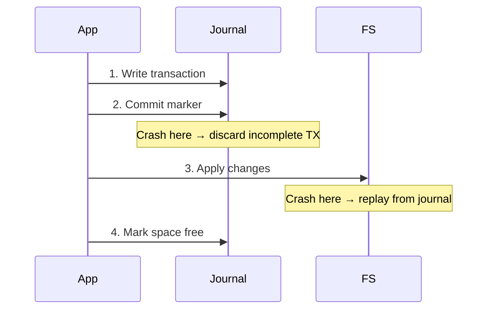

# Journaling (Write-Ahead Logging)

## Overview

**Journaling** ensures filesystem consistency after a crash by recording intended changes in a **journal** (log) before applying them to the filesystem. If a crash occurs during a write, the journal is replayed on recovery, completing the operation or rolling it back atomically.

## The Problem: Crash Inconsistency

Consider creating a file, which requires:
1. Allocate an inode (update inode bitmap)
2. Add directory entry (update directory block)
3. Initialize inode (write inode data)
4. Allocate data block (update block bitmap)
5. Write data

If the system crashes between steps 2 and 3:
- Directory entry exists but inode is uninitialized → corrupted filesystem
- `fsck` must scan the entire disk to fix inconsistencies → slow (minutes to hours on large disks)

## Solution: Write-Ahead Logging (Journal)

**Principle**: Write the *intended* changes to a journal first, then apply them to the actual filesystem.

```
Step 1: Write transaction to journal
  Journal: [TX Begin | inode bitmap | dir block | inode | block bitmap | TX End]
  
Step 2: Mark transaction as committed in journal

Step 3: Write changes to actual filesystem (checkpoint)

Step 4: Mark journal space as free
```

### Recovery

On mount after crash:
- If journal has a **complete transaction** (TX Begin ... TX End) → replay it
- If journal has an **incomplete transaction** → discard it (no partial changes)

**Result**: Either all changes are applied (transaction committed) or none are (transaction discarded). **Atomic**.

## Journaling Modes

### ext4 Journaling Modes

#### 1. Journal Mode (Full Data Journaling)

```
Journal: [TX Begin | metadata + DATA blocks | TX End]
```

- Both **metadata and file data** are written to the journal first
- Slowest mode (double write for all data)
- Safest: file data is also atomic

#### 2. Ordered Mode (Default)

```
Step 1: Write file DATA to disk (final location)
Step 2: Wait for data write to complete
Step 3: Write METADATA to journal
Step 4: Apply metadata to filesystem
```

- Only **metadata** is journaled
- Data is written **before** metadata is committed
- Ensures metadata never points to garbage data
- Good balance of safety and performance

#### 3. Writeback Mode

```
Step 1: Write metadata to journal
Step 2: Write data and metadata to filesystem (no ordering guarantee)
```

- Only metadata is journaled
- No guarantee that data is written before metadata
- Fastest but riskiest: after crash, metadata may point to old/garbage data

### Comparison

| Mode | Data Journaled | Metadata Journaled | Data Before Meta | Speed | Safety |
|------|---------------|-------------------|-----------------|-------|--------|
| journal | Yes | Yes | Yes | Slowest | Most safe |
| ordered | No | Yes | Yes | Medium | Default safe |
| writeback | No | Yes | No | Fastest | Least safe |

```bash
# Check current mode
dmesg | grep "EXT4-fs"
# EXT4-fs (sda1): mounted filesystem with ordered data mode

# Set mode at mount
mount -o data=journal /dev/sda1 /mnt

# Set default mode
tune2fs -o journal_data_writeback /dev/sda1
```

## Journal Structure

### ext4 Journal (JBD2)

```
Journal device/area:
┌──────────────────────────────────────────────────┐
│ Superblock │ Descriptor │ Data │ Descriptor │ ... │
│            │ Block      │Blocks│ Block      │     │
└──────────────────────────────────────────────────┘

Transaction:
┌─────────┬──────────────────┬─────────┐
│Descriptor│  Metadata Blocks │ Commit  │
│ Block    │  (or data blocks)│ Block   │
└─────────┴──────────────────┴─────────┘
```

**Descriptor block**: Lists which filesystem blocks this transaction modifies.
**Commit block**: Checksum and sequence number; marks transaction as complete.

### Circular Buffer

The journal is a circular buffer:
```
Oldest ← ──────────────────────── → Newest
[Free][TX1][TX2][TX3][Free space...]
         ↑                  ↑
    tail (oldest)      head (next write)
```

When free space is low, old transactions are discarded (they've been checkpointed).

## XFS Journal (Log)

XFS uses a similar approach but with some differences:

```
XFS Log:
┌──────────────────────────────────────────┐
│ Log Header │ Unmount Record │ ...        │
│            │ (clean mount marker)         │
├──────────────────────────────────────────┤
│ Operation: INODE_CREATE                   │
│ Operation: BMAP_ALLOC                     │
│ Operation: DIR_ADD                        │
│ Operation: COMMIT                         │
├──────────────────────────────────────────┤
│ Operation: INODE_MODIFY                   │
│ Operation: EXTENT_ALLOC                   │
│ Operation: COMMIT                         │
└──────────────────────────────────────────┘
```

- Log can be on a **separate device** for performance
- Operations are logged, not full blocks (more efficient)

## NTFS Journal ($LogFile)

NTFS uses redo and undo records:

```
Redo record: "Write X to block B"  (what to redo if incomplete)
Undo record: "Write Y to block B"  (what to undo if rolled back)
```

**Recovery**: If transaction was committed → redo. If not committed → undo.

## Crash Scenarios

### Scenario 1: Crash before journal write
- No record in journal → nothing happened → consistent

### Scenario 2: Crash during journal write
- Incomplete transaction in journal → discarded → consistent

### Scenario 3: Crash after journal write, before filesystem write
- Complete transaction in journal → replayed → consistent

### Scenario 4: Crash during filesystem write (after journal committed)
- Replay journal → overwrite partial writes → consistent

### Scenario 5: Crash after filesystem write complete
- Journal transaction discarded after checkpoint → consistent



## Barriers and Flush

To ensure journal writes actually reach disk (not just disk cache):

```c
// Force data to disk
fsync(fd);          // Sync file data
fdatasync(fd);      // Sync data (skip metadata if size unchanged)

// Filesystem barrier
// ext4 uses barriers by default: flush disk cache before and after journal writes
mount -o barrier=1 /dev/sda1 /mnt    // Enable (default)
mount -o barrier=0 /dev/sda1 /mnt    // Disable (dangerous, faster)
```

### Disk Cache Problem

If the disk has a write cache:
1. Journal write → disk cache (not on platter!)
2. Crash → journal data lost even though `write()` returned

**Solution**: Issue cache flush commands between journal and filesystem writes.

## JBD2 (Journaling Block Device 2) — Linux

The ext4 journaling layer is **JBD2**, which can be shared:

```c
// JBD2 API
handle_t *handle = jbd2_journal_start(journal, num_blocks);
// ... modify blocks ...
jbd2_journal_stop(handle);
```

JBD2 manages:
- Transaction batching (group multiple operations)
- Checkpointing (write journaled data to final location)
- Recovery (replay after crash)

## Interview Questions

**Q1: What is the difference between journaling and COW for crash consistency?**

Journaling writes changes to a log first, then applies them to the filesystem. COW writes changes to new locations and atomically updates pointers. Journaling has extra write overhead (journal + final location). COW has write amplification (modified blocks relocate). Both achieve atomicity — journaling via replay, COW via pointer updates.

**Q2: Why does ext4's ordered mode write data before metadata?**

If metadata (pointers to data blocks) is committed to the journal before data reaches disk, a crash could leave metadata pointing to garbage or old data. Ordered mode ensures the data blocks are written first, so even if metadata is replayed, it points to valid data. This prevents the "stale data exposure" security issue.

**Q3: What is a filesystem barrier and why is it important?**

A barrier is a cache flush command sent to the disk to ensure all previously written data is on persistent storage. Without barriers, the disk's write cache might reorder writes, so the journal commit might reach disk before the journal data itself. Barriers ensure ordering: data → flush → commit → flush.

**Q4: What is the difference between `fsync()` and `fdatasync()`?**

`fsync()` flushes both file data AND metadata to disk. `fdatasync()` flushes data and only metadata if it affects the file's ability to be read (i.e., skips atime/mtime updates if file size unchanged). `fdatasync()` is faster for append-only workloads (like databases) because it avoids flushing metadata updates that don't affect data integrity.

**Q5: How does NTFS journaling differ from ext4 journaling?**

NTFS uses redo/undo records in `$LogFile`. If a transaction was committed, redo records are applied. If not committed, undo records reverse partial changes. ext4 (JBD2) uses a write-ahead log where complete transactions are replayed and incomplete ones are discarded. Both achieve atomicity but through different mechanisms.

## Common Mistakes

- Thinking journaling protects data — it protects **metadata consistency**, not data (except in `data=journal` mode)
- Disabling barriers for performance — risks data corruption on power loss
- Confusing `data=ordered` with `data=journal` — ordered only journals metadata, but writes data first
- Not understanding that journaling doesn't replace backups — it prevents corruption, not deletion

## Summary

- Journaling records intended changes before applying them, enabling atomic recovery
- ext4 modes: journal (full), ordered (default, data first), writeback (metadata only)
- The journal is a circular buffer with descriptor, data, and commit blocks
- Barriers/flush ensure writes reach persistent storage in order
- COW (ZFS, Btrfs) is an alternative to journaling that achieves the same goal differently
- `fsync()` forces data + metadata to disk; `fdatasync()` skips unnecessary metadata

## Cross-References

- [ext4](ext4.md) — JBD2 journaling implementation
- [XFS](xfs.md) — XFS log structure
- [NTFS](ntfs.md) — $LogFile
- [ZFS](zfs.md) — COW instead of journaling
- [Btrfs](btrfs.md) — COW instead of journaling
- [Disk Scheduling](../io/disk-scheduling.md) — I/O ordering
