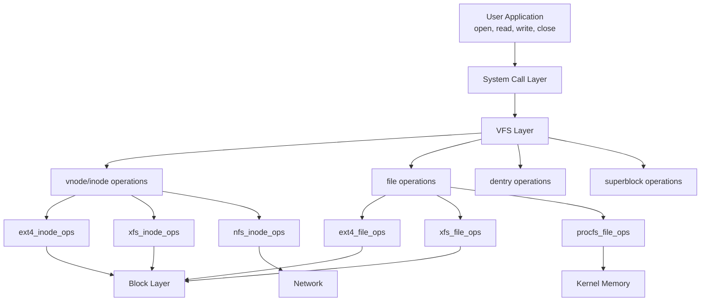
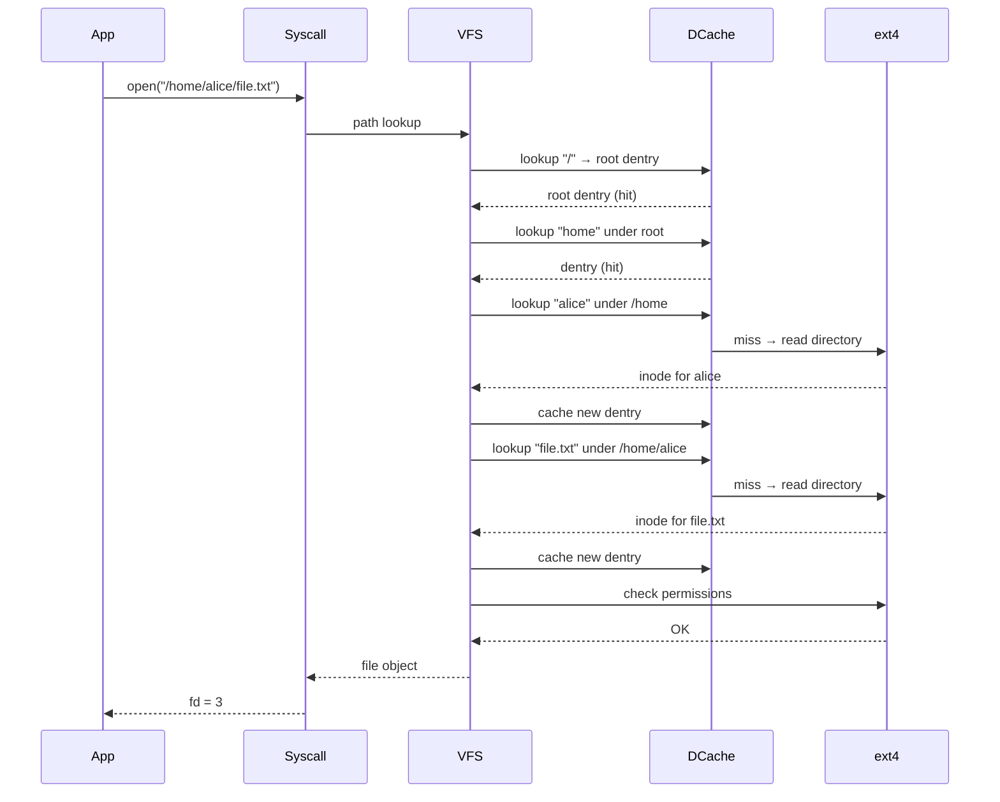
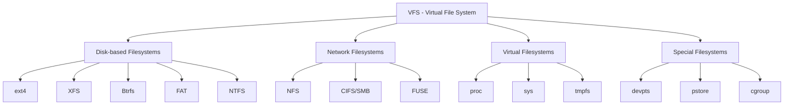

# Virtual File System (VFS)

## Overview

The **Virtual File System (VFS)** is an abstraction layer in the kernel that provides a uniform interface to multiple concrete filesystem implementations. It allows the kernel to support ext4, XFS, NFS, FAT, procfs, sysfs, and many others — all through the same system call interface (`open`, `read`, `write`, `close`).

## Why VFS?

Without VFS, each filesystem would need its own system call interface. With VFS:

- Applications use `open()`, `read()`, `write()` regardless of filesystem
- New filesystems can be added without changing user-space code
- Different filesystem types can coexist on the same system
- Network filesystems (NFS, CIFS) work transparently

## VFS Architecture



## Key VFS Objects

### 1. Superblock (vfsmount / super_block)

Represents a **mounted filesystem instance**. Contains:
- Filesystem type
- Block size
- Root inode
- Mount flags
- Operations for: `alloc_inode`, `destroy_inode`, `read_inode`, `write_inode`, `sync_fs`

```c
struct super_operations {
    struct inode *(*alloc_inode)(struct super_block *sb);
    void (*destroy_inode)(struct inode *);
    void (*dirty_inode)(struct inode *, int flags);
    int (*write_inode)(struct inode *, struct writeback_control *wbc);
    int (*sync_fs)(struct super_block *sb, int wait);
    int (*statfs)(struct dentry *, struct kstatfs *);
    int (*remount_fs)(struct super_block *, int *, char *);
    void (*umount_begin)(struct super_block *);
};
```

### 2. Inode (vfs_inode / inode)

Represents a **file or directory** in the kernel. The in-memory counterpart to the on-disk inode.

```c
struct inode {
    umode_t             i_mode;      // File type and permissions
    kuid_t              i_uid;       // Owner UID
    kgid_t              i_gid;       // Owner GID
    unsigned int        i_flags;
    const struct inode_operations   *i_op;    // Inode operations
    struct super_block  *i_sb;       // Back-pointer to superblock
    struct address_space *i_mapping; // Page cache mapping
    unsigned long       i_ino;       // Inode number
    loff_t              i_size;      // File size
    struct timespec     i_atime;     // Access time
    struct timespec     i_mtime;     // Modification time
    struct timespec     i_ctime;     // Change time
    unsigned short      i_bytes;     // Bytes used in last block
    blkcnt_t            i_blocks;    // Number of blocks
    union {
        struct pipe_inode_info *i_pipe;   // If pipe
        struct cdev            *i_cdev;   // If char device
        // ...
    };
};
```

**Inode operations** include:
- `lookup` — find a child entry in a directory
- `create` — create a new file
- `link`, `unlink` — hard link operations
- `mkdir`, `rmdir` — directory operations
- `rename` — rename a file
- `permission` — check access permissions

### 3. File Object (struct file)

Represents an **open file** — a per-process instance. Multiple processes can have the same file open; each gets a separate `struct file`.

```c
struct file {
    struct path             f_path;     // Mount point + dentry
    struct inode            *f_inode;   // Back-pointer to inode
    const struct file_operations *f_op; // File operations
    atomic_long_t           f_count;    // Reference count
    unsigned int            f_flags;    // O_RDONLY, O_WRONLY, etc.
    fmode_t                 f_mode;
    struct mutex            f_pos_lock;
    loff_t                  f_pos;      // Current file offset
    struct fown_struct      f_owner;
    struct address_space    *f_mapping;
};
```

**File operations** include:
- `read`, `write` — data transfer
- `llseek` — change file position
- `mmap` — memory mapping
- `poll` — wait for I/O readiness
- `fsync` — flush to disk
- `open`, `release` — open and close

### 4. Dentry (Directory Entry / dentry)

Represents a **name → inode mapping**. Cached for fast path lookup.

```c
struct dentry {
    struct dentry           *d_parent;    // Parent directory
    struct qstr             d_name;       // Name (string + hash)
    struct inode            *d_inode;     // Associated inode
    const struct dentry_operations *d_op;
    struct super_block      *d_sb;        // Superblock
    unsigned char           d_iname[DNAME_INLINE_LEN]; // Short name
    struct list_head        d_child;      // Child of parent
    struct list_head        d_subdirs;    // Subdirectories
};
```

The **dentry cache (dcache)** is a hash table of dentries, dramatically speeding up path resolution.

## Path Lookup Walkthrough

When `open("/home/alice/file.txt", O_RDONLY)` is called:



### Dentry Cache Levels

1. **dcache (hash table)**: name hash → dentry. Fast lookups.
2. **Negative dentries**: Cache "file does NOT exist" to speed up failed lookups.
3. **Inode cache**: In-memory inode structures.
4. **Page cache**: Cached file data pages.

## Mount and Namespace

Each mount has:
- **vfsmount**: links a filesystem to a dentry in the tree
- **Mount namespace**: per-process view of mounted filesystems

```bash
# View mount tree
mount
# /dev/sda1 on / type ext4 (rw,relatime)
# /dev/sdb1 on /home type xfs (rw,noatime)
# proc on /proc type proc (rw,nosuid,nodev,noexec)
# tmpfs on /tmp type tmpfs (rw,nosuid,nodev)
```

### Bind Mounts

```bash
mount --bind /original /mount_point
```

Makes the same filesystem appear at two locations. Used extensively in containers.

## Filesystem Registration

A filesystem type registers with VFS:

```c
static struct file_system_type ext4_fs_type = {
    .name       = "ext4",
    .mount      = ext4_mount,       // Called on mount
    .kill_sb    = ext4_kill_sb,     // Called on unmount
    .fs_flags   = FS_REQUIRES_DEV,  // Needs a block device
};

// Registration
register_filesystem(&ext4_fs_type);
```

When `mount -t ext4 /dev/sda1 /mnt` is called:
1. VFS finds `ext4_fs_type` by name
2. Calls `ext4_mount()` → reads superblock from disk
3. Creates VFS superblock, root inode, root dentry
4. Links into the mount namespace

## procfs and sysfs (Virtual Filesystems)

These don't use disk at all — they generate content on the fly.

```bash
cat /proc/cpuinfo        # Generated by kernel
cat /proc/1234/status    # Per-process info
cat /sys/block/sda/size  # Device attribute
```

**procfs operations:**
```c
static ssize_t proc_read(struct file *file, char __user *buf, ...) {
    // Generate content dynamically
    len = sprintf(page, "Name: %s\nPid: %d\n", current->comm, current->pid);
    copy_to_user(buf, page, len);
    return len;
}
```

## Filesystem Type Hierarchy



## Interview Questions

**Q1: What is the purpose of the VFS layer?**

VFS provides a uniform system call interface (`open`, `read`, `write`, `close`) that abstracts over different filesystem implementations. It allows the kernel to support multiple filesystem types (ext4, XFS, NFS, procfs) without changing user-space code. Each filesystem implements a set of function pointers (operations) that VFS calls.

**Q2: What are the four main VFS objects and what does each represent?**

1. **Superblock** — a mounted filesystem instance (device, type, root)
2. **Inode** — a file or directory (metadata, block pointers, operations)
3. **Dentry** — a name-to-inode mapping (cached in the dcache)
4. **File** — an open file instance (current offset, mode, per-process)

**Q3: What is the dentry cache and why is it important?**

The dentry cache (dcache) caches name→inode lookups. Without it, every `open()` would require reading directory blocks from disk for each path component. The dcache turns path resolution into hash lookups, dramatically speeding up file access. It also caches negative entries ("file does not exist").

**Q4: How does `procfs` work if it has no disk backing?**

procfs is a virtual filesystem. Its file operations generate content on the fly by reading kernel data structures. When you `cat /proc/1234/status`, the read function queries the process table and formats the output. There are no disk blocks — all data comes from kernel memory.

**Q5: What happens when two processes open the same file simultaneously?**

Each process gets its own `struct file` with an independent file offset. Both file objects point to the same in-memory inode. If they write concurrently, data corruption is possible unless they use `O_APPEND` (atomic seek-to-end) or file locks.

## Common Mistakes

- Confusing inode and dentry — an inode is the file's metadata; a dentry is the name→inode mapping
- Thinking VFS is a filesystem — it's an abstraction layer, not a filesystem itself
- Assuming `open()` always hits the disk — the dcache and inode cache usually serve the lookup from memory
- Not understanding that `struct file` is per-open, while `struct inode` is per-file

## Summary

- VFS is the kernel's filesystem abstraction layer, providing uniform system calls
- Four key objects: superblock (filesystem), inode (file metadata), dentry (name mapping), file (open instance)
- The dentry cache makes path resolution fast by caching name lookups
- Filesystems register with VFS by providing function pointer tables (operations)
- Virtual filesystems (procfs, sysfs) generate data on the fly from kernel structures
- VFS enables transparent support for disk, network, and virtual filesystems

## Cross-References

- [File Concepts](file-concepts.md) — what files and inodes are
- [ext4](ext4.md) — a concrete VFS implementation
- [Directory Structure](directory-structure.md) — how directories work
- [FUSE](fuse.md) — userspace filesystem implementation via VFS
- [Device Drivers](../io/device-drivers.md) — how block I/O reaches the filesystem
