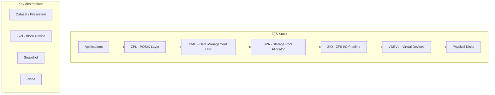
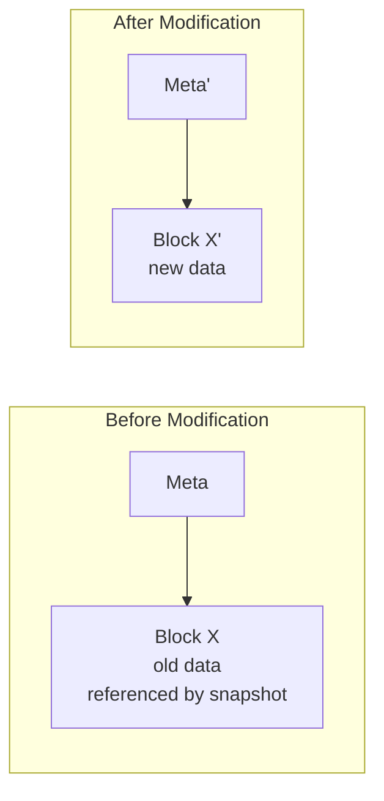

# ZFS (Zettabyte File System)

## Overview

**ZFS** is an advanced filesystem and volume manager originally developed by Sun Microsystems (now Oracle) for Solaris, and ported to Linux via **OpenZFS**. It combines filesystem and volume management into a single layer, providing pooled storage, copy-on-write, checksums everywhere, RAID-Z, snapshots, clones, compression, deduplication, and self-healing.

## Key Design Principles

1. **Pooled storage**: Disks are grouped into **zpools**; filesystems share the pool dynamically
2. **Copy-on-Write (COW)**: Never overwrite data in place
3. **Checksums everywhere**: Every block has a hash; detects silent corruption
4. **Self-healing**: RAID-Z rebuilds corrupted blocks from parity
5. **Transactional**: Atomic writes; no partial updates

## Architecture



## Zpool and Vdevs

A **zpool** is a collection of **vdevs** (virtual devices). A vdev can be:

| Vdev Type | Description | Redundancy |
|-----------|-------------|------------|
| **stripe** | Just a disk | None |
| **mirror** | 2+ disks, all copies | 1-disk failure |
| **raidz1** | RAID-5 equivalent | 1-disk failure |
| **raidz2** | RAID-6 equivalent | 2-disk failure |
| **raidz3** | Triple parity | 3-disk failure |
| **spare** | Hot spare | Replacement |
| **log** | SLOG (ZIL on SSD) | Write cache |
| **cache** | L2ARC | Read cache |

```bash
# Create a simple pool
zpool create mypool /dev/sdb /dev/sdc

# Mirror pool
zpool create mypool mirror /dev/sdb /dev/sdc

# RAIDZ pool
zpool create mypool raidz1 /dev/sdb /dev/sdc /dev/sdd

# RAIDZ2 with hot spare
zpool create mypool raidz2 /dev/sd{b,c,d,e} spare /dev/sdf

# Pool status
zpool status mypool
zpool list
```

## Datasets (Filesystems)

ZFS datasets are lightweight filesystems within a pool:

```bash
# Create dataset
zfs create mypool/data
zfs create mypool/data/projects

# Set properties
zfs set compression=lz4 mypool/data
zfs set quota=100G mypool/data/projects
zfs set recordsize=1M mypool/data/projects

# Mount (automatic)
zfs set mountpoint=/data mypool/data

# List
zfs list
```

## Copy-on-Write (COW)

ZFS **never** overwrites data in place:



1. Write new data to a free block (X')
2. Update parent pointer to X'
3. Old block X is freed only when no snapshots reference it

**Result**: Atomic writes, instant snapshots, crash consistency.

## Checksums and Self-Healing

Every block in ZFS has a **checksum** stored in its parent pointer:

| Checksum | Description |
|----------|-------------|
| fletcher2/fletcher4 | Fast, hardware-friendly |
| sha256 | Cryptographic strength |
| sha512 | Stronger variant |
| skein | Modern, fast |
| edonr | High performance |

```bash
# Set checksum algorithm
zfs set checksum=sha256 mypool/data
```

**Self-healing process:**
1. Read block → verify checksum
2. Checksum fails → read from mirror/parity
3. Return correct data to application
4. Write correct data back to failed disk

```bash
# Scrub pool (verify all checksums)
zpool scrub mypool
zpool status mypool  # Check for errors
```

## Snapshots and Clones

### Snapshots

```bash
# Create snapshot
zfs snapshot mypool/data@backup-2026-08-01

# List snapshots
zfs list -t snapshot

# Rollback to snapshot
zfs rollback mypool/data@backup-2026-08-01

# Destroy snapshot
zfs destroy mypool/data@backup-2026-08-01
```

Snapshots are:
- **Instant**: Only metadata is copied (root block pointer)
- **Space-efficient**: Only changed blocks consume extra space
- **Read-only**: Immutable point-in-time copy

### Clones

A **clone** is a writable copy of a snapshot:

```bash
# Create clone from snapshot
zfs clone mypool/data@backup-2026-08-01 mypool/data-dev

# Promote clone (becomes independent)
zfs promote mypool/data-dev
```

## ZFS Send/Receive

Efficient replication based on snapshots:

```bash
# Full send
zfs send mypool/data@snap1 | ssh remote zfs receive backup/data

# Incremental send (only differences)
zfs send -i mypool/data@snap1 mypool/data@snap2 | ssh remote zfs receive backup/data

# Encrypted send
zfs send -w mypool/data@snap1 | ssh remote zfs receive backup/data
```

## RAID-Z Parity

### RAID-Z1 (Single Parity)

Like RAID-5 but with variable-width stripes:

```
Disk 1: [D1] [D4] [D7]
Disk 2: [D2] [D5] [P2]
Disk 3: [D3] [P1] [D8]

P1 = D1 ⊕ D2 ⊕ D3
P2 = D4 ⊕ D5 (variable stripe width)
```

**Advantage over RAID-5**: No "write hole" — ZFS writes full stripes atomically.

### RAID-Z2/Z3

- RAID-Z2: Two parity disks (survive 2 failures)
- RAID-Z3: Three parity disks (survive 3 failures)

## ZFS Intent Log (ZIL) and L2ARC

### ZIL (Synchronous Write Log)

```
Application → write() → ZIL (fast SSD) → confirm → later: flush to pool
```

For sync-heavy workloads (databases, NFS), place ZIL on a fast SSD:

```bash
zpool add mypool log /dev/nvme0n1
```

### L2ARC (Level 2 Adaptive Replacement Cache)

SSD read cache in front of the ARC (in-memory cache):

```bash
zpool add mypool cache /dev/nvme1n1
```

## Compression

```bash
# Enable compression (lz4 is fast, default recommendation)
zfs set compression=lz4 mypool/data

# Higher compression ratio
zfs set compression=zstd mypool/data
zfs set compression=zstd-3 mypool/data  # zstd level 3

# Check compression ratio
zfs get compressratio mypool/data
```

## Deduplication

```bash
# Enable dedup (⚠️ memory-intensive!)
zfs set dedup=on mypool/data
```

**Warning**: Dedup requires ~5 GB of RAM per TB of data. Not recommended for most workloads.

## Interview Questions

**Q1: How does ZFS differ from traditional filesystems?**

ZFS combines filesystem and volume manager. Traditional stacks: partition → RAID → LVM → filesystem. ZFS: vdevs → zpool → datasets. ZFS also uses COW (no journaling needed), checksums everything, and provides RAID-Z with atomic full-stripe writes (no write hole).

**Q2: What is the ZFS ARC and how does it work?**

The ARC (Adaptive Replacement Cache) is ZFS's read cache. It's a self-tuning algorithm that balances between recently-used blocks (MRU) and frequently-used blocks (MFU). Unlike simple LRU, ARC keeps both recent and frequent data, adapting to workload patterns. It uses most available RAM but releases it under memory pressure.

**Q3: How does ZFS prevent the RAID-5 write hole?**

The write hole occurs in RAID-5 when a power loss during a stripe write leaves parity inconsistent with data. ZFS solves this by: (1) using COW — writes go to new locations, never overwrite, (2) writing full stripes atomically with transaction groups, (3) checksumming every block to detect corruption.

**Q4: What is a zpool and how does it differ from a traditional volume group?**

A zpool is a collection of vdevs that provides storage to all datasets within it. Unlike LVM volume groups, zpools don't have fixed-size logical volumes — all datasets share the pool's free space dynamically. Adding a vdev to the pool immediately increases available space for all datasets.

**Q5: Why does ZFS need so much RAM?**

ZFS uses RAM for: (1) ARC read cache (typically 50-75% of RAM), (2) metadata caching, (3) dedup tables (if enabled — ~5 GB/TB), (4) transaction group management. The ARC is the primary consumer. More RAM = better read performance. Minimum recommended: 1 GB per TB of raw storage (without dedup).

## Common Mistakes

- Using hardware RAID with ZFS — ZFS needs direct disk access for checksums and self-healing. Use HBA (IT mode), not RAID controller.
- Enabling dedup without enough RAM — it will cripple performance
- Not scrubbing regularly — `zpool scrub` catches silent corruption before it compounds
- Assuming ZFS snapshots are backups — they protect against accidental deletion, not hardware failure (replicate with `zfs send`)

## Summary

- ZFS is a combined filesystem + volume manager with COW, checksums, and RAID-Z
- Pooled storage: datasets share space dynamically from the zpool
- COW enables atomic writes, instant snapshots, and crash consistency without journaling
- Checksums on every block + self-healing with RAID-Z
- ZIL for sync writes, L2ARC for read caching
- Send/receive for efficient replication
- Compression (lz4, zstd) and dedup (memory-intensive)

## Cross-References

- [Btrfs](btrfs.md) — similar features, different implementation
- [RAID](raid.md) — hardware vs. software RAID
- [Journaling](journaling.md) — ZFS uses COW instead
- [Disk Allocation](disk-allocation.md) — ZFS's variable-width stripes
- [I/O Buffering](../io/buffering.md) — ARC and page cache


## Cross References

- [Btrfs](btrfs.md)
- [RAID](raid.md)
- [Erasure Coding](../../storage/erasure-coding.md)
- [Copy-on-Write](../virtual-memory/cow.md)
