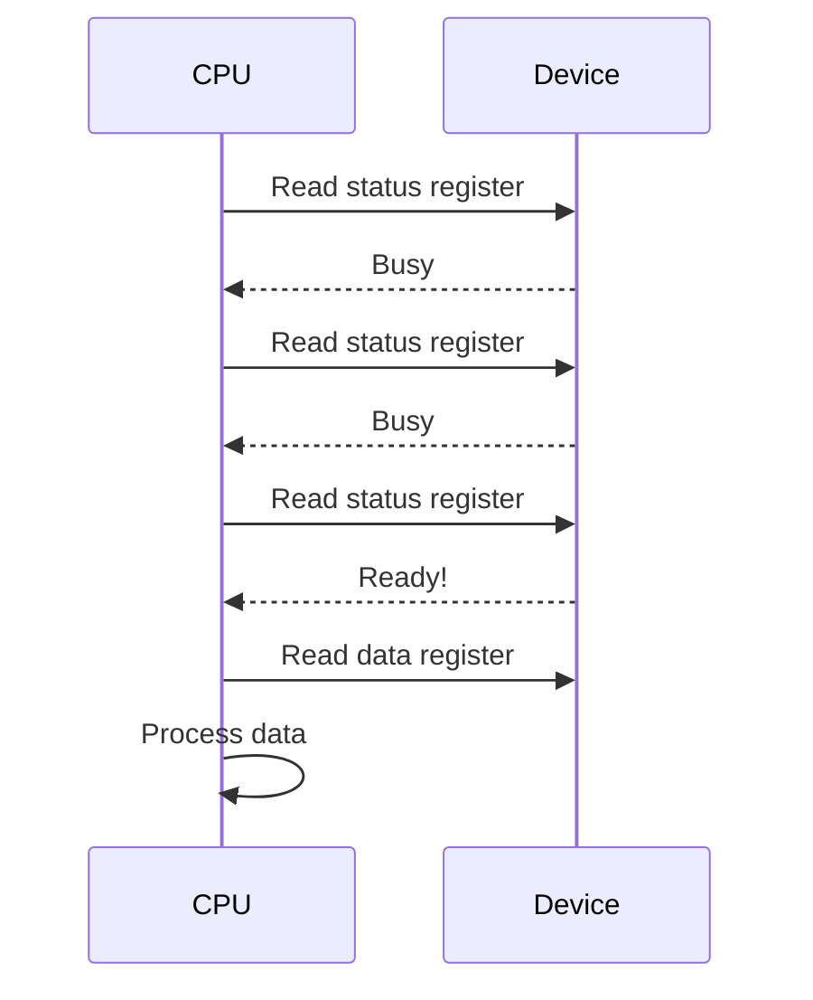
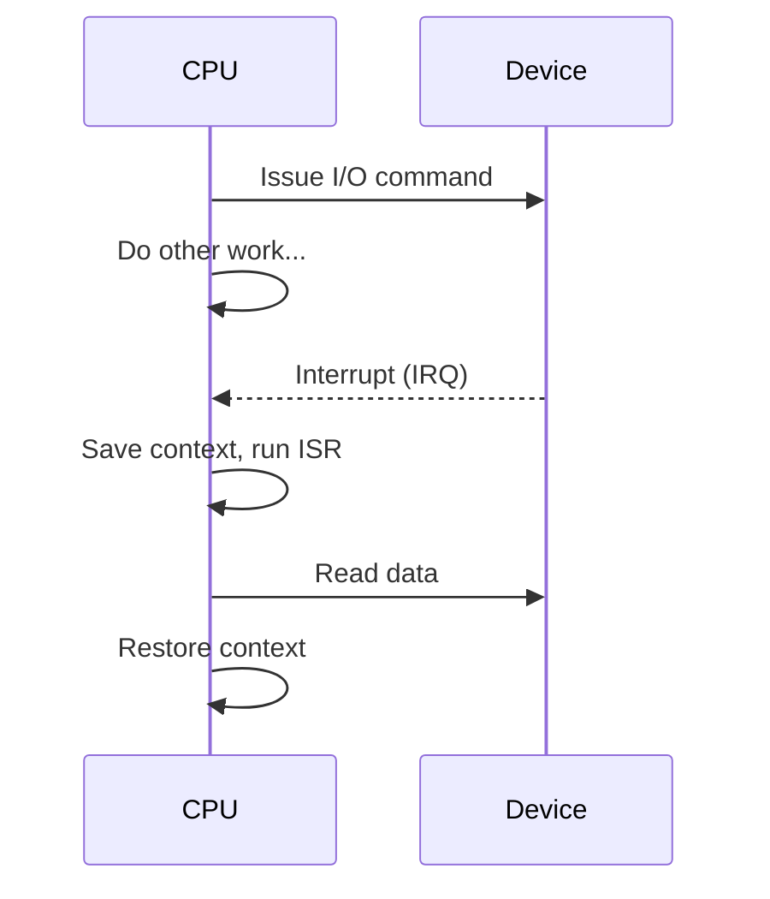
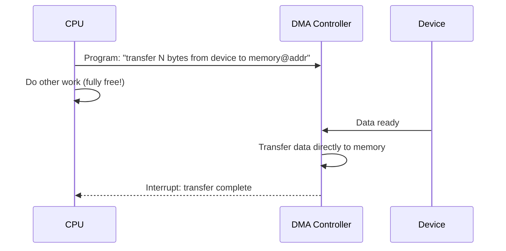
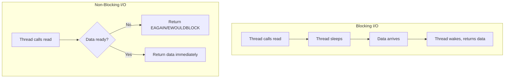
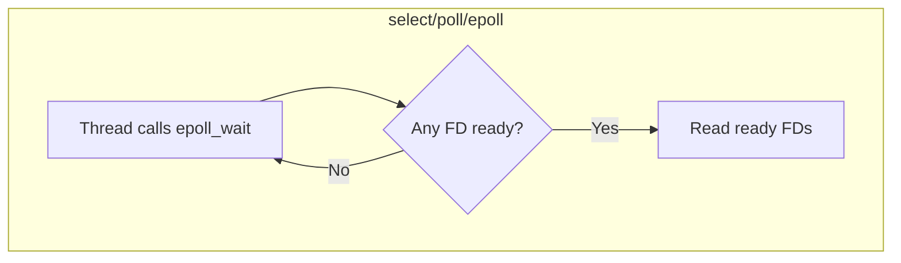
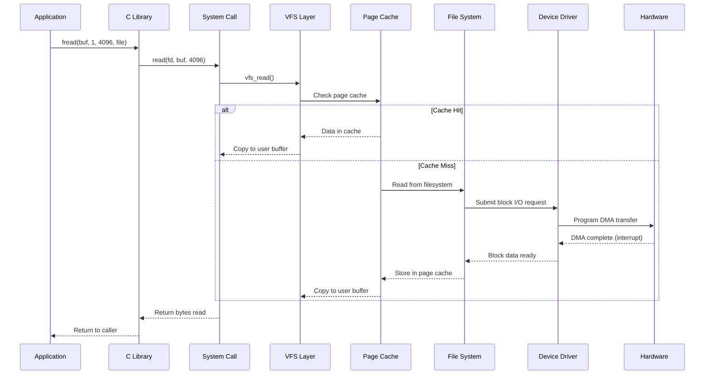

# I/O Systems

## Overview

Input/Output (I/O) is one of the most critical and complex subsystems of an operating system. The OS must manage a vast array of peripheral devices — disks, network cards, keyboards, displays, sensors — each with different speed characteristics, data formats, and control mechanisms. The I/O subsystem provides a uniform abstraction so that applications can interact with devices without knowing hardware-specific details.

## Motivation

Why is I/O so important?

1. **Performance bottleneck**: CPU operates in nanoseconds; disks in milliseconds. A single disk I/O can take as long as millions of CPU instructions.
2. **Heterogeneity**: Hundreds of device types exist, each with unique protocols. The OS must hide this complexity.
3. **Concurrency**: Multiple processes may request I/O simultaneously; the OS must schedule, multiplex, and arbitrate.
4. **Reliability**: I/O failures (disk errors, network timeouts) must be handled gracefully without crashing the system.

## The I/O Performance Gap

```
Component          Latency           Relative Time
─────────────────────────────────────────────────
CPU register       0.3 ns            1x
L1 cache           1 ns              3x
L2 cache           4 ns              13x
L3 cache           12 ns             40x
Main memory        100 ns            300x
NVMe SSD           25 μs             83,000x
SATA SSD           100 μs            333,000x
HDD (seek)         10 ms             33,000,000x
Network (cross-DC)  100 ms           333,000,000x
```

This gap is why I/O optimization is critical. A single HDD seek wastes as much time as 33 million CPU instructions.

## I/O Subsystem Architecture

```
┌─────────────────────────────────────────────┐
│              User Applications              │
│         (read(), write(), open())           │
├─────────────────────────────────────────────┤
│           System Call Interface             │
│         (VFS - Virtual File System)         │
├─────────────────────────────────────────────┤
│          Device-Independent I/O Layer       │
│    (buffering, caching, spooling, naming)   │
├─────────────────────────────────────────────┤
│            Device Drivers                   │
│    (translate generic → device-specific)    │
├─────────────────────────────────────────────┤
│        Interrupt Handlers                   │
│    (handle hardware signals)                │
├─────────────────────────────────────────────┤
│          Hardware                           │
│    (controllers, buses, devices)            │
└─────────────────────────────────────────────┘
```

Each layer has a specific responsibility:

| Layer | Responsibility | Example |
|-------|---------------|---------|
| **User Application** | High-level I/O requests | `fread(buf, 1, 1024, file)` |
| **System Call Interface** | Transition to kernel mode | `read(fd, buf, count)` |
| **VFS** | Unified file abstraction | `/dev/sda`, `/tmp/file` |
| **Device-Independent** | Buffering, caching, error handling | Page cache, read-ahead |
| **Device Drivers** | Hardware-specific control | `ahci.c` (SATA driver) |
| **Interrupt Handlers** | Async hardware notifications | Disk completion IRQ |
| **Hardware** | Physical I/O operations | DMA transfer to memory |

## Three Methods of I/O

### 1. Programmed I/O (Polling)



**How it works**: CPU repeatedly checks the device status register in a busy loop.

| Aspect | Assessment |
|--------|-----------|
| **CPU utilization** | Very low — CPU wastes cycles polling |
| **Simplicity** | Simplest to implement |
| **Latency** | Low (immediate detection) |
| **Use case** | Embedded systems, very fast devices |

### 2. Interrupt-Driven I/O



**How it works**: CPU issues the I/O command and switches to other tasks. The device raises an interrupt when done.

| Aspect | Assessment |
|--------|-----------|
| **CPU utilization** | Better — CPU does useful work between interrupts |
| **Overhead** | Context switch per byte (for programmed part) |
| **Latency** | Interrupt handling adds small delay |
| **Use case** | Keyboard, mouse, low-bandwidth devices |

### 3. Direct Memory Access (DMA)



**How it works**: CPU programs a DMA controller with source, destination, and byte count. The DMA controller transfers data directly to memory without CPU involvement.

| Aspect | Assessment |
|--------|-----------|
| **CPU utilization** | Excellent — CPU free during entire transfer |
| **Overhead** | One interrupt per block (not per byte) |
| **Complexity** | Requires DMA hardware controller |
| **Use case** | Disk I/O, network I/O, high-bandwidth devices |

### Comparison

| Method | CPU Involvement | Interrupts | Use Case |
|--------|----------------|------------|----------|
| **Polling** | Continuous (busy loop) | None | Embedded, fast devices |
| **Interrupt-driven** | Per byte/word | Per byte | Low-bandwidth (keyboard) |
| **DMA** | Setup + completion only | Per block | High-bandwidth (disk, NIC) |

## Blocking vs Non-Blocking I/O



| Model | Thread Behavior | Complexity | Throughput |
|-------|----------------|------------|------------|
| **Blocking** | Sleep until data ready | Simple | Low (1 thread per connection) |
| **Non-blocking** | Return immediately if no data | Medium | Medium |
| **Multiplexed** | Monitor many FDs, notify when ready | Higher | High |
| **Async (AIO)** | OS notifies when complete | Highest | Highest |

## I/O Multiplexing

I/O multiplexing allows a single thread to monitor multiple file descriptors.

### The Four I/O Models (Stevens Classification)



| System Call | Mechanism | Scalability | Notes |
|-------------|-----------|-------------|-------|
| **select** | Bitmap of FDs, O(n) scan | ~1024 FDs max | POSIX standard, limited |
| **poll** | Array of FD structs, O(n) scan | No hard limit | No FD limit, still O(n) |
| **epoll** | Red-black tree + ready list, O(1) | Millions of FDs | Linux only, event-driven |
| **kqueue** | Similar to epoll | Millions of FDs | BSD/macOS |
| **IOCP** | Completion ports | High | Windows |

### epoll vs select

```
select() workflow:                epoll workflow:
1. Copy FD set to kernel         1. Register FDs once (epoll_ctl)
2. Scan all FDs for readiness    2. epoll_wait returns only ready FDs
3. Return all FDs (caller filters) 3. O(1) notification
4. Repeat every call             4. Scales to millions of FDs
```

**Why epoll wins at scale**: With 10,000 connections but only 10 active, `select` scans all 10,000 each time. `epoll` returns only the 10 active ones.

## The Read Path: From User Space to Hardware



## Topics in This Chapter

| Topic | Description |
|-------|-------------|
| [Hardware](hardware.md) | I/O hardware: ports, buses, controllers |
| [Software Layers](software-layers.md) | The layered I/O architecture |
| [Buffering](buffering.md) | Buffering strategies and their tradeoffs |
| [Disk Scheduling](disk-scheduling.md) | Overview of disk scheduling algorithms |
| [FCFS](disk-fcfs.md) | First-Come First-Served disk scheduling |
| [SSTF](disk-sstf.md) | Shortest Seek Time First |
| [SCAN / Elevator](disk-scan.md) | SCAN algorithm |
| [C-SCAN](disk-cscan.md) | Circular SCAN algorithm |
| [LOOK / C-LOOK](disk-look.md) | LOOK variants |
| [Interrupts](interrupts.md) | Interrupt-driven I/O |
| [DMA](dma.md) | Direct Memory Access |
| [Device Drivers](device-drivers.md) | Device driver architecture |

## Interview Questions

1. **Q: Compare polling, interrupt-driven, and DMA-based I/O.**
   A: Polling: CPU busy-waits checking device status — wastes CPU cycles, simplest implementation. Interrupt-driven: CPU issues command, does other work, device signals completion via interrupt — better CPU utilization but context switch overhead per I/O. DMA: CPU programs DMA controller, data transfers directly to memory, single interrupt for entire block — best for high-bandwidth I/O.

2. **Q: What is I/O multiplexing and when would you use it?**
   A: I/O multiplexing allows a single thread to monitor multiple file descriptors for readiness. Use it for network servers handling many concurrent connections (e.g., web server, chat server). `select` is simple but limited to ~1024 FDs. `epoll` (Linux) scales to millions of FDs with O(1) notification. This is the basis of event-driven architectures like Nginx, Node.js, and Redis.

3. **Q: Explain the difference between blocking and non-blocking I/O.**
   A: Blocking I/O: the calling thread sleeps until data is available — simple but requires one thread per connection. Non-blocking I/O: returns immediately with EAGAIN if no data — caller must retry or use multiplexing. Asynchronous I/O: caller continues, OS notifies when complete — most complex but highest throughput.

4. **Q: What is the page cache and how does it improve I/O performance?**
   A: The page cache stores recently accessed file data in main memory. Subsequent reads of the same data are served from memory (nanoseconds) instead of disk (milliseconds). The OS uses LRU-like eviction to manage cache size. Write-back caching buffers writes in the page cache and flushes to disk periodically. This is why `free` shows most memory as "used" — it's actually cache.

5. **Q: How does a disk read work from the application to the hardware?**
   A: Application calls `read()` → system call enters kernel → VFS looks up file → page cache check (cache hit: return immediately) → cache miss: filesystem submits block request → device driver programs DMA → DMA controller transfers data from disk to memory → disk raises interrupt → driver handles interrupt → data placed in page cache → copied to user buffer → system call returns.

6. **Q: Why is epoll more scalable than select?**
   A: `select` copies the entire FD set to kernel on each call and scans all FDs for readiness (O(n)). `epoll` registers FDs once with `epoll_ctl` and `epoll_wait` returns only ready FDs (O(1) per notification). With 1M connections where only 100 are active, select scans 1M FDs; epoll returns only 100. Also, epoll uses a red-black tree internally and a ready list for O(1) event notification.

7. **Q: What is DMA and why is it important for disk I/O?**
   A: DMA (Direct Memory Access) allows hardware devices to transfer data directly to/from memory without CPU involvement. For disk I/O: CPU programs the DMA controller with memory address and byte count → DMA controller handles the transfer → raises interrupt when complete. Without DMA, the CPU would need to move each byte individually (programmed I/O), wasting millions of cycles per disk read.

8. **Q: What is a device driver and why is it needed?**
   A: A device driver is kernel software that translates generic I/O operations into device-specific commands. Each device has unique registers, protocols, and capabilities. The driver abstracts this behind a standard interface (e.g., `read()`, `write()`). This allows applications to work with any device without knowing hardware details. Drivers run in kernel space for direct hardware access.

9. **Q: Explain the SCAN disk scheduling algorithm.**
   A: SCAN (elevator algorithm) moves the disk head in one direction servicing all pending requests, then reverses direction. Like an elevator going up, stopping at each floor, then going down. It's fairer than SSTF (no starvation) and more efficient than FCFS. C-SCAN only services requests in one direction and returns to the start without servicing, providing more uniform wait times.

10. **Q: What is the difference between synchronous and asynchronous I/O?**
    A: Synchronous I/O: the calling thread blocks until the operation completes (blocking) or gets an immediate status (non-blocking). Asynchronous I/O: the calling thread initiates the operation and continues; the OS notifies completion via callback, signal, or completion port. AIO is the most efficient for disk I/O but has higher implementation complexity. Linux provides `io_uring` as a modern async I/O interface.

## Quick Revision

- **I/O hierarchy**: Hardware → Interrupt handlers → Device drivers → Device-independent layer → User space
- **Three I/O methods**: Programmed I/O (polling), Interrupt-driven I/O, DMA
- **I/O models**: Blocking, Non-blocking, Multiplexed (select/epoll), Async (AIO)
- **Buffering types**: Single, double, circular, buffer pool
- **Disk scheduling**: FCFS, SSTF, SCAN, C-SCAN, LOOK, C-LOOK
- **Key tradeoff**: Throughput vs. latency vs. fairness

## Cross References

- [I/O Architecture](../../arch/io/README.md)
- [Device Drivers](device-drivers.md)
- [Interrupts](interrupts.md)
- [DMA](dma.md)
- [Storage Overview](../../storage/overview.md)

## References

- [Operating System Concepts](https://www.os-book.com/) — Silberschatz, Galvin, Gagne (Chapter 13)
- [Modern Operating Systems](https://www.pearson.com/en-us/subject-catalog/p/modern-operating-systems/P200000003308) — Andrew Tanenbaum
- [Linux Kernel Development](https://www.amazon.com/Linux-Kernel-Development-Robert-Love/dp/0672329468) — Robert Love (I/O chapters)
- [The Linux Programming Interface](https://man7.org/tlpi/) — Michael Kerrisk (Chapters 4-6, 63)
- [io_uring documentation](https://kernel.dk/io_uring.pdf) — Jens Axboe
- [UNIX Network Programming, Vol 1](https://www.unpbook.com/) — W. Richard Stevens (I/O multiplexing chapters)
