# Kernel Deep Dive — Advanced Topics (101–200)

## Overview

This section goes **significantly deeper** into Linux kernel internals than the foundational [Kernel Internals](../kernel/README.md) and the [Advanced OS](../advanced/README.md) sections. These are the topics that distinguish candidates who have *read about* the kernel from those who have *worked with* it — the kind of depth expected at FAANG+ systems programming, kernel development, and infrastructure engineering roles.

Each file targets 800–2000 words of dense technical content with source code references, architecture diagrams, and interview-ready explanations.

## Topic Map

```mermaid
graph TD
    ROOT["Kernel Deep Dive"] --> BOOT["Boot Process"]
    ROOT --> TRACE["Tracing & Probes"]
    ROOT --> EBPF["eBPF Internals"]
    ROOT --> NS["Namespaces & cgroups"]
    ROOT --> VFS["VFS & IPC Internals"]
    ROOT --> NET["Network Stack"]
    ROOT --> BLK["Block Layer & Hardware"]

    BOOT --> B1["EFI/UEFI, bootloaders, initramfs"]
    BOOT --> B2["Kernel decompression, early boot memory"]
    BOOT --> B3["Initcall mechanism, module loading"]

    TRACE --> T1["kprobes, uprobes, tracepoints"]
    TRACE --> T2["ftrace, perf events, BPF trampolines"]

    EBPF --> E1["Verifier, JIT, maps, ring buffers"]
    EBPF --> E2["CO-RE, libbpf, BTF, bpftrace"]
    EBPF --> E3["XDP, AF_XDP, tc-BPF, cgroup/LSM BPF"]

    NS --> N1["Namespace internals, cgroup v2"]
    NS --> N2["systemd, journald, udev"]
    NS --> N3["Device model, sysfs, procfs, debugfs"]

    VFS --> V1["Inode lifecycle, dentry cache, pathname lookup"]
    VFS --> V2["fd tables, fd passing, SCM_RIGHTS"]
    VFS --> V3["Unix domain sockets, netlink, rtnetlink"]

    NET --> NW1["skb, NAPI, GRO/GSO/TSO"]
    NET --> NW2["TCP impl, BBR/CUBIC, SYN cookies"]
    NET --> NW3["XDP vs DPDK, RSS/RPS/RFS"]

    BLK --> BK1["blk-mq, NVMe, device mapper"]
    BLK --> BK2["DMA, IOMMU, ACPI, PCIe"]
    BLK --> BK3["Softirqs, workqueues, interrupt threading"]
```

## Reading Order

| Order | File | Why |
|-------|------|-----|
| 1 | [Boot Process](./boot-process.md) | Understand how the kernel starts — sets context for everything else |
| 2 | [Namespaces & cgroups](./namespaces-cgroups.md) | Container fundamentals; prerequisite for systemd/cgroup BPF |
| 3 | [VFS Internals](./vfs-internals.md) | File descriptor machinery, Unix sockets, netlink |
| 4 | [Block Layer](./block-layer.md) | I/O path from VFS to hardware, interrupts, DMA |
| 5 | [Network Stack](./network-stack.md) | skb lifecycle, TCP internals, offloads |
| 6 | [Tracing & Probes](./tracing-probes.md) | How to observe everything above |
| 7 | [eBPF Deep Dive](./ebpf-deep.md) | The crown jewel — verifier, JIT, CO-RE, XDP, LSM |

## Prerequisites

- [Kernel Internals](../kernel/README.md) — syscall path, monolithic architecture, modules
- [eBPF basics](../kernel/ebpf.md) — hooks, maps, CO-RE overview
- [io_uring](../kernel/io-uring.md) — async I/O interface
- [Advanced OS: Memory Internals](../advanced/memory-internals.md) — page tables, reclaim, NUMA
- [Advanced OS: Sync Primitives](../advanced/sync-primitives.md) — RCU, futex, qspinlock

## Relationship to Existing Content

| Existing File | This Section Goes Deeper Via |
|---------------|------------------------------|
| `kernel/ebpf.md` | `ebpf-deep.md` — verifier algorithm, JIT backends, BPF trampolines, XDP/AF_XDP datapath, LSM BPF |
| `kernel/tracing.md` | `tracing-probes.md` — kprobe INT3/jump opt internals, perf_event PMU, BPF trampoline vs kprobe |
| `kernel/modules.md` | `boot-process.md` — initcall levels, module symbol resolution, ELF section handling |
| `kernel/io-uring.md` | `block-layer.md` — blk-mq submission from io_uring, NVMe driver integration |
| `boot/bios-uefi.md` | `boot-process.md` — EFI handoff protocol, kernel decompression, early page tables |
| `boot/bootloader.md` | `boot-process.md` — GRUB2 EFI chain, initramfs unpacking, root= parsing |
| `boot/init-systems.md` | `namespaces-cgroups.md` — systemd unit deps, journald, cgroup delegation |

## Interview Questions

### Q: What separates kernel-deep knowledge from surface-level OS knowledge?

Surface-level: "Linux is monolithic, uses CFS for scheduling, has a VFS layer." Deep: "The CFS red-black tree holds `sched_entity` nodes sorted by `vruntime`; preemption is checked via `resched_curr()` in the scheduler tick and wakeup paths; the EEVDF migration uses a virtual deadline instead.