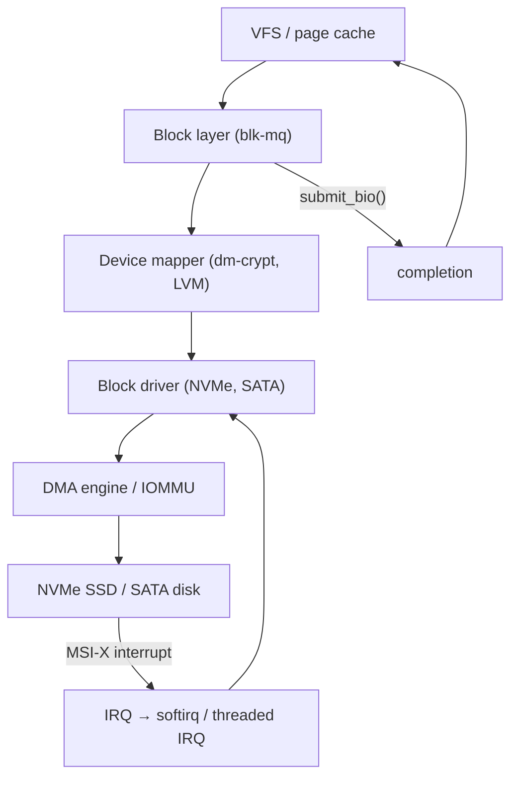

# Block Layer — blk-mq, NVMe, DMA, Interrupts, and Hardware

## Overview

The Linux block layer sits between the VFS/page cache and storage hardware. This chapter covers the modern **blk-mq** (multi-queue) architecture, the NVMe driver stack, device mapper (dm-crypt, LVM, md RAID), the kernel crypto API, and the interrupt/subsystem machinery that connects everything to hardware: workqueues, tasklets, softirqs, interrupt threading, MSI/MSI-X, APIC, NUMA, ACPI, PCIe enumeration, DMA mapping, and IOMMU page tables.



## blk-mq — Multi-Queue Block Layer

### Architecture

`blk-mq` (Linux 5.0+ default, replaces the legacy single-queue `blk`) provides **per-CPU submission queues** and a configurable number of hardware queues:

```text
Application (io_uring, read/write, aio)
  → submit_bio(bio)
    → blk_mq_submit_bio(bio)
      → Plug/merge: if current CPU has a plug list, append
      → Else: blk_mq_sched_insert_request()
        → If scheduler (mq-deadline, bfq, none):
          → Insert into scheduler's internal data structure
        → Else (none scheduler):
          → blk_mq_try_issue_directly()
            → driver's .queue_rq()

Per-CPU submission (hardware queues):
  hctx[0] → CPU 0,1 → NVMe queue pair 0
  hctx[1] → CPU 2,3 → NVMe queue pair 1
  hctx[2] → CPU 4,5 → NVMe queue pair 2
  ... (up to nr_hw_queues, typically = number of hardware queues)
```

### struct request

```c
// include/linux/blkdev.h
struct request {
    struct request_queue *q;      // owning queue
    struct blk_mq_ctx *mq_ctx;    // submission CPU context
    struct bio *bio;              // linked bios
    struct bio *biotail;          // tail of bio list
    unsigned int cmd_flags;       // REQ_OP_READ, REQ_OP_WRITE, REQ_NOWAIT, ...
    rq_cmd_dir_t cmd_dir;         // READ or WRITE
    sector_t __sector;            // first sector
    unsigned int __data_len;      // total data length
    struct completion *done;      // completion callback
    void *special;                // driver-private data
    // For NVMe: points to nvme_request with nvme_command
};
```

### I/O Schedulers (elevator)

| Scheduler | Algorithm | Use Case |
-----------|-----------|----------|
| `none` (mq-deadline-like) | FIFO, no reordering | NVMe SSDs (internal NCQ already optimal) |
| `mq-deadline` | Deadline-based with read/write FIFO | Mixed workloads, prevents starvation |
| `bfq` | Budget-based fair queuing | Desktop, interactive workloads |
| `kyber` | Adaptive, latency-aware | Modern SSDs, cloud workloads |

Since Linux 5.0, **`none`** is the default for multi-queue devices (NVMe). The reasoning: NVMe SSDs have internal command queuing (up to 64K commands) and their own NCQ/elevator, so a second scheduler in the kernel adds latency without benefit.

> **Interview Angle**: "Why is the I/O scheduler `none` by default for NVMe?" Because NVMe SSDs have deep internal queues (up to 64K commands) with their own scheduling, wear leveling, and garbage collection. A kernel-level elevator adds queuing latency without improving throughput. For SATA HDDs, `mq-deadline` is still recommended due to high seek costs.

## NVMe Driver Stack

### NVMe Command Submission

```c
// drivers/nvme/host/core.c + pci.c

// NVMe uses a fixed 4KB submission queue entry (SQE) and completion queue entry (CQE):
struct nvme_command {
    __u8 opcode;        // NVME_CMD_READ (0x02), NVME_CMD_WRITE (0x01)
    __u8 flags;
    __u16 command_id;   // unique per-command ID
    __le32 nsid;        // namespace ID
    __le64 cdw2;
    __le64 prp1;        // Physical Region Page 1 (DMA address)
    __le64 prp2;        // Physical Region Page 2 (for >4KB or >1 page)
    __le32 cdw10;       // start LBA (lower 32 bits)
    __le32 cdw11;       // start LBA (upper 32 bits) + length
    // ...
};

// Submission path:
nvme_submit_sync_cmd() / nvme_queue_rq():
  1. Get next SQE slot (sq->sq_tail % sq->sq_depth)
  2. Fill in command: opcode, nsid, prp1/2 (DMA address), LBA, length
  3. Ring doorbell: writel(sq->sq_tail, nvmeq->q_db + sq->sqid * 2)
  4. NVMe controller DMA reads SQE, processes command, DMAs data
  5. Completion: CQE posted to CQ, MSI-X interrupt fires
```

### NVMe vs SATA (AHCI)

| Aspect | NVMe | SATA (AHCI) |
--------|------|-------------|
| Interface | PCIe (direct) | PCIe → AHCI controller → SATA cable |
| Command queue depth | 64K (per queue) | 32 (per port, NCQ) |
| Max queues | 64K I/O + 1 admin | 1 per port |
| Latency | ~10-20 µs | ~50-100 µs |
| Throughput | 3.5-7+ GB/s (PCIe 3/4 x4) | ~550 MB/s (SATA III) |
| Driver | `drivers/nvme/host/` | `drivers/ata/libahci.c` |

## Device Mapper

Device mapper creates **virtual block devices** layered on top of real devices:

```text
/dev/mapper/vg-lv_root (device mapper device)
  → dm-crypt (encryption layer)
    → /dev/sda2 (real partition)

/dev/mapper/docker-253:1-1234-pool (Docker thin pool)
  → dm-thin (thin provisioning + snapshots)
    → /dev/sdb (real device)
```

### dm-crypt

```c
// drivers/md/dm-crypt.c
// Each bio is encrypted/decrypted before/after submission:
// 1. Incoming bio (read): submit to underlying device
//    On completion: decrypt each page in-place via kernel crypto API
// 2. Outgoing bio (write): encrypt each page, then submit

// The crypto API provides:
// crypto_alloc_skcipher("xts(aes)", 0, 0) → AES-256-XTS cipher handle
// skcipher_request_set_crypt(req, src_sg, dst_sg, len, iv) → encrypt/decrypt

// dm-crypt uses a per-cpu workqueue for encryption to avoid
// blocking the submitting process.
```

### LVM (Logical Volume Manager)

LVM uses device mapper internally:

```bash
# LVM stack:
Physical Volume (PV): /dev/sda1, /dev/sdb → metadata + data extents
Volume Group (VG): myvg → collection of PVs
Logical Volume (LV): myvg/root → dm-linear or dm-striped mapping

# dm-linear target: maps LV offsets to PV offsets
# echo "0 20971520 linear /dev/sda1 2048" | dmsetup create myvg-root
```

### md RAID

```c
// drivers/md/md.c
// Software RAID implemented as a device mapper target or standalone block device:
// md RAID levels: 0 (stripe), 1 (mirror), 5 (parity), 6 (dual parity), 10 (mirrored stripes)

// RAID 5 write penalty:
// For each write: read old data + read old parity → compute new parity → write data + write parity
// = 4 I/Os per write (read-modify-write)
// This is why RAID 5 write performance is poor for small random writes
```

## Kernel Crypto API

```c
// crypto/ — kernel cryptographic framework
// Provides symmetric ciphers, hashes, AEAD, async crypto, key management

// Example: allocate and use AES-XTS
struct crypto_skcipher *tfm = crypto_alloc_skcipher("xts(aes)", 0, 0);
SKCIPHER_REQUEST_ON_STACK(req, tfm);
sg_init_one(&src_sg, data, len);
sg_init_one(&dst_sg, out, len);
skcipher_request_set_crypt(req, &src_sg, &dst_sg, len, iv);
crypto_skcipher_setkey(tfm, key, key_len);
ret = crypto_skcipher_encrypt(req);  // synchronous
// Or: crypto_skcipher_enqueue_req(&async_queue, req) → async with completion
```

The crypto API supports both **synchronous** and **asynchronous** operations. Asynchronous operations are completed via the `crypto_async_request` completion callback, used by dm-crypt and IPsec.

## Interrupt Infrastructure

### Softirqs, Tasklets, Workqueues

```text
Priority (highest to lowest):
  Hardware interrupt (IRQ)
    → irq_handler (top half: acknowledge hardware, schedule bottom half)
      → Softirq (bottom half, runs with interrupts enabled)
        • NET_RX_SOFTIRQ: NAPI network processing
        • NET_TX_SOFTIRQ: network transmit completion
        • TIMER_SOFTIRQ: timer wheel processing
        • SCHED_SOFTIRQ: scheduler tick
        • RCU_SOFTIRQ: RCU callback processing
          → Tasklet (deferred in softirq context, serialized on same CPU)
            → Workqueue (runs in process context, can sleep)
              • events (system workqueue)
              • kworker/u*: unbound workers
              • Custom workqueues (create_singlethread_workqueue)
```

| Mechanism | Context | Can sleep? | Serialized? | Use case |
-----------|---------|------------|-------------|----------|
| Hard IRQ | Interrupt context | No | Runs on one CPU | Hardware acknowledgment |
| Softirq | Softirq context | No | Same CPU serial | Network Rx/Tx, RCU, timer |
| Tasklet | Softirq context | No | Same CPU, same tasklet serial | Driver deferred work | 
| Workqueue | Process context | Yes | Concurrent | Anything that may sleep |

### Interrupt Threading

Since Linux 2.6.39, hard interrupt handlers can be **threaded** — the actual handler runs in a kernel thread instead of in hard IRQ context:

```bash
# Enable interrupt threading (default on many distros):
# Kernel threads: irq/<IRQ-NUM>-<device>
ps aux | rg irq/
# irq/27-nvme0   → handles NVMe interrupts in a thread

# Some interrupts are explicitly marked non-threaded (IRQF_NO_THREAD):
# Timer interrupt, perf NMI, idle wake
```

Interrupt threading reduces worst-case latency: the hard IRQ handler only masks the interrupt and wakes the thread. The actual processing happens in the thread, which is subject to normal scheduling (can be preempted by higher-priority tasks). This is critical for PREEMPT_RT.

### MSI and MSI-X

**Message Signaled Interrupts** replace legacy pin-based IRQs:

```text
Legacy (pin-based):  IRQ line → PIC/APIC → CPU
  - Shared IRQs (multiple devices on one line)
  - No per-queue targeting
  - IRQ storm if device misbehaves

MSI/MSI-X (message-based): Device writes to specific address → CPU
  - Device writes a message (IRQ vector) to a programmable address
  - MSI: up to 32 vectors per device
  - MSI-X: up to 2048 vectors per device (separate table)
  - Each vector can target a different CPU (affinity control)
  - No sharing (one vector per source)
  - Critical for NVMe (per-queue interrupt) and NICs (per-Rx-queue interrupt)
```

## APIC — Advanced Programmable Interrupt Controller

```text
// x86 interrupt delivery:
Device → MSI write / legacy pin
  → Local APIC (per-CPU)
    → IPI (Inter-Processor Interrupt) for SMP: RESCHEDULE, CALL_FUNCTION
    → Accepts interrupt → delivers to CPU core
  → I/O APIC (system-wide, routes external interrupts)
    → Routes IRQ pins / MSI addresses to specific CPUs
```

The LAPIC provides per-CPU timer (LAPIC timer, used for scheduler tick in `nohz_full` mode) and IPI delivery.

## ACPI — Advanced Configuration and Power Interface

ACPI provides the **firmware→OS interface** for hardware discovery and power management:

```text
// ACPI tables (in firmware memory, found via RSDP):
// RSDP → XSDT → [MADT, DSDT, FADT, HPET, SRAT, ...]

// MADT (Multiple APIC Description Table):
//   - Lists all CPUs (APIC IDs), I/O APICs, interrupt overrides
//   - Kernel parses this in acpi_parse_madt() → sets up CPU topology

// DSDT (Differentiated System Description Table):
//   - AML bytecode defining devices, power states, methods
//   - Interpreted by the AML interpreter (drivers/acpi/acpica/)

// SRAT (System Resource Affinity Table):
//   - NUMA topology: which memory ranges are local to which CPU
//   - Kernel uses this for NUMA node assignment (see memory-internals.md)

// HPET (High Precision Event Timer):
//   - Provides a high-resolution timer (typically 10+ MHz)
//   - Used as the clocksource on modern systems
```

## PCIe Enumeration

```text
// PCIe discovery (drivers/pci/probe.c):
1. BIOS/UEFI configures the PCIe root complex
2. Kernel enumerates the PCIe bus tree:
   pci_scan_bus() → pci_scan_slot() → pci_scan_device()
3. For each device:
   - Read PCI configuration space (vendor/device ID, class, BARs)
   - Assign BAR addresses (if BIOS didn't)
   - Enable device (pci_enable_device())
   - Map BARs into kernel virtual address space (ioremap)
   - Set up DMA (see below)
   - Match against driver's ID table (pci_match_id)
   - Call driver's .probe()
```

## DMA Mapping

### DMA Types

| Type | Description | API |
|------|-------------|-----|
| **Coherent (consistent)** | CPU and device see same data without flushing | `dma_alloc_coherent()` — allocates uncached or write-combining memory |
| **Streaming** | Data is explicitly synced before/after DMA | `dma_map_single()` / `dma_map_page()` — returns bus address, use `dma_sync_*` |

```c
// Streaming DMA example (NVMe driver):
// 1. Allocate pages for I/O buffer
struct page *page = alloc_page(GFP_KERNEL);
void *virt = page_address(page);

// 2. Map for DMA (device can access via returned DMA address)
dma_addr_t dma_addr = dma_map_page(dev, page, 0, PAGE_SIZE, DMA_TO_DEVICE);
if (dma_mapping_error(dev, dma_addr)) { /* handle error */ }

// 3. Give DMA address to device (fill into NVMe PRP entry)
nvme_cmd->prp1 = cpu_to_le64(dma_addr);

// 4. Submit command, wait for completion

// 5. Unmap
dma_unmap_page(dev, dma_addr, PAGE_SIZE, DMA_TO_DEVICE);
```

### DMA Mapping Under IOMMU

When an IOMMU (Intel VT-d, AMD-Vi) is present, `dma_map_page()` programs the IOMMU to create a **device-side translation**:

```text
// Without IOMMU:
// Device DMA address == physical address
// Device can access ANY physical memory (security risk)

// With IOMMU:
// Device DMA address == IOVA (I/O Virtual Address)
// IOMMU page table translates IOVA → physical address
// Device can ONLY access memory the kernel has mapped for it

// IOMMU page table (similar to CPU page tables):
struct io_pgtable_ops {
    int (*map)(struct io_pgtable_ops *ops, unsigned long iova,
               phys_addr_t paddr, size_t size, int prot);
    void (*unmap)(struct io_pgtable_ops *ops, unsigned long iova,
                  size_t size);
};

// VFIO uses IOMMU to give user-space (DPDK, QEMU) direct device access
// while still isolating the device's DMA to specific memory regions
```

### IOMMU and VFIO

**VFIO** (Virtual Function I/O) is the kernel framework for safe device passthrough:

```text
// VFIO usage (DPDK or QEMU):
// 1. Bind device to vfio-pci driver
//    echo 0000:01:00.0 > /sys/bus/pci/drivers/vfio-pci/bind
// 2. Open /dev/vfio/N
// 3. ioctl(VFIO_IOMMU_MAP_DMA) — map user pages into IOMMU domain
// 4. ioctl(VFIO_DEVICE_GET_IRQ_INFO) — get MSI-X vectors
// 5. mmap BAR regions for MMIO access
// 6. Now user space directly programs the device, DMA is confined by IOMMU
```

This is how **DPDK** gets safe kernel-bypass: the IOMMU ensures the NIC can only DMA into the user-registered hugepages, never into arbitrary kernel memory.

## NUMA Topology

```bash
# NUMA topology:
lscpu | rg -i numa
# NUMA node(s):          2
# NUMA node0 CPU(s):     0-7
# NUMA node1 CPU(s):     8-15

# Memory is local to a node:
numactl -H
# node 0 cpus: 0-7
# node 0 size: 65536 MB
# node 0 free: 12345 MB
# node 1 cpus: 8-15
# node 1 size: 65536 MB
# node 1 free: 23456 MB
```

The kernel uses ACPI SRAT to discover NUMA topology. Each memory range is associated with a proximity domain (node). The `kmalloc_node()` and `alloc_pages_node()` APIs allocate memory local to a specific NUMA node. Cross-node memory access has higher latency (~50-100ns vs ~80ns local on modern systems).

## Interview Questions

### Q: What is blk-mq and why did it replace the legacy block layer?

The legacy block layer used a single request queue with a single lock, creating contention on multi-core systems. blk-mq provides per-CPU submission queues that map to hardware queues (e.g., one per NVMe queue pair). This eliminates lock contention and enables parallel I/O submission. The old `cfq`/`deadline` elevator is replaced by per-hardware-queue scheduling.

### Q: How does dm-crypt affect I/O latency?

dm-crypt adds CPU overhead for encryption (~1-5 µs per 4KB block with AES-NI) and an extra queueing step (the bio is queued to a per-cpu workqueue for encryption before submission to the underlying device). On systems without AES-NI, this can be a significant bottleneck. The encryption is done in a workqueue (process context) to allow the crypto API to sleep.

### Q: Why does NVMe use PRP (Physical Region Page) instead of scatter-gather lists?

PRP is simpler and faster for NVMe's design: it uses a two-level page table (PRP1 + PRP2 can address up to 2 MB without a PRP list, or PRP1 points to a PRP list for larger transfers). Traditional SCSI scatter-gather lists require more metadata per entry. PRP maps directly to page boundaries, which aligns with how the kernel manages memory pages.

### Q: What's the difference between MSI and MSI-X?

MSI provides up to 32 interrupt vectors per device, allocated contiguously. MSI-X provides up to 2048 vectors via a separate table in device memory, with a per-vector mask/unmask capability. MSI-X is essential for NICs and NVMe controllers that need per-queue interrupts with independent affinity control.

## References

- `block/blk-mq.c`, `block/blk-mq-sched.c` — blk-mq core
- `drivers/nvme/host/core.c`, `pci.c` — NVMe driver
- `drivers/md/dm-crypt.c` — dm-crypt
- `drivers/md/dm.c` — device mapper core
- `kernel/irq/manage.c` — interrupt handling, request_irq, threaded IRQs
- `kernel/softirq.c` — softirq, tasklet infrastructure
- `kernel/workqueue.c` — workqueue implementation
- `drivers/acpi/acpica/` — ACPI AML interpreter
- `drivers/pci/probe.c` — PCIe enumeration
- `kernel/dma/` — DMA mapping API
- `drivers/iommu/` — IOMMU implementation
- `drivers/vfio/` — VFIO framework

## Related Topics

- [eBPF Deep Dive](./ebpf-deep.md) — BPF for block I/O tracing
- [Network Stack](./network-stack.md) — NAPI, MSI-X for networking
- [Advanced OS: Memory Internals](../advanced/memory-internals.md) — NUMA, DMA, page allocation
- [Advanced OS: Fast I/O](../advanced/fast-io.md) — io_uring, SPDK, DPDK, VFIO
